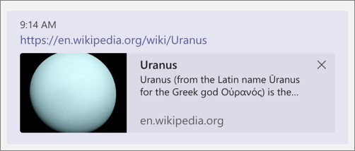

> [!VIDEO https://www.microsoft.com/videoplayer/embed/RE4OFZG]

In this exercise, you’ll learn how to add link unfurling to your Microsoft Teams app and how to implement this type of messaging extension.

> [!IMPORTANT]
> This exercise assumes you have created the Microsoft Teams app project with the Yeoman generator.

## Add a new search messaging extension to the Teams app

In a previous exercise, you created an action messaging extension that enabled a user to add the details of a planet to a message as well as search for a planet.

In this section, you'll add the link unfurling ability to the app

### Use the Yeoman Generator to add a search messaging extension

In the folder containing the solution from the previous exercise, run the Yeoman Generator for Microsoft Teams by running the following command:

```console
yo teams
```

Yeoman will launch and ask you a series of questions. Answer the questions with the following values:

- **You are running the generator on an already existing project, "Planet Messaging", are you sure you want to continue?**: Yes
- **Do you want to change the current manifest version (1.10)?**: No
- **Quick scaffolding**: Yes
- **What features do you want to add to your project?**: A Message Extension Command
- **Where is your message extension hosted?**: In a bot or Messaging Extension already defined in this project
- **Choose which bot**: {{MICROSOFT_APP_ID}}
- **What type of messaging extension command?**: Link unfurling messaging extension
- **Would you like a Settings option for the messaging extension?**: No
- **What is the name of your Message Extension command?**: PlanetLinkMessageExtension
- **Describe your Message Extension command?**: Expand planet links
- **Provide a comma separated list of domains for your Message Extension Link Unfurling**: *.wikipedia.org

The generator will prompt for overwriting files. Enter `y` for each prompt.

### Update the app's configuration

You must increment the version of the app to upgrade an existing installed version. Use the following command to increment the version:

```console
npm version patch
```

Locate and open the **./src/manifest/manifest.json** file. Locate the `composeExtensions` property. Add the following property after the `commands` property to add the link unfurling messaging extension:

```json
"messageHandlers": [
  {
    "type": "link",
    "value": {
      "domains": [
        "*.wikipedia.org"
      ]
    }
  }
]
```

Next, locate the `validDomains` property. Add the following domain to the array of valid domains: `"*.wikipedia.org"`

### Update the bot's code to support link unfurling

The next step is to update the bot's code.

Locate and open the bot in the file **./src/server/planetLinkMessageExtension/PlanetLinkMessageExtension.ts**.

Update the `import` statement for the **botbuilder** package to include the object `AppBasedLinkQuery`:

```typescript
import {
  TeamsActivityHandler,
  TurnContext,
  MessageFactory,
  CardFactory, MessagingExtensionAction, MessagingExtensionActionResponse, MessagingExtensionAttachment,
  MessagingExtensionQuery, MessagingExtensionResponse,
  AppBasedLinkQuery
} from "botbuilder";
```

The scaffolded project has a default implementation of the query link handler, in the `onQueryLink` method in the `PlanetLinkMessageExtension` class. In this exercise, that implementation is not used. Remove the contents of the `onQueryLink` method and replace with the following:

```typescript
public async onQueryLink(context: TurnContext, query: AppBasedLinkQuery): Promise<MessagingExtensionResult> {
  // load planets
  const planets: any = require("../planets.json");
  // get the selected planet
  const selectedPlanet: any = planets.filter((planet) => planet.wikiLink === query.url)[0];
  const heroCard = CardFactory.heroCard(selectedPlanet.name, selectedPlanet.summary, [selectedPlanet.imageLink]);

  // generate the response
  return Promise.resolve({
    type: "result",
    attachmentLayout: "list",
    attachments: [heroCard]
  } as MessagingExtensionResult);
}
```

This method is called by the Bot Framework when a URL matching the domain listed in the app's manifest. It will find a planet with the matching URL and return a `MessagingExtensionResult` object that contains the updated card matching the URL to the existing message.

### Test the updated messaging extension

From the command line, navigate to the root folder for the project and execute the following command:

```console
gulp ngrok-serve -debug
```

> [!IMPORTANT]
> Recall from a previous exercise, Ngrok will create a new subdomain. You need to update your bot registration's **Messaging endpoint** in the Azure portal (*shown in a previous exercise*) with this new domain before testing it.

First, update the existing installed version of the bot.

After updating the app, go back to the 1:1 chat where you tested the messaging extension in the previous exercise. Copy and paste the URL of one of the planets from the **planets.json** file into the compose box. Notice the message has been updated to include the card, which is also included when you send the message:



## Summary

In this exercise, you learned how to add link unfurling to your Microsoft Teams app and how to implement this type of messaging extension.
