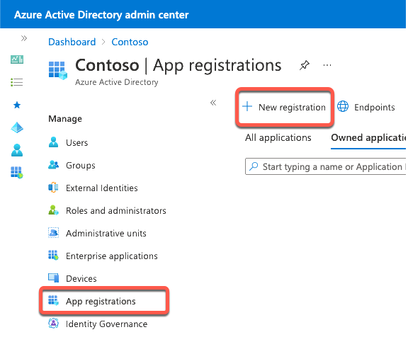
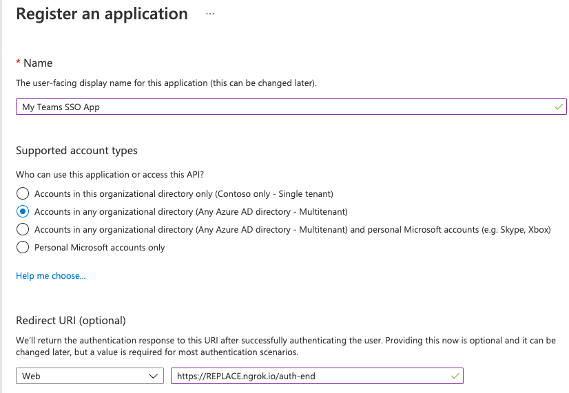
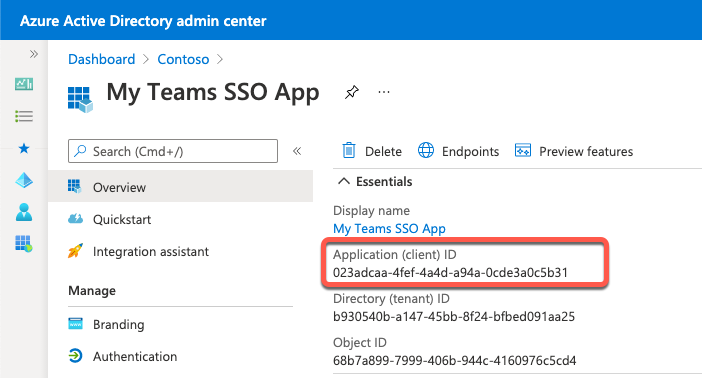
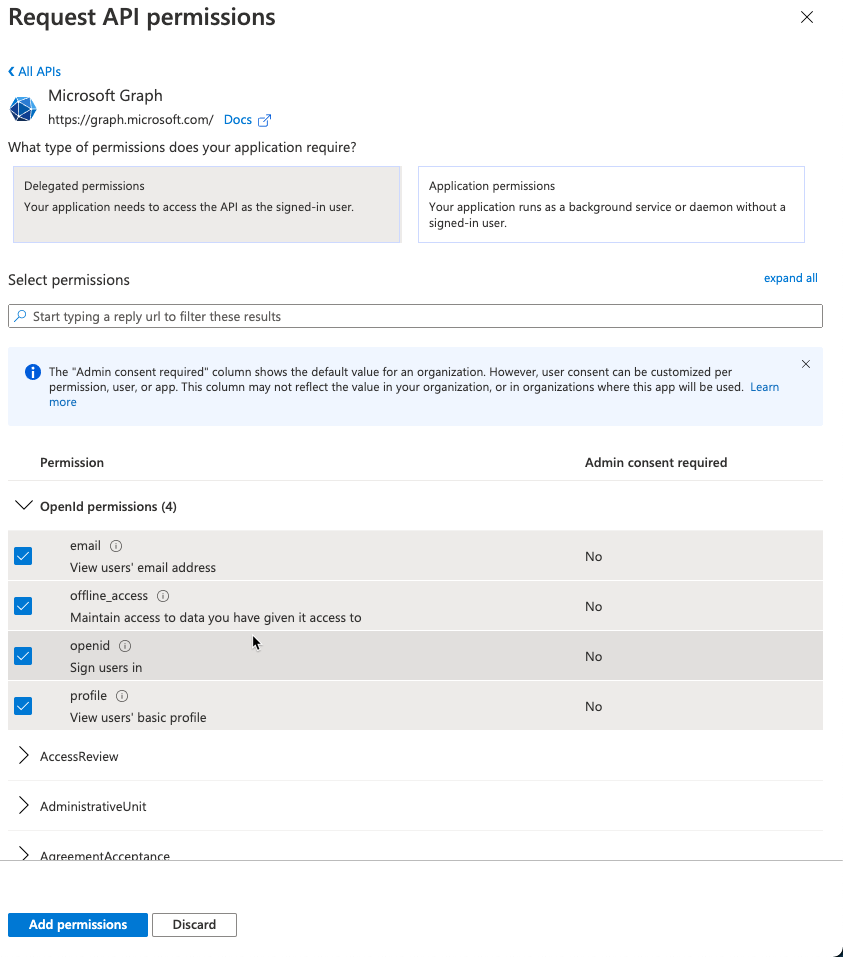
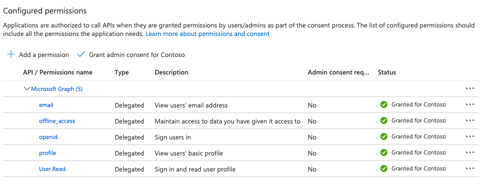

> [!VIDEO https://www.microsoft.com/videoplayer/embed/RE4OARn]

The Microsoft Teams Toolkit can to register the Azure Active Directory (Azure AD) application in a single sign-in (SSO) project.

In this exercise, you'll learn how to manually register and configure the Azure AD app that can be used to implement SSO in a Microsoft Teams app to better understand all the required settings.

## Register an Azure AD application to support single sign-on (SSO)

Open a browser and navigate to the [Azure Active Directory admin center (https://aad.portal.azure.com)](https://aad.portal.azure.com). Sign in using a **Work or School Account** that has global administrator rights to the tenancy.

Select **Manage > App registrations** in the left-hand navigation and then select **New registration**.

On the **Register an application** page, set the values as follows, and then select **Register**:

- **Name**: My Teams SSO App
- **Supported account types**: Accounts in any organizational directory (Any Azure AD directory - Multitenant)
- **Redirect URI**: Web & `https://REPLACE.ngrok.io/auth-end`

> [!NOTE]
> The **Redirect URL** will need to be updated once you know the dynamic subdomain of the proxy URL created by ngrok, a tool you'll use to simplify testing and debugging your Microsoft Teams app.
>
> In fact, you'll need to come back and update the Azure AD app registration in a few places where you'll enter the **REPLACE.ngrok.io** domain.
>
> For now, we'll just use this temporary domain.

On the **My Teams SSO App** page, copy the value of the **Application (client) ID**; you'll need this later when you create the Microsoft Teams app in a future exercise.

### Configure authentication

Next, configure the app's authentication settings. Select **Manage > Authentication** from the left-hand navigation.

In the **Implicit grant and hybrid flows** section, select both of the following options, and then select **Save** at the top of the screen:

### Create a client secret

For an app to authenticate with Azure AD, it needs both the client ID and a client secret.

Select **Manage > Certificates & secrets** from the left-hand navigation.

In the **Client Secrets** section, select **New client secret**. Add a description and select an expiration duration, then select **Add**.

When the secret is created, it will be shown one time so make sure you copy this for use in a later exercise. If you don't copy this value, you'll have to create a new secret as you can't ever view a previously created secret.

### Configure API permissions

Now configure the API permissions the app will need. Select **Manage > API permissions** from the left-hand navigation.

By default, the app has the **User.Read** permission. When Microsoft Teams requests an access token from Azure AD for the currently signed in user, it can only get basic permissions that identify who the user is. To enable this, you'll need to add the basic OpenID permissions.

- Select **Add a permission > Microsoft Graph > Delegated permissions**.
- Find and select the following permissions and then select **Add permissions** to add them to the app:
  - email
  - offline_access
  - openid
  - profile

Once you've added the permissions, select the **Grant admin consent for ...** to consent these permissions for all users in the tenant.

### Expose an API for the app

The next step is to configure the app's API for Microsoft Teams. Select **Manage > Expose an API** from the left-hand navigation.

On the **Expose an API** page, select the **Set** link next to the **Application ID URI**. This will default the app's ID to `api://<app-id>`. This needs to include the domain where the Microsoft Teams app will be hosted. Add `REPLACE.ngrok.io/` to the start of the address after the protocol and select **Save**

Next, select **Add a scope** to add a new permission for the app. Create a new scope using the following settings and then select **Add scope**:

- **Scope name:** access_as_user
- **Who can consent?** Admins and users
- **Admin consent display name:** Teams can access the user’s profile.
- **Admin consent description:** Teams can call the app’s web APIs as the current user.
- **User consent display name:** Teams can access the user profile and make requests on the user's behalf.
- **User consent description:** Teams can call this app’s APIs with the same rights as the user.
- **State**: Enabled

The last step is to preauthorize the Microsoft Teams clients that the app's API will trust. This means users won't be asked to consent to specific permissions, or scopes, exposed by the API.

Add the following client applications by selecting the **Add a client application** link. For each, select the **api://REPLACE.ngrok.io/<app-id>/access_as_user** scope you previously created:

- `1fec8e78-bce4-4aaf-ab1b-5451cc387264`
  - *Microsoft Teams mobile & desktop clients*
- `5e3ce6c0-2b1f-4285-8d4b-75ee78787346`
  - *Microsoft Teams web client*

## Review

At this point, you've now registered an Azure AD application that can be used by Microsoft Teams apps to support SSO for your users.

While the application has been registered, you'll need to come back and make a few changes depending on the features of your custom Microsoft Teams app:

### Update the app's URL

When you create the Microsoft Teams app, you'll need to revisit this Azure AD application to update the places where you entered the URL where the application is hosted. This is true both during development and when the application is deployed to production.

Anywhere you entered **REPLACE.ngrok.io** will need to be updated with the location of the web app that implements the custom Microsoft Teams app.

### Add more API permissions

The Azure AD app you've registered only has the most basic permissions to identify the user (**email**, **offline_access**, **openid**, and **profile**).

It also contains the Microsoft Graph **User.Read** permission to obtain basic information about the user. If your custom Microsoft Teams app needs extra permissions to Microsoft Graph or another app, you'll need to add them to the Azure AD app's registration.