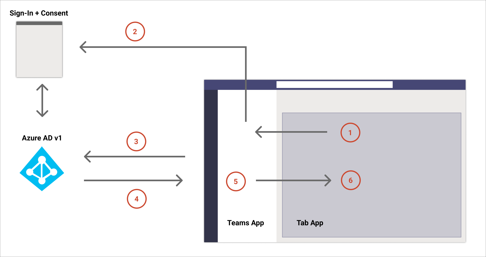
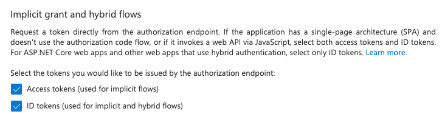
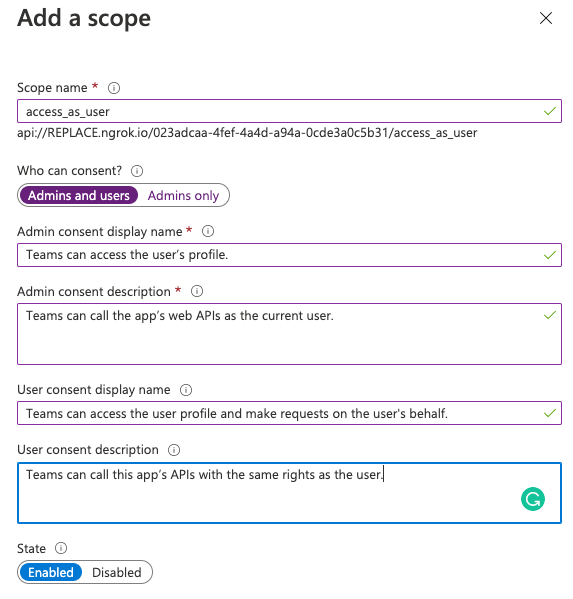
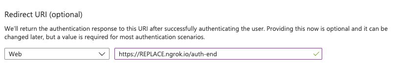
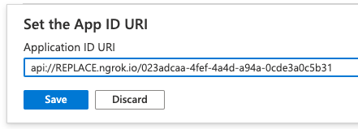

> [!VIDEO https://www.microsoft.com/videoplayer/embed/RE4OARr]

Developers can create custom tabs for Microsoft Teams that display user information using Microsoft Graph. Because users sign in to Microsoft Teams via their Azure Active Directory (Azure AD) accounts in Microsoft 365, developers can take advantage of this by implementing single sign-on (SSO) to authorize the tab.

If a user consents to use your app, they don't have to consent again on another device as they're signed in automatically. Also, your access token is prefetched to improve performance and load times.

> [!TIP]
> While this unit focuses on implementing SSO for tabs, it also applies to implementing SSO for Microsoft Teams task modules that embed web content as well.

In this unit, learn how SSO works and how to create a Microsoft Teams tab that uses SSO.

## Understand the SSO authentication flow

Let's look at how the SSO process works at runtime in Microsoft Teams tabs:



1. In the tab, a JavaScript call is made to `getAuthToken()`. This tells Microsoft Teams to obtain an authentication token for the tab application.
1. If this is the first time the current user has used your tab application, the user is prompted to consent (*if consent is required*), or to handle step-up authentication (*such as two-factor authentication*).
1. Microsoft Teams requests the tab application token from the Azure AD endpoint for the current user.
1. Azure AD sends the tab application token to the Microsoft Teams application.
1. Microsoft Teams sends the tab application token to the tab as part of the result object returned by the `getAuthToken()` call.
1. The token is parsed in the tab application using JavaScript to extract required information, such as the user's email address.

### Microsoft Teams can't prompt for consent of Microsoft Graph permissions

The steps outlined above state that Microsoft Teams can prompt the user to consent the app permissions to sign them in. However, it's worth noting that Microsoft Teams can only prompt for consent for the OpenID `profile` scope. Microsoft Teams can't prompt the user to consent any of the Microsoft Graph permissions.

This can introduce a challenge with your app because it can't know if this initial bootstrap token can be used in the OAuth2 On-Behalf-Of flow to obtain an access token to call Microsoft Graph.

If your code needs permissions to Microsoft Graph, or more permissions that the user hasn't consented to yet, when Microsoft Graph receives the bootstrap token, it will fail with a specific error code: **AADSTS65001**. This error code indicates consent to the requested Microsoft Graph permissions hasn't been granted yet.

In this scenario, your app should gracefully handle this scenario with a fallback authorization system that prompts the user to consent the necessary Microsoft Graph permissions.

## Configure the Azure AD application for SSO with Microsoft Teams tabs

All Microsoft Teams app that implement SSO must also have an associated Azure AD app registered. The Azure AD app used for tab SSO shares many characteristics when used for bot SSO. For example, all Azure AD apps used with Microsoft Teams SSO must have the following:

- **client ID & client certificate/secret**: these are used by your app to authenticate with Azure AD
- **permissions**: this is a list of the API permissions your app needs the user to consent to, such as **User.Read** or **Mail.Read**
- **obtain tokens with the OAuth2 implicit flow**: Microsoft Teams must be able to obtain the access tokens and ID tokens

    

- **`access_as_user` permission**: this permission exposed by the app registration is used to grant apps, such as Microsoft Teams, to act on the user's behalf:

    

- **preauthorize Microsoft Teams clients to act on the user's behalf**: this setting removes the requirement for users to explicitly consenting to allow Microsoft Teams to act on the user's behalf

All of these characteristics of an Azure AD app registration are shared requirements when you use implement SSO for Microsoft Teams tabs and bots.

### Unique characteristics of the Azure AD app for tabs

Microsoft Teams tabs have some unique characteristics because they're a web-based interactive experience compared to the server-side nature of bots.

For example, the **Redirect URI** for the app should point to the URL where the tab implementation is hosted:



Also, when exposing the API permission `access_as_user`, the **Application ID URI** should include the domain where the tab implementation is hosted as well:



## Implement SSO in Microsoft Teams tabs

Let's now look at the code and how you can implement a tab that uses SSO.

### Associate the Azure AD app with the Microsoft Teams app

First, you must associate the Azure AD app with the Microsoft Teams app. This is done in the app's **manifest.json** file in the `webApplicationInfo` object:

```json
"webApplicationInfo": {
  "id": "023adcaa-4fef-4a4d-a94a-0cde3a0c5b31",
  "resource": "api://REPLACE.ngrok.io/023adcaa-4fef-4a4d-a94a-0cde3a0c5b31"
}
```

There are two parts of this section that must be updated for your application:

- **ID**: This is the client ID of the registered Azure AD application
- **Resource**: This is the URL of the app, which is the same thing as the URI that was used when registering the app in Azure AD. The domain portion of the URI must also be listed in the `validDomains` array in the app's manifest.

### Obtain the ID token from Microsoft Teams

The next step is for your tab to obtain the initial ID token from Microsoft Teams. Recall this is commonly referred to as the *bootstrap token* because it only contains details used to identify the currently signed in user; it won't contain any permissions that can be used to call Microsoft Graph.

To obtain this ID token, use the Microsoft Teams JavaScript SDK's `authentication` object:

```typescript
microsoftTeams.authentication.getAuthToken({
  successCallback: (result: string) => { this.ssoLoginSuccess(result) },
  failureCallback: (error: string) => { this.ssoLoginFailure(error) }
});
```

The `result` object passed to the `successCallback` method contains the ID token returned by Azure AD.

This token can be used to identify the user within your tab or your own back-end system.

If you use the ID token in your own API, you should implement accepted best practices when forwarding the token received from Microsoft Teams. This includes validating the token to ensure it was created by Azure AD, it's from the expected authority, the app is the intended audience of the token, the token hasn't expired, and the scope is set to `access_as_user`.

### Obtain an access token for Microsoft Graph

When you want to submit requests to Microsoft Graph from your tab, you need to obtain an access token from Azure AD to include in your requests to Microsoft Graph.

The Microsoft Graph access token is obtained from Azure AD by exchanging the initial ID token received by Microsoft Teams. This access token, obtained using the OAuth2 on behalf of flow, must be done server-side. Therefore, your tab implementation must provide some sort of an API to receive the ID token to submit the request to Azure AD for a valid Microsoft Graph access token.

The OAuth2 on behalf of flow requirements are as follows:

- set the **grant_type** to `urn:ietf:params:oauth:grant-type:jwt-bearer`
- set the **assertion** to the ID token from Microsoft Teams
- set the **requested_token_use** to `on_behalf_of`
- Set the **scope** to a space-delimited list of all permissions your app needs to call Microsoft Graph
- use the registered Azure AD app's client ID and client secret to authenticate the service with Azure AD

This request is sent to the Azure AD token endpoint, `https://login.microsoftonline.com/${tenantId}/oauth2/v2.0/token`. The tenant ID can be retrieved from the `tid` claim that's included in the ID token retrieved by Microsoft Teams.

Azure AD will respond with a valid access token if the user has consented to the requested permissions.

If the user needs to consent to more permissions, or if the user must perform another authentication steps required by their tenant (such as multi-factor authentication), Azure AD will respond to this request with a `invalid_grant` or `interaction_required` error. In these cases, you should prompt the user to consent to Microsoft Graph in your tab.
