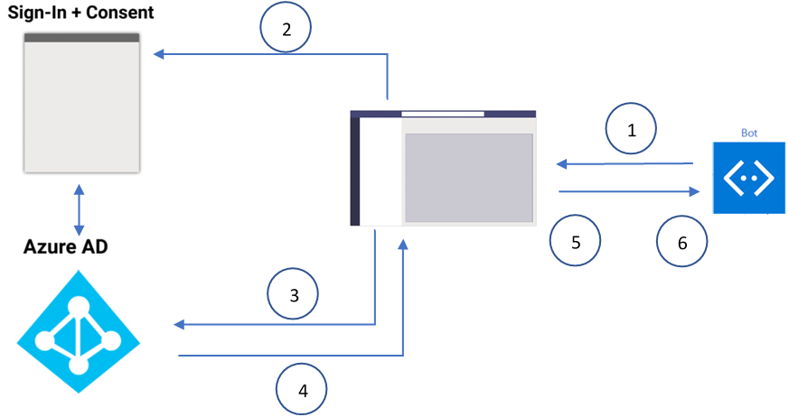

Developers can create bots for Microsoft Teams that display user information using Microsoft Graph. Because users sign in to Microsoft Teams via their Azure AD accounts in Microsoft 365, developers can take advantage of this by implementing single sign-on (SSO) to authorize the bot.

Single sign-on authentication in Azure Active Directory (Azure AD) minimizes the number of times users need to enter their sign-in credentials by silently refreshing the authentication token. If users agree to use your app, they don't need to consent again on another device and can sign in automatically. The flow is similar to that of Microsoft Teams tab SSO support, however, the difference is in the protocol for how a bot requests tokens and receives responses.

In this section, learn how SSO works and how to create a conversational bot for Microsoft Teams that uses SSO.

## Understand the SSO authentication flow

Let's look at how the SSO process works at runtime in bots:



1. The bot sends a message with an OAuthCard that contains the `tokenExchangeResource` property. It tells Microsoft Teams to obtain an authentication token for the bot application. The user receives messages at all the active user endpoints.

    > [!NOTE]
    >
    > - A user can have more than one active endpoint at a time.
    > - The bot token is received from every active user endpoint.
    > - The app must be installed in personal scope for SSO support.

1. If the current user is using your bot application for the first time, a request prompt is displayed, requesting the user to do one of the following:

    - Provide consent, if necessary.
    - Handle step-up authentication, such as two-factor authentication.

    

1. Microsoft Teams requests the bot application token from the Azure AD endpoint for the current user.
1. Azure AD sends the bot application token to the Microsoft Teams application.
1. Microsoft Teams sends the token to the bot as part of the value object returned by the invoke activity with the name **sign-in/tokenExchange**.
1. The parsed token in the bot application provides the required information, such as the user's email address.

## Configure the Azure AD application for SSO with bots

All Microsoft Teams app that implement SSO must also have an associated Azure AD app registered. The Azure AD app used for bot SSO shares many characteristics when used for tab SSO. For example, all Azure AD apps used with Microsoft Teams SSO must have the following:

- **client ID & client certificate/secret**: these are used by your app to authenticate with Azure AD
- **permissions**: this is a list of the API permissions your app needs the user to consent to, such as **User.Read** or **Mail.Read**
- **obtain tokens with the OAuth2 implicit flow**: Microsoft Teams must be able to obtain the access tokens and ID tokens

    

- **`access_as_user` permission**: this permission exposed by the app registration is used to grant apps, such as Microsoft Teams, to act on the user's behalf:

    

- **preauthorize Microsoft Teams clients to act on the user's behalf**: this setting removes the requirement for users to explicitly consenting to allow Microsoft Teams to act on the user's behalf

All of these characteristics of an Azure AD app registration are shared requirements when you use implement SSO for Microsoft Teams tabs and bots.

### Unique characteristics of the Azure AD app for bots

Bots have some unique characteristics because of their server-side-based interactive experience compared to the client-side nature of tabs.

For example, the **Redirect URI** for the app should point to the Azure Bot Framework's token endpoint: `https://token.botframework.com/.auth/web/redirect`

Also, when exposing the API permission `access_as_user`, the **Application ID URI** should include the string **botid-** instead of the domain where the bot service is hosted: `api://botid-023adcaa-4fef-4a4d-a94a-0cde3a0c5b31`.

## Configure the bot's OAuth connection settings

For a bot to support SSO, you must update it's OAuth connection settings. This process associates the bots with the authentication provider (Azure AD), the Azure AD application associated with the bot, the application's ID URI and the permissions the bot needs to obtain an access token for.

This is done within the bot's settings screen in the Azure Bot Framework:


## Implement SSO in a bot for Microsoft Teams

Let's now look at the code and how to you can implement an SSO enabled bot.

### Associate the Azure AD app with the Microsoft Teams app

First, you must associate the Azure AD app with the Microsoft Teams app. This is done in the app's **manifest.json** file in the `webApplicationInfo` object:

```json
"webApplicationInfo": {
  "id": "023adcaa-4fef-4a4d-a94a-0cde3a0c5b31",
  "resource": "api://botid-023adcaa-4fef-4a4d-a94a-0cde3a0c5b31"
}
```

There are two parts of this section that must be updated for your application:

- **ID**: This is the client ID of the registered Azure AD application
- **Resource**: This is the URL of the app, which is the same thing as the URI that was used when registering the app in Azure AD.

### Code the bot to request and receive an access token

The request to get access token involves submitting an HTTP POST message request using the existing message schema. Its included in the attachments of an *OAuthCard*. The schema for the [OAuthCard](https://docs.microsoft.com/dotnet/api/microsoft.bot.schema.oauthcard) class is defined in Microsoft Bot Schema 4.0 and Its similar to a sign-in card.

Microsoft Teams treats the request as a silent token acquisition if the `TokenExchangeResource` property is populated on the card. For Microsoft Teams channels, only the `ID` property, which uniquely identifies a token request, is honored.

When the user sends a message to the bot for the first time, they must first consent to the application. Microsoft Teams displays this consent experience above the message box:


When the user selects **Continue**, the following events occur:

- If the bot defines a sign-in button, the sign-in flow for bots is triggered similar to the sign-in flow from an OAuth card button in a message stream. The developer must decide which permissions require user's consent.

    This approach is recommended if you require a token with permissions beyond `openid` such as in the case when you want to exchange the token for Microsoft Graph resources.
- If the bot isn't providing a sign-in button on the OAuth card, user consent is required for a minimal set of permissions. This token is useful for basic authentication to identify the user. For example, to get the user's email address, identity provider's object ID, the user's tenant ID, or the user's display name.

When building a bot that that requires an authenticated user, consider using dialogs. Dialogs provide a state-based model to manage a long-running conversation with the user. The nature of the sequential conversation that depends on authentication makes dialogs well suited for this scenario.

Dialogs simplify the sequential steps of signing in, interacting with the user and secured resources requiring user and bot authorization, and ultimately signing out. Learn more from the [Bot Framework documentation: Dialogs](https://docs.microsoft.com/composer/concept-dialog) and [Bot Framework SDK: Dialogs library](https://docs.microsoft.com/azure/bot-service/bot-builder-concept-dialog).

The following example demonstrates using a waterfall dialog

```javascript
this.addDialog(new WaterfallDialog(MAIN_WATERFALL_DIALOG, [
  this.promptStep.bind(this),
  this.loginStep.bind(this),
  this.ensureOAuth.bind(this),
  this.displayToken.bind(this)
]));
```

This first step in the waterfall dialog prompts the user and bot to authenticate:

```javascript
async promptStep(stepContext) {
  try {
    return await stepContext.beginDialog(OAUTH_PROMPT);
  } catch (err) {
    console.error(err);
  }
}
```

Next, the login step will attempt to obtain an access token using the bot's authentication support. If successful, it uses the access token obtained in the OAuth process to submit a request to Microsoft Graph to display information returned from Microsoft Graph:

```javascript
async loginStep(stepContext) {
  const tokenResponse = stepContext.result;
  if (!tokenResponse || !tokenResponse.token) {
    await stepContext.context.sendActivity('Login was not successful please try again.');
  } else {
    const microsoftGraphClient = new MicrosoftGraphClient(tokenResponse.token);

    // get user's basic profile information
    const me = await microsoftGraphClient.getMe();
    const title = me ? me.jobTitle : 'UnKnown';
    // respond to Microsoft Teams with an activity message
    await stepContext.context.sendActivity(
        `You're logged in as ${me.displayName} (${me.userPrincipalName});
         your job title is: ${title}; your photo is: `
    );

    // get user's profile photo
    const photoBase64 = await microsoftGraphClient.GetPhotoAsync(tokenResponse.token);
    const card = CardFactory.thumbnailCard("", CardFactory.images([photoBase64]));
    // respond to Microsoft Teams with an activity message
    await stepContext.context.sendActivity({attachments: [card]});

    // add a prompt message, offering the user to review their token
    return await stepContext.prompt(CONFIRM_PROMPT, 'Would you like to view your token?');
  }
  return await stepContext.endDialog();
}
```


In this example, notice after the `loginStep()`, we included two more steps: `ensureOAuth()` and `displayToken()`. These will fire if the user accepts the `prompt` returned by the `loginStep()` method.

The `ensureOAuth()` step is recommended to prompt for an access token again:

```javascript
async ensureOAuth(stepContext) {
  await stepContext.context.sendActivity('Thank you.');

  const result = stepContext.result;
  if (result) {
    return await stepContext.beginDialog(OAUTH_PROMPT);
  }
  return await stepContext.endDialog();
}
```

If the user is already logged in, the bot doesn't need to store the token locally and handle the token refresh if necessary. Instead, the bot can just call the prompt again to get the token. The other more important case is that you can't know how long the user will take to respond. If they want a long time, the token may expire which would require another prompt to log in again.

The final step, `displayToken()`, receives the step context that will contain the token:

```javascript
async displayToken(stepContext) {
  const tokenResponse = stepContext.result;
  if (tokenResponse && tokenResponse.token) {
    await stepContext.context.sendActivity(`Here is your token ${tokenResponse.token}`);
  }
  return await stepContext.endDialog();
}
```
