> [!VIDEO https://www.microsoft.com/videoplayer/embed/RE4OASc]

In this exercise, you'll add a custom bot in a new existing Microsoft Teams app and use single sign-on (SSO) to obtain an access token to submit requests to Microsoft Graph.

> [!IMPORTANT]
> This exercise assumes you have created the Azure AD app from the previous exercise in this module.

> [!NOTE]
> This exercise requires a valid Azure subscription in order to create a bot using Bot Framework. However, if you do not have an Azure subscription, you can use the legacy Bot Framework Registration Portal. For more information, see [Create a bot for Microsoft Teams](/microsoftteams/platform/bots/how-to/create-a-bot-for-teams)

## Prerequisites

Developing Microsoft Teams apps requires a Microsoft 365 tenant, Microsoft Teams configured for development, and the necessary tools installed on your workstation.

For the Microsoft 365 tenant, follow the instructions on [Microsoft Teams: Prepare your Microsoft 365 tenant](/microsoftteams/platform/get-started/get-started-tenant) for obtaining a developer tenant if you don't currently have a Microsoft 365 account. Make sure you have also enabled Microsoft Teams for your organization.

Microsoft Teams must be configured to enable custom apps and allow custom apps to be uploaded to your tenant to build custom apps for Microsoft Teams. Follow the instructions on the same **Prepare your Microsoft 365 tenant** page mentioned above.

You'll use Node.js to create a custom Microsoft Teams app in this module. The exercises in this module assume you have the following tools installed on your developer workstation.

> [!IMPORTANT]
> In most cases, installing the latest version of the following tools is the best option. The versions listed here were used when this module was published and last tested.

- [Node.js](https://nodejs.org/) - v12.\* (or higher)
- NPM (installed with Node.js) - v6.\* (or higher)
- [Gulp-cli](https://gulpjs.com/) - v2.\* (or higher)
- [Yeoman](https://yeoman.io/) - v3.\* (or higher)
- [Yeoman Generator for Microsoft Teams](https://github.com/pnp/generator-teams) - v3.5.0 (or higher)
- [Visual Studio Code](https://code.visualstudio.com)

You must have the minimum versions of these prerequisites installed on your workstation.

## Register the bot with the Microsoft Azure Bot Framework

When you register a new bot with Azure Bot Framework, you'll need the URL where the bot will run. Bots, like tabs, must be served from a publicly accessible domain served over HTTPS. Like the previous exercises in this module, you'll use ngrok to expose the local web server to the Azure Bot Framework.

Recall that you won't know the URL until you create and start the project because the free version of ngrok creates a new subdomain each time it starts. You'll need to update the bot registration each time you restart it when the subdomain changes.

For now, we'll assume the subdomain is `REPLACE.ngrok.io`.

> [!TIP]
> Keep note of all the locations where you enter this value so you can update it later each time you restart the project you'll create later in this exercise.

Open a browser and navigate to the [Azure portal](https://portal.azure.com). Sign in using a **Work or School Account** that has rights to create resources in your Azure subscription.

Select **Create a resource** in the left-hand navigation:


Enter **resource group** in the **Search the marketplace** input box, and select **Resource group**.

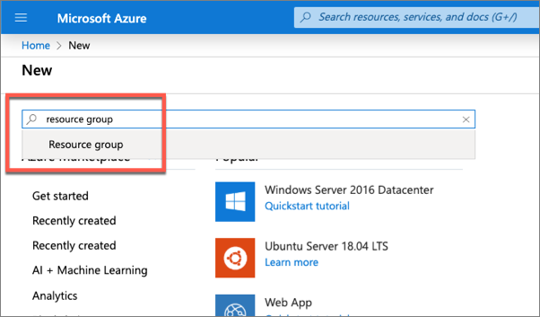

On the **Resource Group** page, select the **Create** button to create a new resource group.

Select a valid subscription, enter a name for the resource group, and select your preferred region. *None of these choices will affect the bot registration and are up to you.*

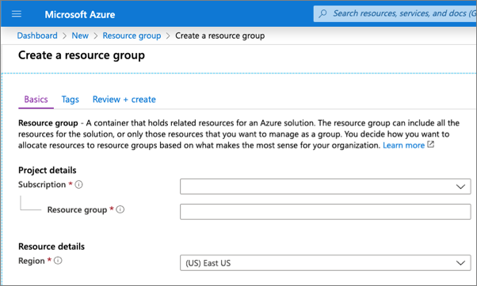

Complete the wizard to create the resource group. Once Azure has completed the resource group creation process, navigate to the resource group.

From the resource group, select the **Add** or **Create resources** button.

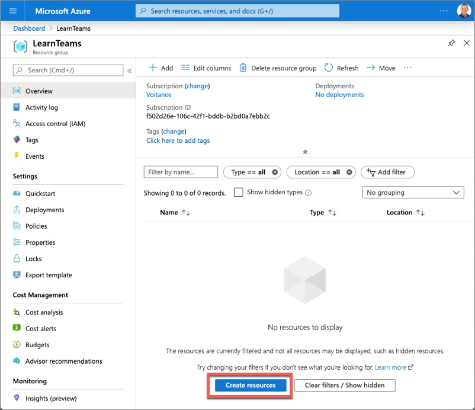

Enter **bot** in the **Search the marketplace** input box, and select **Azure Bot** from the list of resources returned. Then select **Create** on the next page to start the process of registering a new bot resource:

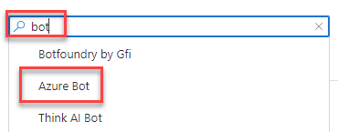

In the **Create an Azure Bot** blade, enter the following values and then select **Review + create**:

- **Bot handle**: *Enter a globally unique name for the bot*
- **Subscription**: *Select the subscription you selected previously when creating the resource group*
- **Resource group**: *Select the resource group you created previously*
- **Pricing tier**: *Select a preferred pricing tier; the F0 tier is free*
- **Type fo App**: *Select Multi Tenant*
- **Microsoft App ID**: Create new Microsoft App ID

Select **Create**.

Azure will start to provision the new resource. This will take a moment or two. Once it's finished, navigate to the bot resource in the resource group.

After the bot has been provisioned, select it from within the new resource group you previously created. Select **Configuration** from the left-hand navigation. Copy the Microsoft App ID of the bot as you'll need it later.


## Update the Azure AD app

The next step is to update an Azure AD app you created in a previous exercise of this module. The  Azure AD app will be associated with the bot you'll register in the next step.

Open a browser and navigate to the [Azure Active Directory admin center (https://aad.portal.azure.com)](https://aad.portal.azure.com). Sign in using a **Work or School Account** that has global administrator rights to the tenancy.

Select **Manage > App registrations** in the left-hand navigation and select the **My Teams SSO App**.

### Update authentication settings

Next, select **Manage > Authentication** in the left-hand navigation.

Change the **RedirectURI** to `https://token.botframework.com/.auth/web/redirect`.

### Update the exposed API settings

Next, select **Manage > Expose API** in the left-hand navigation.

Currently, the **Application ID URI** looks similar to the following:

```text
api://d4fa28c4e203.ngrok.io/023adcaa-4fef-4a4d-a94a-0cde3a0c5b31
```

Replace URI with the string `botid-` followed by the Microsoft App ID of the bot (copied above). For example:

```txt
api://botid-415a87e6-993f-4181-871b-02f4a7ea173e
```

Notice that the values of the **Scopes defined by this API** and **Authorized client applications** will now reflect this change as well:

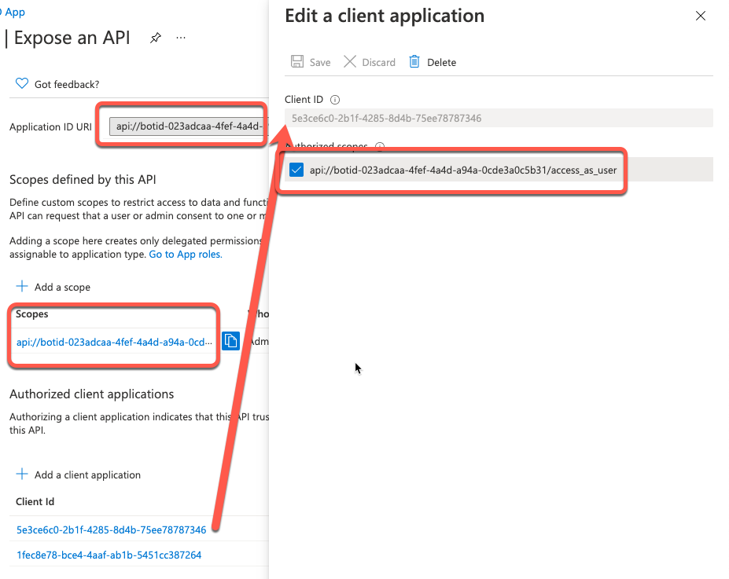

With the Azure AD app configuration updated, the next step is to configure the bot service connection to the app.

### Configure the bot service connection (token store)

Navigate to the Azure portal and select the bot registered above. Then select **Settings > Configuration** from the left-hand menu.

Select the **Add OAuth Connection Settings** button on the **Configuration** screen.

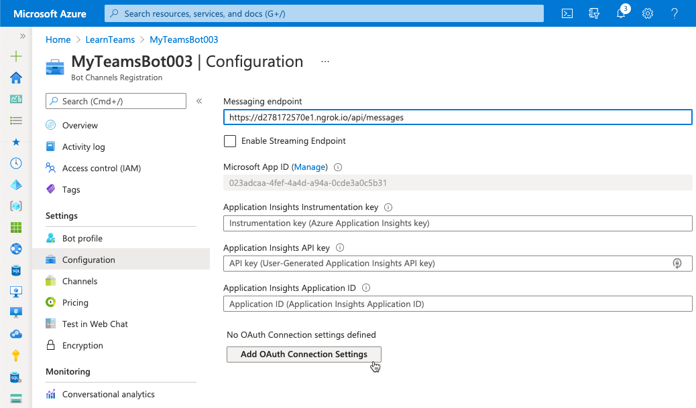

Use the following values to create a new connection setting, and then select **Save**:

- **Name**: *enter a name for your connection, but copy this as you'll need it later when updating the project*
- **Service Provider**: Azure Active Directory v2
- **Client ID**: *use the Azure AD app's client ID (the My Teams SSO application above)*
- **Client secret**: *use the Azure AD app's client secret from the previous exercise*
- **Token Exchange URL**: *use the Azure AD app's application ID URI you updated previously in this exercise (api://botid-{{Microsoft App Id}})*
- **Tenant ID**: common
- **Scopes**: Mail.Read openid profile User.Read
  - *This is a space-delimited list of all permissions the bot needs that have also been added to the Azure AD app you previously. The list contains a subset of the permissions listed in the Azure AD app from the exercises in this module that the bot will use.*

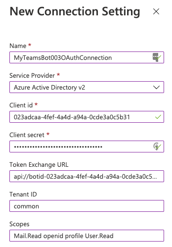

### Enable the Microsoft Teams channel for the bot

In order for the bot to interact with Microsoft Teams, you must enable the Teams channel.

From the bot resource in Azure, select **Channels** in the left-hand navigation.

On the **Connect to channels** pane, select the Microsoft Teams channel, then select **Save** to confirm the action.

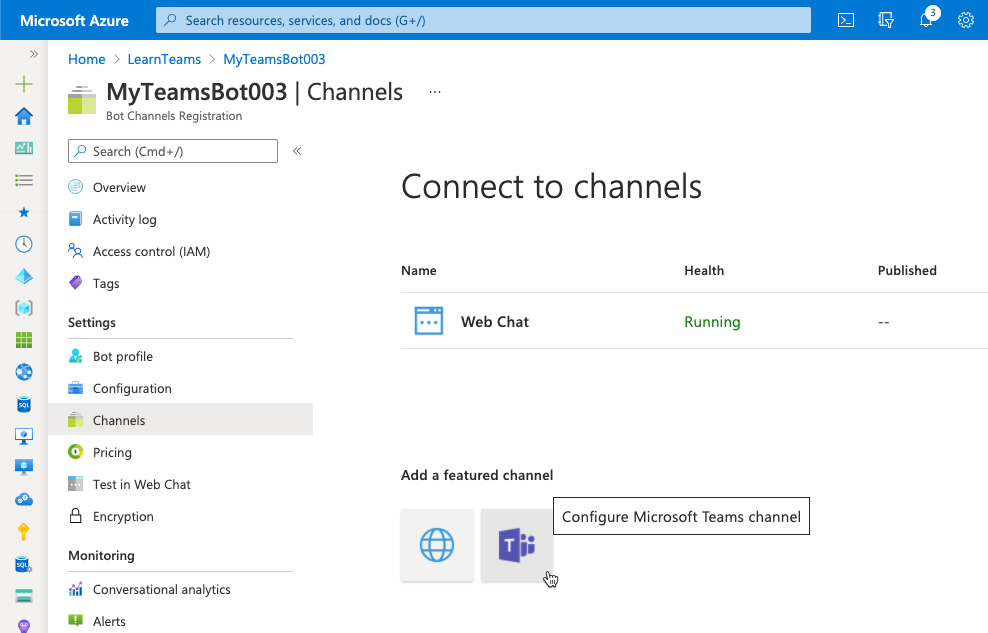

Once this process is complete, you should see both the **Web Chat** and **Microsoft Teams** listed in your enabled channels:

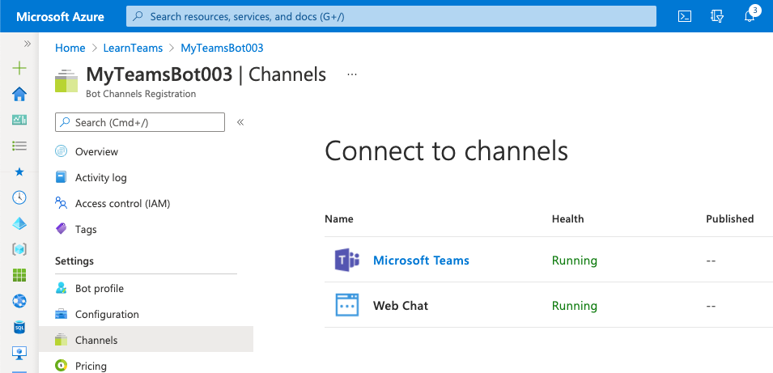

## Create your Microsoft Teams app project

> [!VIDEO https://www.microsoft.com/videoplayer/embed/RE4ODdh]

Open your command prompt, navigate to a directory where you want to save your work, create a new folder **learn-msteams-sso-bot**, and change directory into that folder.

Run the Yeoman Generator for Microsoft Teams by running the following command:

```console
yo teams
```

Yeoman will launch and ask you a series of questions. Answer the questions with the following values:

- **What is your solution name?**: learn-msteams-sso-bot
- **Where do you want to place the files?**: Use the current folder
- **Title of your Microsoft Teams App project?**: SSO Teams Bot
- **Your (company) name? (max 32 characters)**: Contoso
- **Which manifest version would you like to use?**: v1.11
- **Quick scaffolding**: Yes
- **What features do you want to add to your project?**: A bot
- **The URL where you will host this solution?**:  (Accept the default option)
- **Would you like to show a loading indicator when your app/tab loads?** No
- **What type of bot would you like to use?** An already existing and running bot (not hosted in this solution)
- **What is the Microsoft App ID for the bot? It's found in the Bot Framework portal (https://dev.botframework.com)** *Enter the Azure AD application ID (also known as the application ID) for the app you registered in a previous exercise.*
- **Do you want to add a static tab to your bot?** Yes
- **What is the title of your static tab for the bot? (max 16 characters)**: SSO Bot
- **Do you want to support file upload to the bot?** No
- **Do you want to include bot calling support?** No

> [!IMPORTANT]
> At the time of writing this exercise, the Yeoman Generator for Microsoft Teams doesn't contain a project template for a bot that supports SSO. That's why you selected *An already existing and running bot* in the options above. In the next step, you'll manually add the bot to the project.

After answering the generator's questions, the generator will create the scaffolding for the project and then execute `npm install` that downloads all the dependencies required by the project.

### Add more dependencies to the project

Our bot will need a few more dependencies to be installed in the project, so let's take care of that now.

Execute the following commands from the console from the project's root folder. These will install the Microsoft Graph JavaScript SDK, associated type declarations and dependencies, and a utility to decode JWT tokens.

```console
npm install @microsoft/microsoft-graph-client isomorphic-fetch jwt-decode -SE
npm install @microsoft/microsoft-graph-types -DE
```

### Update the app's development environment variables

The **./.env** file within the project's root folder contains environment variables set when you run the bot service locally during development and testing. Before we run the bot, we'll need to update two settings in it.

Open the **./.env** file.

Locate the variable `MICROSOFT_APP_PASSWORD`. Set its value to the client secret of the Azure AD app you registered in a previous step:

```text
MICROSOFT_APP_PASSWORD=-fcY3P_1UoDV441_k58a37ylT9U_q6a-UD
```

> [!NOTE]
> The client secret listed above is only included as an example. Make sure you enter the secret you obtained when you registered the Azure AD app. If you don't have it, you can create another one and enter it here.

Add a new variable immediately after the `MICROSOFT_APP_PASSWORD`. Set the value of this variable to the name of the Bot's OAuth connection setting that you created previously in this exercise:

```text
SSO_CONNECTION_NAME={{OAUTH_CONNECTION_SETTING_NAME}}
```

### Add the bot to the Teams app manifest

The next step before coding the bot is to add it to the custom Microsoft Teams app manifest.

Locate and open the **./src/manifest/manifest.json** file. The bot entry was already added by the Yeoman Generator for Microsoft Teams, but you still need to make a few changes to it.

Locate the bot by finding the `bots` array. It contains a single entry for your bot. Bots that use SSO must be authenticated in the personal scope, so you can remove the `team` and `groupchat` options from the `scopes` collection on the bot. Repeat the process for the `commandLists` array as well:

```json
"bots": [{
  "botId": "{{MICROSOFT_APP_ID}}",
  "needsChannelSelector": true,
  "isNotificationOnly": false,
  "scopes": ["personal"],
  "commandLists": [{
    "scopes": ["personal"],
    "commands": [
      ...
    ]
  }]
}],
```

Next, locate the `validDomains` array. Add `token.botframework.com` to the list of domains so the bot can submit authentication requests to the Bot Framework's token endpoint:

```json
"validDomains": [
  "token.botframework.com",
  "{{PUBLIC_HOSTNAME}}"
],
```

The last step is to add the `webApplicationInfo` object to the app's manifest file. This configures the app with the Azure AD app that you registered in a previous step and updated earlier in this exercise. Add this immediately after the `validDomains` array:

```json
"webApplicationInfo": {
  "id": "{{MICROSOFT_APP_ID}}",
  "resource": "api://botid-{{MICROSOFT_APP_ID}}"
},
```

At this point, the project is configured and you can now start coding the bot.

## Code the bot

> [!VIDEO https://www.microsoft.com/videoplayer/embed/RE4OO1Y]

Create a new folder **SsoBot** in the **./src/server** folder.

### Add helpers to the bot

Our project will contain two helper classes used to simplify signing the user in and implementing support for SSO and to call Microsoft Graph.

Start by creating a new folder, **helpers** in the bot's folder: **./src/server/SsoBot**.

Let's start by creating the SSO helper. Add a new file **SsoOAuthHelper.ts** to the **helpers** folder, and add the following code to it:

```typescript
import {
  ActivityTypes,
  BotFrameworkAdapter,
  ConversationState,
  StatusCodes,
  tokenExchangeOperationName,
  TokenResponse,
  TurnContext
} from "botbuilder";

export class SsoOAuthHelper {

  public async shouldProcessTokenExchange(turnContext: TurnContext): Promise<boolean> {
    if (turnContext.activity.name !== tokenExchangeOperationName) {
      throw new Error(`Only '${tokenExchangeOperationName}' invoke activities can be processed by TokenExchangeHelper.`);
    }

    if (!await this.exchangeToken(turnContext)) {
      // If the TokenExchange is NOT successful, the response will have already been sent by exchangeToken
      return Promise.resolve(false);
    }

    return Promise.resolve(true);
  }

  public async exchangeToken(turnContext: TurnContext): Promise<boolean> {
    let tokenExchangeResponse: TokenResponse | null = null;
    const tokenExchangeRequest = turnContext.activity.value;

    try {
      tokenExchangeResponse = await (turnContext.adapter as BotFrameworkAdapter).exchangeToken(
        turnContext,
        tokenExchangeRequest.connectionName,
        turnContext.activity.from.id,
        tokenExchangeRequest);
    } catch (err) {
      // Ignore Exceptions: if token exchange failed for any reason, tokenExchangeResponse
      //   above stays null; send failure invoke response to the caller.
    }

    if (tokenExchangeResponse === null || !tokenExchangeResponse.token) {
      // The token could not be exchanged (which could be due to a consent requirement)
      // Notify the sender that PreconditionFailed so they can respond accordingly.
      await turnContext.sendActivity({
        type: ActivityTypes.InvokeResponse,
        value: {
          status: StatusCodes.PRECONDITION_FAILED,
          body: {
            id: tokenExchangeRequest.id,
            connectionName: tokenExchangeRequest.connectionName,
            failureDetail: "The bot is unable to exchange token. Proceed with regular login."
          }
        }
      });

      return Promise.resolve(false);
    } else {
      // Store response in TurnState, so the SsoOAuthPrompt can use it, and not have to do the exchange again.
      turnContext.turnState.set("tokenExchangeInvokeRequest", tokenExchangeRequest);
      turnContext.turnState.set("tokenExchangeResponse", tokenExchangeResponse);
    }
    return Promise.resolve(true);
  }
}
```

The `SsoOAuthHelper` class contains the following two methods:

- `shouldProcessTokenExchange()`: This method determines if the activity `signin/tokenExchange` should be processed by this caller. If so, it calls the other method `exchangeToken()`.
- `exchangeToken()`: This method attempts to retrieve an access token from the bot's OAuth connection configuration in the Bot Framework registration. This is done by specifying the connection name specified. If this fails, then the bot framework is unable to exchange the token, so the bot notifies the sender that a preconditioned failed. Our bot uses this to prompt the user to consent to the sign-in prompt.

Next, add the helper for obtaining data from Microsoft Graph. Add a new file **MsGraphHelper.ts** to the **helpers** folder, and add the following code to it:

```typescript
import { Client } from "@microsoft/microsoft-graph-client";
import * as MicrosoftGraph from "@microsoft/microsoft-graph-types";

export class MsGraphHelper {
  private msGraphClient: Client;

  constructor(private token: string) {
    this.msGraphClient = Client.init({
      authProvider: (cb) => {
        cb(null, this.token);
      }
    });
  }

  public async getCurrentUser(): Promise<MicrosoftGraph.User> {
    return await this.msGraphClient.api("me").get() as MicrosoftGraph.User;
  }

  public async getMostRecentEmail(): Promise<MicrosoftGraph.Message> {
    const response = await this.msGraphClient.api("me/messages")
      .select("receivedDateTime,subject")
      .orderby("receivedDateTime desc")
      .top(1)
      .get();

    return response.value[0] as MicrosoftGraph.Message;
  }
}
```

After initializing the Microsoft Graph client by setting the access token used in all requests, the `MsGraphHelper` class includes two methods to retrieve the currently signed in user's details and their most recent email received.

### Add the dialogs used by the bot

Within the **SsoBot** folder, create a new folder **dialogs** that will hold the dialogs and prompts used by our bot.

Create a new file, **./src/server/SsoBot/dialogs/logoutDialog.ts** that will serve as the base dialog for our bot. All other dialogs will inherit from this dialog.

This dialog will check for the text **logout** in the message for all submissions from the user. If found, it will sign the currently signed in user out of the SSO session and cancel any pending dialogs.

Add the following code to the **logoutDialog.ts** file:

```typescript
import {
  ActivityTypes,
  BotFrameworkAdapter
} from "botbuilder";
import {
  ComponentDialog,
  DialogContext,
  DialogTurnResult
} from "botbuilder-dialogs";

export class LogoutDialog extends ComponentDialog {
  constructor(dialogId: string, public ssoConnectionName: string) {
    super(dialogId);
  }

  public async onBeginDialog(innerDialogContext: DialogContext, options): Promise<DialogTurnResult> {
    const result = await this.interrupt(innerDialogContext);
    if (result) {
      return result;
    }
    return await super.onBeginDialog(innerDialogContext, options);
  }

  public async onContinueDialog(innerDialogContext: DialogContext): Promise<DialogTurnResult> {
    const result = await this.interrupt(innerDialogContext);
    if (result) {
      return result;
    }
    return await super.onContinueDialog(innerDialogContext);
  }

  public async interrupt(innerDialogContext: DialogContext): Promise<DialogTurnResult | void> {
    if (innerDialogContext.context.activity.type === ActivityTypes.Message) {
      const text = innerDialogContext.context.activity.text.toLowerCase().replace(/\r?\n|\r/g, "");

      if (text === "logout") {
        // sign out
        const botAdapter = innerDialogContext.context.adapter as BotFrameworkAdapter;
        await botAdapter.signOutUser(innerDialogContext.context, this.ssoConnectionName);

        // notify user
        await innerDialogContext.context.sendActivity("You have been signed out.");

        // cancel dialog stack
        return await innerDialogContext.cancelAllDialogs();
      }
    }
  }
}
```

Create a new file, **./src/server/SsoBot/dialogs/mainDialog.ts** that will serve as the base dialog for our bot. This dialog will inherit from the `logoutDialog` and serve as the main router for our bot.

In the `MainDialog` constructor, it adds a two dialogs to the bot, including:

- The `SsoOauthPrompt` dialog that adds extra logic to implement SSO to the `OAuthPrompt` included in the Bot Framework.
- The `WaterfallDialog` dialog that adds a series of dialogs and steps to implement the user experience once the user has completed the SSO process by signing into the bot.

Add the following code to the **MainDialog.ts** file:

```typescript
import {
  StatePropertyAccessor,
  TurnContext
} from "botbuilder-core";
import {
  DialogSet,
  DialogState,
  DialogTurnResult,
  DialogTurnStatus,
  WaterfallDialog,
  WaterfallStepContext
} from "botbuilder-dialogs";
import { LogoutDialog } from "./logoutDialog";
import { SsoOauthPrompt } from "./ssoOauthPrompt";
import "isomorphic-fetch";
import { MsGraphHelper } from "../helpers/MsGraphHelper";

const MAIN_DIALOG_ID = "MainDialog";
const MAIN_WATERFALL_DIALOG_ID = "MainWaterfallDialog";
const OAUTH_PROMPT_ID = "OAuthPrompt";

export class MainDialog extends LogoutDialog {
  constructor() {
    super(MAIN_DIALOG_ID, process.env.SSO_CONNECTION_NAME as string);

    // sso signin prompt
    this.addDialog(new SsoOauthPrompt(OAUTH_PROMPT_ID, {
      connectionName: process.env.SSO_CONNECTION_NAME as string,
      text: "Please sign in",
      title: "Sign In",
      timeout: 300000
    }));

    // add waterfall dialogs
    this.addDialog(new WaterfallDialog(MAIN_WATERFALL_DIALOG_ID, [
      this.promptStep.bind(this),
      this.displayMicrosoftGraphDataStep.bind(this)
    ]));

    // set the initial dialog to the waterfall
    this.initialDialogId = MAIN_WATERFALL_DIALOG_ID;
  }

  public async run(turnContext: TurnContext, accessor: StatePropertyAccessor<DialogState>): Promise<void> {
    const dialogSet = new DialogSet(accessor);
    dialogSet.add(this);
    const dialogContext = await dialogSet.createContext(turnContext);
    const results = await dialogContext.continueDialog();
    if (results.status === DialogTurnStatus.empty) {
      await dialogContext.beginDialog(this.id);
    }
  }

  public async promptStep(stepContext: WaterfallStepContext): Promise<DialogTurnResult> {
    try {
      return await stepContext.beginDialog(OAUTH_PROMPT_ID);
    } catch (err) {
      console.error(err);
    }
    return await stepContext.endDialog();
  }

  public async displayMicrosoftGraphDataStep(stepContext: WaterfallStepContext): Promise<DialogTurnResult> {
    // get token from prev step (or directly from the prompt itself)
    const tokenResponse = stepContext.result;
    if (!tokenResponse?.token) {
      await stepContext.context.sendActivity("Login not successful, please try again.");
    } else {
     const msGraphClient = new MsGraphHelper(tokenResponse?.token);

      const user = await msGraphClient.getCurrentUser();
      await stepContext.context.sendActivity(`Thank you for signing in ${user.displayName as string} (${user.userPrincipalName as string})!`);
      await stepContext.context.sendActivity("I can retrieve your details from Microsoft Graph using my support for SSO! For example...");

      const email = await msGraphClient.getMostRecentEmail();
      await stepContext.context.sendActivity(`Your most recent email about "${email.subject as string}" was received at ${new Date(email.receivedDateTime as string).toLocaleString()}.`);
    }

    return await stepContext.endDialog();
  }
}
```

Notice the last line in the constructor of the `MainDialog` class sets the default dialog to the waterfall dialog. That is the primary user experience of our bot, provided the user has signed in.

Notice the method `displayMicrosoftGraphDataStep()` that's added to the `WaterfallDialog`. This step will use the access token obtained from the Bot Framework's support for OAuth to submit requests to Microsoft Graph.

Now, let's implement the prompt dialog that will wrap the Bot Framework provided `OAuthPrompt` class so we can add support for SSO to it.

Create a new file, **./src/server/SsoBot/dialogs/ssoOauthPrompt.ts**. In this file, you'll implement a single method on the base `OAuthPrompt` class: `continueDialog()`. In this method, you'll first check to see if the bot has previously exchanged the ID token provided by Microsoft Teams and saved it to the bot's cache. If so, it will stop the current dialog. Otherwise, the bot will prompt the user asking them to sign in and complete any step-up authentication requirements such as multi-factor authentication:

Add the following code to the **ssoOauthPrompt.ts** file:

```typescript
import {
  ActivityTypes,
  StatusCodes,
  TokenResponse
} from "botbuilder";
import {
  DialogContext,
  DialogTurnResult,
  OAuthPrompt
} from "botbuilder-dialogs";
import jwtDecode from "jwt-decode";

export class TokenExchangeInvokeResponse {
  id: string;
  connectionName: string;
  failureDetail: string;

  constructor(id: string, connectionName: string, failureDetail: string) {
    this.id = id;
    this.connectionName = connectionName;
    this.failureDetail = failureDetail;
  }
}

export class SsoOauthPrompt extends OAuthPrompt {
  public async continueDialog(dialogContext: DialogContext): Promise<DialogTurnResult> {
    // if token previously successfully exchanged, it should be cached in
    //  TurnState along with the TokenExchangeInvokeRequest
    const cachedTokenResponse = dialogContext.context.turnState.get("tokenExchangeResponse");

    if (cachedTokenResponse) {
      const tokenExchangeRequest = dialogContext.context.turnState.get("tokenExchangeInvokeRequest");
      if (!tokenExchangeRequest) {
        throw new Error("TokenResponse is present in TurnState, but TokenExchangeInvokeRequest is missing.");
      }

      // TokenExchangeInvokeResponse
      const exchangeResponse = new TokenExchangeInvokeResponse(tokenExchangeRequest.id, process.env.SSO_CONNECTION_NAME as string, tokenExchangeRequest.failureDetail);

      await dialogContext.context.sendActivity({
        type: ActivityTypes.InvokeResponse,
        value: {
          status: StatusCodes.OK,
          body: exchangeResponse
        }
      });

      const result: TokenResponse = {
        channelId: cachedTokenResponse.channelId,
        connectionName: process.env.SSO_CONNECTION_NAME as string,
        token: cachedTokenResponse.token,
        expiration: new Date(jwtDecode<any>(cachedTokenResponse.token).exp).toISOString()
      };

      return await dialogContext.endDialog(result);
    }

    return await super.continueDialog(dialogContext);
  }
}
```

At this point, we can implement the main part of our bot: the `DialogBot` class.

Create a new file, **./src/server/SsoBot/DialogBot.ts** that will serve as the base for our bot. Notice the constructor of the `DialogBot` class accepts an instance of the `MainDialog` that our bot will pass into it. When the bot receives a message, it will run the `MainDialog`.

Add the following code to the **DialogBot.ts** file:

```typescript
import {
  ConversationState,
  UserState,
  TeamsActivityHandler,
  TurnContext
} from "botbuilder";
import { MainDialog } from "./dialogs/mainDialog";

export class DialogBot extends TeamsActivityHandler {
  public dialogState: any;

  constructor(public conversationState: ConversationState, public userState: UserState, public dialog: MainDialog) {
    super();

    this.conversationState = conversationState;
    this.userState = userState;
    this.dialog = dialog;
    this.dialogState = this.conversationState.createProperty("DialogState");

    this.onMessage(async (context, next) => {
      // Run the Dialog with the new message Activity.
      await this.dialog.run(context, this.dialogState);

      await next();
    });
  }

  public async run(context: TurnContext) {
    await super.run(context);

    // Save any state changes. The load happened during the execution of the Dialog.
    await this.conversationState.saveChanges(context, false);
    await this.userState.saveChanges(context, false);
  }
}
```

The last step in creating our bot is to implement the bot itself.

### Add the bot to the project

Create a new file, **./src/server/SsoBot/SsoBot.ts**, and add the following code to it:

```typescript
import { BotDeclaration } from "express-msteams-host";
import * as debug from "debug";
import {
  ConversationState,
  UserState,
  SigninStateVerificationQuery,
  TurnContext,
  MemoryStorage
} from "botbuilder";
import { DialogBot } from "./DialogBot";
import { MainDialog } from "./dialogs/mainDialog";
import { SsoOAuthHelper } from "./helpers/SsoOAuthHelper";

// Initialize debug logging module
const log = debug("msteams");

@BotDeclaration(
  "/api/messages",
  new MemoryStorage(),
  // eslint-disable-next-line no-undef
  process.env.MICROSOFT_APP_ID,
  // eslint-disable-next-line no-undef
  process.env.MICROSOFT_APP_PASSWORD)
export class SsoBot extends DialogBot {
  public _ssoOAuthHelper: SsoOAuthHelper;

  constructor(conversationState: ConversationState, userState: UserState) {
    super(conversationState, userState, new MainDialog());
    this._ssoOAuthHelper = new SsoOAuthHelper();

    this.onMembersAdded(async (context, next) => {
      const membersAdded = context.activity.membersAdded;
      if (membersAdded && membersAdded.length > 0) {
        for (let cnt = 0; cnt < membersAdded.length; cnt++) {
          if (membersAdded[cnt].id !== context.activity.recipient.id) {
            await context.sendActivity("Welcome to TeamsBot. Type anything to get logged in. Type 'logout' to sign-out.");
          }
        }
      }
      await next();
    });

    this.onTokenResponseEvent(async (context) => {
      await this.dialog.run(context, this.dialogState);
    });
  }

  public async handleTeamsSigninTokenExchange(context: TurnContext, query: SigninStateVerificationQuery): Promise<void> {
    if (!await this._ssoOAuthHelper.shouldProcessTokenExchange(context)) {
      await this.dialog.run(context, this.dialogState);
    }
  }

  public async handleTeamsSigninVerifyState(context: TurnContext, query: SigninStateVerificationQuery): Promise<void> {
    await this.dialog.run(context, this.dialogState);
  }
}
```

Notice in the constructor for the `SsoBot`, which extends the `DialogBot` you previously created, creates an instance of the `MainDialog` and passes it into the base class. Recall the base class, `DialogBot`, accepts a dialog in its constructor. This is how our dialogs are loaded into the bot.

The other two events in the `SsoBot` class, `handleTeamsSigninTokenExchange()` and `handleTeamsSigninVerifyState()`, handle when the invoke activities of types `signin/tokenExchange` and `signin/verifyState` respectively.

The handler for the `signin/tokenExchange` activity uses the helper we previously created to process the token received, if it should be processed. The token should only be processed once, while the response is sent to every Microsoft Teams instance where the user is signed in, which may be more than one.

### Load the bot when the web server starts

> [!VIDEO https://www.microsoft.com/videoplayer/embed/RE4OG2C]

The last step is to add the bot to the web server when it starts.

Locate and open the file **./src/server/TeamsAppsComponents.ts**. Add the following to the end of the file:

```typescript
export * from "./SsoBot/SsoBot";
```

## Build and test the application

From the command line, navigate to the root folder for the project and execute the following command:

```console
gulp ngrok-serve --debug
```

This gulp task will run many other tasks all displayed within the command-line console. The **ngrok-serve** task builds your project and starts a local web server (http://localhost:3007). It then starts ngrok with a random subdomain that creates a secure URL to your local webserver.

> [!NOTE]
> Microsoft Teams requires all content displayed within a tab be loaded from an HTTPS request. In development, can be done using the tool [ngrok](https://www.ngrok.com) that creates a secure rotatable URL to your local HTTP webserver. Ngrok is included as a dependency within the project so there is nothing to setup or configure.

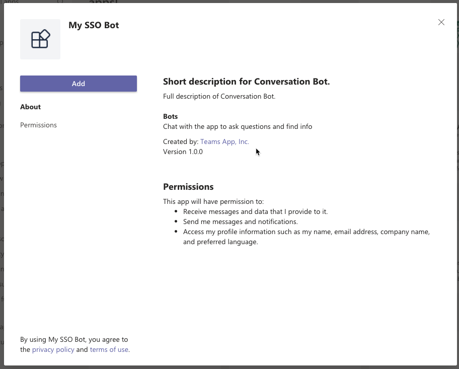

Note the URL of the ngrok URL displayed in the console. In the previous screenshot, ngrok has created the temporary URL `5f1f02998d18.ngrok.io` that will map to our locally running web server. In order for the Bot Framework to route messages from Microsoft Teams to our locally running bot, you need to the bot's **messaging endpoint** URL in the bot's registration. This property can be found on the **Configuration** screen:


### Install the custom app in Microsoft Teams

Now let's install the app in Microsoft Teams. In the browser, navigate to **https://teams.microsoft.com** and sign in with the credentials of a Work and School account.

> [!NOTE]
> Microsoft Teams is available for use as a web client, desktop client and a mobile client. In this module, we will use the web client but any of the clients can be used.

Using the app bar navigation menu, select the **More added apps** button. Then select **Browse all apps** followed by **Upload for me or my teams**.

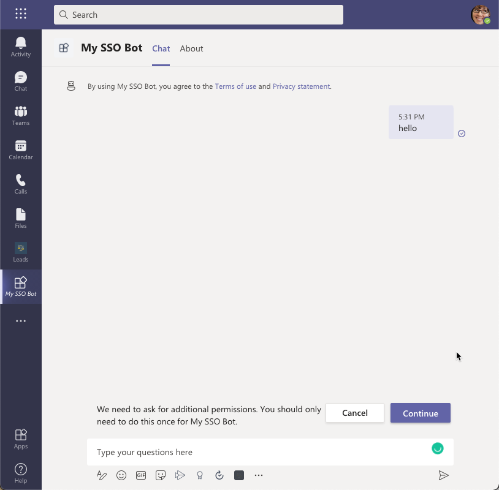

In the file dialog that appears, select the Microsoft Teams package in your project. This app package is a ZIP file that can be found in the project's **./package** folder.

> [!NOTE]
> If the **./package** folder is not present, this means you are affected by a bug in the yoteams-deploy package. To resolve the issue:
> - Stop the local web server by pressing <kbd>CTRL</kbd>+<kbd>C</kbd> in the console.
> - Install the preview version of the **yoteams-deploy** package using the command `npm install yoteams-deploy@preview`
> - Restart the server process: `gulp ngrok-serve --debug`

Once the package is uploaded, Microsoft Teams will display a summary of the app. Here you can see some "todo" items to address. _None of these "todo" items are important to this exercise, so you'll leave them as is._

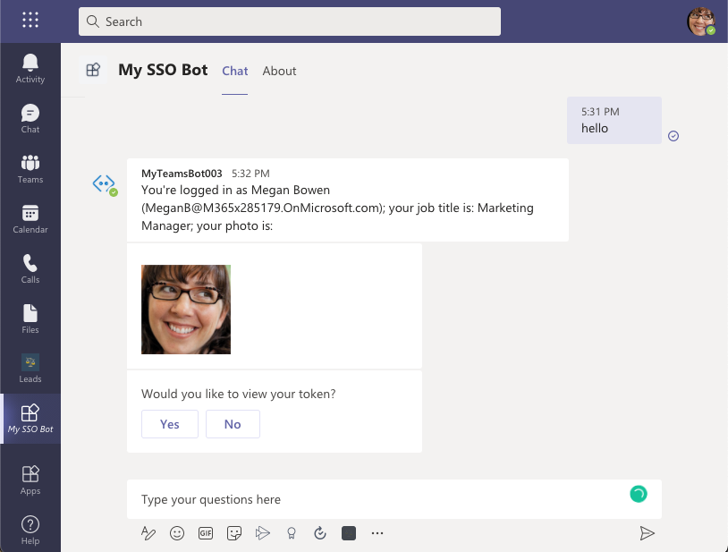

Select the **Add** button to install the app, adding a new personal tab to your **More added apps** dialog:

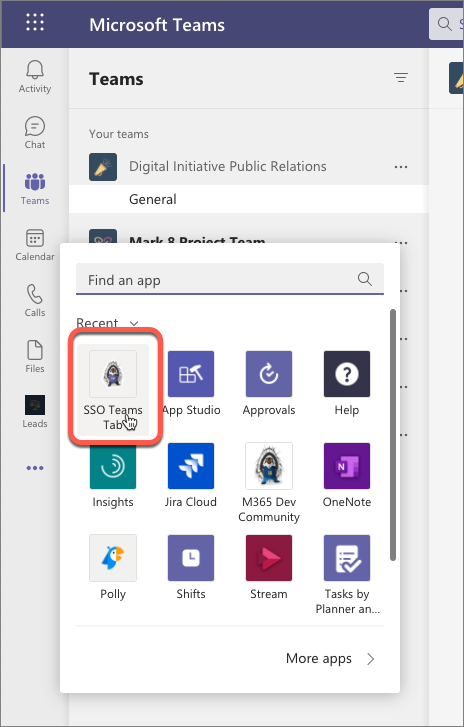

After a few seconds, you should see the bot post its introductory message

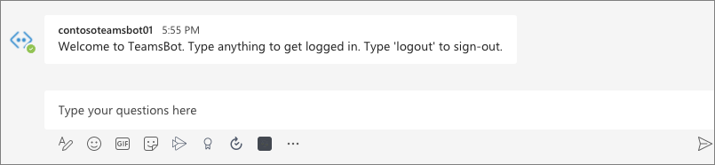

Start the sign in process by entering any message, such as **hello**. The bot will prompt you to sign in:

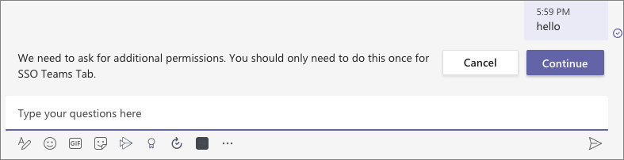

Select the **Continue** button to accept the sign in process. After a moment, you should see the bot display information about the currently signed in user. This information was retrieved using the SSO support in Microsoft Teams to obtain an ID token for the currently signed in user, exchanging this ID token for an access token, and using that to submit requests to Microsoft Graph:

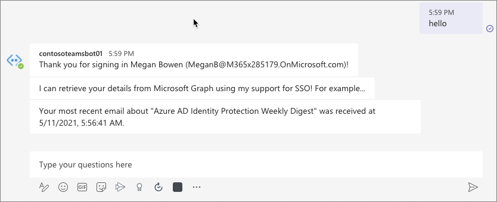

Finally, enter **logout** to start the sign-out process:

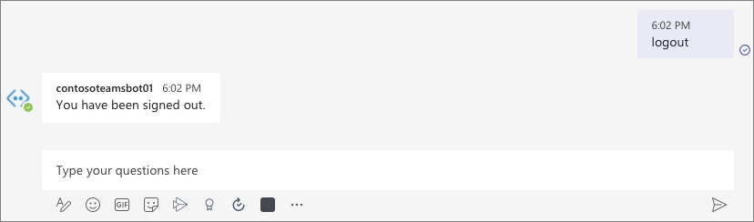

## Summary

In this exercise, you’ll learn how to create and add a new bot to a Microsoft Teams app and interact with it from the Microsoft Teams client while using the support for SSO.
