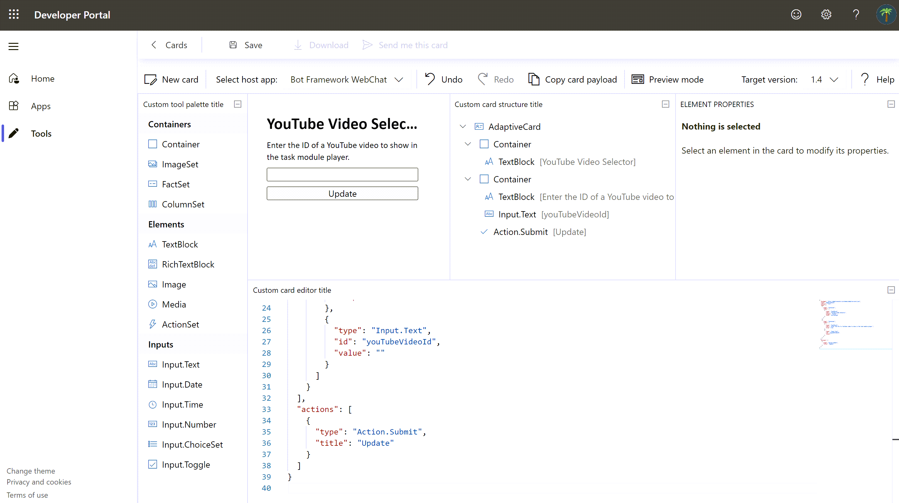
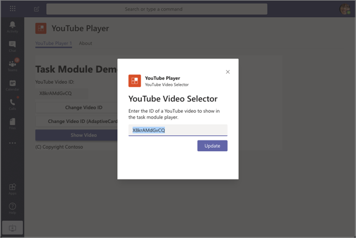

> [!VIDEO https://www.microsoft.com/videoplayer/embed/RE4OO1q]

In this unit, you’ll learn how to use Adaptive Cards in a custom task module in a custom Microsoft Teams app. You’ll also learn how to invoke task modules from anywhere within Microsoft Teams using deep links.

## Overview of adaptive cards

A card is a user-interface (UI) container for short or related pieces of information. Cards can have multiple properties and attachments and can include buttons that can trigger Card actions.

Adaptive Cards are a cross-product specification for various Microsoft products including Bots, Outlook, Teams, and Windows. They're the recommended card type for new Microsoft Teams apps. Microsoft Teams supports multiple types of cards.

An Adaptive Card is represented as a JSON object. The JSON string defines all the controls, text, and actions that the hosting application will use to render the card.

This JSON can be authored in any text editor. The Developer Portal can be used to author Adaptive Cards starting with a template and preview the rendering of the card.



The following JSON represents an Adaptive Card that contains an input box and single submit button:

```json
{
  "$schema": "http://adaptivecards.io/schemas/adaptive-card.json",
  "type": "AdaptiveCard",
  "version": "1.0",
  "body": [
    {
      "type": "Container",
      "items": [
        {
          "type": "TextBlock",
          "text": "YouTube Video Selector",
          "weight": "bolder",
          "size": "extraLarge"
        }
      ]
    },
    {
      "type": "Container",
      "items": [
        {
          "type": "TextBlock",
          "text": "Enter the ID of a YouTube video to show in the task module player.",
          "wrap": true
        },
        {
          "type": "Input.Text",
          "id": "youTubeVideoId",
          "value": ""
        }
      ]
    }
  ],
  "actions": [
    {
      "type": "Action.Submit",
      "title": "Update"
    }
  ]
}
```

## Using Adaptive Cards in Microsoft Teams task modules

In a previous unit, you learned how to use HTML and JavaScript, or React, to implement a task module. You can also use Adaptive Cards to implement the task module interface.



Using Adaptive Cards in task modules follows almost all the same rules as a HTML-based task module.

One difference is how you create the task module. If you recall, a task module is invoked by passing a populated instance of the `taskInfo` object in the `microsoftTeams.tasks.startTask()` method. For an HTML-based task module, you set the address of the web page loaded in the task module in the `taskInfo.url` property.

When using an Adaptive Card, you assign the JSON of the card to the `taskInfo.card` property.

The other difference with Adaptive Cards is in the parameter of the callback method defined when invoking the task module with the `startTask()` method. The values of all input controls defined in the Adaptive Card are returned in a single object, `result`, in the callback method.

## Using deep links to invoke task modules

Task modules can be invoked using buttons and other types of user actions within Microsoft Teams. Another way to invoke a task module is with a deep link.

Deep links are URLs that contain specific values that Microsoft Teams uses to invoke the task module.

The format for a deep link is as follows:

```http
https://teams.microsoft.com/l/task/<APP_ID>?url=<TASKINFO.URL>&height=<TASKINFO.HEIGHT>&width=<TASKINFO.WIDTH>&title=<TASKINFO.TITLE>
```

Let's look at each of these values:

- `<APP_ID>`: This is the ID of the custom Microsoft Teams app. The app ID, a GUID, can be found in the app's **manifest.json** file.
- `<TASKINFO.*>`: The extra properties in the query string of the URL map to specific properties on the `taskInfo` object covered in a previous unit.

The deep link can be used from anywhere, including the conversations within Microsoft Teams channels or in external applications.

## Summary

In this unit, you learned how to use Adaptive Cards in a custom task module in a custom Microsoft Teams app. You also learned how to invoke task modules from anywhere within Microsoft Teams using deep links.
