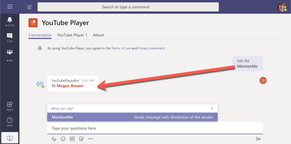
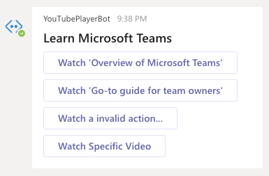
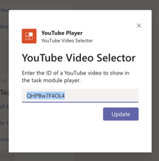
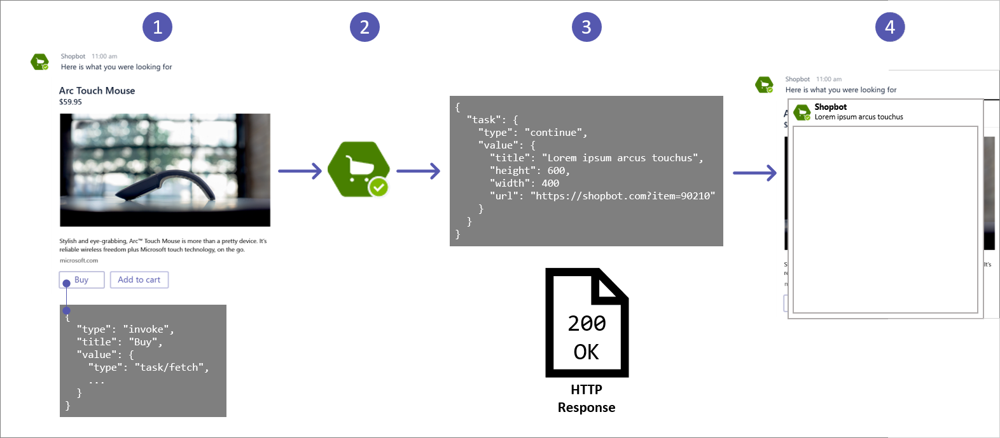

> [!VIDEO https://www.microsoft.com/videoplayer/embed/RE4OAOK]

Task modules can be invoked from custom tabs in Microsoft Teams, from anywhere using a deep link and from bots. Task modules offer developers a way to collect user input with a bot and keep everyone in the channel from seeing what another user is doing with the bot.

In this unit, you’ll learn how to use task modules with bots in Microsoft Teams.

## Overview

So far in this module, you've learned how to create task modules as HTML web pages and Adaptive Cards. You've learned how to use these task modules from tabs and invoking them using Microsoft Teams' support for deep links.

Another way you can use task modules is from bots. Bots present a unique challenge in that there's no user interface to interact with a bot, rather all communication is typically done using conversations.



Microsoft's Bot Framework and the Microsoft Teams SDKs have added support for not only invoking task modules, but also to handle the **Action.Submit** event in the case where task modules submit information back to the bot.





## Invoking task modules from bots

Recall from a previous unit, the process of invoking a task module is to call the `submitTask(taskInfo, submitHandler)` method in the Microsoft Teams JavaScript SDK. This method won't work when invoking the task module from the bot because the bot's code is running as a web service external to Microsoft Teams.

Instead, you have two options for invoking a task module from a bot.

One option is to use a deep link that is included in the message posted to the **Conversations** tab in Microsoft Teams by the bot. When a user selects this link, it will invoke the task module.

The other option is to send a special type of message to the Bot Framework and therefore, to Microsoft Teams. This message can be sent from a card action or from the bot itself.



To create the message, set a button's type to `invoke`. The `value.type` property of the button should be set to `task/fetch`, or `Action.Submit` for cards.

When the user selects the button, it will send an HTTP POST `invoke` message to the bot. The Microsoft Teams SDK automatically processes all `invoke` messages and directs them to one of two handlers:

- `handleTeamsTaskModuleFetch()`: called when the `value.type` property of the message is `task/fetch`
- `handleTeamsTaskModuleSubmit()`: called when the `value.type` property of the message is `task/submit`

Both of these methods return an object of type `TaskModuleResponse`. This object tells Microsoft Teams to either display a message (`type: "message"`) or to display another task module (`type: "continue"`).

The details of the response, either a message or a task module, are included in the `value` property of the returned object.

For example, the following response from either of the two handlers to display a message:

```json
{
  "task": {
    "type": "message",
    "value": "Message text
  }
}
```

For example, the following response from either of the two handlers to display a task module:

```json
{
  "task": {
    "type": "continue",
    "value": {
      "title": <TaskModuleTaskInfo object>
    }
  }
}
```

## Summary

In this unit, you learned how to use task modules with bots in Microsoft Teams.

Task modules can be invoked from custom tabs in Microsoft Teams, from anywhere using a deep link and from bots. Task modules offer developers a way to collect user input with a bot and keep everyone in the channel from seeing what another user is doing with the bot.
