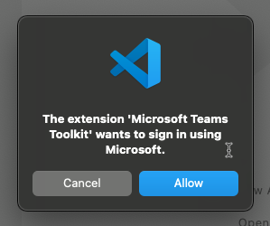
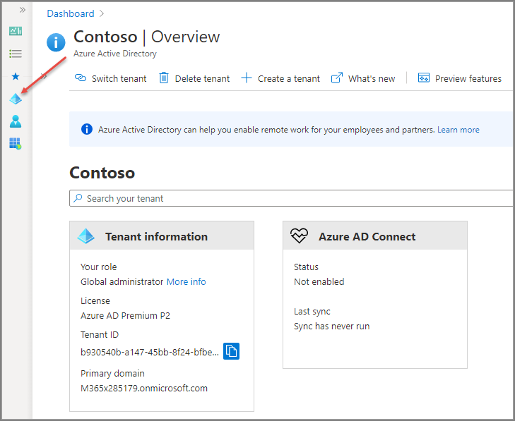
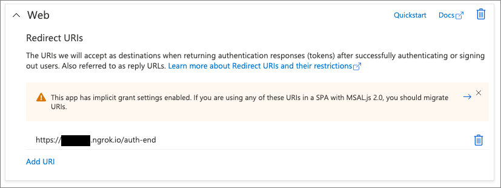
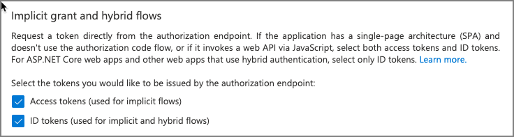
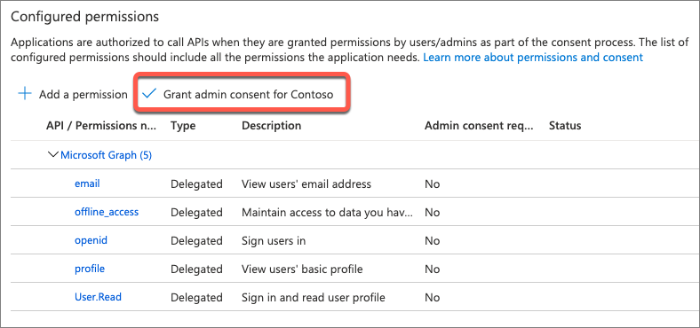
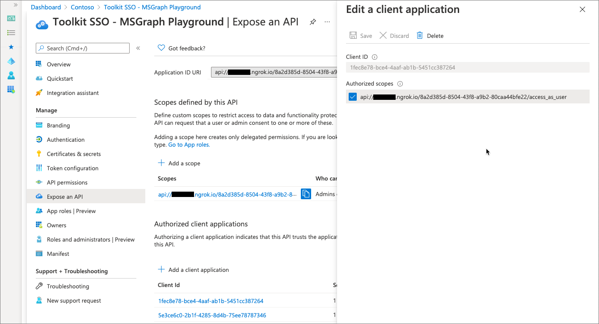
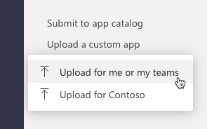
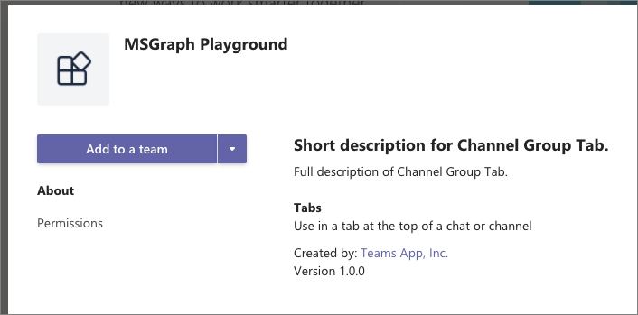
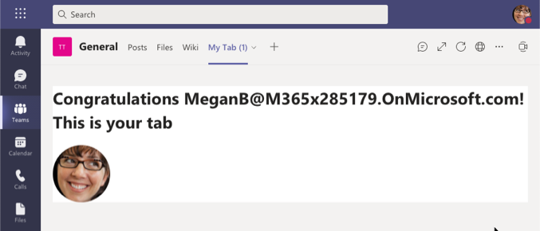
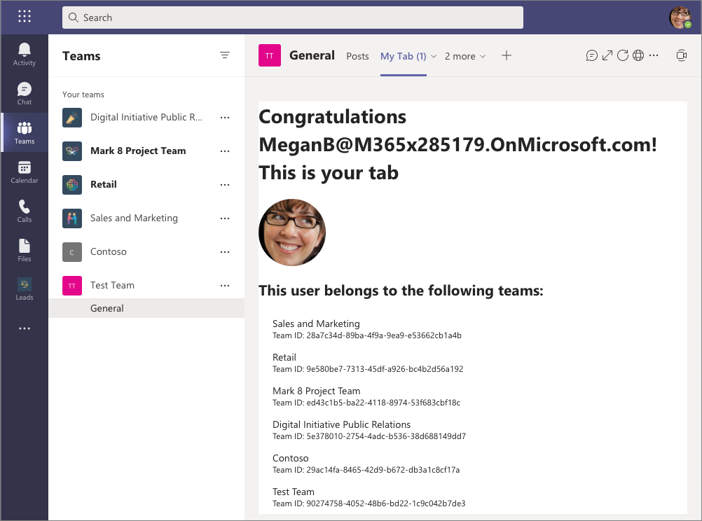

In this exercise, you’ll learn how to create a project using the Microsoft Teams Toolkit for Visual Studio and configure the custom Microsoft Teams app with single sign-on to submit requests to Microsoft Graph.

## Prerequisites

Developing Microsoft Teams apps requires a Microsoft 365 tenant, Microsoft Teams configured for development, and the necessary tools installed on your workstation.

For the Microsoft 365 tenant, follow the instructions on [Microsoft Teams: Prepare your Microsoft 365 tenant](https://docs.microsoft.com/microsoftteams/platform/concepts/build-and-test/prepare-your-o365-tenant) for obtaining a developer tenant if you don't currently have a Microsoft 365 account. Make sure you've also enabled Microsoft Teams for your organization.

Microsoft Teams must be configured to enable custom apps and allow custom apps to be uploaded to your tenant to build custom apps for Microsoft Teams.

You'll use Node.js to create custom Microsoft Teams tabs in this module. The exercises in this module assume you have the following tools installed on your developer workstation.

> [!IMPORTANT]
> In most cases, installing the latest version of the following tools is the best option. The versions listed here were used when this module was published and last tested.

- [Node.js](https://nodejs.org/) - v10.\* (or higher)
- NPM (installed with Node.js) - v6.\* (or higher)
- [ngrok](https://www.ngrok.com)
- [Visual Studio Code](https://code.visualstudio.com)
- [Microsoft Teams Toolkit for Visual Studio Code](https://docs.microsoft.com/microsoftteams/platform/toolkit/visual-studio-code-overview)

You must have the minimum versions of these prerequisites installed on your workstation.

## Create your Microsoft Teams app project

Let's start by creating a Microsoft Teams app project. To do this, you'll use the Microsoft Teams Toolkit for Visual Studio Code.

Start by launching Visual Studio Code, and then select the **Microsoft Teams Toolkit** from the activity bar:


From the list of **Microsoft Teams: Commands**, select **Create a new Teams app**.

The Teams Toolkit will prompt you to sign in to your Microsoft account. This will be used to register the Teams app in both your Microsoft 365 tenant's Microsoft Teams app store and Azure Active Directory (Azure AD). Select **Allow** and sign-in using your Microsoft 365 Work & school account.



After signing in, the toolkit prompts you to select a project type to create. Because this project will use the Microsoft Graph, which requires all requests to include OAuth2 access token for authorization, create a new tab project using the single sign-on (SSO) capability supported by Microsoft Teams. Select the **TypeScript** option for **Channel and group app with single sign-on (SSO)** app type:


On the **Configure project** screen, you're prompted for the **Application name** and **Azure AD single sign-on** domain name:


Set the **Application name** to **MSGraph Playground**.

For the domain name, this must be a fully qualified domain name that will serve the custom app, it must be HTTPS, and the domain can't be localhost. You can address these requirements during development with the tool [ngrok](https://www.ngrok.com). Ngrok creates a secure routatable URL to your local HTTP webserver. For example, ngrok can route requests from https://something.ngrok.io to http://localhost:3000.

While we don't have a local webserver running yet because we're still creating the project, we can still start ngrok now and leave it running during the exercise. In the console, run the following command to start ngrok:

```console
ngrok http https://localhost:3000
```

When ngrok starts, it will display the temporary subdomain. In this case, the URL https://d4fa28c4e203.ngrok.io is forwarding all requests to https://localhost:3000 that you'll start later in the exercise.


Enter the full ngrok address, excluding the protocol, in the **Configure project** dialog for the domain name and select **Register**.


The toolkit will create a new Azure AD application using the values you've provided as shown in the following screenshot. It's a good idea to copy all of this information into a text file.

> [!IMPORTANT]
> Each time ngrok is started, it will generate a new dynamic subdomain for the URL. **If you restart ngrok, you'll need to update anywhere you've referenced the dynamic subdomain.** The optional licensed version of ngrok allows you to define and reuse the same subdomain.


When you select **Finish**, the toolkit will prompt you for the location where to create the project. Select a folder on your local workstation. The toolkit will create a new folder the specified location and create all the project scaffolding required.

Once the project has been created, the toolkit will load it in VS Code.

## Explore the initial project

Let's explore a few parts of the project created by the toolkit in VS Code.

The initial project actually contains two separate web applications that you'll use:


### Microsoft Teams tab web application

The root files in the project, as well as the **public** and **src** folders represent the web app that implements the custom Microsoft Teams tab app.

Open the **./.env** file that contains environment variables used by the project. Take note of the following properties that were set from the project creation process:

- **REACT_APP_AZURE_APP_REGISTRATION_ID**: This is the ID of the Azure AD application created by the Teams Toolkit project creation experience.
- **REACT_APP_BASE_URL**: This is the fully qualified URL, including the protocol, to the web server hosted by the application. In our case, this is the ngrok URL.

The following represents the **./.env** file from the project created using the previous steps:

```text
HTTPS=true
BROWSER=none
DANGEROUSLY_DISABLE_HOST_CHECK=true
REACT_APP_AZURE_APP_REGISTRATION_ID=8a2d385d-8504-43f8-a9b2-80caa44bfe22
REACT_APP_BASE_URL=https://d4fa28c4e203.ngrok.io
REACT_APP_GRAPH_SCOPES=User.Read
```

> [!IMPORTANT]
> If you restart ngrok and get a new dynamic subdomain, you'll need to update everywhere you've seen the **\*.ngrok.io** URL.

The **src** folder contains a client-side React application that is used for the custom Teams tab.

### Authentication web API

The **./api_server** folder contains a Node.js-based web API that's used to implement the OAuth2 on-behalf-of flow to exchange the access token obtained by the Microsoft Teams client that implements SSO to obtain an access token that can be used to call Microsoft Graph.

Open the **./api_server/.env** file that contains environment variables used by this web API project. Take note of the following properties that were set from the project creation process:

- **CLIENT_ID**: This is the client ID of the Azure AD application created by the Teams Toolkit project creation experience.
- **CLIENT_SECRET**: This is the client secret of the Azure AD application created by the Teams Toolkit project creation experience.

The following represents the **./api_server/.env** file from the project created using the previous steps:

```text
CLIENT_ID=8a2d385d-8504-43f8-a9b2-80caa44bfe22
CLIENT_SECRET=ySbGlRZg18.M8H1~V-T-Hn7Zq39NHd55G~
GRAPH_SCOPES=User.Read
```

### Microsoft Teams app manifest & app package

The **./appPackage** folder contains the Microsoft Teams app manifest file, **./appPackage/manifest.json** as well as the images used by the custom app. The toolkit also created the app package, **./appPackage/appPackage.zip**

Open the **manifest.json** file and notice the `webApplicationInfo` element at the end of the file. This contains some of the same details about the Azure AD application created by the toolkit. This is what configures the Microsoft Teams SSO process with our custom application.

> [!IMPORTANT]
> If you restart ngrok and get a new dynamic subdomain, you'll need to update everywhere you've seen the **\*.ngrok.io** URL in the **manifest.json** file, package, and update any installed instances of the app.

## Explore the registered Azure AD application

Part of the new project creation included registering an application with Azure AD used to implement SSO and obtain an access token used to call Microsoft Graph.

Open a browser and navigate to the [Azure Active Directory admin center (https://aad.portal.azure.com)](https://aad.portal.azure.com). Sign in using a **Work or School Account** that has global administrator rights to the tenancy.

Select **Azure Active Directory** in the left-hand navigation.

### App registration

Select **Manage > App registrations** in the left-hand navigation.

  

On the **App registrations** page, select the app **Toolkit SSO: MSGraph Playground**. This is the name of the app you entered when creating the project with the toolkit, prefixed with **Toolkit SSO:**.

### Authentication

In the left-hand navigation, select **Manage > Authentication**. Notice the **Redirect URIs** is set to the **/auth-end** link. This is where Azure AD will redirect the redirection request.



Also note the section **Implicit grand and hybrid flows** has been updated to ensure Azure AD returns access tokens and ID tokens when a user authenticates to the app:



### Certificates & secrets

Next, in the left-hand navigation, select **Manage > Authentication**. Notice the **Redirect URIs** are In the left-hand navigation, select **Manage > Certificates & secrets**.

The toolkit created a client secret for the app. This was displayed in the confirmation after creating the project as you saw previously.

### API permissions

In the left-hand navigation, select **Manage > API permissions**. Notice how multiple delegated permissions have been configured for the app.



To simplify the development process, select **Grant admin consent for ...**. This will grant consent to all permissions the app needs on behalf of all users in your organization.

### Expose an API: Application ID URI

Finally, select **Manage > Expose an API** in the left-hand navigation. There are multiple things to take note of on this page:

First, notice the **Application ID URI**. This is the unique ID of our application. Notice it has the ID of the application in the full string and the proxy URL of our application.

### Expose an API: Scopes defined by the API

The next section contains the scopes defined by the API. These can be custom scopes that enable you to restrict access to data and functionality protected by the API. In our case, the toolkit added the following scope:

```text
api://d4fa28c4e203.ngrok.io/8a2d385d-8504-43f8-a9b2-80caa44bfe22
```

The ID of the scope will match the ID of your application. Notice the end of the scope. This scope, **access_as_user** enables the Microsoft Teams client applications to use the app's web APIs with the same rights as the currently signed in user.

### Expose an API: Authorized client applications

The last section indicates the API will automatically trust these specific applications and not prompt the user for consent when the application calls this API.

This effectively authorizes the Microsoft Teams desktop, mobile, and web applications to call your add-in's API.

The applications listed are as follows:

- **Microsoft Teams (mobile/desktop client)**: `1fec8e78-bce4-4aaf-ab1b-5451cc387264`
- **Microsoft Teams (web client)**: `5e3ce6c0-2b1f-4285-8d4b-75ee78787346`

If you select one of these apps, each of them has the scope defined above as an authorized scope.



> [!IMPORTANT]
> If you restart ngrok and get a new dynamic subdomain, you'll need to update everywhere you've seen the **\*.ngrok.io** URL in the Azure AD application.

## Build and test the application

To test the application you have three steps:

1. Install the dependencies & start the web API project
1. Install the dependencies & start the React web app project
1. Install the custom Microsoft Teams tab

> [!TIP]
> The following steps assume ngrok is still running from a previous step. If not, make sure you start ngrok following the same process outlined above. The ngrok URL points to the React web app project.
>
> Remember, if you restart the ngrok process, the dynamic subdomain will change and you'll need to make the appropriate updates in the registered Azure AD application, custom Microsoft Teams app, environment variables in the web API project, and  environment variables in the React web app project.

### Install the dependencies & start the web API project

Open a new console, change to current folder to the **./api-server** folder in the project and install all dependencies by running the executing command:

```console
npm install
```

After all dependencies are installed, run the following command to start the web API project:

```console
npm start
```

You'll know it's working when returns the following in the console:

```console
API server is listening on port 5000
```

> [!TIP]
> If you need to stop the process in the future, press <kbd>CTRL</kbd>+<kbd>C</kbd>

### Install the dependencies & start the React web app project

Open a new console, change to current folder to the **./** folder in the project and install all dependencies by running the executing command:

```console
npm install
```

After all dependencies are installed, run the following command to start the React web app project:

```console
npm start
```

You'll know it's working when returns the following in the console:

```console
Compiled successfully!

You can now view microsoft-teams-app in the browser.

  Local:            https://localhost:3000
  On Your Network:  https://###.###.###.###:3000

Note that the development build is not optimized.
To create a production build, use npm run build.
```

> [!TIP]
> If you need to stop the process in the future, press <kbd>CTRL</kbd>+<kbd>C</kbd>.

### Install the custom Microsoft Teams tab

Now let's load the tab in Microsoft Teams. In the browser, go to [Microsoft Teams](https://teams.microsoft.com). Sign in with the credentials of a Work and School account.

In the app bar on the left, select the **More added apps** button. Then select **More apps**.

On the **Browse available apps and services** page, select **Upload a custom app** > **Upload for me or my teams**.



In the file dialog box that appears, select the Microsoft Teams package in your project. This app package is a zip file in the project's **./appPackage** folder.

After the package is uploaded, select it to display a summary of the app. Here you can see some todo items to address. You'll update the todo items later in the exercise.



Select the **Add to a team** button, specify an existing team and channel to install the app to, and then select the **Set up a tab** button.


In the **Tab Configuration** dialog, select the **Save** button.

Test the tab by navigating to the team and channel where you installed the tab. Then select the **My tab** tab. You should see the working tab, with the current user's UPN and profile picture displayed:



This working sample demonstrates the following:

1. The React app that implements the tab is successfully communicating with the host Microsoft Teams client that uses SSO to obtain an access token for the currently signed in user.
1. The React app is exchanging this access token for an access token that can be used to submit requests to Microsoft Graph. This process is handled by our local web API server.
1. The React app is then using the access token to submit a request to Microsoft Graph for the currently signed in user's profile picture.

With everything working, let's update the tab and Azure AD application to display a list of all teams the current user as joined.

Leave the ngrok and web API processes running in the consoles, but stop the React app project's process by pressing <kbd>CTRL</kbd>+<kbd>C</kbd>.

## Display the teams the current user has joined

In this step, you'll update the project to use a different Microsoft Graph endpoint to display a list of all teams the current user has joined.

### Add the Team.ReadBasic.All permission to the Azure AD application

Before you do this, your Azure AD application registration needs a new permission to call this endpoint.

Open a browser and navigate to the [Azure Active Directory admin center (https://aad.portal.azure.com)](https://aad.portal.azure.com). Sign in using a **Work or School Account** that has global administrator rights to the tenancy.

Select **Azure Active Directory** in the left-hand navigation.

Select **Manage > App registrations** in the left-hand navigation.

On the **App registrations** page, select the app **Toolkit SSO: MSGraph Playground**. This is the name of the app you entered when creating the project with the toolkit, prefixed with **Toolkit SSO:**.

In the left-hand navigation, select **Manage > API permissions**.

Select **Add a permission**, then select **Microsoft Graph > Delegated permissions**.

Search for, and select the permission **Team.ReadBasic.All**, then select the **Add permissions** button:


To simplify the testing process, select **Grant admin consent for Contoso** to consent this new permission for all users in your tenant.

### Update the tab project

The next step is to update the tab project to call Microsoft Graph to obtain a list of all teams the signed in user has joined.

In Visual Studio Code, locate and open the **./src/components/tab.tsx** file.

First, add a new React component to display a list of items. Locate the following line at the top of the file:

```typescript
import { Avatar, Loader } from '@fluentui/react-northstar'
```

Add the `List` component to the `import` statement:

```typescript
import { Avatar, Loader, List } from '@fluentui/react-northstar'
```

Next, update the tab component's state. Locate the `ITabState` interface and add an array declaration of `joinedTeams`:

```typescript
interface ITabState {
  context?: microsoftTeams.Context;
  ssoToken: string;
  consentRequired: boolean;
  consentProvided: boolean;
  graphAccessToken: string;
  photo: string;
  joinedTeams: [];
  error: boolean;
}
```

Locate the tab's `constructor()` method and update the code that initializes the state to include an empty collection of `joinedTeams`:

```typescript
this.state = {
  context: undefined,
  ssoToken: "",
  consentRequired: false,
  consentProvided: false,
  graphAccessToken: "",
  photo: "",
  joinedTeams: [],
  error: false
}
```

With the state of the component updated, now add code to call Microsoft Graph. Add the following method declaration after the `componentDidUpdate()` React lifecycle method declaration:

```typescript
getUsersJoinedTeams = async () => {
  let endpoint = `https://graph.microsoft.com/v1.0/me/joinedTeams`;
  let graphRequestParams = {
    method: 'GET',
    headers: {
      "authorization": "bearer " + this.state.graphAccessToken
    }
  }

  // submit request to Microsoft Graph
  let response = await fetch(endpoint,graphRequestParams).catch(this.unhandledFetchError);

  // process response
  if (response) {
    if(!response.ok){
      console.error("ERROR: ", response);
      this.setState({error:true});
    }

    this.setState({ joinedTeams: (await response.json()).value });
  }
}
```

Update the tab to call the new `getUsersJoinedTeams()` method when the component loads on the page. Locate the `componentDidUpdate()` method. After the existing `this.callGraphFromClient();` call, add a call to the new method:

```typescript
componentDidUpdate = async (prevProps: ITabProps, prevState: ITabState) => {
  if((prevState.graphAccessToken === "") && (this.state.graphAccessToken !== "")){
    this.callGraphFromClient();
    this.getUsersJoinedTeams();
  }
}
```

The last step is to update the user interface. Locate the `render()` method and locate the following line:

```tsx
let avatar = this.state.photo !== "" ?
  <Avatar image={this.state.photo} size='largest'/> : null;
```

Add the following code immediately after this line. This code will convert the array of objects returned from Microsoft Graph to an array to bind to the `<List />` component:

```typescript
let joinedTeams = this.state.joinedTeams.length > 0
  ? this.state.joinedTeams.map((joinedTeam: any) => ({
      key: joinedTeam.id,
      header: joinedTeam.displayName,
      content: `Team ID: ${joinedTeam.id}`
    }))
  : [];
```

Finally, locate the line `<h1>{avatar}</h1>` in the `render()` method and add the following code after it:

```tsx
<h2>This user belongs to the following teams:</h2>
<List items={joinedTeams} />
```

Save all the changes to the **tab.tsx** file.

## Build and retest the application

Repeat the process to start the React web app project by executing the following statement in the command line:

```console
npm start
```

Once the app starts, go back to the browser and navigate back to your tab that you previously installed. You'll now see the list of teams the user has previously joined:



You can now stop the web project and web API projects in their respective consoles by pressing <kbd>CTRL</kbd>+<kbd>C</kbd> in each one. However, you can leave the ngrok process running so the dynamic subdomain won't change for future exercises in this module.
