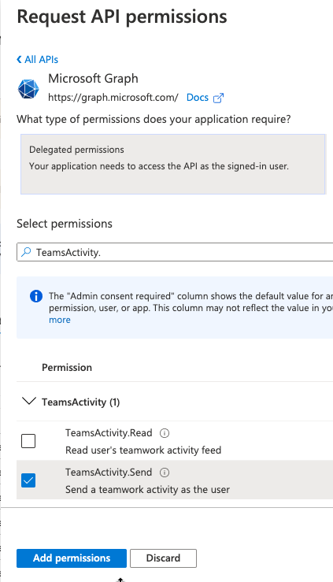
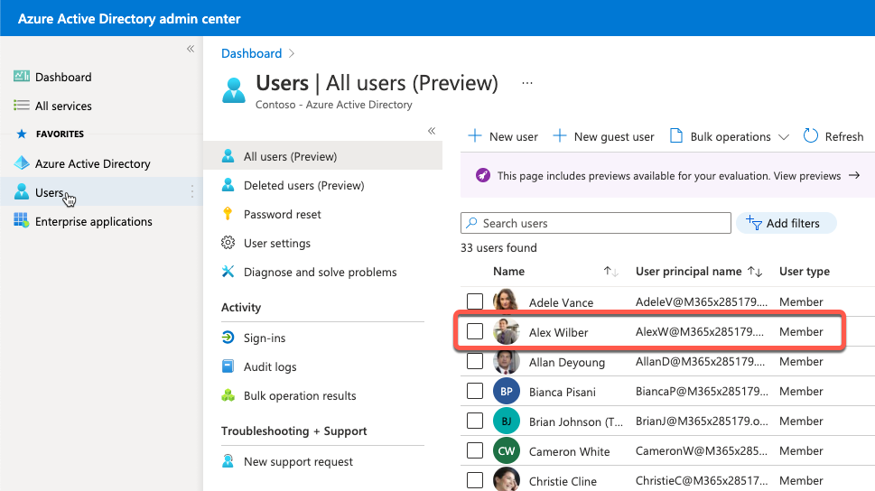
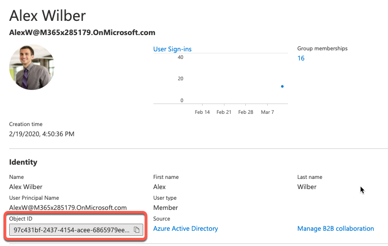
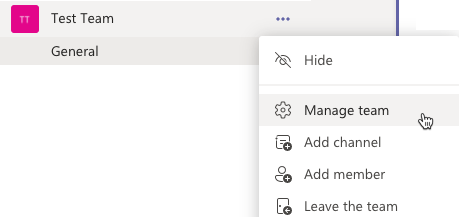
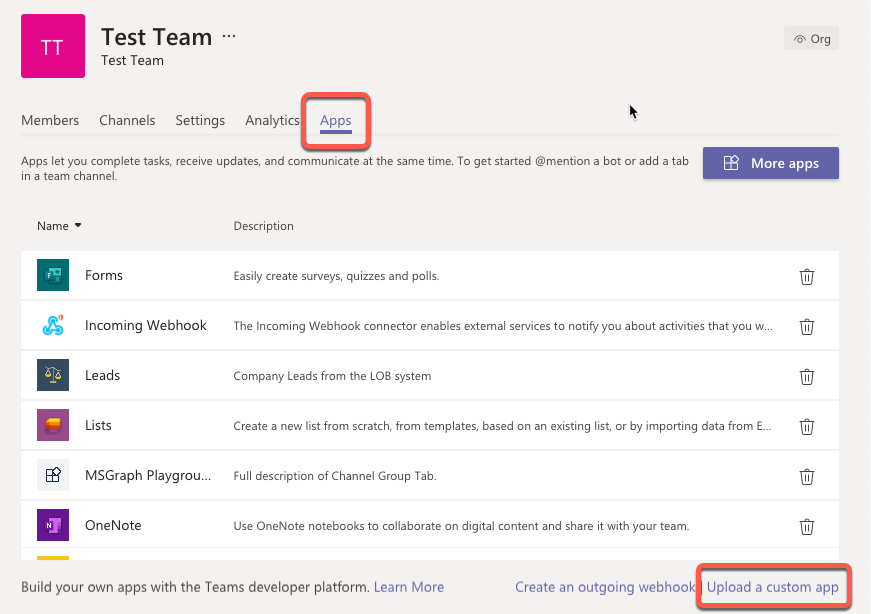
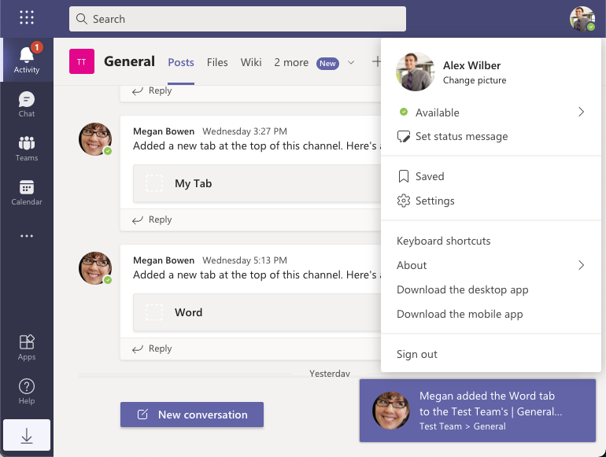
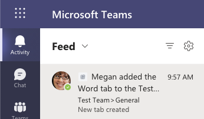

> [!VIDEO https://www.microsoft.com/videoplayer/embed/RE4OIwR]

In this exercise, you'll learn how to use Microsoft Graph to submit notifications to the Microsoft Teams activity feed.

> [!IMPORTANT]
> This exercise assumes you have created the Microsoft Teams app project from the previous exercises in this module. You'll update the project to add code to notify a user when a new tab is added to the channel.

## Add the TeamsActivity.Send permission to the Azure AD application

The Microsoft Graph teamwork endpoint supports sending notifications to users. The user that executes the code that calls the endpoint must consent to one of the **TeamsActivity.\*** permissions. In this exercise, you'll send the activity notification using the teamwork endpoint and permission, so you need to consent to the permission that enables this: **TeamsActivity.Send**.

Let's start by adding and pre-consenting this permission for our existing Azure AD application.

Open a browser and navigate to the [Azure Active Directory admin center (https://aad.portal.azure.com)](https://aad.portal.azure.com). Sign in using a **Work or School Account** that has global administrator rights to the tenancy.

Select **Azure Active Directory** in the left-hand navigation.

Select **Manage > App registrations** in the left-hand navigation.

On the **App registrations** page, select the app **My Teams SSO App**.

In the left-hand navigation, select **Manage > API permissions**.

Select **Add a permission**, then select **Microsoft Graph > Delegated permissions**.

Search for, and select the permission **TeamsActivity.Send**, then select the **Add permissions** button:



To simplify the testing process, select **Grant admin consent for Contoso** to consent this new permission for all users in your tenant.

### Update the list of permissions requested by the tab

With the permission added to the Azure AD app, you now need to update the list of permissions the server-side API will include in the request for the access token.

Locate and open the **./.env**. At the end of the file, locate the environment variable that contains the space-delimited permissions and add the following permission you just added so it now looks like the following:

```txt
TAB_APP_SCOPES=https://graph.microsoft.com/User.Read https://graph.microsoft.com/Team.ReadBasic.All https://graph.microsoft.com/TeamsTab.ReadWriteForTeam https://graph.microsoft.com/TeamsActivity.Send email openid profile offline_access
```

## Add a user to the team

Activity feed notifications can't be sent from a user to themselves. So for this exercise, you'll need to sign into Microsoft Teams in another browser session as a different user than you've been using.

While you're in the Azure Active Directory admin center, let's get the details on another user. Select **Manage > Users** from the left-hand menu and find a user in the list. For this exercise, we'll use Alex Wilber as an example. Select a user from the list:



When you use Microsoft Graph to send a notification to a user's activity feed, you specify the user by their unique object ID. To simplify the exercise code and to focus on the activity feed, we'll specify the exact user rather dynamically looking up the user.

Copy the user's **Object ID** value as you'll need this when you update the tab's code.



## Update the Microsoft Teams app manifest

Now, let's update the app's manifest to register support for an activity.

Locate and open the **./manifest/manifest.json** file.

At the end of this file, find the `webApplicationInfo` element. Immediately after the `webApplicationInfo` element, add the following JSON. This adds a new activity type `userMention` to the app's registration with Microsoft Teams:

```json
"activities": {
  "activityTypes": [
    {
      "type": "userMention",
      "description": "Personal Mention Activity",
      "templateText": "{actor} added the {tabName} tab to the {teamName}'s | {channelName} channel"
    }
  ]
}
```

After making this change, you'll have to reinstall the app so Microsoft Teams is aware of this activity. You'll do this when testing the app at the end of this exercise.

## Update the tab's code

The last step is to add code to call Microsoft Graph.

Locate and open the **./src/client/MsGraphTeamworkTab/MsGraphTeamworkTab.tsx** file that contains our tab.

Add the following code before the `handleWordOnClick` method:

```typescript
const sendActivityMessage = useCallback(async() => {
  if (!msGraphOboToken || !context) { return; }

  const endpoint = `https://graph.microsoft.com/v1.0/teams/${context.groupId}/sendActivityNotification`;
  const requestObject = {
    method: "POST",
    headers: {
      authorization: `bearer ${msGraphOboToken}`,
      "content-type": "application/json",
    },
    body: JSON.stringify({
      topic: {
        source: "entityUrl",
        value: `https://graph.microsoft.com/v1.0/teams/${context.groupId}`
      },
      activityType: "userMention",
      previewText: {
        content: "New tab created"
      },
      recipient: {
        "@odata.type": "microsoft.graph.aadUserNotificationRecipient",
        userId: "97c431bf-2437-4154-acee-6865979eed54"
      },
      templateParameters: [
        { name: "tabName", value: "Word" },
        { name: "teamName", value: `${context.teamName}` },
        { name: "channelName", value: `${context.channelName}` }
      ]
    })
  };

  await fetch(endpoint, requestObject);
}, [context, msGraphOboToken]);
```

Notice a few things from this code:

- The `activityType` of the activity matches the type we previously registered in the app's **manfest.json** file.
- The `recipient` object contains the **Object ID** of the use the notification is intended for. In a real world application, you would likely want to look up the user the notification is intended for to make this value dynamic.
- The `templateParameters` array contains objects that match the template strings we specified in the `templateText` property of the activity that we registered in the app's **manfest.json** file.

Locate the `handleWordOnClick` callback you added in the previous exercise. At the end of the method, add the following line to call the activity sender callback:

```typescript
await sendActivityMessage();
```

At this point, you're ready to test the activity feed notification code. Save your changes to the **MsGraphTeamworkTab.tsx** file.

## Build and test the application

Now let's test the new functionality added in this exercise.

From the command line, navigate to the root folder for the project and execute the following command:

```console
gulp ngrok-serve
```

> [!IMPORTANT]
> If the **ngrok-serve** stopped for any reason, remember when you start/restart the **gulp ngrok-serve** task, the dynamic ngrok URL will change.
>
> You'll need to update all the locations where you set the URL in your project as well as in the Azure AD app registration as previously explained.
>
> In addition, you'll need to reinstall your app package because the Microsoft Teams app manifest contains the URL. To do this, you'll first need to increment the `version` property in the app's **./manifest/manifest.json** file. This value is dynamically set using the `version` property from the **./package.json** file. When you repeat the installation process of the app, it will update the existing installation.

Once the app starts, go back to the browser and navigate back to your tab that you previously installed.

### Update the Microsoft Teams app

Before you can test the new activity feed code, the installed app must be updated to register support for the new activity feed.

Once the processes app starts, go back to the browser and navigate back to the team and channel where you previously installed the tab from an earlier exercise.

From the list of teams select the **...** menu for your team, then select **Manage Team**:



On the team management screen, select the **Apps** tab and then select **Upload a custom app**. Even though the app is already uploaded and installed, this will overwrite the existing app and effectively update the existing installation.



Select the ZIP file from the project's **./package** folder and install the app.

### Test the activity feed

Activity feed notifications can't be sent from a user to themselves, so for this exercise, you'll need to sign into Microsoft Teams in another browser session with the user you selected earlier (*for example: Alex Wilber*).

In the original browser session where you updated the installed application as the team owner, navigate back to the team and channel where the tab is installed. Select the **Add Word tab** button in the tab and watch the Microsoft Teams instance that the other user (*for example: Alex Wilber in this case*) is signed into.

You'll notice after a moment, a notification will appear for Alex from the team owner (Megan):



Next, select the **Activity feed** from the activity bar to see the entry listed in Alex's Activity feed:


