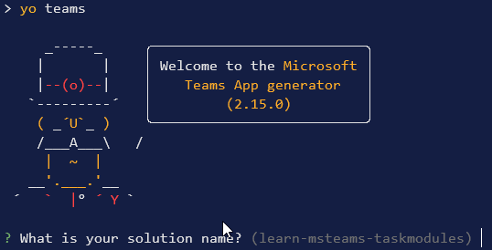
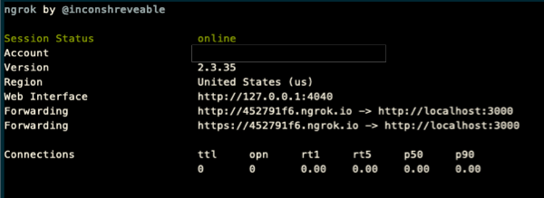
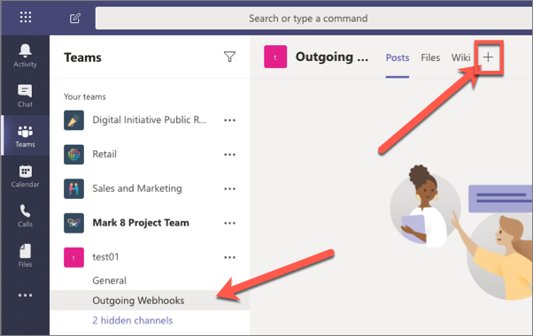
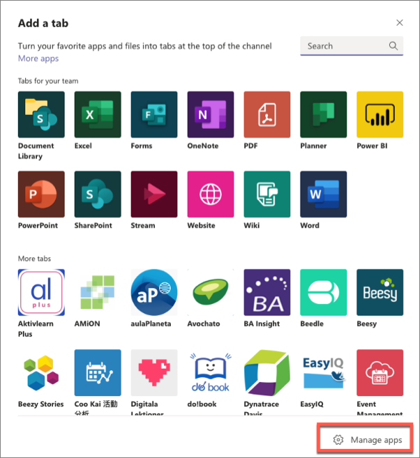
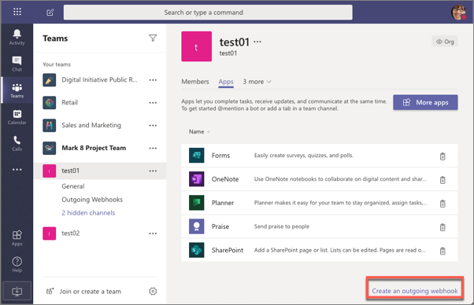
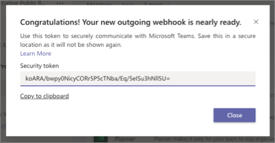
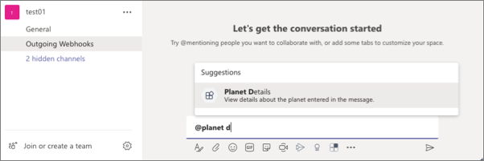
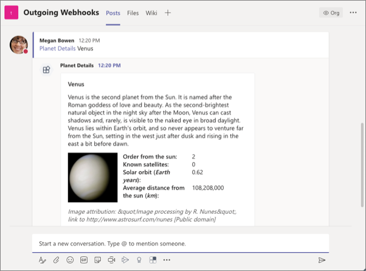

> [!VIDEO https://www.microsoft.com/videoplayer/embed/RE4OIzu]

In this exercise, you’ll learn how to create a web service and register it as an outgoing webhook in Microsoft Teams.

## Prerequisites

Developing Microsoft Teams apps requires a Microsoft 365 tenant, Microsoft Teams configured for development, and the necessary tools installed on your workstation.

For the Microsoft 365 tenant, follow the instructions on [Microsoft Teams: Prepare your Microsoft 365 tenant](/microsoftteams/platform/get-started/get-started-tenant) for obtaining a developer tenant if you don't currently have a Microsoft 365 account. Make sure you have also enabled Microsoft Teams for your organization.

Microsoft Teams must be configured to enable custom apps and allow custom apps to be uploaded to your tenant to build custom apps for Microsoft Teams. Follow the instructions on the same **Prepare your Microsoft 365 tenant** page mentioned above.

You'll use Node.js to create custom Microsoft Teams tabs in this module. The exercises in this module assume you've the following tools installed on your developer workstation.

> [!IMPORTANT]
> In most cases, installing the latest version of the following tools is the best option. The versions listed here were used when this module was published and last tested.

- [Node.js](https://nodejs.org/) - v12.\* (or higher)
- NPM (installed with Node.js) - v6.\* (or higher)
- [Gulp](https://gulpjs.com/) - v4.\* (or higher)
- [Yeoman](https://yeoman.io/) - v3.\* (or higher)
- [Yeoman Generator for Microsoft Teams](https://github.com/OfficeDev/generator-teams) - v3.5.0 (or higher)
- [Visual Studio Code](https://code.visualstudio.com)

You must have the minimum versions of these prerequisites installed on your workstation.

## Create Microsoft Teams app

Open your command prompt, navigate to a directory where you want to save your work, create a new folder **learn-msteams**, and change directory into that folder.

Run the Yeoman Generator for Microsoft Teams by running the following command:

```console
yo teams
```



Yeoman will launch and ask you a series of questions. Answer the questions with the following values:

- **What is your solution name?**: TeamsWebhooks
- **Where do you want to place the files?**: Use the current folder
- **Title of your Microsoft Teams App project?**: Teams Webhooks
- **Your (company) name? (max 32 characters)**: Contoso
- **Which manifest version would you like to use?**: 1.11
- **Quick scaffolding**: Yes
- **What features do you want to add to your project?**: An Outgoing Webhook
- **The URL where you will host this solution?**: (Accept the default option)
- **Would you like show a loading indicator when your app/tab loads?**: No
- **Name of your outgoing webhook?**: Teams Webhooks Outgoing Webhook

> [!NOTE]
> Most of the answers to these questions can be changed after creating the project. For example, the URL where the project will be hosted isn't important at the time of creating or testing the project.

After answering the generator's questions, the generator will create the scaffolding for the project and then execute `npm install` that downloads all the dependencies required by the project.

To simplify working with collections, install the Lodash library by executing the following commands in the command line from the root folder of the project:
```console
npm install lodash -S
```

Add the AdaptiveCards templating library by executing the following command:

```console
npm install adaptive-expressions adaptivecards-templating
```

## Code the outgoing webhook

The Yeoman Generator for Microsoft Teams created a stub web service endpoint for our outgoing webhook. Locate and open the file **./src/server/teamsWebhooksOutgoingWebhook/TeamsWebhooksOutgoingWebhook.ts**. It listens for HTTPS requests at the endpoint **/api/webhook**.

Find the `requestHander()` method in the `TeamsWebhooksOutgoingWebhook` class. The method first checks the HMAC value in the authorization header against the security token that you'll obtain when you add the webhook to a team.

Locate the following code:

```typescript
message.text = `Echo ${incoming.text}`;
```

This code simply echoes the string entered in the message back to Microsoft Teams that will be added in a reply to the message that triggered the webhook.

Let's update this code to add some real functionality. When a user @mentions the webhook, if they enter the name of a known planet of our solar system, it will respond with an adaptive card that displays details of the planet.

Let's start by adding two resource files to the project.

Create a new file **planets.json** in the **./src/server/teamsWebhooksOutgoingWebhook** folder and add the following JSON to it. This file will contain an array of planet details:

```json
[
  {
    "id": "1",
    "name": "Mercury",
    "summary": "Mercury is the smallest and innermost planet in the Solar System. Its orbit around the Sun takes 87.97 days, the shortest of all the planets in the Solar System. It is named after the Roman deity Mercury, the messenger of the gods.",
    "solarOrbitYears": "0.24",
    "solarOrbitAvgDistanceKm": "57909050",
    "numSatellites": "0",
    "wikiLink": "https://en.wikipedia.org/wiki/Mercury_(planet)",
    "imageLink": "https://upload.wikimedia.org/wikipedia/commons/d/d9/Mercury_in_color_-_Prockter07-edit1.jpg",
    "imageAlt": "NASA/Johns Hopkins University Applied Physics Laboratory/Carnegie Institution of Washington [Public domain]"
  },
  {
    "id": "2",
    "name": "Venus",
    "summary": "Venus is the second planet from the Sun. It is named after the Roman goddess of love and beauty. As the second-brightest natural object in the night sky after the Moon, Venus can cast shadows and, rarely, is visible to the naked eye in broad daylight. Venus lies within Earth's orbit, and so never appears to venture far from the Sun, setting in the west just after dusk and rising in the east a bit before dawn.",
    "solarOrbitYears": "0.62",
    "solarOrbitAvgDistanceKm": "108208000",
    "numSatellites": "0",
    "wikiLink": "https://en.wikipedia.org/wiki/Venus",
    "imageLink": "https://upload.wikimedia.org/wikipedia/commons/e/e5/Venus-real_color.jpg",
    "imageAlt": "&quot;Image processing by R. Nunes&quot;, link to http://www.astrosurf.com/nunes [Public domain]"
  },
  {
    "id": "3",
    "name": "Earth",
    "summary": "Earth is the third planet from the Sun and the only astronomical object known to harbor life. According to radiometric dating and other sources of evidence, Earth formed over 4.5 billion years ago. Earth's gravity interacts with other objects in space, especially the Sun and the Moon, which is Earth's only natural satellite. Earth orbits around the Sun in 365.256 days, a period known as an Earth sidereal year. During this time, Earth rotates about its axis about 366.256 times.",
    "solarOrbitYears": "1.00",
    "solarOrbitAvgDistanceKm": "149597500",
    "numSatellites": "1",
    "wikiLink": "https://en.wikipedia.org/wiki/Earth",
    "imageLink": "https://upload.wikimedia.org/wikipedia/commons/9/97/The_Earth_seen_from_Apollo_17.jpg",
    "imageAlt": "Apollo 17 [Public domain]"
  },
  {
    "id": "4",
    "name": "Mars",
    "summary": "Mars is the fourth planet from the Sun and the second-smallest planet in the Solar System after Mercury. In English, Mars carries a name of the Roman god of war and is often referred to as the 'Red Planet'. The latter refers to the effect of the iron oxide prevalent on Mars' surface, which gives it a reddish appearance distinctive among the astronomical bodies visible to the naked eye.",
    "solarOrbitYears": "1.88",
    "solarOrbitAvgDistanceKm": "134935000",
    "numSatellites": "2",
    "wikiLink": "https://en.wikipedia.org/wiki/Mars",
    "imageLink": "https://upload.wikimedia.org/wikipedia/commons/0/02/OSIRIS_Mars_true_color.jpg",
    "imageAlt": "ESA - European Space Agency &amp; Max-Planck Institute for Solar System Research for OSIRIS Team ESA/MPS/UPD/LAM/IAA/RSSD/INTA/UPM/DASP/IDA [CC BY-SA 3.0-IGO (https://creativecommons.org/licenses/by-sa/3.0-igo)]"
  },
  {
    "id": "5",
    "name": "Jupiter",
    "summary": "Jupiter is the fifth planet from the Sun and the largest in the Solar System. It is a gas giant with a mass one-thousandth that of the Sun, but two-and-a-half times that of all the other planets in the Solar System combined. Jupiter is one of the brightest objects visible to the naked eye in the night sky, and has been known to ancient civilizations since before recorded history. It is named after the Roman god Jupiter. When viewed from Earth, Jupiter can be bright enough for its reflected light to cast shadows, and is on average the third-brightest natural object in the night sky after the Moon and Venus.",
    "solarOrbitYears": "11.86",
    "solarOrbitAvgDistanceKm": "445336000",
    "numSatellites": "78",
    "wikiLink": "https://en.wikipedia.org/wiki/Jupiter",
    "imageLink": "https://upload.wikimedia.org/wikipedia/commons/5/50/Jupiter%2C_image_taken_by_NASA%27s_Hubble_Space_Telescope%2C_June_2019_-_Edited.jpg",
    "imageAlt": "NASA, ESA, and A. Simon (NASA Goddard), edited by PlanetUser [Public domain]"
  },
  {
    "id": "6",
    "name": "Saturn",
    "summary": "Saturn is the sixth planet from the Sun and the second-largest in the Solar System, after Jupiter. It is a gas giant with an average radius about nine times that of Earth. It has only one-eighth the average density of Earth; however, with its larger volume, Saturn is over 95 times more massive. Saturn is named after the Roman god of wealth and agriculture; its astronomical symbol (♄) represents the god's sickle.",
    "solarOrbitYears": "29.46",
    "solarOrbitAvgDistanceKm": "1433525000",
    "numSatellites": "82",
    "wikiLink": "https://en.wikipedia.org/wiki/Saturn",
    "imageLink": "https://upload.wikimedia.org/wikipedia/commons/c/c7/Saturn_during_Equinox.jpg",
    "imageAlt": "NASA / JPL / Space Science Institute [Public domain]"
  },
  {
    "id": "7",
    "name": "Uranus",
    "summary": "Uranus is the seventh planet from the Sun. It has the third-largest planetary radius and fourth-largest planetary mass in the Solar System. Uranus is similar in composition to Neptune, and both have bulk chemical compositions which differ from that of the larger gas giants Jupiter and Saturn. For this reason, scientists often classify Uranus and Neptune as \"ice giants\" to distinguish them from the gas giants.",
    "solarOrbitYears": "84.02",
    "solarOrbitAvgDistanceKm": "2883000000",
    "numSatellites": "27",
    "wikiLink": "https://en.wikipedia.org/wiki/Uranus",
    "imageLink": "https://upload.wikimedia.org/wikipedia/commons/3/3d/Uranus2.jpg",
    "imageAlt": "NASA/JPL-Caltech [Public domain]"
  },
  {
    "id": "8",
    "name": "Neptune",
    "summary": "Neptune is the eighth and farthest known planet from the Sun in the Solar System. In the Solar System, it is the fourth-largest planet by diameter, the third-most-massive planet, and the densest giant planet. Neptune is 17 times the mass of Earth, slightly more massive than its near-twin Uranus. Neptune is denser and physically smaller than Uranus because its greater mass causes more gravitational compression of its atmosphere.",
    "solarOrbitYears": "164.80",
    "solarOrbitAvgDistanceKm": "4500000000",
    "numSatellites": "14",
    "wikiLink": "https://en.wikipedia.org/wiki/Neptune",
    "imageLink": "https://upload.wikimedia.org/wikipedia/commons/6/63/Neptune_-_Voyager_2_%2829347980845%29_flatten_crop.jpg",
    "imageAlt": "Justin Cowart [CC BY (https://creativecommons.org/licenses/by/2.0)]"
  }
]
```

Next, create a new file **planetDisplayCard.json** in the **./src/server/teamsWebhooksOutgoingWebhook** folder and add the following JSON to it. This file will contain a template of the adaptive card the web service will respond with:

```json
{
  "$schema": "http://adaptivecards.io/schemas/adaptive-card.json",
  "type": "AdaptiveCard",
  "version": "1.4",
  "body": [
    {
      "id": "cardHeader",
      "type": "Container",
      "items": [
        {
          "id": "planetName",
          "type": "TextBlock",
          "weight": "Bolder",
          "size": "Medium",
          "text": "${name}"
        }
      ]
    },
    {
      "type": "Container",
      "id": "cardBody",
      "items": [
        {
          "id": "planetSummary",
          "type": "TextBlock",
          "wrap": true,
          "text": "${summary}"
        },
        {
          "id": "planetDetails",
          "type": "ColumnSet",
          "columns": [
            {
              "type": "Column",
              "width": 100,
              "items": [
                {
                  "id": "planetImage",
                  "size": "Stretch",
                  "type": "Image",
                  "url": "${imageLink}"
                }
              ]
            },
            {
              "type": "Column",
              "width": 250,
              "items": [
                {
                  "type": "FactSet",
                  "facts": [
                    {
                      "title": "Order from the sun:",
                      "value": "${id}"
                    },
                    {
                      "title": "Known satellites:",
                      "value": "${numSatellites}"
                    },
                    {
                      "title": "Solar orbit (*Earth years*):",
                      "value": "${solarOrbitYears}"
                    },
                    {
                      "title": "Average distance from the sun (*km*):",
                      "value": "${solarOrbitAvgDistanceKm}"
                    }
                  ]
                }
              ]
            }
          ]
        },
        {
          "id": "imageAttribution",
          "type": "TextBlock",
          "size": "Medium",
          "isSubtle": true,
          "wrap": true,
          "text": "*Image attribution: ${imageAlt}"
        }
      ]
    },
    {
      "type": "ActionSet",
      "actions": [
        {
          "type": "Action.OpenUrl",
          "title": "Learn more on Wikipedia",
          "url": "${wikiLink}"
        }
      ]
    }
  ]
}
```

Add the following `import` statements to the **./src/server/teamsWebhooksOutgoingWebhook/TeamsWebhooksOutgoingWebhook.ts** file, just after the existing `import` statements:

```typescript
import { CardFactory } from "botbuilder";
import { find, sortBy } from "lodash";
import * as ACData from "adaptivecards-templating";
```

Add the following method to the `TeamsWebhooksOutgoingWebhook` class. The `getPlanetDetailCard()` method will load and populate the adaptive card template with details using the provided planet object:

```typescript
private static getPlanetDetailCard(selectedPlanet: any): builder.Attachment {
 // load card template
  const adaptiveCardSource: any = require("./planetDisplayCard.json");
  // Create a Template instance from the template payload
  const template = new ACData.Template(adaptiveCardSource);
  // bind the data to the card template
  const boundTemplate = template.expand({ $root: selectedPlanet });
  // load the adaptive card
  const adaptiveCard = CardFactory.adaptiveCard(boundTemplate);
  // return the adaptive card
  return adaptiveCard;
}
```

Next, add the following method to the `TeamsWebhooksOutgoingWebhook` class. The `processAuthenticatedRequest()` method takes the incoming text uses it to find a planet in the **planets.json** file. If it finds one, it calls the `getPlanetDetailCard()` method to get an adaptive card and returns it as an `Activity` that will be sent back to Microsoft Teams. If a planet isn't found, it just echoes the text back in a reply to the request:

```typescript
private static processAuthenticatedRequest(incomingText: string): Partial<builder.Activity> {
  const message: Partial<builder.Activity> = {
    type: builder.ActivityTypes.Message
  };

  // load planets
  const planets: any = require("./planets.json");
  // get the selected planet
  const selectedPlanet: any = planets.filter((planet) => (planet.name as string).trim().toLowerCase() === incomingText.trim().toLowerCase());

  if (!selectedPlanet || !selectedPlanet.length) {
    message.text = `Echo ${incomingText}`;
  } else {
    const adaptiveCard = TeamsWebhooksOutgoingWebhook.getPlanetDetailCard(selectedPlanet[0]);
    message.type = "result";
    message.attachmentLayout = "list";
    message.attachments = [adaptiveCard];
  }

  return message;
}
```

Add the following `scrubMessage()` method to the `TeamsWebhooksOutgoingWebhook` class. A user must @mention an outgoing webhook to send a message to it. This method will remove the `<at></at>` text and any spaces to extract the planet name:

```typescript
private static scrubMessage(incomingText: string): string {
  const cleanMessage = incomingText
                        .slice(incomingText.lastIndexOf(">")+1, incomingText.length)
                        .replace("&nbsp;", "");
  return cleanMessage;
}
```

Finally, update the `requestHandler()` method:

- Locate the following code and change the `message` declaration from a `const` to `let` as you'll change this value.

    ```typescript
    const message: Partial<builder.Activity> = {
      type: builder.ActivityTypes.Message
    };
    ```

- Locate and replace the following code:

    ```typescript
    message.text = `Echo ${incoming.text}`;
    ```

  with the following code:

    ```typescript
    const scrubbedText = TeamsWebhooksOutgoingWebhook.scrubMessage(incoming.text);
    message = TeamsWebhooksOutgoingWebhook.processAuthenticatedRequest(scrubbedText);
    ```

## Test the outgoing webhook

From the command line, navigate to the root folder for the project and execute the following command:

```console
gulp serve --debug
```

Next, open a new console window and execute the following command:

```console
ngrok http 3007
```

This command will create dynamic HTTP and HTTPS URLs with unique subdomains that will redirect to your local web server. Make a note of the dynamic HTTPS URL because you'll need it later.



> [!IMPORTANT]
> Be careful to not stop and restart ngrok. Each time you start ngrok, it will create a new unique URL. This will require you to reconfigure your webhooks each time you restart it.
>
> However, you can restart the web server you started with **gulp serve** without impacting ngrok.

Now let's add the outgoing webhook to a team in Microsoft Teams. In the browser, navigate to **https://teams.microsoft.com** and sign in with the credentials of a Work and School account.

Once you're signed in, select a channel in a team you want to add the webhook to. From the channel's page, select the **+** in the top navigation:



On the **Add a tab** dialog, select **Manage apps** in the lower right corner:



This will take you to the **Manage Channel** page. Select the **Create an outgoing webhook** in the lower right corner:



In the **Create an outgoing webhook** dialog, enter the following values, and select **Create**:

- **Name**: Planet Details
- **Callback URL**: https://{{REPLACE_NGROK_SUBDOMAIN}}.ngrok.io/api/webhook

    > [!IMPORTANT]
    > Replace the `{{REPLACE_NGROK_SUBDOMAIN}}` with the value of your dynamically created Ngrok URL displayed in the console when you ran `gulp ngrok-serve`.

- **Description**: View details about the planet entered in the message.

After creating the outgoing webhook, Microsoft Teams will display a security token.



Copy this value and set the `SECURITY_TOKEN` property in the **./.env** file in the project.

Stop the project's local web server by pressing <kbd>CTRL</kbd>+<kbd>C</kbd> and restart it by executing the following command:

```console
gulp serve --debug
```

> [!CAUTION]
> Be careful to only stop the web server. Don't stop the ngrok process. If you do, you'll need to update the outgoing webhook registration with a new URL after restarting ngrok.

Now you can test the webhook. Go to a channel's **Conversation** tab within the team and enter the message **@Planet Details Venus**. Notice that as you're typing the message, Microsoft Teams detects the name of the webhook:



A few seconds after submitting the message, you'll see a reply to your message appear that contains the customized adaptive card with details about the planet:



You've successfully tested your outgoing webhook! Stop the local web server by pressing <kbd>CTRL</kbd>+<kbd>C</kbd> in the command prompt.

## Summary

In this exercise, you learned how to create a web service and register it as an outgoing webhook in Microsoft Teams.
