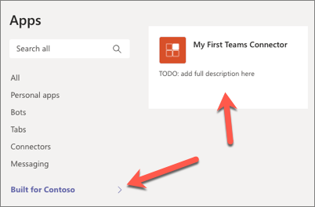
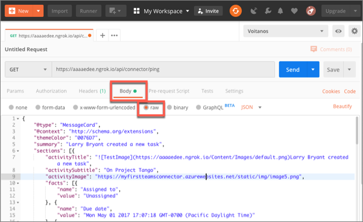

In this unit, you’ll learn how to create an Office 365 Connector and add it to Microsoft Teams.

The first step will be to register a new Office 365 Connector with the **Connectors Developer Dashboard**. Then you'll create a new Microsoft Teams app that contains a web service and the necessary details to associate the Office 365 Connector to connect it to Microsoft Teams.

## Register an Office 365 Connector

Open a browser and navigate to the **Connectors Developer Dashboard**: https://aka.ms/ConnectorsDashboard


Select **New Connector**.

On the **Register Connector** page, complete the required fields in the form with anything you like and accept any default options presented, with the following exceptions:

- **Connector name**: My First Teams Connector
- **Configuration page for your Connector**: https://REPLACE.ngrok.io/MyFirstTeamsConnector/config.html

> [!NOTE]
> In this exercise, it isn't necessary to come back and update the address of the configuration page because we are only testing the Connector in Microsoft Teams.

Select the **I accept the terms and conditions...** checkbox and select **Save** to register the Connector.

After successfully registering your Connector, the **Connectors Developer Dashboard** page will display some additional sections. While there is a button to **Download Manifest** for a custom Microsoft Teams app, we'll use the manifest created by the Yeoman Generator for Microsoft Teams.

You'll need the ID of your new Connector later in the exercise. This ID, a GUID, can be found in the URL of the updated page. Copy this ID for later use.


## Create Microsoft Teams app

Open your command prompt, navigate to a directory where you want to save your work, create a new folder **learn-msteams-taskmodules**, and change directory into that folder.

Run the Yeoman Generator for Microsoft Teams by running the following command:

```shell
yo teams
```

Yeoman will launch and ask you a series of questions. Answer the questions with the following values:

- **What is your solution name?**: MyFirstTeamsConnector
- **Where do you want to place the files?**: Use the current folder
- **Title of your Microsoft Teams App project?**: My First Teams Connector
- **Your (company) name? (max 32 characters)**: Contoso
- **Which manifest version would you like to use?**: 1.5
- **Enter your Microsoft Partner Id, if you have one?**: (Leave blank to skip)
- **What features do you want to add to your project?**: A Connector
- **The URL where you will host this solution?**: https://myfirstteamsconnector.azurewebsites.net
- **Would you like to include Test framework and initial tests?**: No
- **Would you like to use Azure Applications Insights for telemetry?**: No
- **What type of Connector would you like to include?**: A new Connector hosted in this solution
- **What is the Id of your Connector (found in the Connector Developer Portal)?**: (Enter the ID of the Connector you copied in the last step)
- **What is the name of your Connector?** My First Teams Connector

> [!NOTE]
> Most of the answers to these questions can be changed after creating the project. For example, the URL where the project will be hosted isn't important at the time of creating or testing the project.

After answering the generator's questions, the generator will create the scaffolding for the project and then execute `npm install` that downloads all the dependencies required by the project.

### Examine and update the app manifest file

After creating the project you'll need to make a few edits to the default app manifest file. Locate and open the file **./src/manifest/manifest.json**.

Within this file, locate the `connectors` array. Notice a single connector is listed:

```json
"connectors": [
  {
    "connectorId": "{{CONNECTOR_ID}}",
    "configurationUrl": "https://{{HOSTNAME}}/myFirstTeamsConnector/config.html",
    "scopes": [
      "team"
    ]
  }
]
```

> [!IMPORTANT]
> Notice the scope of the Connector ID will be replaced by the build process. This ID can be found in the `./.env` file that's used for development.

A default manifest has a few empty array properties must be removed in order to add the Connector to a team. Locate the following properties and delete them from the **manifest.json** file:

```json
"configurableTabs": []
"staticTabs": []
"bots": []
"composeExtensions": []
```

Finally, let's explore the code in the default project to see how it works. The default project contains two elements that support the Connector:

1. The web service that Microsoft Teams & the Office 365 Connector infrastructure will call which implements the Connector logic.
1. A configuration page that's displayed when the Connector is added to a team.

### Examine the configuration page

The configuration page is an HTML page that contains a React control. Locate and open the React control file **./src/app/scripts/myFirstTeamsConnector/MyFirstTeamsConnectorConfig.tsx**.

You need to make one edit to this file before building the project. Within the `componentWillMount()` React lifecycle event handler, locate the following code:

```typescript
microsoftTeams.getContext((context: microsoftTeams.Context) => {
  this.setState({
    color: availableColors.find(c => c.code === context.entityId),
  });
  this.setValidityState(this.state.color !== undefined);
});
```

The `find()` method needs to be replaced with a `fitler()` method. Update this line:

```typescript
color: availableColors.find(c => c.code === context.entityId),
```

... to the following:

```typescript
color: availableColors.filter(c => c.code === context.entityId)[0],
```

The important part of this component to take note of is in the call to the `microsoftTeams.settings.registerOnSaveHandler()` handler that is called when the user selects the **Save**  button on the config page. Selecting **Save** will save the configuration of the Connector in Microsoft Teams and notify the Connector's web service that it has been added to a team.

The code does the following things:

- Update the settings for the Connector in Microsoft Teams
- Submit an HTTP POST to the Connector's `/api/connector/connect` endpoint with a payload that contains necessary information the Connector web service needs to store

Notice before the HTTP POST is executed, the code is calls the `getSettings()` method to retrieve the settings from Microsoft Teams:

```typescript
microsoftTeams.settings.getSettings((s: any) => {
  this.setState({
    webhookUrl: s.webhookUrl,
    user: s.userObjectId,
    appType: s.appType,
  });

...
```

This method passes in a settings object that contains a few important properties:

- **webhookUrl**: this is the endpoint, the incoming webhook, the Connector will submit to
- **userObjectId**: the ID of the user who is registering the Connector
- **appType**: this is the value `team` when associating the Connector with a team

When the HTTP POST request succeeds, the `notifySuccess()` method is called on the `SaveEvent` passed into this `registerOnSaveHandler()` handler; otherwise the `notifyFailure()` method is called.

### Examine the web service

The Connector is implemented as a web service that is hosted within the Microsoft Teams project. Locate and open the file **./src/app/myFirstTeamsConnector/MyFirstTeamsConnector.ts**.

The web service exposes two endpoints, both represented by methods with the endpoint's respective names. The endpoints are:

- **/connect**: This is called, as we covered in the previous section, when the **Save** button is selected on the config page. The default code in the handler, `Connect()`, simply saves the Connector registration in a local JSON file.

    > [!NOTE]
    > The sample web service in the default project uses a JSON file to store the registration. It does not contain any logic to update an existing Connector when it's changed, or remove a Connector. In a real world Connector, you'll likely implement a system that saves this registration to a persistent data store that handles the scenarios of updating and removing a Connector from a team.

- **/ping**: This endpoint can be called by anyone and is simply used to test the Connector. When called, it will create a card and send it to all the registered Connectors.

## Test the Office 365 Connector in Microsoft Teams

At this point, our Microsoft Teams app and Office 365 Connector is set up and working. Verify this by starting ngrok and install the Connector.

From the command line, navigate to the root folder for the project and execute the following command:

```shell
gulp ngrok-serve
```

Now let's load the Connector in Microsoft Teams. In the browser, navigate to **https://teams.microsoft.com** and sign in with the credentials of a Work and School account.

Once you are signed in, the first step is to install the Microsoft Teams app.

Select a team, select the action menu on the team and select **Manage team**:


Select the **Apps** tab and then the **More apps** button:


From the **Browse available apps and services**, select the **Upload a custom app > Upload for [tenant]** at the bottom of the **Apps** panel of categories. Select the Microsoft Teams app package, the **MyFirstTeamsConnector.zip** file in the **./package** folder of your project.

After uploading the app, Microsoft Teams will display it on the list of apps installed under the **Build for [tenant]** category page:



Once installed, you can now add the Connector to a team. You can do this from the app by selecting it, then select the **Add to a team** button and enter the team...


... or you can add it directly to a team. Let's use this first option. Select the **Add to a team** button and select a team to add the Connector to:


On the **Connectors for... channel in ... team** page, select the **Others** category and scroll to the bottom. You will see your connector under the **Sideloaded** section:


Select the **Configure** button for the Connector. This will display the configuration page from our project:


Select a color and then select the **Save** button.

This will trigger the configuration page to call the web service's `/connect` endpoint to save the connector.

With the Connector saved, the next step is to see it post to a channel. Do this by submitting an HTTPS request to the web service's `/ping` endpoint. To do this, you need to know the dynamic URL created by the ngrok utility. You can retrieve this from the command prompt as it was displayed when you started the `gulp ngrok-serve` task:


Using the free tool [Postman](https://www.postman.com/), create a new request to the point endpoint:

- set the `Content-Type` header to `application/json` on the **Headers** tab:

    

- add the following JSON to the **Body** tab and select the **raw** option (*make sure to update the URL of the image in the `sections[0].activityTile` property so the image renders when the message is set to Microsoft Teams*):

    ```json
    {
      "@type": "MessageCard",
      "@context": "http://schema.org/extensions",
      "themeColor": "0076D7",
      "summary": "Larry Bryant created a new task",
      "sections": [
        {
          "activityTitle": "Larry Bryant created a new task",
          "activitySubtitle": "On Project Tango",
          "activityImage": "https://myfirstteamsconnector.azurewebsites.net/static/img/image5.png",
          "facts": [
            {
              "name": "Assigned to",
              "value": "Unassigned"
            },
            {
              "name": "Due date",
              "value": "Mon May 01 2017 17:07:18 GMT-0700 (Pacific Daylight Time)"
            },
            {
              "name": "Status",
              "value": "Not started"
            }
          ],
          "markdown": true
        }
      ],
      "potentialAction": [
        {
          "@type": "ActionCard",
          "name": "Add a comment",
          "inputs": [
            {
              "@type": "TextInput",
              "id": "comment",
              "isMultiline": false,
              "title": "Add a comment here for this task"
            }
          ],
          "actions": [
            {
              "@type": "HttpPOST",
              "name": "Add comment",
              "target": "http://..."
            }
          ]
        },
        {
          "@type": "ActionCard",
          "name": "Set due date",
          "inputs": [
            {
              "@type": "DateInput",
              "id": "dueDate",
              "title": "Enter a due date for this task"
            }
          ],
          "actions": [
            {
              "@type": "HttpPOST",
              "name": "Save",
              "target": "http://..."
            }
          ]
        },
        {
          "@type": "ActionCard",
          "name": "Change status",
          "inputs": [
            {
              "@type": "MultichoiceInput",
              "id": "list",
              "title": "Select a status",
              "isMultiSelect": "false",
              "choices": [
                {
                  "display": "In Progress",
                  "value": "1"
                },
                {
                  "display": "Active",
                  "value": "2"
                },
                {
                  "display": "Closed",
                  "value": "3"
                }
              ]
            }
          ],
          "actions": [
            {
              "@type": "HttpPOST",
              "name": "Save",
              "target": "http://..."
            }
          ]
        }
      ]
    }
    ```

    

    > [!IMPORTANT]
    > Connectors, like incoming webhooks, only support Office 365 Connector Cards for messages sent to Microsoft Teams. Adaptive cards aren't supported when sending messages with cards when using Connectors or incoming webhooks.

Select the **Send** button in Postman. When you go back to the channel, you will see the card displayed as a message in the team:


## Summary

In this unit, you learned how to create an Office 365 Connector and add it to Microsoft Teams.
