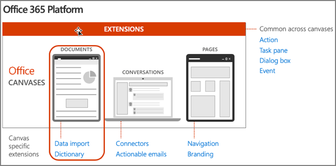
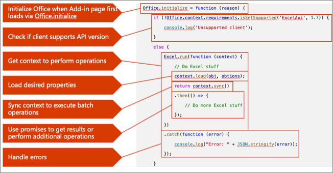
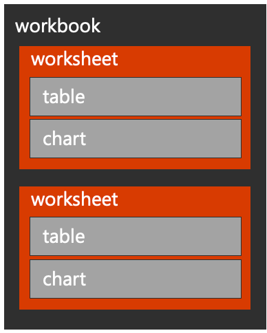
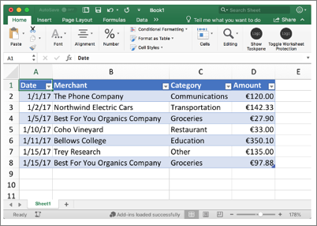
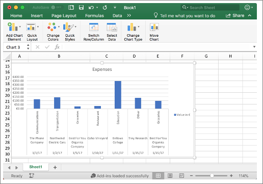

The Excel JavaScript API makes programmatic control over text, tables, and charts in Excel workbooks. In this unit, you'll learn how to work with tables including formatting options, how to filter data, and sort the data within the table. You'll also learn how to add and customize charts to your worksheets.

## Office developer platform overview

The Microsoft 365 developer platform, which includes Office, offers many canvases for developers to embed customizations and Office Add-ins are one of three canvases: documents, conversations, and pages.

Microsoft Teams makes conversations between users and enables developers to extend the experience using messaging extensions, conversational bots, and other customization options.

Developers customize pages in SharePoint Server and SharePoint online using the SharePoint Framework.

Office clients, such as Word, Excel, PowerPoint, OneNote, and Outlook can also be extended to implement custom task panes, actions, and other customizations using add-ins.



## Anatomy of Office.js add-in for Microsoft Excel

We'll start by looking at an anatomy of an Office.js for Microsoft Excel:



- All Office Add-ins must call off the `Office.initialize()` method when a page first loads the add-in.
- If you're using a newer Office.js capability in your add-in, it's important to check if the client supports those extensions using the `requirements` API.
- For the Excel JavaScript APIs, you'll use the `Excel.run()` method to get an instance of the current workbook `context`.
- Once you have a reference to the current Excel workbook's `context`, you can load any properties on the context using the `load()` method. This method will add the request queue, allowing you to chain multiple requests together for performance reasons.
- When you're ready to retrieve the properties you queued, or to do any queued actions, use the`context.sync()` method to execute the batch of queued operations defined using the `load()` method.
- The `context.sync()` method returns a JavaScript promise that can be used to get results or a previous operation and do new operations.
- As a best practice, you should listen for, catch, and handle any errors that might occur when working with the Excel JavaScript APIs.

## Excel object hierarchy

Excel add-in developers should understand an Excel workbook's hierarchy and how that relates to the objects in Office.js.

### Hierarchy of a workbook

Office.js provides context to an Excel workbook through `Excel.run()` and the `context.workbook` property.



The workbook contains worksheets that contain many collections. These collections include things such as charts, tables, and pivotTables.

Many objects within a worksheet can be accessed directly from the workbook object, including tables and pivotTables.

### Worksheets

Worksheets are aware of their siblings using `getNext()` and `getPrevious()` methods.

You can get the active worksheet using the `workbook.worksheets.getActiveWorksheet()` method and set the active worksheet using `worksheet.activate()` method.

Office.js also offers many worksheet events such as `onActivated`, `onDeactivated`, and `onSelectionChanged` that developers can use in their custom add-ins.

## Tables and headers

Tables are at the heart of a spreadsheet. Excel supports defining a range of data that is the foundation of a table of data.



### Ranges

A range represents a set of one or more contiguous cells such as a cell, a row, a column, block of cells, and so on.

You can get a range object with Office.js using a worksheet and address. For example, range "A1:D4" represents a range from top left to bottom-right cells in this screenshot.

### Tables

A table is established based on a range of data.

The `tables.add()` function accepts a data range with a flag to indicate if the table has headers or not.

Existing tables can be retrieved by their named range or ID. Developers can also iterate through a collection of tables in the worksheet.

After the table is added, headers and table rows can be added using two-dimensional arrays.

### Headers

A table created with a header flag will use the first row in the data range for its headers.

You can also set header values using the `getHeaderRowRange().values` property with a two-dimensional array.

The following code snippets demonstrate working examples of working text and paragraphs using the Excel JavaScript API:

- Obtain a range of data from a worksheet:

    ```javascript
    const range = currWorksheet.getRange('A1:D1');
    ```

- Insert a table into the worksheet based on the specified range

    ```javascript
    const table = currWorksheet.tables.add(range, true);
    table.name = "ExpensesTable";
    ```

- Get a table by name from a workbook or worksheet

    ```javascript
    const table = workbook.tables.getItem("ExpensesTable");
    ```

- Add a header row to the specified table

    ```javascript
    table.getHeaderRowRange().values = [["Date", "Merchant", "Category", "Amount"]];
    ```

- Freeze the header row by freezing the topmost row

    ```javascript
    currWorksheet.freezePanes.freezeRows(1);
    ```

- Delete the second row in a table

    ```javascript
    var row = context.workbook.tables.getItem("ExpensesTable").rows.getItemAt(1);
    row.delete();
    ```

- Update the second row in a table

    ```javascript
    var row = context.workbook.tables.getItem("ExpensesTable").rows.getItemAt(1);
    row.values = [["1/15/2017", "Best For You Organics Company", "Groceries", "97.8"]];
    ```

- Add rows to the end of a table

    ```javascript
    table.rows.add(null, [
      ["1/1/2017", "The Phone Company", "Communications", "120"]
    ]);
    ```

    > [!NOTE]
    > The first parameter of the `add()` method indicates the index where the data should be added. A value of `null` or `-1`, the row is added to the end of the end table.

- Add a row

    ```javascript
    table.rows.add(0, [
      ["1/10/2017", "Coho Vineyard", "Restaurant", "33"]
    ]);
    ```

    > [!NOTE]
    > The first parameter of the `add()` method indicates the index where the data should be added. A value of `0` adds the data to the beginning of the index.

## Filtering tables

Any column in a table can be filtered using Office.js.


Filter a column by first getting a reference ot the column and then use the `applyValuesFilter()` method to filter on specific values.

The following code filters a table's **Category** column by the values **Education** and **Groceries**:

```javascript
const categoryFilter = table.columns.getItem('Category').filter;
categoryFilter.applyValuesFilter(["Education", "Groceries"]);
```

You can also programmatically reapply filters and clear filters on a table using the table functions `reapplyFilters()` and `clearFilters()` respectively.

The following code demonstrates reapplying and clearing filters:

```javascript
// re-apply filters
table.reapplyFilters();

// clear filters
table.clearFilters();
```

## Sorting tables

Developers can sort table data using the Office.js API from Excel add-ins. To sort, call the `table.sort.apply()` method and include the `SortFields` argument to specify the fields to sort on.

The following code defines an array of sort fields. The `key` property specifies the column index in the table and the `ascending` Boolean property specifies if the sort should be in ascending or descending order:

```javascript
const sortFields = [
  { key: 1, ascending: false },
  { key: 2, ascending: true }
];
table.sort.apply(sortFields);
```

You can reapply and clear table sorts using `table.sort.reapply()` and `table.sort.clear()` methods.

```javascript
// re-apply sort
table.sort.reapply();

// clear filters
table.sort.clear();
```

## Charts

Microsoft Excel has become a playground for data manipulation and visualization. So it's no surprise that the Excel JavaScript APIs allow developers to add and manipulate charts.

Charts exist within worksheets, but can also be accessed directly from the workbook object.



Charts have many complex relational properties that can be used to fine-tune the look of a chart. These include titles, legends, axes, series, labels, and format.

Users and developers can create a chart based on a data range and are often created with tables.

The `worksheet.charts.add()` function is used to create a chart, which accepts a chart `type`, a data `range`, and `seriesBy`. The `seriesBy` argument supports the following values

- Auto
- Scalar
- Matrix

Excel supports many different types of charts. Developers can add a chart to a worksheet using the `worksheet.carts.add("{REPLACE_WITH_CHARTTYPE_ENUM}", range, "{REPLACE_WITH_CHARTSERIESBY_ENUM}")` method.

The `ChartType` argument specifies the type of chart to use. Refer to the SDK for the available options on the [Excel.ChartType enum](/javascript/api/excel/excel.charttype).

The `ChartSeriesBy` argument specifies whether the series are by rows or by columns. Refer to the SDK for the available options on the [Excel.ChartSeriesBy enum](/javascript/api/excel/excel.chartseriesby).

### Chart properties

The Excel chart object contains multiple properties developers can use to customize charts in Excel worksheets. The following table lists some of the commonly used properties on in the Office.js chart object:

|       Property        |                                                                     Description                                                                     |
| --------------------- | --------------------------------------------------------------------------------------------------------------------------------------------------- |
| `chartType`           | Represents the type of the chart (possible values on previous slide).                                                                               |
| `height`              | Represents the height, in points, of the chart object.                                                                                              |
| `id`                  | The unique ID of chart.                                                                                                                             |
| `left`                | The distance, in points, from the left side of the chart to the worksheet origin.                                                                   |
| `name`                | Represents the name of a chart object.                                                                                                              |
| `showAllFieldButtons` | Represents whether to display all field buttons on a PivotChart.                                                                                    |
| `top`                 | Represents the distance, in points, from the top edge of the object to the top of row 1 (on a worksheet) or the top of the chart area (on a chart). |
| `width`               | Represents the width, in points, of the chart object.                                                                                               |

In addition to the properties in the table above, the chart object includes multiple relationship properties. These make a difference in how the chart is displayed in Excel:

| Relationship |                                                          Description                                                          |
| ------------ | ----------------------------------------------------------------------------------------------------------------------------- |
| axes         | Represents chart axes. Read-only.                                                                                             |
| dataLabels   | Represents the data labels on the chart. Read-only.                                                                            |
| format       | Encapsulates the format properties for the chart area. Read-only.                                                             |
| legend       | Represents the legend for the chart. Read-only.                                                                               |
| series       | Represents either a single series or collection of series in the chart. Read-only.                                            |
| title        | Represents the title of the specified chart, including the text, visibility, position, and formatting of the title. Read-only. |
| worksheet    | The worksheet containing the current chart. Read-only.                                                                        |

> [!TIP]
> Refer to the Excel Office.js documentation for all properties, methods, and events on the [Excel.Chart](/javascript/api/excel/excel.chart) object.

The following code examples demonstrate how to use the Office.js API to create and manipulate charts in Excel:

- Add a clustered column chart using table data

    ```javascript
    const dataRange = table.getDataBodyRange();
    let chart = currWorksheet.charts.add("ColumnClustered", dataRange, "auto");
    ```

- Get existing chart by name

    ```javascript
    let chart = workbook.charts.getItem("MyChart");
    ```

- Modify chart properties such as position, titles, colors, and font sizes

    ```javascript
    chart.setPosition("A15", "F30");
    chart.title.text = "Expenses";
    chart.legend.position = "right"
    chart.legend.format.fill.setSolidColor("white");
    chart.dataLabels.format.font.size = 15;
    chart.dataLabels.format.font.color = "black";
    chart.series.getItemAt(0).name = "Value in &euro;";
    ```

## Summary

The Excel JavaScript API makes programmatic control over text, tables, and charts in Excel workbooks. In this unit, you learned how to work with tables including formatting options, how to filter data, and sort the data within the table. You also learned how to add and customize charts to your worksheets.
