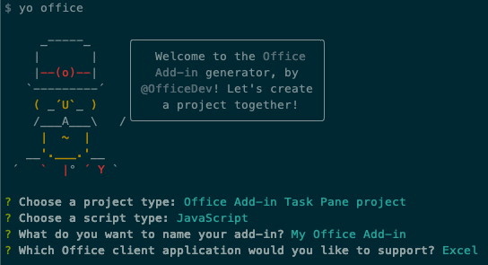
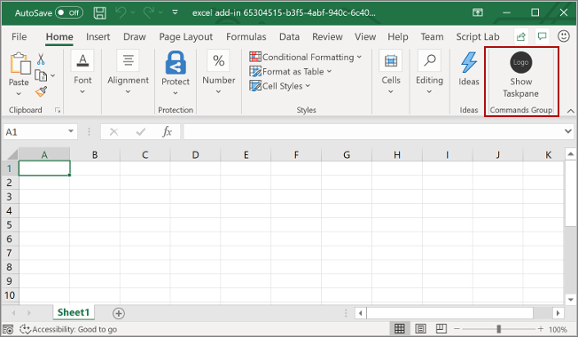
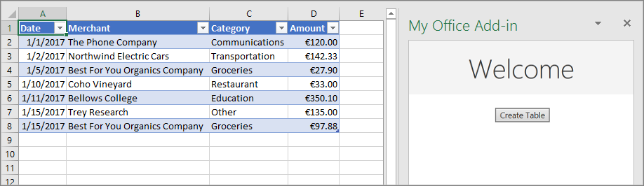
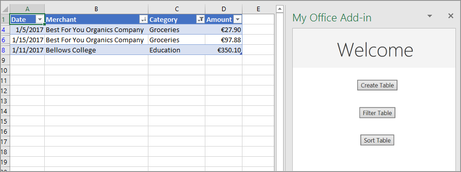
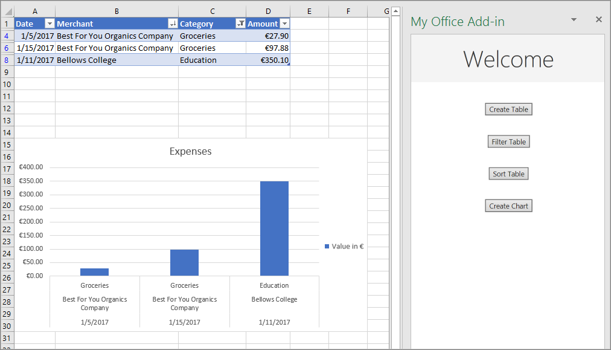

In this exercise, you'll learn how to work with tables and charts using the Office.js Excel JavaScript API. After creating a table, you'll learn how you can apply sorting and filtering actions on the data within the table. You'll also learn how to create and edit charts in the workbook using from your custom Excel add-in.

## Prerequisites

Developing Office add-ins for Microsoft Excel requires Excel 2016, version 1711 (Build 8730.1000 Click-to-Run) or later. You might need to be an Office Insider to get this version. For more information, see [Be an Office Insider](https://products.office.com/office-insider?tab=tab-1).

You'll use Node.js to create the custom Excel add-in in this module. The exercises in this module assume you have the following tools installed on your developer workstation.

> [!IMPORTANT]
> In most cases, installing the latest version of the following tools is the best option. The versions listed here were used when this module was published and last tested.

- [Node.js](https://nodejs.org/) - (*the latest [LTS](https://nodejs.org/about/releases) version*)
- NPM (installed with Node.js) - v6.x (or higher)
- [Yeoman](https://yeoman.io/) - v3.x (or higher)
- [Yeoman Generator for Microsoft Office](https://github.com/OfficeDev/generator-office) - v1.8.x (or higher)
- [Visual Studio Code](https://code.visualstudio.com)

You must have the minimum versions of these prerequisites installed on your workstation.

## Create your add-in project

Run the following command to create an add-in project using the Yeoman generator:

```console
yo office
```

> [!NOTE]
> When you run the `yo office` command, you may receive prompts about the data collection policies of Yeoman and the Office Add-in CLI tools. Use the information that's provided to respond to the prompts as you see fit.

When prompted, provide the following information to create your add-in project:

- **Choose a project type:** Office Add-in Task Pane project
- **Choose a script type:** JavaScript
- **What do you want to name your add-in?** My Office Add-in
- **Which Office client application would you like to support?** Excel



After you complete the wizard, the generator creates the project and installs supporting Node components.

> [!TIP]
> You can ignore any warnings or errors when installing dependencies and the **Congratulations! Your add-in has been created! Your next steps:** guidance the Yeoman generator displays. The remainder of this unit include all the steps you'll need to follow.

## Create a table

In this section, you'll programmatically test that your add-in supports the user's current version of Excel, add a table to a worksheet, populate the table with data, and format it.

### Code the add-in

1. Open the project in your code editor.
1. Open the file **./src/taskpane/taskpane.html**.  This file contains the HTML markup for the task pane.
1. Locate the `<main>` element and delete all lines that appear after the opening `<main>` tag and before the closing `</main>` tag.
1. Add the following markup immediately after the opening `<main>` tag:

    ```html
    <button class="ms-Button" id="create-table">Create Table</button><br/><br/>
    ```

1. Open the file **./src/taskpane/taskpane.js**. This file contains the Office JavaScript API code that makes interaction between the task pane and the Office host application.
1. Remove all references to the **run** button and the `run()` function by doing the following:
    - Locate and delete the line `document.getElementById("run").onclick = run;`.
    - Locate and delete the entire `run()` function.
1. Within the `Office.onReady()` method call, locate the line `if (info.host === Office.HostType.Excel) {` and add the following code immediately after that line:

    ```javascript
    // Determine if the user's version of Office supports all the Office.js APIs that are used in the tutorial.
    if (!Office.context.requirements.isSetSupported('ExcelApi', '1.7')) {
      console.log('Sorry. The tutorial add-in uses Excel.js APIs that are not available in your version of Office.');
    }

    // Assign event handlers and other initialization logic.
    document.getElementById("create-table").onclick = createTable;
    ```

    > [!NOTE]
    >
    > - The first part of this code determines whether the user's version of Excel supports a version of Excel.js that includes all the APIs that this series of tutorials will use. In a production add-in, use the body of the conditional block to hide or disable the UI that would call unsupported APIs. This will enable the user to still make use of the parts of the add-in that are supported by their version of Excel.
    > - The second part of this code adds an event handler for the **create-table** button.

1. Add the following function to the end of the file:

    ```javascript
    function createTable() {
      Excel.run(function (context) {

        // TODO1: Queue table creation logic here.

        // TODO2: Queue commands to populate the table with data.

        // TODO3: Queue commands to format the table.

        return context.sync();
      })
      .catch(function (error) {
        console.log("Error: " + error);
        if (error instanceof OfficeExtension.Error) {
          console.log("Debug info: " + JSON.stringify(error.debugInfo));
        }
      });
    }
    ```

    > [!NOTE]
    >
    > - Your Excel.js business logic will be added to the function that is passed to `Excel.run()`. This logic doesn't execute immediately. Instead, its added to a queue of pending commands.
    > - The `context.sync()` method sends all queued commands to Excel for execution.
    > - The `Excel.run()` is followed by a `catch` block. This is a best practice that you should always follow.

1. Within the `createTable()` function, replace `TODO1` with the following code:

    ```javascript
    var currentWorksheet = context.workbook.worksheets.getActiveWorksheet();
    var expensesTable = currentWorksheet.tables.add("A1:D1", true /*hasHeaders*/);
    expensesTable.name = "ExpensesTable";
    ```

    > [!NOTE]
    >
    > - The code creates a table by using `add()` method of a worksheet's table collection, which always exists even if its empty. This is the standard way that Excel.js objects are created. There are no class constructor APIs, and you never use a `new` operator to create an Excel object. Instead, you add to a parent collection object.
    > - The first parameter of the `add()` method is the range of only the top row of the table, not the entire range the table will ultimately use. This is because when the add-in populates the data rows (in the next step), it will add new rows to the table instead of writing values to the cells of existing rows. This is a more common pattern because the number of rows that a table will have is often not known when the table is created.
    > - Table names must be unique across the entire workbook, not just the worksheet.

1. Within the `createTable()` function, replace `TODO2` with the following code:

    ```javascript
    expensesTable.getHeaderRowRange().values =
      [["Date", "Merchant", "Category", "Amount"]];

    expensesTable.rows.add(null /*add at the end*/, [
      ["1/1/2017", "The Phone Company", "Communications", "120"],
      ["1/2/2017", "Northwind Electric Cars", "Transportation", "142.33"],
      ["1/5/2017", "Best For You Organics Company", "Groceries", "27.9"],
      ["1/10/2017", "Coho Vineyard", "Restaurant", "33"],
      ["1/11/2017", "Bellows College", "Education", "350.1"],
      ["1/15/2017", "Trey Research", "Other", "135"],
      ["1/15/2017", "Best For You Organics Company", "Groceries", "97.88"]
    ]);
    ```

    > [!NOTE]
    >
    > - The cell values of a range are set with an array of arrays.
    > - New rows are created in a table by calling the `add()` method of the table's row collection. You can add multiple rows in a single call of `add()` by including multiple cell value arrays in the parent array that is passed as the second parameter.

1. Within the `createTable()` function, replace `TODO3` with the following code:

    ```javascript
    expensesTable.columns.getItemAt(3).getRange().numberFormat = [['\u20AC#,##0.00']];
    expensesTable.getRange().format.autofitColumns();
    expensesTable.getRange().format.autofitRows();
    ```

    > [!NOTE]
    >
    > - The code gets a reference to the **Amount** column by passing its zero-based index to the `getItemAt()` method of the table's column collection.
    > - Excel.js collection objects, such as `TableCollection`, `WorksheetCollection`, and `TableColumnCollection` have an `items` property that is an array of the child object types, such as `Table` or `Worksheet` or `TableColumn`; but a `*Collection` object isn't itself an array.
    > - The code then formats the range of the **Amount** column as Euros to the second decimal.
    > - Finally, it ensures that the width of the columns and height of the rows is large enough to fit the longest (or tallest) data item. Notice that the code must get `Range` objects to format. `TableColumn` and `TableRow` objects don't have format properties.

1. Verify that you've saved all of the changes you've made to the project.

### Test the add-in

1. Complete the following steps to start the local web server and sideload your add-in.

    > [!NOTE]
    > Office Add-ins should use HTTPS, not HTTP, even when you are developing. If you are prompted to install a certificate after you run one of the following commands, accept the prompt to install the certificate that the Yeoman generator provides.

    > [!TIP]
    > If you're testing your add-in on Mac, run the following command in the root directory of your project before proceeding. When you run this command, the local web server starts.
    >
    > ```console
    > npm run dev-server
    > ```

    - To test your add-in in Excel, run the following command in the root directory of your project. This starts the local web server (if it's not already running) and opens Excel with your add-in loaded.

        ```console
        npm start
        ```

    - To test your add-in in Excel on the web, run the following command in the root directory of your project. When you run this command, the local web server will start (if it's not already running).

        ```console
        npm run start:web
        ```

        To use your add-in, open a new document in Excel on the web and then sideload your add-in by following the instructions in [Sideload Office Add-ins in Office on the web](/office/dev/add-ins/testing/sideload-office-add-ins-for-testing#sideload-an-office-add-in-in-office-on-the-web).

1. In Excel, select the **Home** tab, and then select the **Show Task pane** button in the ribbon to open the add-in task pane.

    

1. In the task pane, select the **Create Table** button.

    

## Filter and sort a table

In this section, you'll filter and sort the table that you created previously.

### Filter the table

1. Open the file **./src/taskpane/taskpane.html**.
1. Locate the `<button>` element for the **create-table** button, and add the following markup after that line:

    ```html
    <button class="ms-Button" id="filter-table">Filter Table</button><br/><br/>
    ```

1. Open the file **./src/taskpane/taskpane.js**.
1. Within the `Office.onReady()` method call, locate the following line in the `Office.onRead()` method:

    ```javascript
    document.getElementById("create-table").onclick = createTable;
    ```

    Add the following code immediately after it:

    ```javascript
    document.getElementById("filter-table").onclick = filterTable;
    ```

1. Add the following function to the end of the file:

    ```javascript
    function filterTable() {
      Excel.run(function (context) {

        // TODO1: Queue commands to filter out all expense categories except
        //        Groceries and Education.

        return context.sync();
      })
      .catch(function (error) {
        console.log("Error: " + error);
        if (error instanceof OfficeExtension.Error) {
          console.log("Debug info: " + JSON.stringify(error.debugInfo));
        }
      });
    }
    ```

1. Within the `filterTable()` function, replace `TODO1` with the following code:

    ```javascript
    var currentWorksheet = context.workbook.worksheets.getActiveWorksheet();
    var expensesTable = currentWorksheet.tables.getItem('ExpensesTable');
    var categoryFilter = expensesTable.columns.getItem('Category').filter;
    categoryFilter.applyValuesFilter(['Education', 'Groceries']);
    ```

    > [!NOTE]
    >
    > - The code first gets a reference to the column that needs filtering by passing the column name to the `getItem()` method, instead of passing its index to the `getItemAt()` method as the `createTabl()e` method does. Since users can move table columns, the column at a given index might change after the table is created. Its safer to use the column name to get a reference to the column. We used `getItemAt` safely in the preceding tutorial, because we used it in the same method that creates the table, so there's no chance that a user has moved the column.
    > - The `applyValuesFilter()` method is one of several filtering methods on the `Filter` object.

### Sort the table

1. Open the file **./src/taskpane/taskpane.html**.
1. Locate the `<button>` element for the **filter-table** button, and add the following markup after that line:

    ```html
    <button class="ms-Button" id="sort-table">Sort Table</button><br/><br/>
    ```

1. Open the file **./src/taskpane/taskpane.js**.
1. Within the `Office.onReady()` method call, locate the following line in the `Office.onRead()` method:

    ```javascript
    document.getElementById("filter-table").onclick = filterTable;
    ```

    Add the following code immediately after it:

    ```javascript
    document.getElementById("sort-table").onclick = sortTable;
    ```

1. Add the following function to the end of the file:

    ```javascript
    function sortTable() {
      Excel.run(function (context) {

        // TODO1: Queue commands to sort the table by Merchant name.

        return context.sync();
      })
      .catch(function (error) {
        console.log("Error: " + error);
        if (error instanceof OfficeExtension.Error) {
          console.log("Debug info: " + JSON.stringify(error.debugInfo));
        }
      });
    }
    ```

1. Within the `sortTable()` function, replace `TODO1` with the following code:

    ```javascript
    var currentWorksheet = context.workbook.worksheets.getActiveWorksheet();
    var expensesTable = currentWorksheet.tables.getItem('ExpensesTable');
    var sortFields = [
      {
        key: 1,            // Merchant column
        ascending: false,
      }
    ];

    expensesTable.sort.apply(sortFields);
    ```

    > [!NOTE]
    >
    > - The code creates an array of `SortField` objects, which has just one member since the add-in only sorts on the Merchant column.
    > - The `key` property of a `SortField` object is the zero-based index of the column to sort-on.
    > - The `sort` member of a `Table` is a `TableSort` object, not a method. The `SortField`s are passed to the `TableSort` object's `apply()` method.

1. Verify that you've saved all of the changes you've made to the project.

### Test the add-in

1. If the local web server is already running and your add-in is already loaded in Excel, continue to step 2. Otherwise, start the local web server and sideload your add-in:
    - To test your add-in in Excel, run the following command in the root directory of your project. This starts the local web server (if it's not already running) and opens Excel with your add-in loaded.

        ```console
        npm start
        ```

    - To test your add-in in Excel on the web, run the following command in the root directory of your project. When you run this command, the local web server will start (if it's not already running).

        ```console
        npm run start:web
        ```

        To use your add-in, open a new document in Excel on the web and then sideload your add-in by following the instructions in [Sideload Office Add-ins in Office on the web](/office/dev/add-ins/testing/sideload-office-add-ins-for-testing#sideload-an-office-add-in-in-office-on-the-web).

1. If the add-in task pane isn't already open in Excel, go to the **Home** tab and select the **Show Task pane** button in the ribbon to open it.
1. If the table you added previously in this tutorial isn't present in the open worksheet, select the **Create Table** button in the task pane.
1. Select the **Filter Table** button and the **Sort Table** button, in either order.

    

## Create a chart

In this section, you'll create a chart using data from the table that you created previously, and then format the chart.

### Chart a chart using table data

1. Open the file **./src/taskpane/taskpane.html**.
1. Locate the `<button>` element for the **sort-table** button, and add the following markup after that line:

    ```html
    <button class="ms-Button" id="create-chart">Create Chart</button><br/><br/>
    ```

1. Open the file **./src/taskpane/taskpane.js**.
1. Within the `Office.onReady()` method call, locate the following line in the `Office.onRead()` method:

    ```javascript
    document.getElementById("sort-table").onclick = sortTable;
    ```

    Add the following code immediately after it:

    ```javascript
    document.getElementById("create-chart").onclick = createChart;
    ```

1. Add the following function to the end of the file:

    ```javascript
    function createChart() {
      Excel.run(function (context) {

        // TODO1: Queue commands to get the range of data to be charted.

        // TODO2: Queue command to create the chart and define its type.

        // TODO3: Queue commands to position and format the chart.

        return context.sync();
      })
      .catch(function (error) {
        console.log("Error: " + error);
        if (error instanceof OfficeExtension.Error) {
          console.log("Debug info: " + JSON.stringify(error.debugInfo));
        }
      });
    }
    ```

1. Within the `createChart()` function, replace `TODO1` with the following code. To exclude the header row, the code uses the `Table.getDataBodyRange()` method to get the range of data you want to chart instead of the `getRange()` method.

    ```javascript
    var currentWorksheet = context.workbook.worksheets.getActiveWorksheet();
    var expensesTable = currentWorksheet.tables.getItem('ExpensesTable');
    var dataRange = expensesTable.getDataBodyRange();
    ```

1. Within the `createChart()` function, replace `TODO2` with the following code:

    ```javascript
    var chart = currentWorksheet.charts.add('ColumnClustered', dataRange, 'auto');
    ```

    > [!NOTE]
    >
    > - The first parameter to the `add()` method specifies the type of chart. There are several dozen types.
    > - The second parameter specifies the range of data to include in the chart.
    > - The third parameter determines whether a series of data points from the table should be charted row-wise or column-wise. The option `auto` tells Excel to decide the best method.

1. Within the `createChart()` function, replace `TODO3` with the following code. Most of this code is self-explanatory:

    ```javascript
    chart.setPosition("A15", "F30");
    chart.title.text = "Expenses";
    chart.legend.position = "right"
    chart.legend.format.fill.setSolidColor("white");
    chart.dataLabels.format.font.size = 15;
    chart.dataLabels.format.font.color = "black";
    chart.series.getItemAt(0).name = 'Value in &euro;';
    ```

    > [!NOTE]
    >
    > - The parameters to the `setPosition()` method specify the upper left and lower right cells of the worksheet area that should contain the chart. Excel can adjust things like line width to make the chart look good in the space it has been given.
    > - A "series" is a set of data points from a column of the table. Since there's only one non-string column in the table, Excel infers that the column is the only column of data points to chart. It interprets the other columns as chart labels. So there will be just one series in the chart and it will have index 0. This is the one to label with "Value in &euro;".

1. Verify that you've saved all of the changes you've made to the project.

### Test the add-in

1. If the local web server is already running and your add-in is already loaded in Excel, continue to step 2. Otherwise, start the local web server and sideload your add-in:
    - To test your add-in in Excel, run the following command in the root directory of your project. This starts the local web server (if it's not already running) and opens Excel with your add-in loaded.

        ```console
        npm start
        ```

    - To test your add-in in Excel on the web, run the following command in the root directory of your project. When you run this command, the local web server will start (if it's not already running).

        ```console
        npm run start:web
        ```

        To use your add-in, open a new document in Excel on the web and then sideload your add-in by following the instructions in [Sideload Office Add-ins in Office on the web](/office/dev/add-ins/testing/sideload-office-add-ins-for-testing#sideload-an-office-add-in-in-office-on-the-web).

1. If the add-in task pane isn't already open in Excel, go to the **Home** tab and select the **Show Task pane** button in the ribbon to open it.
1. If the table you added previously in this tutorial isn't present in the open worksheet, select the **Create Table** button, and then the **Filter Table** button and the **Sort Table** button, in either order.
1. Select the **Create Chart** button. A chart is created and only the data from the rows that have been filtered are included. The labels on the data points across the bottom are in the sort order of the chart; that is, merchant names in reverse alphabetical order.



## Summary

In this exercise, you learned how to work with tables and charts using the Office.js Excel JavaScript API. After creating a table, you learned how you can apply sorting and filtering actions on the data within the table. You also learned how to create and edit charts in the workbook using from your custom Excel add-in.
