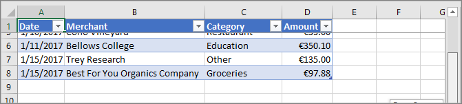
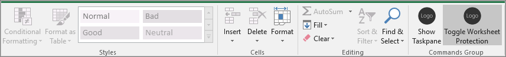

In this exercise, you'll learn how to freeze the header row of the table that you previously created, so that it remains visible even as the user scrolls down the worksheet. You'll also learn how to toggle worksheet protection on and off.

## Freeze a table header

When a table is long enough that a user must scroll to see some rows, the header row can scroll out of sight. In this section, you'll freeze the header row of the table that you created previously, so that it remains visible even as the user scrolls down the worksheet.

### Freeze the table's header row

1. Open the file **./src/taskpane/taskpane.html**.
1. Locate the `<button>` element for the **create-chart** button, and add the following markup after that line:

    ```html
    <button class="ms-Button" id="freeze-header">Freeze Header</button><br/><br/>
    ```

1. Open the file **./src/taskpane/taskpane.js**.
1. Within the `Office.onReady()` method call, locate the following line:

    ```javascript
    document.getElementById("create-chart").onclick = createChart;
    ```

    Add the following code immediately after it:

    ```javascript
    document.getElementById("freeze-header").onclick = freezeHeader;
    ```

1. Add the following function to the end of the file:

    ```javascript
    function freezeHeader() {
      Excel.run(function (context) {

        // TODO1: Queue commands to keep the header visible when the user scrolls.

        return context.sync();
      })
      .catch(function (error) {
        console.log("Error: " + error);
        if (error instanceof OfficeExtension.Error) {
          console.log("Debug info: " + JSON.stringify(error.debugInfo));
        }
      });
    }
    ```

1. Within the `freezeHeader()` function, replace `TODO1` with the following code:

    ```javascript
    var currentWorksheet = context.workbook.worksheets.getActiveWorksheet();
    currentWorksheet.freezePanes.freezeRows(1);
    ```

    > [!NOTE]
    >
    > - The `Worksheet.freezePanes` collection is a set of panes in the worksheet that are pinned, or frozen, in place when the worksheet is scrolled.
    > - The `freezeRows()` method takes as a parameter the number of rows, from the top that are to be pinned in place. We pass `1` to pin the first row in place.

1. Verify that your changes are saved to the project.

### Test the add-in

1. If the local web server is already running and your add-in is already loaded in Excel, continue to step 2. Otherwise, start the local web server and sideload your add-in:
    - To test your add-in in Excel, run the following command in the root directory of your project. This starts the local web server (if it's not already running) and opens Excel with your add-in loaded.

        ```console
        npm start
        ```

    - To test your add-in in Excel on the web, run the following command in the root directory of your project. When you run this command, the local web server will start (if it's not already running).

        ```console
        npm run start:web
        ```

        To use your add-in, open a new document in Excel on the web and then sideload your add-in by following the instructions in [Sideload Office Add-ins in Office on the web](/office/dev/add-ins/testing/sideload-office-add-ins-for-testing#sideload-an-office-add-in-in-office-on-the-web).

1. If the add-in task pane isn't already open, on the **Home** tab, select **Show Task pane**.
1. If the table you added previously in this tutorial is present in the worksheet, delete it.
1. In the task pane, select **Create Table**.
1. In the task pane, select **Freeze Header**.
1. Scroll down the worksheet far enough to see that the table header remains visible at the top even when the higher rows scroll out of sight.



## Protect a worksheet

In this section, you'll add another button to the ribbon that, when chosen, executes a function that you'll define to toggle worksheet protection on and off.

### Configure the manifest to add a second ribbon button

1. Open the manifest file **./manifest.xml**.
1. Locate the `<Control>` element. This element defines the **Show Task pane** button on the **Home** ribbon you have been using to launch the add-in. We're going to add a second button to the same group on the **Home** ribbon.

    Between the end Control tag (`</Control>`) and the end Group tag (`</Group>`), add the following markup.

    ```xml
    <Control xsi:type="Button" id="<!--TODO1: Unique (in manifest) name for button -->">
        <Label resid="<!--TODO2: Button label -->" />
        <Supertip>
          <Title resid="<!-- TODO3: Button tool tip title -->" />
          <Description resid="<!-- TODO4: Button tool tip description -->" />
        </Supertip>
        <Icon>
          <bt:Image size="16" resid="Icon.16x16"/>
          <bt:Image size="32" resid="Icon.32x32"/>
          <bt:Image size="80" resid="Icon.80x80"/>
        </Icon>
        <Action xsi:type="<!-- TODO5: Specify the type of action-->">
          <!-- TODO6: Identify the function.-->
        </Action>
    </Control>
    ```

1. Within the XML you just added to the manifest file, replace `TODO1` with a string that gives the button an ID that is unique within this manifest file. Since our button is going to toggle protection of the worksheet on and off, use `ToggleProtection`. When you're done, the opening tag for the `Control` element should look like this:

    ```xml
    <Control xsi:type="Button" id="ToggleProtection">
    ```

1. The next three `TODO`s set `resid` properties, which are short for resource ID. A resource is a string, and you'll create these three strings in a later step. For now, you need to give IDs to the resources. The button `label` should read `Toggle Protection`, but the *ID* of this string should be `ProtectionButtonLabel`, so the `Label` element should look like this:

    ```xml
    <Label resid="ProtectionButtonLabel" />
    ```

1. The `SuperTip` element defines the tool tip for the button. The tool tip title should be the same as the button label, so we use the same resource ID: `ProtectionButtonLabel`. The tool tip description will be `Click to turn protection of the worksheet on and off`. But the *ID* should be `ProtectionButtonToolTip`. So, when you're done, the `SuperTip` element should look like this:

    ```xml
    <Supertip>
      <Title resid="ProtectionButtonLabel" />
      <Description resid="ProtectionButtonToolTip" />
    </Supertip>
    ```

   > [!NOTE]
   > In a production add-in, you would not want to use the same icon for two different buttons; but to simplify this tutorial, we'll do that. So the `Icon` markup in our new `Control` is just a copy of the `Icon` element from the existing `Control`.

1. The `Action` element inside the original `Control` element that was already present in the manifest, has its type set to `ShowTaskpane`, but our new button isn't going to open a task pane; it's going to run a custom function that you create in a later step. So replace `TODO5` with, which is the action type for buttons that trigger custom functions. The opening tag for the `Action` element should look like this:

    ```xml
    <Action xsi:type="ExecuteFunction">
    ```

1. The original `Action` element has child elements that specify a task pane ID and a URL of the page that should be opened in the task pane. But an `Action` element of the `ExecuteFunction` type has a single child element that names the function that the control executes. You'll create that function in a later step, and it will be called `toggleProtection`. So, replace `TODO6` with the following markup:

    ```xml
    <FunctionName>toggleProtection</FunctionName>
    ```

    The entire `Control` markup should now look like the following:

    ```xml
    <Control xsi:type="Button" id="ToggleProtection">
        <Label resid="ProtectionButtonLabel" />
        <Supertip>
          <Title resid="ProtectionButtonLabel" />
          <Description resid="ProtectionButtonToolTip" />
        </Supertip>
        <Icon>
          <bt:Image size="16" resid="Icon.16x16"/>
          <bt:Image size="32" resid="Icon.32x32"/>
          <bt:Image size="80" resid="Icon.80x80"/>
        </Icon>
        <Action xsi:type="ExecuteFunction">
          <FunctionName>toggleProtection</FunctionName>
        </Action>
    </Control>
    ```

1. Scroll down to the `Resources` section of the manifest.
1. Add the following markup as a child of the `bt:ShortStrings` element.

    ```xml
    <bt:String id="ProtectionButtonLabel" DefaultValue="Toggle Worksheet Protection" />
    ```

1. Add the following markup as a child of the `bt:LongStrings` element.

    ```xml
    <bt:String id="ProtectionButtonToolTip" DefaultValue="Click to protect or unprotect the current worksheet." />
    ```

1. Save the file.

### Create the function that protects the sheet

1. Open the file **.\commands\commands.js**.
1. Add the following function immediately after the `action()` function. We specify an `args` parameter to the function and the last line of the function calls `args.completed`. This is a requirement for all add-in commands of type `ExecuteFunction`. It signals the Office host application that the function has finished and the UI can become responsive again.

    ```javascript
    function toggleProtection(args) {
      Excel.run(function (context) {

        // TODO1: Queue commands to reverse the protection status of the current worksheet.

        return context.sync();
      })
      .catch(function (error) {
        console.log("Error: " + error);
        if (error instanceof OfficeExtension.Error) {
          console.log("Debug info: " + JSON.stringify(error.debugInfo));
        }
      });
      args.completed();
    }
    ```

1. Add the following line to the end of the file:

    ```javascript
    g.toggleProtection = toggleProtection;
    ```

1. Within the `toggleProtection()` function, replace `TODO1` with the following code. This code uses the worksheet object's protection property in a standard toggle pattern. The `TODO2` will be explained in the next section.

    ```javascript
    var sheet = context.workbook.worksheets.getActiveWorksheet();

    // TODO2: Queue command to load the sheet's "protection.protected" property from
    //        the document and re-synchronize the document and task pane.

    if (sheet.protection.protected) {
      sheet.protection.unprotect();
    } else {
      sheet.protection.protect();
    }
    ```

### Add code to fetch document properties into the task pane's script objects

In each function that you've created in this unit until now, you queued commands to *write* to the Office document. Each function ended with a call to the `context.sync()` method, which sends the queued commands to the document to be executed. But the code you added in the last step calls the `sheet.protection.protected` property, and this is a significant difference from the earlier functions you wrote, because the `sheet` object is only a proxy object that exists in your task pane's script. It doesn't know what the actual protection state of the document is, so its `protection.protected` property can't have a real value. It's necessary to first fetch the protection status from the document and use it set the value of `sheet.protection.protected`. Only then can `sheet.protection.protected` be called without causing an exception to be thrown. This fetching process has three steps:

  1. Queue a command to load (that is; fetch) the properties that your code needs to read.
  1. Call the context object's `sync()` method to send the queued command to the document for execution and return the requested information.
  1. Because the `sync()` method is asynchronous, ensure that it has completed before your code calls the properties that were fetched.

These steps must be completed whenever your code needs to *read* information from the Office document.

1. Within the `toggleProtection()` function, replace `TODO2` with the following code:

    ```javascript
    sheet.load('protection/protected');
    return context.sync()
      .then(
        function() {
          // TODO3: Move the queued toggle logic here.
        }
      )
      // TODO4: Move the final call of `context.sync` here and ensure that it
      //        doesn't run until the toggle logic has been queued.
    ```

    > [!NOTE]
    >
    ><- Every Excel object has a `load()` method. You specify the properties of the object that you want to read in the parameter as a string of comma-delimited names. In this case, the property you need to read is a subproperty of the `protection` property. You reference the subproperty almost exactly as you would anywhere else in your code, with the exception that you use a forward slash ('/') character instead of a "." character.
    ><- To ensure that the toggle logic, which reads `sheet.protection.protected`, doesn't run until after the `sync()` is complete and the `sheet.protection.protected` has been assigned the correct value that is fetched from the document, it will be moved (in the next step) into a `then()` function that won't run until the `sync()` has completed.

1. You can't have two `return` statements in the same unbranching code path, so delete the final line `return context.sync();` at the end of the `Excel.run()`. You'll add a new final `context.sync()`, in a later step.
1. Cut the `if ... else` structure in the `toggleProtection()` function and paste it in place of `TODO3`.
1. Replace `TODO4` with the following code. Note:
   - Passing the `sync()` method to a `then()` function ensures that it doesn't run until either `sheet.protection.unprotect()` or `sheet.protection.protect()` has been queued.
   - The `then()` method invokes whatever function is passed to it, and you don't want `sync()` to be invoked twice, so leave off the "()" from the end of `context.sync`.

    ```javascript
    .then(context.sync);
    ```

   When you're done, the entire function should look like the following:

    ```javascript
    function toggleProtection(args) {
        Excel.run(function (context) {
          var sheet = context.workbook.worksheets.getActiveWorksheet();
          sheet.load('protection/protected');

          return context.sync()
            .then(
              function() {
                if (sheet.protection.protected) {
                  sheet.protection.unprotect();
                } else {
                  sheet.protection.protect();
                }
              }
            )
            .then(context.sync);
        })
        .catch(function (error) {
          console.log("Error: " + error);
          if (error instanceof OfficeExtension.Error) {
            console.log("Debug info: " + JSON.stringify(error.debugInfo));
          }
        });
        args.completed();
    }
    ```

1. Verify that you've saved all of the changes you've made to the project.

### Test the add-in

1. Close all Office applications, including Excel.
1. Delete the Office cache by deleting the contents of the cache folder. This is necessary to completely clear the old version of the add-in from the host.

    - For Windows: `%LOCALAPPDATA%\Microsoft\Office\16.0\Wef\`.
    - For Mac: `~/Library/Containers/com.Microsoft.OsfWebHost/Data/`.

        > [!NOTE]
        > If that folder doesn't exist, check for the following folders and if found, delete the contents of the folder:
        >    - `~/Library/Containers/com.microsoft.{host}/Data/Library/Caches/` where `{host}` is the Office host (e.g., `Excel`)
        >    - `~/Library/Containers/com.microsoft.{host}/Data/Library/Application Support/Microsoft/Office/16.0/Wef/` where `{host}` is the Office host (e.g., `Excel`)
        >    - `com.microsoft.Office365ServiceV2/Data/Caches/com.microsoft.Office365ServiceV2/`

1. If the local web server is already running, stop it by pressing <kbd>CTRL</kbd>+<kbd>C</kbd> in the console window.
1. Because your manifest file has been updated, you must sideload your add-in again, using the updated manifest file. Start the local web server and sideload your add-in:

    - To test your add-in in Excel, run the following command in the root directory of your project. This starts the local web server (if it's not already running) and opens Excel with your add-in loaded.

        ```console
        npm start
        ```

    - To test your add-in in Excel on the web, run the following command in the root directory of your project. When you run this command, the local web server will start (if it's not already running).

        ```console
        npm run start:web
        ```

        To use your add-in, open a new document in Excel on the web and then sideload your add-in by following the instructions in [Sideload Office Add-ins in Office on the web](/office/dev/add-ins/testing/sideload-office-add-ins-for-testing#sideload-an-office-add-in-in-office-on-the-web).

1. On the **Home** tab in Excel, select the **Toggle Worksheet Protection** button. Most of the controls on the ribbon are disabled (and visually grayed-out) as seen in the following screenshot.

    

1. Select a cell as you would if you wanted to change its content. Excel displays an error message indicating that the worksheet is protected.
1. Select the **Toggle Worksheet Protection** button again, and the controls are reenabled, and you can change cell values again.

## Summary

In this exercise, you learned how to freeze the header row of the table that you previously created, so that it remains visible even as the user scrolls down the worksheet. You also learned how to toggle worksheet protection on and off.
