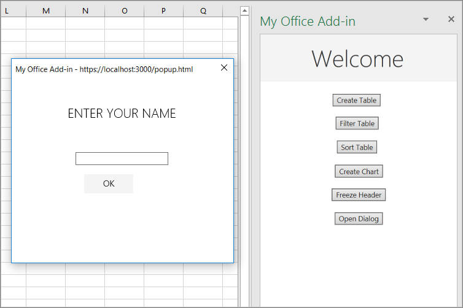

Office Add-in dialogs are *nonmodal*. This means a user can continue to interact with both the document in the host Office application and with the host page in the task pane.

In this exercise, you'll open a dialog in your add-in, pass a message from the dialog process to the task pane process, and close the dialog.

### Create the dialog page

1. In the **./src** folder that's located at the root of the project, create a new folder named **dialogs**.
1. In the **./src/dialogs** folder, create new file named **popup.html**.
1. Add the following markup to **popup.html**. Note:
   - The page has a `<input>` where the user will enter their name and a button that will send the name to the page in the task pane where it will be displayed.
   - The markup loads a script named **popup.js** that you'll create in a later step.
   - It also loads the Office.js library because it will be used in **popup.js**.

    ```html
    <!DOCTYPE html>
    <html>
      <head lang="en">
        <title>Dialog for My Office Add-in</title>
        <meta charset="UTF-8">
        <meta name="viewport" content="width=device-width, initial-scale=1">

        <!-- For more information on Office UI Fabric, visit https://developer.microsoft.com/fabric. -->
        <link rel="stylesheet" href="https://static2.sharepointonline.com/files/fabric/office-ui-fabric-core/9.6.1/css/fabric.min.css"/>

        <script type="text/javascript" src="https://appsforoffice.microsoft.com/lib/1/hosted/office.js"></script>
        <script type="text/javascript" src="popup.js"></script>
      </head>
      <body style="display:flex;flex-direction:column;align-items:center;justify-content:center">
        <p class="ms-font-xl">ENTER YOUR NAME</p>
        <input id="name-box" type="text"/><br/><br/>
        <button id="ok-button" class="ms-Button">OK</button>
      </body>
    </html>
    ```

1. In the **./src/dialogs** folder, create new file named **popup.js**.
1. Add the following code to **popup.js**:

    ```javascript
    (function () {
    "use strict";
      Office.onReady()
        .then(function() {

          // TODO1: Assign handler to the OK button.

        });

      // TODO2: Create the OK button handler
    }());
    ```

    > [!NOTE]
    >
    > - *Every page that calls APIs in the Office.js library must first ensure that the library is fully initialized.* The best way to do that is to call the `Office.onReady()` method. If your add-in has its own initialization tasks, the code should go in a `then()` method that is chained to the call of `Office.onReady()`. The call of `Office.onReady()` must run before any calls to Office.js; so the assignment is in a script file that is loaded by the page, as it is in this case.

1. Replace `TODO1` with the following code. You'll create the `sendStringToParentPage()` function in the next step.

    ```javascript
    document.getElementById("ok-button").onclick = sendStringToParentPage;
    ```

1. Replace `TODO2` with the following code. The `messageParent()` method passes its parameter to the parent page, in this case, the page in the task pane. The parameter can be a boolean or a string, which includes anything that can be serialized as a string, such as XML or JSON.

    ```javascript
    function sendStringToParentPage() {
        var userName = document.getElementById("name-box").value;
        Office.context.ui.messageParent(userName);
    }
    ```

> [!NOTE]
> The **popup.html** file, and the **popup.js** file that it loads, run in an entirely separate Microsoft Edge or Internet Explorer 11 process from the add-in's task pane. If **popup.js** was transpiled into the same **bundle.js** file as the **app.js** file, then the add-in would have to load two copies of the **bundle.js** file, which defeats the purpose of bundling. Therefore, this add-in does not transpile the **popup.js** file at all.

### Update webpack config settings

Open the file **webpack.config.js** in the root directory of the project and complete the following steps.

1. Locate the `entry` object within the `config` object and add a new entry for `popup`.

    ```javascript
    popup: "./src/dialogs/popup.js"
    ```

    After you've done this, the new `entry` object will look like this:

    ```javascript
    entry: {
      polyfill: "@babel/polyfill",
      taskpane: "./src/taskpane/taskpane.js",
      commands: "./src/commands/commands.js",
      popup: "./src/dialogs/popup.js"
    },
    ```

1. Locate the `plugins` array within the `config` object and add the following object to the end of that array.

    ```javascript
    new HtmlWebpackPlugin({
      filename: "popup.html",
      template: "./src/dialogs/popup.html",
      chunks: ["polyfill", "popup"]
    })
    ```

    After you've done this, the new `plugins` array will look like this:

    ```javascript
    plugins: [
      new HtmlWebpackPlugin({
        filename: "taskpane.html",
        template: "./src/taskpane/taskpane.html",
        chunks: ["polyfill", "taskpane"],
      }),
      new CopyWebpackPlugin({
        patterns: [
          {
            from: "assets/*",
            to: "assets/[name][ext][query]",
          },
          {
            from: "manifest*.xml",
            to: "[name]." + buildType + "[ext]",
            transform(content) {
              if (dev) {
                return content;
              } else {
                return content.toString().replace(new RegExp(urlDev, "g"), urlProd);
              }
            },
          },
        ],
      }),
      new HtmlWebpackPlugin({
        filename: "commands.html",
        template: "./src/commands/commands.html",
        chunks: ["polyfill", "commands"],
      }),
      new HtmlWebpackPlugin({
        filename: "popup.html",
        template: "./src/dialogs/popup.html",
        chunks: ["polyfill", "popup"]
      })
    ],
    ```

1. If the local web server is running, stop it by pressing <kbd>CTRL</kbd>+<kbd>C</kbd> in the console window.
1. Run the following command to rebuild the project.

    ```console
    npm run build
    ```

### Open the dialog from the task pane

1. Open the file **./src/taskpane/taskpane.html**.
1. Locate the `<button>` element for the **freeze-header** button, and add the following markup after that line:

    ```html
    <button class="ms-Button" id="open-dialog">Open Dialog</button><br/><br/>
    ```

1. The dialog will prompt the user to enter a name and pass the user's name to the task pane. The task pane will display it in a label. Immediately after the `button` that you just added, add the following markup:

    ```html
    <label id="user-name"></label><br/><br/>
    ```

1. Open the file **./src/taskpane/taskpane.js**.
1. Within the `Office.onReady()` method call, locate the following line:

    ```javascript
    document.getElementById("freeze-header").onclick = freezeHeader;
    ```

    Add the following code immediately after it:

    ```javascript
    document.getElementById("open-dialog").onclick = openDialog;
    ```

1. Add the following declaration to the end of the file. This variable is used to hold an object in the parent page's execution context that acts as an intermediator to the dialog page's execution context.

    ```javascript
    var dialog = null;
    ```

1. Add the following function to the end of the file (after the declaration of `dialog`). The important thing to notice about this code is what **isn't** there: there's no call of `Excel.run()`. This is because the API to open a dialog is shared among all Office hosts, so it's part of the Office JavaScript Common API, not the Excel-specific API.

    ```javascript
    function openDialog() {
      // TODO1: Call the Office Common API that opens a dialog
    }
    ```

1. Replace `TODO1` with the following code:

    ```javascript
    Office.context.ui.displayDialogAsync(
      'https://localhost:3000/popup.html',
      {height: 45, width: 55},

      // TODO2: Add callback parameter.
    );
    ```

    > [!NOTE]
    >
    > - The `displayDialogAsync()` method opens a dialog in the center of the screen.
    > - The first parameter is the URL of the page to open.
    > - The second parameter passes options. `height` and `width` are percentages of the size of the Office application's window.

### Process the message from the dialog and close the dialog

1. Within the `openDialog()` function in the file **./src/taskpane/taskpane.js**, replace `TODO2` with the following code:

    ```javascript
    function (result) {
      dialog = result.value;
      dialog.addEventHandler(Microsoft.Office.WebExtension.EventType.DialogMessageReceived, processMessage);
    }
    ```

    > [!NOTE]
    >
    > - The callback is executed immediately after the dialog successfully opens and before the user has taken any action in the dialog.
    > - The `result.value` is the object that acts as a middleman between the execution contexts of the parent and dialog pages.
    > - The `processMessage()` function will be created in a later step. This handler will process any values that are sent from the dialog page with calls of the `messageParent()` function.

1. Add the following function after the `openDialog()` function.

    ```javascript
    function processMessage(arg) {
      document.getElementById("user-name").innerHTML = arg.message;
      dialog.close();
    }
    ```

1. Verify that you've saved all of the changes you've made to the project.

### Test the add-in

1. If the local web server is already running and your add-in is already loaded in Excel, continue to step 2. Otherwise, start the local web server and sideload your add-in:
    - To test your add-in in Excel, run the following command in the root directory of your project. This starts the local web server (if it's not already running) and opens Excel with your add-in loaded.

        ```console
        npm start
        ```

    - To test your add-in in Excel on the web, run the following command in the root directory of your project. When you run this command, the local web server will start (if it's not already running).

        ```console
        npm run start:web
        ```

        To use your add-in, open a new document in Excel on the web and then sideload your add-in by following the instructions in [Sideload Office Add-ins in Office on the web](/office/dev/add-ins/testing/sideload-office-add-ins-for-testing#sideload-an-office-add-in-in-office-on-the-web).

1. To open the add-in task pane, on the **Home** tab, select **Show Taskpane**.
1. Choose **Open Dialog**.
1. While the dialog is open, drag it and resize it. You can interact with the worksheet and press other buttons on the task pane, but you can't launch a second dialog from the same task pane page.
1. In the dialog, enter a name, and select **OK**. The name appears on the task pane and the dialog closes.
1. Optionally, in the `processMessage` function, add **//** in front of the line `dialog.close();` . Then repeat the steps of this section. The dialog stays open and you can change the name. You can close it manually by pressing the **X** button in the upper right corner.



## Summary

In this exercise, you opened a dialog in your add-in, pass a message from the dialog process to the task pane process, and closed the dialog.
