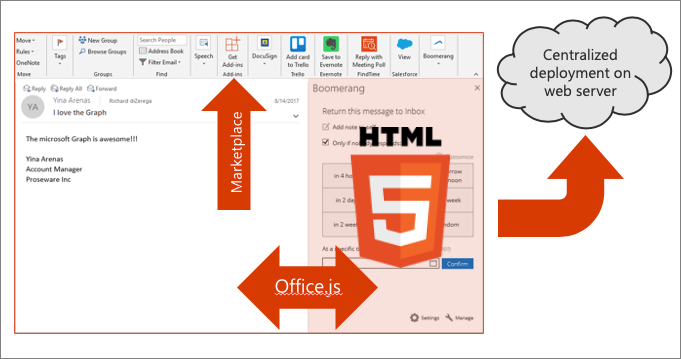
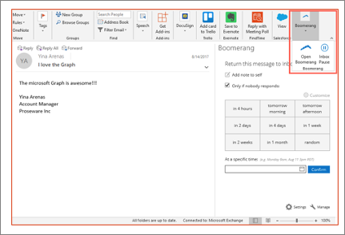
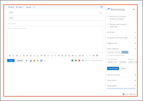
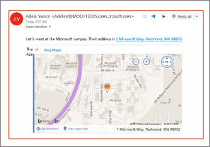
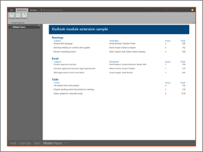

In this unit, you'll learn the basics of an Outlook mail add-in.

## Office developer platform overview

The Microsoft 365 developer platform, which includes Office, offers many canvases for developers to embed customizations and Office Add-ins are one of three canvases: documents, conversations, and pages.

Microsoft Teams makes conversations between users and enables developers to extend the experience using messaging extensions, conversational bots, and other customization options.

Developers customize pages in SharePoint Server and SharePoint online using the SharePoint Framework.

Office clients, such as Word, Excel, PowerPoint, OneNote, and Outlook can also be extended to implement custom task panes, actions, and more customizations using add-ins.

## Historical add-in challenges

Traditional Office Add-ins have been built using old or proprietary development technologies such as VBA, COM, and VSTO.

Once developers got past the development tools and built a great Office Add-in, how are people going to find it? Great Office Add-ins were hard to find as there was no centralized marketplace to find them.

Assuming you can find an add-in, how do you distribute it to the rest of your organization? Traditional Office Add-ins were installed alongside Office and execute with Office, meaning you have to distribute it to each user's computer.

Then you had the issue of upgrading add-ins. What if you needed to roll out an update to fix a bug or add new functionality? These challenges, including handling users on older versions of Office, were all blockers to previous add-in technologies.

A more recent challenge is that most organizations live in a mobile world these days and users want to be productive on the go. Traditional add-ins didn't install on mobile devices nor do they work cross platform or in the web implementations of the Office clients.

## Modern add-ins value proposition

Office Add-ins are built using modern web standards, which mean developers won't use older and proprietary technologies such as VBA or VSTO.

Modern Office Add-ins are just web app applications. Office clients include Office.js, which provides a bridge between the hosting Office application and your custom add-in.

The web applications that implement a modern Office Add-in are hosted by the developer, which results in a greatly simplified deployment, installation, and upgrade experience for end users. There's zero-client footprint on installation. In fact, when the add-in is installed in one Office client, provided the user is signed into their Microsoft 365 account, the add-in will be available in the desktop, mobile, and web Office client applications.

A single XML manifest file is used to define the requirements, limitations, and metadata about the add-in. This manifest file is used by Office to determine integration points such as the type of add-in, buttons to add to the ribbon, the location of the web application, and other metadata including the title and description of the add-in.

Add-ins are also discoverable, can be installed, and upgraded, via the Office marketplace. This makes the distribution process of add-ins much simpler for organizations than the previous add-in models.

## Types of mail add-ins

Let's now look at the various types of mail add-ins developers can create for Outlook.

### Add-in commands and actions

Start specific add-in actions from the ribbon by adding buttons or drop-down menus.

Custom buttons in the Office ribbon, called add-in commands, can launch a task pane add-in with context to the selected message. These task panes can also be pinned to stay open.

Add-in commands can execute a JavaScript function for scenarios where the user doesn't need to make any other selections to start the action.

### Message compose add-ins

Outlook add-ins can be activated in the message compose forms to help author a message, meeting request, or appointment.

### Contextual add-ins

Contextual add-ins are Outlook add-ins that activate based on text in a message or appointment that matches a known type or regular expression. Known types can include meeting time suggestions or physical addresses.

### Module extension add-ins

Module extension add-ins appear in the Outlook navigation bar alongside mail, tasks, and calendars allowing you to embed almost any applications inside Outlook.

### On send add-ins

The *on send* feature for Outlook add-ins provides a way to handle email or block email users from certain actions, and allows an add-in to set certain items on send

## Provisioning add-ins

Microsoft gives developers multiple options for creating Office Add-ins.

The Visual Studio installer includes an optional Office/SharePoint development feature for doing add-in development.

The other option for developers is to use the Office Yeoman Generator, which uses a command-line workflow for provisioning add-in projects using many popular frameworks including TypeScript. The Yeoman Generator can create the complete project or just the manifest file for an existing web project.

Office Add-ins must be hosted using HTTPS, and both these project provisioning methods handle the self-signed certificated needed to do this locally.

## Summary

In this unit, you'll learn the basics of an Outlook mail add-in.
