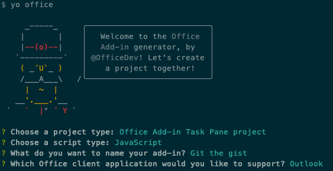
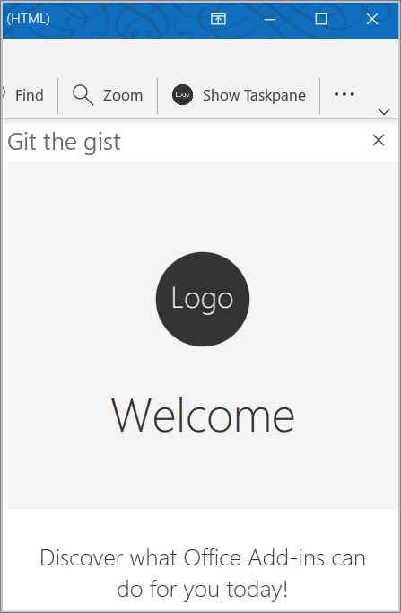

In this exercise, you'll learn how to create your first Outlook add-in project and load it in the Outlook client.

## Prerequisites

Developing Outlook add-ins requires Outlook 2016 or later or Outlook on the web.

You'll use Node.js to create the custom Outlook add-in in this module. The exercises in this module assume you have the following tools installed on your developer workstation.

> [!IMPORTANT]
> In most cases, installing the latest version of the following tools is the best option. The versions listed here were used when this module was published and last tested.

- [Node.js](https://nodejs.org/) (*the latest [LTS](https://nodejs.org/about/releases) version*)
- NPM v6.x or higher (installed with Node.js)
- [Yeoman](https://yeoman.io/) (v3.x or higher) and [Yeoman generator for Office Add-ins](/office/dev/add-ins/develop/yeoman-generator-overview) (v1.8.x or higher). To install these tools globally, run the following command via the command prompt.

  ```console
  npm install -g yo generator-office
  ```

- [Visual Studio Code (VS Code)](https://code.visualstudio.com) or your preferred code editor

You must have the minimum versions of these prerequisites installed on your workstation.

For this exercise, you'll also need a [GitHub](https://www.github.com/) account.

## Setup

The add-in that you'll create in this tutorial will read [gists](https://gist.github.com) from the user's GitHub account and add the selected gist to the body of a message. Complete the following steps to create two new gists that you can use to test the add-in you're going to build.

1. [Sign in to GitHub](https://github.com/login).
1. [Create a new gist](https://gist.github.com).
    - In the **Gist description...** field, enter **Hello World Markdown**.
    - In the **Filename including extension...** field, enter **test.md**.
    - Add the following markdown to the multiline textbox:

        ```markdown
        # Hello World

        This is content converted from Markdown!

        Here's a JSON sample:

          ```json
          {
            "foo": "bar"
          }
          ```
        ```

    - Select the **Create public gist** button.

1. [Create another new gist](https://gist.github.com).
    - In the **Gist description...** field, enter **Hello World Html**.
    - In the **Filename including extension...** field, enter **test.html**.
    - Add the following markdown to the multiline textbox:

        ```HTML
        <html>
          <head>
            <style>
            h1 {
              font-family: Calibri;
            }
            </style>
          </head>
          <body>
            <h1>Hello World!</h1>
            <p>This is a test</p>
          </body>
        </html>
        ```

    - Select the **Create public gist** button.

## Create an Outlook add-in project

1. Run the following command to create an add-in project using the Yeoman generator:

    ```console
    yo office
    ```

    > [!NOTE]
    > When you run the `yo office` command, you may receive prompts about the data collection policies of Yeoman and the Office Add-in CLI tools. Use the information that's provided to respond to the prompts as you see fit.

    When prompted, provide the following information to create your add-in project:
    - **Choose a project type** - `Office Add-in Task Pane project`
    - **Choose a script type** - `JavaScript`
    - **What do you want to name your add-in?** - `Git the gist`
    - **Which Office client application would you like to support?** - `Outlook`

    

    After you complete the wizard, the generator will create the project and install supporting Node components.

    > [!TIP]
    > You can ignore the *next steps* guidance that the Yeoman generator provides after the add-in project's been created. The remainder of this unit includes all the steps you'll need to follow.

1. Navigate to the root directory of the project.

    ```console
    cd "Git the gist"
    ```

1. This add-in will use the following libraries:

    - [Showdown](https://github.com/showdownjs/showdown) library to convert Markdown to HTML
    - [URI.js](https://github.com/medialize/URI.js) library to build relative URLs.
    - [jquery](https://jquery.com/) library to simplify DOM interactions.

     To install these tools for your project, run the following command in the root directory of the project.

    ```console
    npm install showdown urijs jquery --save
    ```

1. Open your project in VS Code or your preferred code editor.

   > [!TIP]
   > On Windows, you can navigate to the root directory of the project via the command line and then enter `code .` to open that folder in VS Code. On Mac, you'll need to [add the code command to the path](https://code.visualstudio.com/docs/setup/mac#_launching-from-the-command-line) before you can use that command to open the project folder in VS Code.

### Update the manifest

The manifest for an add-in influences how it appears in Outlook. It defines the way the add-in appears in the add-in list and the buttons that appear on the ribbon, and it sets the URLs for the HTML and JavaScript files used by the add-in.

#### Specify basic information

Make the following updates in the **manifest.xml** file to specify some basic information about the add-in.

1. Locate the **ProviderName** element and replace the default value with your company name.

    ```xml
    <ProviderName>Contoso</ProviderName>
    ```

1. Locate the **Description** element, replace the default value with a description of the add-in, and save the file.

    ```xml
    <Description DefaultValue="Allows users to access their GitHub gists."/>
    ```

#### Test the generated add-in

Before going any further, let's test the basic add-in that the generator created to confirm that the project is set up correctly.

> [!NOTE]
> Office Add-ins should use HTTPS, not HTTP, even when you are developing. If you are prompted to install a certificate after you run the following command, accept the prompt to install the certificate that the Yeoman generator provides. You may also have to run your command prompt or terminal as an administrator for the changes to be made.

1. Run the following command in the root directory of your project. When you run this command, the local web server starts and your add-in will be sideloaded.

    ```console
    npm start
    ```

1. In Outlook, open an existing message, and select the **Show Taskpane** button.

1. When prompted with the **WebView Stop On Load** dialog box, select **OK**.

   > [!NOTE]
   > If you select **Cancel**, the dialog won't be shown again while this instance of the add-in is running. However, if you restart your add-in, you'll see the dialog again.

If set up correctly, the task pane will open and render the add-in's welcome page.



## Summary

In this exercise, you learned how to create your first Outlook add-in project and load it in the Outlook client.
