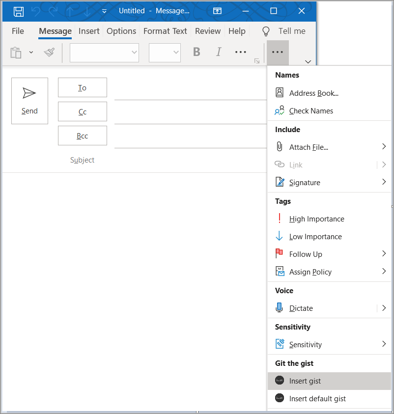
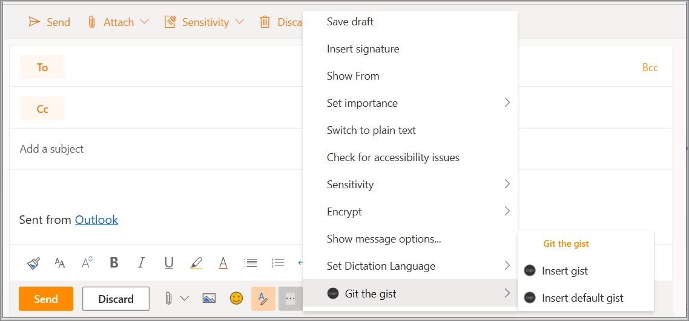
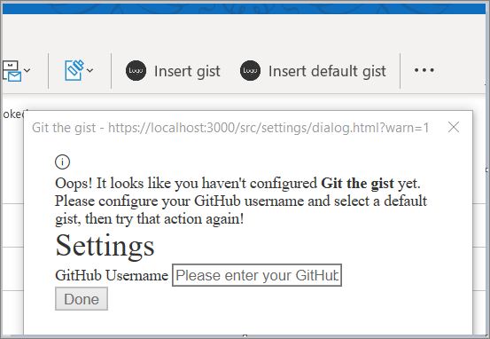

In this exercise, you'll add extra functionality to the add-in you created in a previous exercise. You'll create two new buttons that insert a specific gist or a default gist into a message. You'll also implement a first-run experience, prompting the user for their credentials to authenticate with GitHub to retrieve your gists.

> [!IMPORTANT]
> This exercise assumes you have created the Office Outlook add-in project with the Yeoman generator and tested it works in Outlook in a previous exercise in this module.

## Define buttons

By default, the add-in manifest only defines buttons for the read message window. Let's update the manifest to remove the buttons from the read message window and define two new buttons for the compose message window:

- **Insert gist**: a button that opens a task pane
- **Insert default gist**: a button that invokes a function

### Remove the MessageReadCommandSurface extension point

Open the **manifest.xml** file and locate the `ExtensionPoint` element with type `MessageReadCommandSurface`. Delete this `ExtensionPoint` element (including its closing tag) to remove the buttons from the read message window.

### Add the MessageComposeCommandSurface extension point

Locate the line in the manifest that reads `</DesktopFormFactor>`. Immediately before this line, insert the following XML markup:

```xml
<!-- Message Compose -->
<ExtensionPoint xsi:type="MessageComposeCommandSurface">
  <OfficeTab id="TabDefault">
    <Group id="msgComposeCmdGroup">
      <Label resid="GroupLabel"/>
      <Control xsi:type="Button" id="msgComposeInsertGist">
        <Label resid="TaskpaneButton.Label"/>
        <Supertip>
          <Title resid="TaskpaneButton.Title"/>
          <Description resid="TaskpaneButton.Tooltip"/>
        </Supertip>
        <Icon>
          <bt:Image size="16" resid="Icon.16x16"/>
          <bt:Image size="32" resid="Icon.32x32"/>
          <bt:Image size="80" resid="Icon.80x80"/>
        </Icon>
        <Action xsi:type="ShowTaskpane">
          <SourceLocation resid="Taskpane.Url"/>
        </Action>
      </Control>
      <Control xsi:type="Button" id="msgComposeInsertDefaultGist">
        <Label resid="ActionButton.Label"/>
        <Supertip>
          <Title resid="ActionButton.Title"/>
          <Description resid="ActionButton.Tooltip"/>
        </Supertip>
        <Icon>
          <bt:Image size="16" resid="Icon.16x16"/>
          <bt:Image size="32" resid="Icon.32x32"/>
          <bt:Image size="80" resid="Icon.80x80"/>
        </Icon>
        <Action xsi:type="ExecuteFunction">
          <FunctionName>insertDefaultGist</FunctionName>
        </Action>
      </Control>
    </Group>
  </OfficeTab>
</ExtensionPoint>
```

> [!NOTE]
>
> - The `ExtensionPoint` with `xsi:type="MessageComposeCommandSurface"` indicates that you're defining buttons to add to the compose message window.
> - By using an `OfficeTab` element with `id="TabDefault"`, you're indicating you want to add the buttons to the default tab on the ribbon.
> - The `Group` element defines the grouping for the new buttons, with a label set by the `groupLabel` resource.
> - The first `Control` element contains an `Action` element with `xsi:type="ShowTaskPane"`, so this button opens a task pane.
> - The second `Control` element contains an `Action` element with `xsi:type="ExecuteFunction"`, so this button invokes a JavaScript function contained in the function file.

### Update resources in the manifest

The previous code references labels, tooltips, and URLs that you must define before the manifest is valid. Specify this information in the `Resources` section of the manifest.

1. Locate the `Resources` element in the manifest file and delete the entire element (including its closing tag).
1. In that same location, add the following markup to replace the `Resources` element you removed:

    ```xml
    <Resources>
      <bt:Images>
        <bt:Image id="Icon.16x16" DefaultValue="https://localhost:3000/assets/icon-16.png"/>
        <bt:Image id="Icon.32x32" DefaultValue="https://localhost:3000/assets/icon-32.png"/>
        <bt:Image id="Icon.80x80" DefaultValue="https://localhost:3000/assets/icon-80.png"/>
      </bt:Images>
      <bt:Urls>
        <bt:Url id="Commands.Url" DefaultValue="https://localhost:3000/commands.html"/>
        <bt:Url id="Taskpane.Url" DefaultValue="https://localhost:3000/taskpane.html"/>
      </bt:Urls>
      <bt:ShortStrings>
        <bt:String id="GroupLabel" DefaultValue="Git the gist"/>
        <bt:String id="TaskpaneButton.Label" DefaultValue="Insert gist"/>
        <bt:String id="TaskpaneButton.Title" DefaultValue="Insert gist"/>
        <bt:String id="ActionButton.Label" DefaultValue="Insert default gist"/>
        <bt:String id="ActionButton.Title" DefaultValue="Insert default gist"/>
      </bt:ShortStrings>
      <bt:LongStrings>
        <bt:String id="TaskpaneButton.Tooltip" DefaultValue="Displays a list of your gists and allows you to insert their contents into the current message."/>
        <bt:String id="ActionButton.Tooltip" DefaultValue="Inserts the content of the gist you mark as default into the current message."/>
      </bt:LongStrings>
    </Resources>
    ```

1. Save your changes to the manifest.

### Reinstall the add-in

Since you previously installed the add-in from a file, you must reinstall it in order for the manifest changes to take effect.

1. Follow the instructions in [Sideload Outlook add-ins for testing](/office/dev/add-ins/outlook/sideload-outlook-add-ins-for-testing) to locate the **Custom add-ins** section at the bottom of the **My add-ins** dialog box.
1. Select the **...** button next to the **Git the gist** entry and then choose **Remove**.
1. Close the **My add-ins** window.
1. The custom button should disappear from the ribbon momentarily.
1. Follow the instructions in [Sideload Outlook add-ins for testing](/office/dev/add-ins/outlook/sideload-outlook-add-ins-for-testing) to reinstall the add-in using the updated **manifest.xml** file.

After you've reinstalled the add-in, you can verify that it installed successfully by checking for the commands **Insert gist** and **Insert default gist** in a compose message window. Nothing will happen if you select either of these items, because you haven't yet finished building this add-in.

- If you're running this add-in in Outlook 2016 or later on Windows, you should see two new buttons in the ribbon of the compose message window: **Insert gist** and **Insert default gist**.

    

- If you're running this add-in in Outlook on the web, you should see a new button at the bottom of the compose message window. Select that button to see the options **Insert gist** and **Insert default gist**.

    

## Implement a first-run experience

This add-in needs to read gists from the user's GitHub account and identify which one the user has chosen as the default gist. To achieve these goals, the add-in must prompt the user to provide their GitHub username and choose a default gist from their collection of existing gists. Complete the steps in this section to implement a first-run experience that will display a dialog to collect this information from the user.

### Collect data from the user

Let's start by creating the UI for the dialog itself. Within the **./src** folder, create a new subfolder named **settings**. In the **./src/settings** folder, create a file named **dialog.html**, and add the following markup to define a basic form with a text input for a GitHub username and an empty list for gists that will be populated via JavaScript.

```html
<!DOCTYPE html>
<html>

<head>
  <meta charset="UTF-8" />
  <meta http-equiv="X-UA-Compatible" content="IE=Edge" />
  <title>Settings</title>

  <!-- Office JavaScript API -->
  <script type="text/javascript" src="https://appsforoffice.microsoft.com/lib/1.1/hosted/office.js"></script>

  <!-- For more information on Office UI Fabric, visit https://developer.microsoft.com/fabric. -->
  <link rel="stylesheet" href="https://static2.sharepointonline.com/files/fabric/office-ui-fabric-core/9.6.1/css/fabric.min.css"/>

  <!-- Template styles -->
  <link href="dialog.css" rel="stylesheet" type="text/css" />
</head>

<body class="ms-font-l">
  <main>
    <section class="ms-font-m ms-fontColor-neutralPrimary">
      <div class="not-configured-warning ms-MessageBar ms-MessageBar--warning">
        <div class="ms-MessageBar-content">
          <div class="ms-MessageBar-icon">
            <i class="ms-Icon ms-Icon--Info"></i>
          </div>
          <div class="ms-MessageBar-text">
            Oops! It looks like you haven't configured <strong>Git the gist</strong> yet.
            <br/>
            Please configure your GitHub username and select a default gist, then try that action again!
          </div>
        </div>
      </div>
      <div class="ms-font-xxl">Settings</div>
      <div class="ms-Grid">
        <div class="ms-Grid-row">
          <div class="ms-TextField">
            <label class="ms-Label">GitHub Username</label>
            <input class="ms-TextField-field" id="github-user" type="text" value="" placeholder="Please enter your GitHub username">
          </div>
        </div>
        <div class="error-display ms-Grid-row">
          <div class="ms-font-l ms-fontWeight-semibold">An error occurred:</div>
          <pre><code id="error-text"></code></pre>
        </div>
        <div class="gist-list-container ms-Grid-row">
          <div class="list-title ms-font-xl ms-fontWeight-regular">Choose Default Gist</div>
          <form>
            <div id="gist-list">
            </div>
          </form>
        </div>
      </div>
      <div class="ms-Dialog-actions">
        <div class="ms-Dialog-actionsRight">
          <button class="ms-Dialog-action ms-Button ms-Button--primary" id="settings-done" disabled>
            <span class="ms-Button-label">Done</span>
          </button>
        </div>
      </div>
    </section>
  </main>
  <script type="text/javascript" src="../../node_modules/core-js/client/core.js"></script>
  <script type="text/javascript" src="../../node_modules/jquery/dist/jquery.js"></script>
  <script type="text/javascript" src="../helpers/gist-api.js"></script>
  <script type="text/javascript" src="dialog.js"></script>
</body>

</html>
```

Next, create a file in the **./src/settings** folder named **dialog.css**, and add the following code to specify the styles that are used by **dialog.html**.

```CSS
section {
  margin: 10px 20px;
}

.not-configured-warning {
  display: none;
}

.error-display {
  display: none;
}

.gist-list-container {
  margin: 10px -8px;
  display: none;
}

.list-title {
  border-bottom: 1px solid #a6a6a6;
  padding-bottom: 5px;
}

ul {
  margin-top: 10px;
}

.ms-ListItem-secondaryText,
.ms-ListItem-tertiaryText {
  padding-left: 15px;
}
```

Now that you've defined the dialog UI, you can write the code that makes it actually do something. Create a file in the **./src/settings** folder named **dialog.js** and add the following code. This code uses jQuery to register events and uses the `messageParent` function to send the user's choices back to the caller.

```javascript
(function(){
  'use strict';

  // The Office initialize function must be run each time a new page is loaded.
  Office.initialize = function(reason){
    jQuery(document).ready(function(){
      if (window.location.search) {
        // Check if warning should be displayed.
        var warn = getParameterByName('warn');
        if (warn) {
          $('.not-configured-warning').show();
        } else {
          // See if the config values were passed.
          // If so, pre-populate the values.
          var user = getParameterByName('gitHubUserName');
          var gistId = getParameterByName('defaultGistId');

          $('#github-user').val(user);
          loadGists(user, function(success){
            if (success) {
              $('.ms-ListItem').removeClass('is-selected');
              $('input').filter(function() {
                return this.value === gistId;
              }).addClass('is-selected').attr('checked', 'checked');
              $('#settings-done').removeAttr('disabled');
            }
          });
        }
      }

      // When the GitHub username changes,
      // try to load gists.
      $('#github-user').on('change', function(){
        $('#gist-list').empty();
        var ghUser = $('#github-user').val();
        if (ghUser.length > 0) {
          loadGists(ghUser);
        }
      });

      // When the Done button is selected, send the
      // values back to the caller as a serialized
      // object.
      $('#settings-done').on('click', function() {
        var settings = {};

        settings.gitHubUserName = $('#github-user').val();

        var selectedGist = $('.ms-ListItem.is-selected');
        if (selectedGist) {
          settings.defaultGistId = selectedGist.val();

          sendMessage(JSON.stringify(settings));
        }
      });
    });
  };

  // Load gists for the user using the GitHub API
  // and build the list.
  function loadGists(user, callback) {
    getUserGists(user, function(gists, error){
      if (error) {
        $('.gist-list-container').hide();
        $('#error-text').text(JSON.stringify(error, null, 2));
        $('.error-display').show();
        if (callback) callback(false);
      } else {
        $('.error-display').hide();
        buildGistList($('#gist-list'), gists, onGistSelected);
        $('.gist-list-container').show();
        if (callback) callback(true);
      }
    });
  }

  function onGistSelected() {
    $('.ms-ListItem').removeClass('is-selected').removeAttr('checked');
    $(this).children('.ms-ListItem').addClass('is-selected').attr('checked', 'checked');
    $('.not-configured-warning').hide();
    $('#settings-done').removeAttr('disabled');
  }

  function sendMessage(message) {
    Office.context.ui.messageParent(message);
  }

  function getParameterByName(name, url) {
    if (!url) {
      url = window.location.href;
    }
    name = name.replace(/[\[\]]/g, "\\$&");
    var regex = new RegExp("[?&]" + name + "(=([^&#]*)|&|#|$)"),
      results = regex.exec(url);
    if (!results) return null;
    if (!results[2]) return '';
    return decodeURIComponent(results[2].replace(/\+/g, " "));
  }
})();
```

#### Update webpack config settings

Finally, open the file **webpack.config.js** file in the root directory of the project and complete the following steps.

1. Locate the `entry` object within the `config` object and add a new entry for `dialog`:

    ```javascript
    dialog: "./src/settings/dialog.js"
    ```

    After you've done this, the new `entry` object will look like this:

    ```javascript
    entry: {
      polyfill: "@babel/polyfill",
      taskpane: "./src/taskpane/taskpane.js",
      commands: "./src/commands/commands.js",
      dialog: "./src/settings/dialog.js"
    },
    ```

1. Locate the `plugins` array within the `config` object and add these two new objects to the end of that array.

    ```javascript
    new HtmlWebpackPlugin({
      filename: "dialog.html",
      template: "./src/settings/dialog.html",
      chunks: ["polyfill", "dialog"]
    }),
    new CopyWebpackPlugin({
      patterns: [{
        to: "dialog.css",
        from: "./src/settings/dialog.css"
      }]
    })
    ```

    After you've done this, the new `plugins` array will look like this:

    ```javascript
    plugins: [
      new HtmlWebpackPlugin({
        filename: "taskpane.html",
        template: "./src/taskpane/taskpane.html",
        chunks: ["polyfill", "taskpane"],
      }),
      new CopyWebpackPlugin({
        patterns: [
          {
            from: "assets/*",
            to: "assets/[name][ext][query]",
          },
          {
            from: "manifest*.xml",
            to: "[name]." + buildType + "[ext]",
            transform(content) {
              if (dev) {
                return content;
              } else {
                return content.toString().replace(new RegExp(urlDev, "g"), urlProd);
              }
            },
          },
        ],
      }),
      new HtmlWebpackPlugin({
        filename: "commands.html",
        template: "./src/commands/commands.html",
        chunks: ["polyfill", "commands"],
      }),
      new HtmlWebpackPlugin({
        filename: "dialog.html",
        template: "./src/settings/dialog.html",
        chunks: ["polyfill", "dialog"]
      }),
      new CopyWebpackPlugin({
        patterns: [{
          to: "dialog.css",
          from: "./src/settings/dialog.css"
        }]
      })
    ],
    ```

1. If the web server is running, close the node command window.
1. To rebuild the project, run the following command.

    ```console
    npm run build
    ```

1. To start the web server, run the following command:

    ```console
    npm run dev-server
    ```

### Fetch data from GitHub

The **dialog.js** file you created specifies that the add-in should load gists when the `change` event fires for the GitHub username field. To retrieve the user's gists from GitHub, you'll use the [GitHub Gists API](https://developer.github.com/v3/gists/).

Within the **./src** folder, create a new subfolder named **helpers**. In the **./src/helpers** folder, create a file named **gist-api.js**, and add the following code to retrieve the user's gists from GitHub and build the list of gists.

```javascript
function getUserGists(user, callback) {
  var requestUrl = 'https://api.github.com/users/' + user + '/gists';

  $.ajax({
    url: requestUrl,
    dataType: 'json'
  }).done(function(gists){
    callback(gists);
  }).fail(function(error){
    callback(null, error);
  });
}

function buildGistList(parent, gists, clickFunc) {
  gists.forEach(function(gist) {

    var listItem = $('<div/>')
      .appendTo(parent);

    var radioItem = $('<input>')
      .addClass('ms-ListItem')
      .addClass('is-selectable')
      .attr('type', 'radio')
      .attr('name', 'gists')
      .attr('tabindex', 0)
      .val(gist.id)
      .appendTo(listItem);

    var desc = $('<span/>')
      .addClass('ms-ListItem-primaryText')
      .text(gist.description)
      .appendTo(listItem);

    var desc = $('<span/>')
      .addClass('ms-ListItem-secondaryText')
      .text(' - ' + buildFileList(gist.files))
      .appendTo(listItem);

    var updated = new Date(gist.updated_at);

    var desc = $('<span/>')
      .addClass('ms-ListItem-tertiaryText')
      .text(' - Last updated ' + updated.toLocaleString())
      .appendTo(listItem);

    listItem.on('click', clickFunc);
  });
}

function buildFileList(files) {

  var fileList = '';

  for (var file in files) {
    if (files.hasOwnProperty(file)) {
      if (fileList.length > 0) {
        fileList = fileList + ', ';
      }

      fileList = fileList + files[file].filename + ' (' + files[file].language + ')';
    }
  }

  return fileList;
}
```

> [!NOTE]
> You may have noticed that there's no button to invoke the settings dialog. Instead, the add-in will check whether it has been configured when the user selects either the **Insert default gist** button or the **Insert gist** button. If the add-in has not yet been configured, the settings dialog will prompt the user to configure before proceeding.

## Implement a UI-less button

This add-in's **Insert default gist** button is a UI-less button that will invoke a JavaScript function, rather than open a task pane like many add-in buttons do. When the user selects the **Insert default gist** button, the corresponding JavaScript function will check whether the add-in has been configured.

- If the add-in has already been configured, the function will load the content of the gist that the user has selected as the default and insert it into the body of the message.
- If the add-in hasn't yet been configured, then the settings dialog will prompt the user to provide the required information.

### Update the function file (HTML)

A function that's invoked by a UI-less button must be defined in the file that's specified by the `FunctionFile` element in the manifest for the corresponding form factor. This add-in's manifest specifies `https://localhost:3000/commands.html` as the function file.

Open the file **./src/commands/commands.html** and replace the entire contents with the following markup.

```html
<!DOCTYPE html>
<html>

<head>
  <meta charset="UTF-8" />
  <meta http-equiv="X-UA-Compatible" content="IE=Edge" />

  <!-- Office JavaScript API -->
  <script type="text/javascript" src="https://appsforoffice.microsoft.com/lib/1.1/hosted/office.js"></script>

  <script type="text/javascript" src="../node_modules/jquery/dist/jquery.js"></script>
  <script type="text/javascript" src="../node_modules/showdown/dist/showdown.min.js"></script>
  <script type="text/javascript" src="../node_modules/urijs/src/URI.min.js"></script>
  <script type="text/javascript" src="../src/helpers/addin-config.js"></script>
  <script type="text/javascript" src="../src/helpers/gist-api.js"></script>
</head>

<body>
  <!-- NOTE: The body is empty by design. Since functions in commands.js are invoked using a button, there is no UI to render. -->
</body>

</html>
```

### Update the function file

Open the file **./src/commands/commands.js** and replace the entire contents with the following code. If the `insertDefaultGist()` function determines the add-in hasn't yet been configured, it adds the `?warn=1` parameter to the dialog URL. Doing so makes the settings dialog render the message bar that's defined in **./settings/dialog.html**, to tell the user why they're seeing the dialog.

```javascript
var config;
var btnEvent;

// The initialize function must be run each time a new page is loaded.
Office.initialize = function (reason) {
};

// Add any ui-less function here.
function showError(error) {
  Office.context.mailbox.item.notificationMessages.replaceAsync('github-error', {
    type: 'errorMessage',
    message: error
  }, function(result){
  });
}

var settingsDialog;

function insertDefaultGist(event) {

  config = getConfig();

  // Check if the add-in has been configured.
  if (config && config.defaultGistId) {
    // Get the default gist content and insert.
    try {
      getGist(config.defaultGistId, function(gist, error) {
        if (gist) {
          buildBodyContent(gist, function (content, error) {
            if (content) {
              Office.context.mailbox.item.body.setSelectedDataAsync(content,
                {coercionType: Office.CoercionType.Html}, function(result) {
                  event.completed();
              });
            } else {
              showError(error);
              event.completed();
            }
          });
        } else {
          showError(error);
          event.completed();
        }
      });
    } catch (err) {
      showError(err);
      event.completed();
    }

  } else {
    // Save the event object so we can finish up later.
    btnEvent = event;
    // Not configured yet, display settings dialog with
    // warn=1 to display warning.
    var url = new URI('../src/settings/dialog.html?warn=1').absoluteTo(window.location).toString();
    var dialogOptions = { width: 20, height: 40, displayInIframe: true };

    Office.context.ui.displayDialogAsync(url, dialogOptions, function(result) {
      settingsDialog = result.value;
      settingsDialog.addEventHandler(Microsoft.Office.WebExtension.EventType.DialogMessageReceived, receiveMessage);
      settingsDialog.addEventHandler(Microsoft.Office.WebExtension.EventType.DialogEventReceived, dialogClosed);
    });
  }
}

function receiveMessage(message) {
  config = JSON.parse(message.message);
  setConfig(config, function(result) {
    settingsDialog.close();
    settingsDialog = null;
    btnEvent.completed();
    btnEvent = null;
  });
}

function dialogClosed(message) {
  settingsDialog = null;
  btnEvent.completed();
  btnEvent = null;
}

function getGlobal() {
  return (typeof self !== "undefined") ? self :
    (typeof window !== "undefined") ? window :
    (typeof global !== "undefined") ? global :
    undefined;
}

var g = getGlobal();

// The add-in command functions need to be available in global scope.
g.insertDefaultGist = insertDefaultGist;
```

### Create a file to manage configuration settings

The HTML function file references a file named **addin-config.js**, which doesn't yet exist. Create a file named **addin-config.js** in the **./src/helpers** folder and add the following code. This code uses the [RoamingSettings object](/javascript/api/outlook/office.RoamingSettings) to get and set configuration values.

```javascript
function getConfig() {
  var config = {};

  config.gitHubUserName = Office.context.roamingSettings.get('gitHubUserName');
  config.defaultGistId = Office.context.roamingSettings.get('defaultGistId');

  return config;
}

function setConfig(config, callback) {
  Office.context.roamingSettings.set('gitHubUserName', config.gitHubUserName);
  Office.context.roamingSettings.set('defaultGistId', config.defaultGistId);

  Office.context.roamingSettings.saveAsync(callback);
}
```

### Create new functions to process gists

Open **./src/helpers/gist-api.js** and add the following functions:

```javascript
function getGist(gistId, callback) {
  var requestUrl = 'https://api.github.com/gists/' + gistId;

  $.ajax({
    url: requestUrl,
    dataType: 'json'
  }).done(function(gist){
    callback(gist);
  }).fail(function(error){
    callback(null, error);
  });
}

function buildBodyContent(gist, callback) {
  // Find the first non-truncated file in the gist
  // and use it.
  for (var filename in gist.files) {
    if (gist.files.hasOwnProperty(filename)) {
      var file = gist.files[filename];
      if (!file.truncated) {
        // We have a winner.
        switch (file.language) {
          case 'HTML':
            // Insert as-is.
            callback(file.content);
            break;
          case 'Markdown':
            // Convert Markdown to HTML.
            var converter = new showdown.Converter();
            var html = converter.makeHtml(file.content);
            callback(html);
            break;
          default:
            // Insert contents as a <code> block.
            var codeBlock = '<pre><code>';
            codeBlock = codeBlock + file.content;
            codeBlock = codeBlock + '</code></pre>';
            callback(codeBlock);
        }
        return;
      }
    }
  }
  callback(null, 'No suitable file found in the gist');
}
```

> [!NOTE]
>
> - If the gist contains HTML, the add-in inserts the HTML as-is into the body of the message.
> - If the gist contains Markdown, the add-in uses the [Showdown](https://github.com/showdownjs/showdown) library to convert the Markdown to HTML, and inserts the resulting HTML into the body of the message.
> - If the gist contains anything other than HTML or Markdown, the add-in inserts it into the body of the message as a code snippet.

### Test the button

If the server isn't already running, save all of your changes and run **npm run dev-server** from the command prompt. Then, to test the **Insert default gist** button, complete the following steps:

1. Open Outlook and compose a new message.
1. In the compose message window, select the **Insert default gist** button. You should be prompted to configure the add-in.

    

1. In the settings dialog, enter your GitHub username and then either **Tab** or select elsewhere in the dialog to invoke the `change` event, which should load your list of gists. Select a gist to be the default, and select **Done**.

    

1. Select the **Insert default gist** button again. This time, you should see the contents of the gist inserted into the body of the email.

   > [!NOTE]
   > Outlook on Windows: To pick up the latest settings, you may need to close and reopen the compose message window.

## Summary

In this exercise, you added extra functionality to the add-in you created in a previous exercise. You created two new buttons that inserted a specific gist or a default gist into a message. You also implemented a first-run experience, prompting the user for their credentials to authenticate with GitHub to retrieve your gists.
