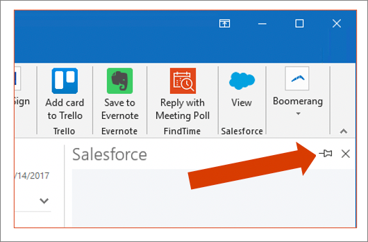

In this unit, you'll learn how you can use task panes in Outlook add-ins and how to store user settings for use across devices.

## Pinnable task panes

By default, if a user has an add-in task pane open for a message in the Reading Pane, and then selects a new message, the task pane is automatically closed. Pinning allows the task pane to stay activated.



Pinnable task panes ideal for heavily used add-ins. In these cases, the user may prefer to keep that pane open, eliminating the need to reactivate the add-in on each message

At the current time only available in Outlook 2016 for Windows and Outlook Online (or later).

Developers must specify in the manifest that the task pane supports pinning and "listen" for new item selections to update UI of task pane.

## Implement a pinnable task pane

To implement a pinnable task pane, add the `SupportsPinning` element to your add-in manifest:

```javascript
<Action xsi:type="ShowTaskpane">
  <SourceLocation resid="readTaskPaneUrl" />
  <SupportsPinning>true</SupportsPinning>
</Action>

// Set up ItemChanged event to listen for new item selections in Outlook
Office.context.mailbox.addHandlerAsync(Office.EventType.ItemChanged, function(eventArgs) {
  // Update UI based on the new current item...this should check for null item
});
```

You'll also need to implement a handler for the `ItemChanged` event so your add-in can update the UI when a new item is selected.

The `ItemChanged` handler should account for `null` because the user could have no selection, which would return a `null` item.

## Office.js for mail add-ins

Let's look at some common tasks developers face when creating add-ins for Outlook using Office.js.

### Write to the message body

The following example shows some basic BODY operations. The `body.getAsync()` method is used to read the body of a message. Notice the coercion type that's specified. In this sample, we're asking for the content to be returned as HTML.

Before inserting data into the message body, you should check the format of the message using the `body.getTypeAsync()` method.

The sample shows inserting data into two different places in the message:

- the position of the current cursor
- the beginning of the body

```javascript
// Get item body
item.body.getAsync(coercionType: Office.CoercionType.Html, function (asyncResult) {
  // asyncResult.value;
}
// Insert data in item body
item.body.getTypeAsync(function (r) { // check the format of the message body
  if (r.status != Office.AsyncResultStatus.Failed && r.value == Office.MailboxEnums.BodyType.Html) {
    // Insert data at the current cursor position
    item.body.setSelectedDataAsync("<b>Hello!</b>", { coercionType: Office.CoercionType.Html,
      asyncContext: { var3: 1, var4: 2 } }, function (asyncResult) {
    });
    // Insert data at the beginning of the item body
    item.body.prependAsync("<b>Hello!</b>", { coercionType: Office.CoercionType.Html,
      asyncContext: { var3: 1, var4: 2 } }, function (asyncResult) {
    });
...
```

### Get/set message and appointment recipients

The following sample demonstrates how to get and set the recipients for both messages and appointments.

The use `getAsync()` method is primarily for compose add-ins. Read add-ins have direct access to recipients using the properties `item.to`, `item.cc`, and `item.bcc`.

Each recipient is set using an array of objects, where each object has a `displayName` and `emailAddress` property.

```javascript
// Get recipients
var item = Office.context.mailbox.item;
var toRecipients;
if (item.itemType == Office.MailboxEnums.ItemType.Appointment) // Handle appointment vs message
  toRecipients = item.requiredAttendees;
else
  toRecipients = item.to;

// Perform the async get (compose add-in…read add-in can simply call item.to)
toRecipients.getAsync(function (asyncResult) { };

// Perform the async set
toRecipients.setAsync(
  [
    {
      "displayName":"Graham Durkin",
      "emailAddress":"graham@contoso.com"
    },{
      "displayName" : "Donnie Weinberg",
      "emailAddress" : "donnie@contoso.com"
    }
  ], function (r) {
        // check status.
});
```

> [!NOTE]
> The sample looks at to/required recipients, it also works for optional attendees, cc and bcc recipients.

### Get/set appointment recurrence

This sample demonstrates how to set an appointment recurrence setting, which is a more complex object using the `SeriesTime` object.

```javascript
// Get and set recurrence
var seriesTimeObject = new Office.SeriesTime();
seriesTimeObject.setStartDate(2019,10,2);
seriesTimeObject.setEndDate(2019,11,2);
seriesTimeObject.setStartTime(10,30);
seriesTimeObject.setDuration(30);

var pattern = {
  "seriesTime": seriesTimeObject,
  "recurrenceType": "weekly",
  "recurrenceProperties": {"interval": 1, "days": ["tue", "thu"]},
  "recurrenceTimeZone": {"name": "Pacific Standard Time"}};

// Set recurrence
Office.context.mailbox.item.recurrence.setAsync(pattern, function(asyncResult) { .. });
// Get recurrence
Office.context.mailbox.item.recurrence.getAsync(function(asyncResult) { .. });
```

### Roaming settings

Roaming settings are a valuable tool for an add-in to save configurable information that is stored on the mail server and available on any device

The following sample demonstrates how to get, set, and remove a user's roaming setting.

```javascript
// Roaming Settings
Office.initialize = function () {
  var settings = Office.context.roamingSettings;

  // Save roaming settings for the mailbox to the server so always available
  settings.set("cookie", Date());
  settings.saveAsync(function(asyncResult) {});

  // Remove a roaming setting
  settings.remove("cookie");
  settings.saveAsync(function(asyncResult) {});

  // Get roaming setting
  var val = settings.get("cookie");
}
```

### Tokens and APIs (REST)

This following sample demonstrates how to get an OAuth 2.0 access token from Outlook for use in calling the Outlook REST API.

Use the `getCallbackTokenAsync()` method to get the token and then submit a typical REST request can be done with the access token passed as a bearer token in the `authorization` header.

```javascript
// Call Outlook REST API
Office.context.mailbox.getCallbackTokenAsync({isRest: true}, function(result){
  if (result.status === "succeeded") {
    // this is the access token for calling Outlook APIs
    var token = result.value;
    var itemId = Office.context.mailbox.item.itemId;

    var url = Office.context.mailbox.restUrl + '/v2.0/me/messages/' + itemId;

    $.ajax({ url: url, dataType: 'json',
      headers: { 'Authorization': 'Bearer ' + token } }).done(function(item){
      // Message is passed in item
    }).fail(function(error){
      // Handle error
    });
  }
});
```

### Tokens and APIs (Exchange Web Services)

This sample demonstrates how to call the Exchange Web Services (EWS) from an add-in using Office.js.

```javascript
// Call Exchange Web Services (EWS)
var mailbox = Office.context.mailbox;
mailbox.makeEwsRequestAsync(mailbox.item.itemId, function(result) {
  // result.value contains the EWS getItem information in XML format
  var response = $.parseXML(result.value);
  var extendedProps = response.getElementsByTagName("ExtendedProperty")
});

// Note add-ins calling EWS must be installed by an Exchange admin
```

> [!NOTE]
> In order to call the EWS from an add-in, an Exchange admin must install the add-in and you must parse all the XML submitted to and received from the EWS in your add-in.

### Get attachments

The following sample demonstrates how to get attachments using the Office.js.

Outlook add-ins can't pass the attachments of a selected item directly from the client.

Instead, Outlook can return an OAuth 2.0 access token the add-in can use to call the Outlook REST APIs.

```javascript
// Get attachments
var svcRequest = { attachmentToken: '', ewsUrl: Office.context.mailbox.ewsUrl, attachments: [] };
Office.context.mailbox.getCallbackTokenAsync(function(asyncResult, userContext) {
  // get access token returned from getCallbackTokenAsync and capture attachment metadata
  svcRequest.attachmentToken = asyncResult.value;
  for (var i = 0; i < mailbox.item.attachments.length; i++) {
    svcRequest.attachments[i] = JSON.parse(JSON.stringify(mailbox.item.attachments[i].$0_0));
  }
  $.ajax({
    url: './api/YourApiFprProcessingAttachments',
    type: 'POST',
    data: JSON.stringify(svcRequest), // contains metadata on all attachments and access token
    contentType: 'application/json;charset=utf-8'
  })
});
```

### Add/remove attachments

The following sample demonstrates how to add and remove an attachment from an Outlook item.

```javascript
// Attach a file
Office.context.mailbox.item.addFileAttachmentAsync(
  'https://webserver/picture.png',
  'picture.png', { asyncContext: null }, function (asyncResult) {
    // Validate status asyncResult.status
  }
);

// Attach an Outlook item
Office.context.mailbox.item.addItemAttachmentAsync(
  itemId,
  'Welcome message', { asyncContext: null }, function (asyncResult) {
    // Validate status asyncResult.status
  }
);

// Remote an attachment
Office.context.mailbox.item.removeAttachmentAsync(
  attachmentId,
  { asyncContext: null }, function (asyncResult) {
    // Validate status asyncResult.status
  }
);
```

## Summary

In this unit, you'll learn how you can use task panes in Outlook add-ins and how to store user settings for use across devices.
