In this exercise, you'll build an Outlook add-in that adds a list of upcoming calendar events to the body of an email by the currently logged in user with Microsoft Graph. This process uses the single sign-on (SSO) authentication scheme.

## Prerequisites

Developing Office Add-ins for Microsoft Outlook requires the web client or the following desktop clients:

- Windows v16.0.12215.20006 (*or higher*)
- macOS v16.32.19102902 (*or higher*)

You'll use Node.js to create the custom Outlook add-in in this module. The exercises in this module assume you have the following tools installed on your developer workstation:

> [!IMPORTANT]
> In most cases, installing the latest version of the following tools is the best option. The versions listed here were used when this module was published and last tested.

- [Node.js](https://nodejs.org/) - (*the latest [LTS](https://nodejs.org/about/releases) version*)
- NPM (installed with Node.js) - v6.x (or higher)
- [Yeoman](https://yeoman.io/) - v3.x (or higher)
- [Yeoman Generator for Microsoft Office](https://github.com/OfficeDev/generator-office) - v1.8.x (or higher)
- [Visual Studio Code](https://code.visualstudio.com)

You must have the minimum versions of these prerequisites installed on your workstation.

## Create your add-in project

Run the following command to create an add-in project using the Yeoman generator:

```console
yo office
```

> [!NOTE]
> When you run the `yo office` command, you may receive prompts about the data collection policies of Yeoman and the Office Add-in CLI tools. Use the information that's provided to respond to the prompts as you see fit.

When prompted, provide the following information to create your add-in project:

- **Select a project type:** Office Add-in Task Pane project supporting single sign-on
- **Select a script type:** JavaScript
- **What do you want to name your add-in?** MyOutlookSsoAddin
- **Which Office client application would you like to support?** Outlook

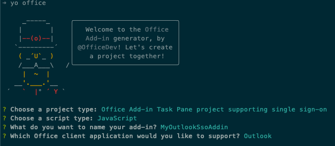

After you complete prompts, the generator creates the project and installs supporting Node components.

## Register the Azure Active Directory (Azure AD) app

Next, register the Azure AD application and update the project to use the Azure AD application.

> [!TIP]
> For details on registering the Azure AD application manually, see: **[Create a Node.js Office Add-in that uses single sign-on: Register the add-in with Azure AD v2.0 endpoint](/office/dev/add-ins/develop/create-sso-office-add-ins-nodejs#register-the-add-in-with-azure-ad-v20-endpoint)**.

From the command prompt, ensure you're currently in the root folder of the project. Then execute the following command:

```console
npm run configure-sso
```

The command will launch a browser and prompt you to sign in to Azure AD. Ensure you sign in as a user that has permissions to register an Azure AD application, such as a user assigned to the **Global Administrator** role.

After authenticating, the script will do the following tasks:

1. Register the Azure AD application
1. Configure the application's audience and permissions settings
1. Create a new client secret and save it to your developer workstations secret store
1. Update the project with the Azure AD application's client ID


> [!WARNING]
> The **configure-sso** command will fail if your Azure AD tenant is configured for multi-factor authentication (MFA)/two-factor authentication. In this case, you'll need manually create the Azure AD app registration as outlined in the **[Create a Node.js Office Add-in that uses single sign-on: Register the add-in with Azure AD v2.0 endpoint](/office/dev/add-ins/develop/create-sso-office-add-ins-nodejs#register-the-add-in-with-azure-ad-v20-endpoint)** article.

## Build and test the application

Run the following command in a command prompt to transpile and start the debugging process:

```console
npm start
```

### Test the add-in in the Outlook web client

Open a browser and navigate to the [Outlook (https://outlook.office.com)](https://outlook.office.com). Sign in using a **Work or School Account**.

Create a new message by selecting the **New message** button.

In the new message section, locate the **...** button in the bottom of the new message on the same footer with the **Send** and **Discard** buttons.

Select the **Get Add-ins** menu item.

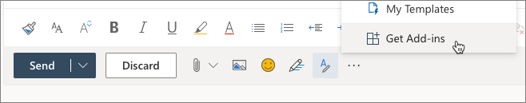

On the **Add-Ins for Outlook** dialog, select **My add-ins** from the left menu.

On the **My add-ins** screen, select the **Add a custom add-in > Add from file...** button.

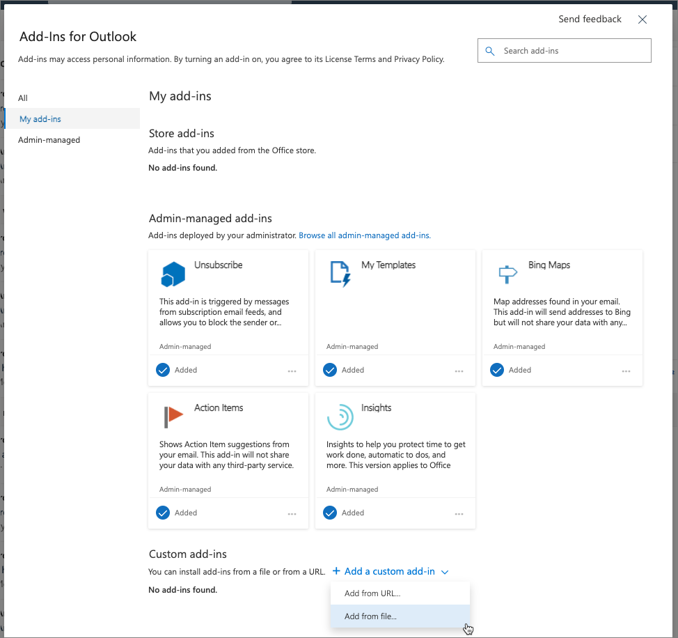

Select the **manifest.xml** file in the root of your project folder and select **Upload**.

When prompted, select the **Install** button on the **Warning** dialog.

Close the dialog and select the **...** button at the bottom of the email. Notice your custom add-in now appears:

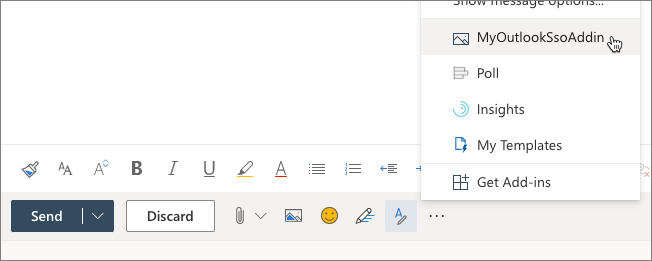

Select the add-in to open the task pane. When the task pane appears, select the **Get My user profile information** button.

Because you're already signed in, after a moment, you'll see the user's basic profile information appear in the email without having to sign in.

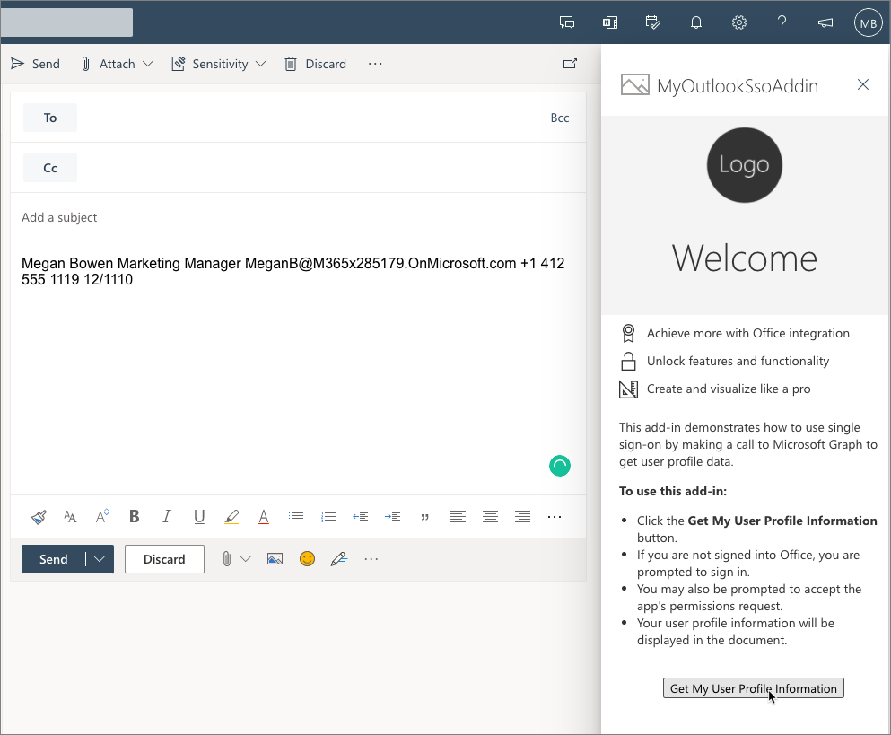

## Update the app to show upcoming meetings

Now, let's update the task pane app display a list of upcoming meetings for the currently logged in user. This information will be collected with Microsoft Graph.

### Update the task pane

Locate and open the **./src/taskpane/taskpane.html**.

Replace the `<body>` element with the following HTML. This will update the task pane's rendering:

```html
<body class="ms-font-m ms-welcome ms-Fabric">
  <header class="ms-welcome__header ms-bgColor-neutralLighter">
    
    <h1 class="ms-font-su">My upcoming meetings... </h1>
  </header>
  <main class="ms-firstrun-instructionstep">
    <ul class="ms-List ms-welcome__features">
      <li class="ms-ListItem">
        <i class="ms-Icon ms-Icon--Ribbon ms-font-xl"></i>
        <span class="ms-font-m">Share your day with others...</span>
      </li>
    </ul>
    <section class="ms-firstrun-instructionstep__header">
      <h2 class="ms-font-m">This add-in adds a list of your upcoming meetings to the current email.</h2>
      <div class="ms-firstrun-instructionstep__header--image"></div>
    </section>
    <p align="center">
      <button id="getGraphDataButton" class="popupButton ms-Button ms-Button--primary"><span class="ms-Button-label">Add
          upcoming schedule to email</span></button>
    </p>
    </div>
  </main>
</body>
```

### Update the task pane's code

Now, update the code that will get the user's next few calendar events.

Locate and open the **./src/helpers/ssoauthhelper.js** file.

Find the following line in the `getGraphData()` method:

```javascript
const response = await sso.makeGraphApiCall(exchangeResponse.access_token);
```

Delete this line and replace it with the following code. This code uses a different method in the SSO helper to submit a specific request to Microsoft Graph.

This query will get all the meetings on the current user's calendar from the current time for the next 24 hours:

```javascript
const startDate = new Date();
let endDate = new Date(startDate);
endDate.setDate(startDate.getDate() + 1);

const endpoint = "/me/calendarview";
const urlParams = `?startdatetime=${ startDate.toISOString() }&enddatetime=${ endDate.toISOString() }&$select=subject,start,end`;

const response = await sso.getGraphData(exchangeResponse.access_token, endpoint, urlParams);
```

Next, locate, and open the **./src/helpers/documentHelper.js** file.

Find the method `writeDataToOutlook()`. You'll replace the contents of this method to build an HTML string of the upcoming meetings returned from the Microsoft Graph request and add the list to the current email.

Replace the contents of the `writeDataToOutlook()` method with the following code:

```javascript
let emailMessage = "";

result.value.forEach(function(meeting){
  let startDateTime = new Date(meeting.start.dateTime + "Z");
  let endDateTime = new Date(meeting.end.dateTime + "Z");
  emailMessage += `<li><strong><em>${startDateTime.toLocaleTimeString()}-${endDateTime.toLocaleTimeString()}</em></strong><br />${meeting.subject}</li>`;
});

// wrap meeting
emailMessage = `Here's what my upcoming calendar looks like for the rest of the day: <ul>${emailMessage}</ul>`;

Office.context.mailbox.item.body.setSelectedDataAsync(emailMessage, { coercionType: Office.CoercionType.Html });
```

## Create a new Azure AD application for the add-in

Previous exercises in this module have used the **configure-sso** utility script that's included with all projects created with the Yeoman Generator for Microsoft Office. For this exercise, you'll learn how to manually register an Azure AD application and configure your developer environment to use the manually created app.

Open a browser and navigate to the [Azure Active Directory admin center (https://aad.portal.azure.com)](https://aad.portal.azure.com). Sign in using a **Work or School Account** that has global administrator rights to the tenancy.

Select **Azure Active Directory** in the leftmost navigation.

### App registration

Select **Manage > App registrations** in the leftmost navigation.

  

On the **App registrations** page, select **New registration** and set the following values on the **Register an application** screen. When finished, select the **Register** button.

- **Name:** MyOutlookSsoAddin2
- **Supported account types:** Accounts in any organizational directory (Any Azure AD directory - Multitenant)
- **Redirect URI (option)**: *leave default blank value*

### App authentication

The next step is to configure the app's registration details.

Next, in the leftmost navigation, select **Manage > Authentication**.

On the **Authentication** screen, select **Add a platform**. Then select the **Web** platform from the list of options:

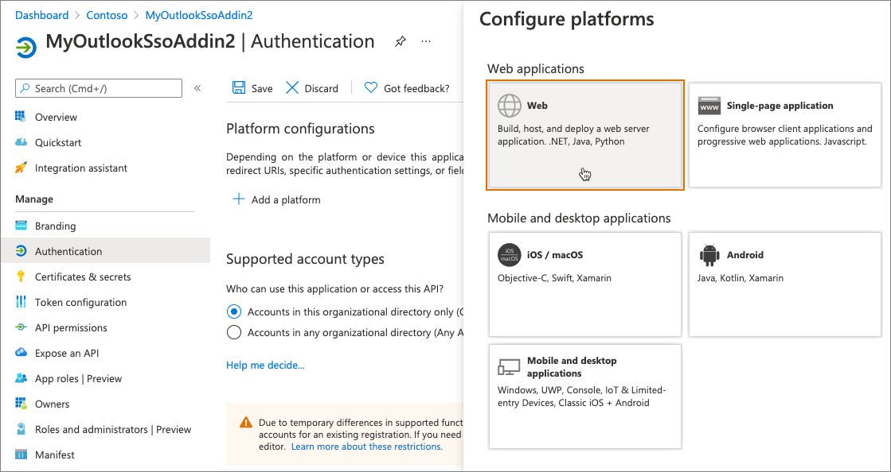

For the **Redirect URIs**, enter **https://localhost:3000/taskpane.html**.

For the **Implicit grant and hybrid flows**, select both of the following options and then select **Configure**:

- Access tokens (used for implicit flows)
- ID tokens (used for implicit and hybrid flows)

After the screen reloads, select **Add URI** in the **Web** platform, and enter **https://localhost:3000/fallbackauthdialog.html**.

Select **Save** at the top of the screen to save your changes.

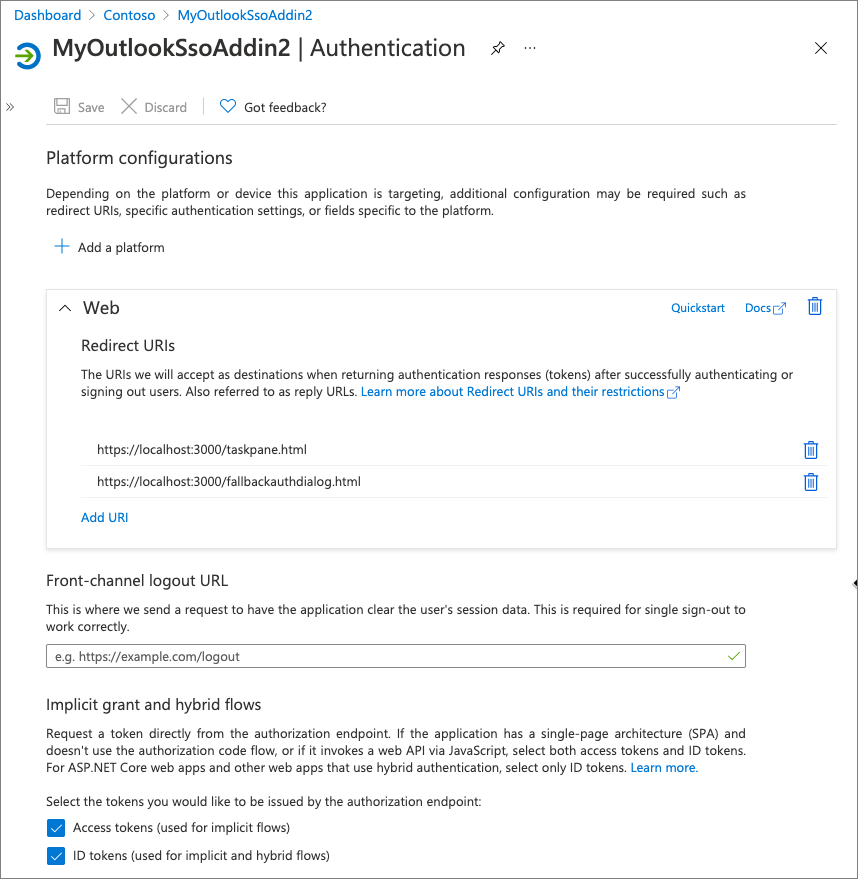

### App certificates and secrets

Now you need to create a client secret for the application

Select **Certificates & secrets** from the leftmost navigation panel.

Select the **New client secret** button:

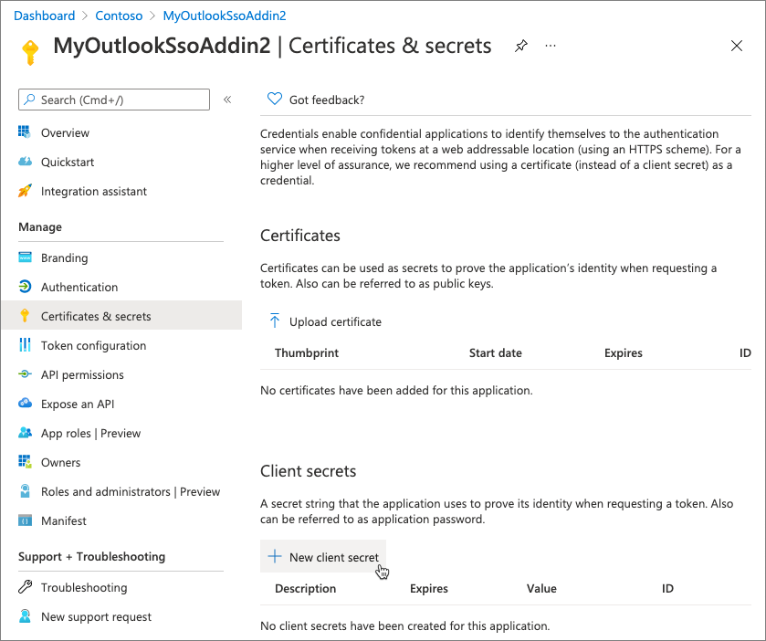

When prompted, give the secret a description and select one of the expiration duration options provided and select **Add**. *What you enter and select doesn't matter for the exercise.*


The **Certificate & Secrets** page will display the new secret.

> [!IMPORTANT]
> It's important you copy this value as it's only shown this one time; if you leave the page and come back, it will only show as a masked value.

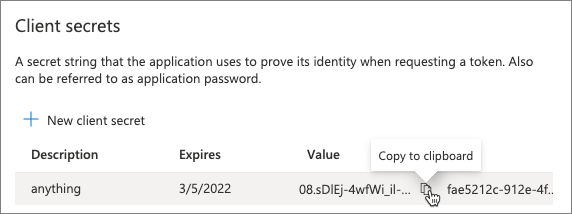

After copying the client secret, let's copy the client ID as well. In the leftmost navigation, select **Manage > Overview**.

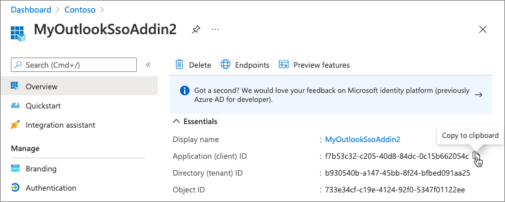

### API permissions

Next, you need to grant the application permissions to Microsoft Graph.

In the leftmost navigation, select **Manage > API permissions**.

It's a good practice to only request permissions that your app needs. So, let's remove the initial **User.Read** permission by selecting it, then select **Remove permission**, followed by **Yes, remove** to confirm.

Next, let's add the minimal permissions required for users to sign in using SSO.

Add a new permission by selecting **Add permission**.

On the **Select an API** screen, select **Microsoft Graph**, then select **Delegated permissions**. Select the following permissions from the following sections, or use the search box to find these permissions:

- OpenID permissions
  - openid
  - profile
- Calendars
  - Calendars.Read

Once you've selected these permissions, select the **Add permissions** button.

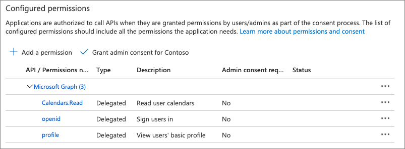

Next, select the **Grant admin consent for Contoso** followed by accepting the confirmation prompt by selecting **Yes**.

### Expose an API: Application ID URI

Finally, select **Manage > Expose an API** in the leftmost navigation. There are multiple things to do on this page:

First, select **Set** next to the **Application ID URI**. This is the unique ID of our application. Add **localhost:3000/** just before the protocol and the ID of the application so it looks similar to the following and select **Save**:

```text
api://localhost:3000/f7b53c32-c205-40d8-84dc-0c15b662054c
```

> [!NOTE]
> The GUID is the unique ID for each app. Your ID won't match the one shown in this exercise.

### Expose an API: Scopes defined by the API

The next section contains the scopes defined by the API. These can be custom scopes that enable you to restrict access to data and functionality protected by the API.

Select **Add a scope** and use the following values to complete the form:

- **Scope name:** access_as_user
- **Who can consent?** Admins and users
- **Admin consent display name:** Office can act as the user
- **Admin consent description:** Enable Office to call the add-in's web APIs with the same rights as the current user.
- **User consent display name:** Office can act as you
- **User consent description:** Enable Office to call the add-in's web APIs with the same rights that you have.
- **State:** Enabled

### Expose an API: Authorized client applications

The last section indicates the API will automatically trust specific applications and not prompt the user for consent when the application calls this API.

This effectively authorizes the Office desktop and web applications to call your add-in's API.

Select the **Add a client application** to add the following applications. Applications are added as GUIDs. For each one, make sure you select the only **Authorized scopes** listed to grant the application access to the scope previously defined:

- `d3590ed6-52b3-4102-aeff-aad2292ab01c` (*Microsoft Office*)
- `ea5a67f6-b6f3-4338-b240-c655ddc3cc8e` (*Microsoft Office*)
- `57fb890c-0dab-4253-a5e0-7188c88b2bb4` (*Office on the web*)
- `08e18876-6177-487e-b8b5-cf950c1e598c` (*Office on the web*)
- `bc59ab01-8403-45c6-8796-ac3ef710b3e3` (*Outlook on the web*)
- `93d53678-613d-4013-afc1-62e9e444a0a5` (*Office on the web*)

If you select one of these apps, each of them has the scope defined above as an authorized scope.

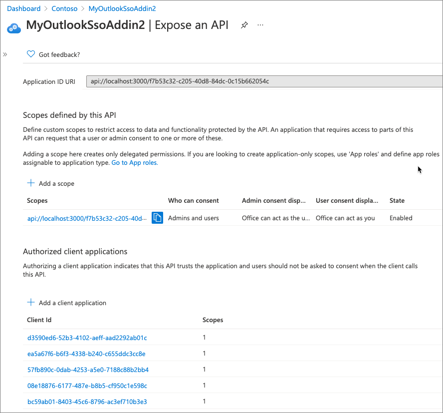

### Update project and developer workstation

With the Azure AD application created, the last step is to update your project and workstation to use the new app.

Within your project, locate and open the **.ENV** file.

Update the `CLIENT_ID` to use the **client ID** you copied from the app registration process.

Locate and open the **./manifest.xml** file. At the end of the file, find the `<WebApplicationInfo>` element. Within this element, update the `<ID>` and `<Resource>` elements to use the new client ID.

Locate and open the **./src/helpers/fallbackauthdialog.js** file. Find the line that starts with `const msalConfig`. This is the MSAL.js configuration object. Update the object's `clientId` property to be the new client ID.

Next, you need to save the client secret for the application in the credential store on your developer workstation. The commend you'll run is dependent on your platform.

#### Windows

Execute the following PowerShell, after updating the first three values:

- `$ssoAppName`: *the name of your project, such as **MyOutlookSsoAddin***
- `$user`: *your Windows sign-in user name, such as MyDomain\MyUserName*
- `$secret`: *the client secret you copied when registering the Azure AD app*

```powershell
$ssoAppName = "MyOutlookSsoAddin"
$user = "MyDomain\MyUserName"
$secret = "....."
[void][Windows.Security.Credentials.PasswordVault, Windows.Security.Credentials, ContentType = WindowsRuntime]
$creds = New-Object Windows.Security.Credentials.PasswordCredential
$creds.Resource = $ssoAppName
$creds.UserName = $user
$creds.Password = $secret
$vault = New-Object Windows.Security.Credentials.PasswordVault
$vault.Add($creds)
```

#### macOS

Execute the following in the console, after updating the first three values:

- `SSOAPPNAME`: *the name of your project, such as **MyOutlookSsoAddin***
- `USER`: *your macOS sign in user name, such as myusername*
- `SECRET`: *the client secret you copied when registering the Azure AD app*

```console
SSOAPPNAME="MyOutlookSsoAddin"
USER="myusername"
SECRET="...."
sudo security add-generic-password -a $USER -s $SSOAPPNAME -w $SECRET -U
```

## Build and retest the application

Run the following command in a command prompt to transpile and start the debugging process:

```console
npm start
```

### Retest the add-in in the Outlook web client

Open a browser and navigate to the [Outlook (https://outlook.office.com)](https://outlook.office.com). Sign in using a **Work or School Account**.

Repeat the process of testing the add-in that you did at the beginning of this exercise. However, before activating the add-in, you need to remove it because the currently installed add-in is still using the old **manifest.xml** file with the old Azure AD application registration.

To remove the add-in, follow the same steps to install a new add-in, except before uploading your custom **manifest.xml** file, remove the previously installed add-in:

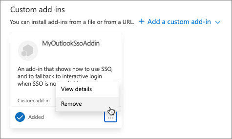

After you've installed the updated add-in **manifest.xml** file, complete the testing process to test the new logic of your add-in.

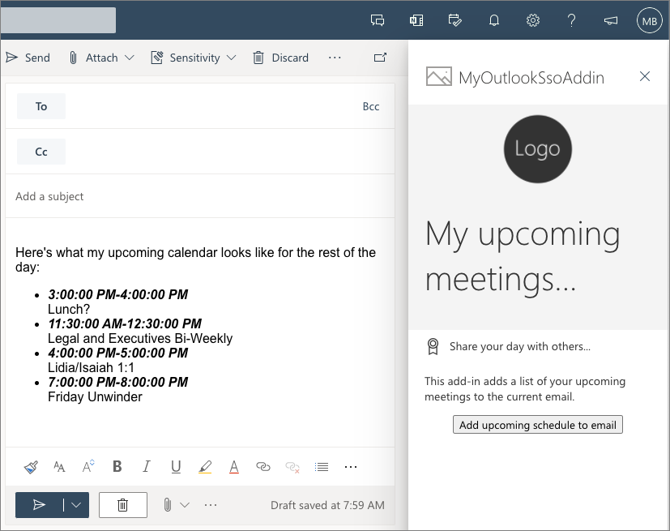
