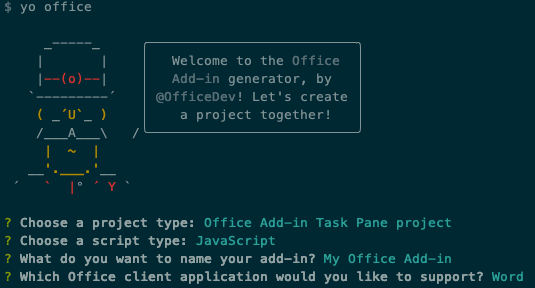
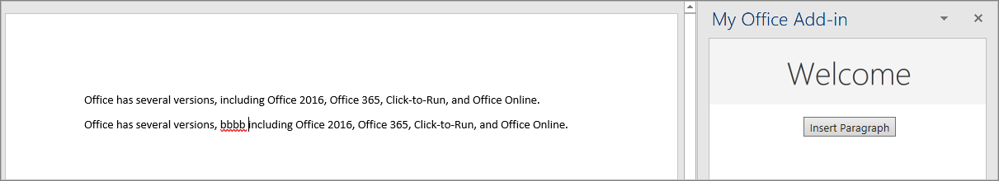
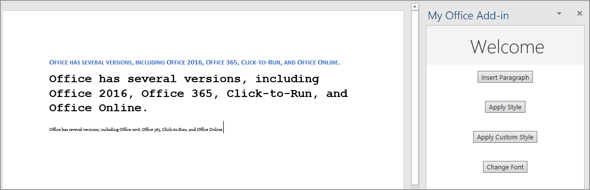

In this exercise, you'll build a Word add-in that inserts text ranges and paragraphs and format this text.

## Prerequisites

Developing Office Add-ins for Microsoft Word requires Word 2016, version 1711 (Build 8730.1000 Click-to-Run) or later. You might need to be an Office Insider to get this version. For more information, see [Be an Office Insider](https://insider.office.com/?tab=tab-1).

You'll use Node.js to create the custom Word add-in in this module. The exercises in this module assume you have the following tools installed on your developer workstation.

> [!IMPORTANT]
> In most cases, installing the latest version of the following tools is the best option. The versions listed here were used when this module was published and last tested.

- [Node.js](https://nodejs.org/) - (*the latest [LTS](https://nodejs.org/about/releases) version*)
- NPM (installed with Node.js) - v6.x (or higher)
- [Yeoman](https://yeoman.io/) - v3.x (or higher)
- [Yeoman Generator for Microsoft Office](https://github.com/OfficeDev/generator-office) - v1.8.x (or higher)
- [Visual Studio Code](https://code.visualstudio.com)

You must have the minimum versions of these prerequisites installed on your workstation.

## Create your add-in project

Run the following command to create an add-in project using the Yeoman generator:

```console
yo office
```

> [!NOTE]
> When you run the `yo office` command, you may receive prompts about the data collection policies of Yeoman and the Office Add-in CLI tools. Use the information that's provided to respond to the prompts as you see fit.

When prompted, provide the following information to create your add-in project:

- **Select a project type:** Office Add-in Task Pane project
- **Select a script type:** JavaScript
- **What do you want to name your add-in?** My Office Add-in
- **Which Office client application would you like to support?** Word



After you complete the wizard, the generator creates the project and installs supporting Node components.

> [!TIP]
> When installing dependencies, you can ignore any warnings or errors the Yeoman generator displays. The remainder of this unit include all the steps you'll need to follow.

## Insert a range of text

In this section, you'll programmatically test that your add-in supports the user's current version of Word, and then insert a paragraph into the document.

### Code the add-in

1. Open the project in your code editor.
1. Open the file **./src/taskpane/taskpane.html**. This file contains the HTML markup for the task pane.
1. Locate the `<main>` element and delete all lines that appear after the opening `<main>` tag and before the closing `</main>` tag.
1. Add the following markup immediately after the opening `<main>` tag:

    ```html
    <button class="ms-Button" id="insert-paragraph">Insert Paragraph</button><br/><br/>
    ```

1. Open the file **./src/taskpane/taskpane.js**. This file contains the Office JavaScript API code that enables interaction between the task pane and the Office host application.
1. Remove all references to the **run** button and the `run()` function by doing the following steps:

    - Locate and delete the line `document.getElementById("run").onclick = run;`.
    - Locate and delete the entire `run()` function.

1. Within the `Office.onReady()` method call, locate the line `if (info.host === Office.HostType.Word) {` and add the following code immediately after that line:

    ```javascript
    // Determine if the user's version of Office supports all the Office.js APIs that are used in the tutorial.
    if (!Office.context.requirements.isSetSupported('WordApi', '1.3')) {
      console.log('Sorry. The tutorial add-in uses Word.js APIs that are not available in your version of Office.');
    }

    // Assign event handlers and other initialization logic.
    document.getElementById("insert-paragraph").onclick = insertParagraph;
    ```

    > [!NOTE]
    >
    > - The first part of this code determines whether the user's version of Word supports a version of Word.js that includes all the APIs used in this tutorial. In a production add-in, use the body of the conditional block to hide or disable the UI that calls unsupported APIs. This will enable the user to use the parts of the add-in that are supported by their version of Word.
    > - The second part of this code adds an event handler for the **insert-paragraph** button.

1. Add the following function to the end of the file:

    ```javascript
    function insertParagraph() {
      Word.run(function (context) {

        // TODO1: Queue commands to insert a paragraph into the document.

        return context.sync();
      })
      .catch(function (error) {
        console.log("Error: " + error);
        if (error instanceof OfficeExtension.Error) {
          console.log("Debug info: " + JSON.stringify(error.debugInfo));
        }
      });
    }
    ```

    > [!NOTE]
    >
    > - Your Word.js business logic will be added to the function that is passed to `Word.run`. This logic doesn't execute immediately. Instead, it's added to a queue of pending commands.
    > - The `context.sync` method sends all queued commands to Word for execution.
    > - The `Word.run` is followed by a `catch` block. This is a best practice that you should always follow.

1. Within the `insertParagraph()` function, replace `TODO1` with the following code:

    ```javascript
    var docBody = context.document.body;
    docBody.insertParagraph("Office has several versions, including Office 2016, Microsoft 365 Click-to-Run, and Office on the web.",
                            "Start");
    ```

    > [!NOTE]
    >
    > - The first parameter to the `insertParagraph` method is the text for the new paragraph.
    > - The second parameter is the location within the body where the paragraph will be inserted. Other options for insert paragraph, when the parent object is the body, are "End" and "Replace".

1. Save all changes to the **taskpane.html** and **taskpane.js** files.

### Test the add-in

1. Complete the following steps to start the local web server and sideload your add-in:

    > [!NOTE]
    > Office Add-ins should use HTTPS, not HTTP, even when you are developing. If you are prompted to install a certificate after you run one of the following commands, accept the prompt to install the certificate that the Yeoman generator provides.

    > [!TIP]
    > If you're testing your add-in on Mac, run the following command in the root directory of your project before proceeding. When you run this command, the local web server starts.
    >
    > ```console
    > npm run dev-server
    > ```

    - To test your add-in in Word, run the following command in the root directory of your project. This starts the local web server (if it's not already running) and opens Word with your add-in loaded.

        ```console
        npm start
        ```

    - To test your add-in in Word on the web, run the following command in the root directory of your project. When you run this command, the local web server will start (if it's not already running).

        ```console
        npm run start:web
        ```

        To use your add-in, open a new document in Word on the web and then sideload your add-in by following the instructions in [Sideload Office Add-ins in Office on the web](/office/dev/add-ins/testing/sideload-office-add-ins-for-testing#sideload-an-office-add-in-in-office-on-the-web).

1. In Word, select the **Home** tab, and then select the **Show Task pane** button in the ribbon to open the add-in task pane.

    

1. In the task pane, select **Insert Paragraph**.
1. Make a change in the paragraph.
1. Select the **Insert Paragraph** button again. The new paragraph appears above the previous one because the `insertParagraph*()` method is inserting at the start of the document's body.

    

## Format text

In this section, you'll apply a built-in style to text, apply a custom style to text, and change the font of text.

### Apply a built-in style to text

1. Open the file **./src/taskpane/taskpane.html**.
1. Locate the `<button>` element for the **insert-paragraph** button, and add the following markup after that line:

    ```html
    <button class="ms-Button" id="apply-style">Apply Style</button><br/><br/>
    ```

1. Open the file **./src/taskpane/taskpane.js**.
1. Within the `Office.onReady()` method call, locate the following line in the `Office.onReady()` method:

    ```javascript
    document.getElementById("insert-paragraph").onclick = insertParagraph;
    ```

    Add the following code immediately after it:

    ```javascript
    document.getElementById("apply-style").onclick = applyStyle;
    ```

1. Add the following function to the end of the file:

    ```javascript
    function applyStyle() {
      Word.run(function (context) {

        // TODO1: Queue commands to style text.

        return context.sync();
      })
      .catch(function (error) {
        console.log("Error: " + error);
        if (error instanceof OfficeExtension.Error) {
          console.log("Debug info: " + JSON.stringify(error.debugInfo));
        }
      });
    }
    ```

1. Within the `applyStyle()` function, replace `TODO1` with the following code. The code applies a style to a paragraph, but styles can also be applied to ranges of text.

    ```javascript
    var firstParagraph = context.document.body.paragraphs.getFirst();
    firstParagraph.styleBuiltIn = Word.Style.intenseReference;
    ```

### Apply a custom style to text

1. Open the file **./src/taskpane/taskpane.html**.
1. Locate the `<button>` element for the **apply-style** button, and add the following markup after that line:

    ```html
    <button class="ms-Button" id="apply-custom-style">Apply Custom Style</button><br/><br/>
    ```

1. Open the file **./src/taskpane/taskpane.js**.
1. Within the `Office.onReady()` method call, locate the following line in the `Office.onReady()` method:

    ```javascript
    document.getElementById("apply-style").onclick = applyStyle;
    ```

    Add the following code immediately after it:

    ```javascript
    document.getElementById("apply-custom-style").onclick = applyCustomStyle;
    ```

1. Add the following function to the end of the file:

    ```javascript
    function applyCustomStyle() {
      Word.run(function (context) {

        // TODO1: Queue commands to apply the custom style.

        return context.sync();
      })
      .catch(function (error) {
        console.log("Error: " + error);
        if (error instanceof OfficeExtension.Error) {
          console.log("Debug info: " + JSON.stringify(error.debugInfo));
        }
      });
    }
    ```

1. Within the `applyCustomStyle()` function, replace `TODO1` with the following code. The code applies a custom style that doesn't exist yet. You'll create a style with the name **MyCustomStyle** in a later step.

    ```javascript
    var lastParagraph = context.document.body.paragraphs.getLast();
    lastParagraph.style = "MyCustomStyle";
    ```

1. Verify that you've saved all of the changes you've made to the project.

### Change the font of text

1. Open the file **./src/taskpane/taskpane.html**.
1. Locate the `<button>` element for the **apply-custom-style** button, and add the following markup after that line:

    ```html
    <button class="ms-Button" id="change-font">Change Font</button><br/><br/>
    ```

1. Open the file **./src/taskpane/taskpane.js**.
1. Within the `Office.onReady()` method call, locate the following line in the `Office.onReady()` method:

    ```javascript
    document.getElementById("apply-custom-style").onclick = applyCustomStyle;
    ```

    Add the following code immediately after it:

    ```javascript
    document.getElementById("change-font").onclick = changeFont;
    ```

1. Add the following function to the end of the file:

    ```javascript
    function changeFont() {
      Word.run(function (context) {

        // TODO1: Queue commands to apply a different font.

        return context.sync();
      })
      .catch(function (error) {
        console.log("Error: " + error);
        if (error instanceof OfficeExtension.Error) {
          console.log("Debug info: " + JSON.stringify(error.debugInfo));
        }
      });
    }
    ```

1. Within the `changeFont()` function, replace `TODO1` with the following code. The code gets a reference to the second paragraph by using the `ParagraphCollection.getFirst()` method chained to the `Paragraph.getNext()` method.

    ```javascript
    var secondParagraph = context.document.body.paragraphs.getFirst().getNext();
    secondParagraph.font.set({
      name: "Courier New",
      bold: true,
      size: 18
    });
    ```

1. Verify that you've saved all of the changes you've made to the project.

### Test the add-in

1. If the local web server is already running and your add-in is already loaded in Word, continue to step 2. Otherwise, start the local web server and sideload your add-in:

    - To test your add-in in Word, run the following command in the root directory of your project. This starts the local web server (if it's not already running) and opens Word with your add-in loaded.

        ```console
        npm start
        ```

    - To test your add-in in Word on the web, run the following command in the root directory of your project. When you run this command, the local web server will start (if it's not already running).

        ```console
        npm run start:web
        ```

        To use your add-in, open a new document in Word on the web and then sideload your add-in by following the instructions in [Sideload Office Add-ins in Office on the web](/office/dev/add-ins/testing/sideload-office-add-ins-for-testing#sideload-an-office-add-in-in-office-on-the-web).

1. If the add-in task pane isn't already open in Word, go to the **Home** tab and select **Show Task pane**.
1. Be sure there are at least three paragraphs in the document. You can select the **Insert Paragraph** button three times. *Check carefully that there's no blank paragraph at the end of the document. If there is, delete it.*
1. In Word, create a [custom style](https://support.office.com/article/Customize-or-create-new-styles-d38d6e47-f6fc-48eb-a607-1eb120dec563) named **MyCustomStyle**. It can have any formatting that you want.
1. Select the **Apply Style** button. The first paragraph will be styled with the built-in style **Intense Reference**.
1. Select the **Apply Custom Style** button. The last paragraph will be styled with your custom style. (If nothing seems to happen, the last paragraph might be blank. If so, add some text to it.)
1. Select the **Change Font** button. The font of the second paragraph changes to 18 pt., bold, Courier New.

    

## Summary

In this exercise, you built a Word add-in that inserts text ranges and paragraphs and format this text.
