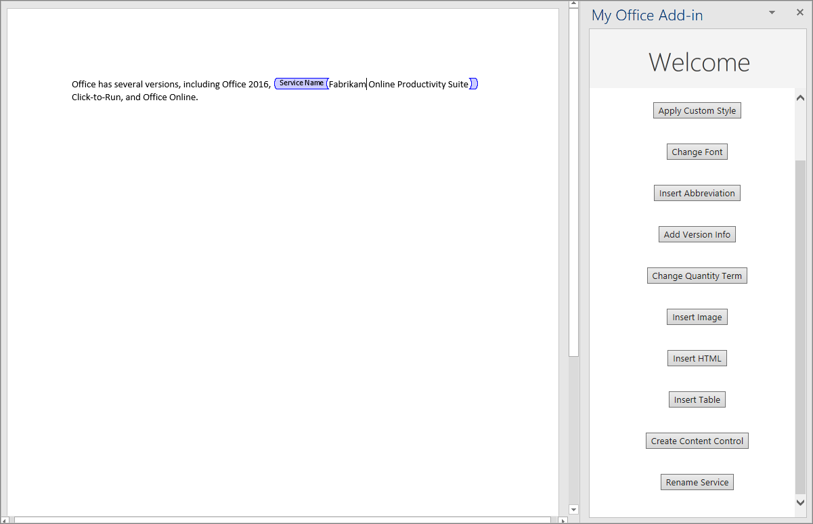

In this exercise, you'll learn how to create rich text content controls in the document, and then how to insert and replace content in the controls.

> [!IMPORTANT]
> This exercise assumes you have created the Word add-in in the previous exercise in this module.

> [!NOTE]
> There are several types of content controls that can be added to a Word document through the UI, but currently only rich text content controls are supported by Word.js.

### Create a content control

1. Open the file **./src/taskpane/taskpane.html**.
1. Locate the `<button>` element for the **insert-table** button, and add the following markup after that line:

    ```html
    <button class="ms-Button" id="create-content-control">Create Content Control</button><br/><br/>
    ```

1. Open the file **./src/taskpane/taskpane.js**.
1. Within the `Office.onReady()` method call, locate the following line in the `Office.onReady()` method:

    ```javascript
    document.getElementById("insert-table").onclick = insertTable;
    ```

    Add the following code immediately after it:

    ```javascript
    document.getElementById("create-content-control").onclick = createContentControl;
    ```

1. Add the following function to the end of the file:

    ```javascript
    function createContentControl() {
      Word.run(function (context) {
        // TODO1: Queue commands to create a content control.

        return context.sync();
      })
      .catch(function (error) {
        console.log("Error: " + error);
        if (error instanceof OfficeExtension.Error) {
          console.log("Debug info: " + JSON.stringify(error.debugInfo));
        }
      });
    }
    ```

1. Within the `createContentControl()` function, replace `TODO1` with the following code:

    ```javascript
    var serviceNameRange = context.document.getSelection();
    var serviceNameContentControl = serviceNameRange.insertContentControl();
    serviceNameContentControl.title = "Service Name";
    serviceNameContentControl.tag = "serviceName";
    serviceNameContentControl.appearance = "Tags";
    serviceNameContentControl.color = "blue";
    ```

    > [!NOTE]
    >
    > - This code is intended to wrap the phrase "Microsoft 365" in a content control. It makes a simplifying assumption that the string is present and the user has selected it.
    > - The `ContentControl.title` property specifies the visible title of the content control.
    > - The `ContentControl.tag` property specifies a tag that can be used to get a reference to a content control using the `ContentControlCollection.getByTag()` method, which you'll use in a later function.
    > - The `ContentControl.appearance` property specifies the visual look of the control. Using the value "Tags" means that the control will be wrapped in opening and closing tags, and the opening tag will have the content control's title. Other possible values are "BoundingBox" and "None".
    > - The `ContentControl.color` property specifies the color of the tags or the border of the bounding box.

### Replace the content of the content control

1. Open the file **./src/taskpane/taskpane.html**.

1. Locate the `<button>` element for the **create-content-control** button, and add the following markup after that line:

    ```html
    <button class="ms-Button" id="replace-content-in-control">Rename Service</button><br/><br/>
    ```

1. Open the file **./src/taskpane/taskpane.js**.
1. Within the `Office.onReady()` method call, locate the following line in the `Office.onReady()` method:

    ```javascript
    document.getElementById("create-content-control").onclick = createContentControl;
    ```

    Add the following code immediately after it:

    ```javascript
    document.getElementById("replace-content-in-control").onclick = replaceContentInControl;
    ```

1. Add the following function to the end of the file:

    ```javascript
    function replaceContentInControl() {
      Word.run(function (context) {
        // TODO1: Queue commands to replace the text in the Service Name
        //        content control.

        return context.sync();
      })
      .catch(function (error) {
        console.log("Error: " + error);
        if (error instanceof OfficeExtension.Error) {
          console.log("Debug info: " + JSON.stringify(error.debugInfo));
        }
      });
    }
    ```

1. Within the `replaceContentInControl()` function, replace `TODO1` with the following code. Note:
    - The `ContentControlCollection.getByTag()` method returns a `ContentControlCollection` of all content controls of the specified tag. We use `getFirst` to get a reference to the desired control.

        ```javascript
        var serviceNameContentControl = context.document.contentControls.getByTag("serviceName").getFirst();
        serviceNameContentControl.insertText("Fabrikam Online Productivity Suite", "Replace");
        ```

1. Verify that you've saved all of the changes you've made to the project.

### Test the add-in

1. Repeat the steps from the previous exercise to sideload the add-in.
1. If the add-in task pane isn't already open, from the **Home** tab, select **Show Taskpane**.
1. In the task pane, select the **Insert Paragraph** button to ensure that there's a paragraph with "Microsoft 365" at the top of the document.
1. In the document, select the text "Microsoft 365" and then select the **Create Content Control** button. The phrase is wrapped in tags labeled "Service Name".
1. Select the **Rename Service** button and note that the text of the content control changes to "Fabrikam Online Productivity Suite".



## Summary

In this exercise, you learned how to create rich text content controls in the document, and then you learned how to insert and replace content in the controls.
