> [!VIDEO https://www.microsoft.com/videoplayer/embed/RE4OIAs]

In this exercise, you'll create a new Azure AD web application registration using the Azure Active Directory admin center, a .NET Core console application, and query Microsoft Graph.

## Prerequisites

Developing Microsoft Graph apps requires a Microsoft 365 tenant.

For the Microsoft 365 tenant, follow the instructions on the [Microsoft 365 Developer Program](https://developer.microsoft.com/microsoft-365/dev-program) site for obtaining a developer tenant if you don't currently have a Microsoft 365 account.

You'll use the .NET SDK to create custom Microsoft Graph app in this module. The exercises in this module assume you have the following tools installed on your developer workstation.

> [!IMPORTANT]
> In most cases, installing the latest version of the following tools is the best option. The versions listed here were used when this module was published and last tested.

- [.NET SDK](https://dotnet.microsoft.com/) - v5.\* (or higher)
- [Visual Studio Code](https://code.visualstudio.com)

You must have the minimum versions of these prerequisites installed on your workstation.

## Create an Azure AD application

Open a browser and navigate to the [Azure Active Directory admin center (https://aad.portal.azure.com)](https://aad.portal.azure.com). Sign in using a **Work or School Account** that has global administrator rights to the tenancy.

Select **Azure Active Directory** in the left-hand navigation.

  

Select **Manage > App registrations** in the left-hand navigation.

On the **App registrations** page, select **New registration**.

  

On the **Register an application** page, set the values as follows:

- **Name**: Graph Console App
- **Supported account types**: Accounts in this organizational directory only (Contoso only - Single tenant)

    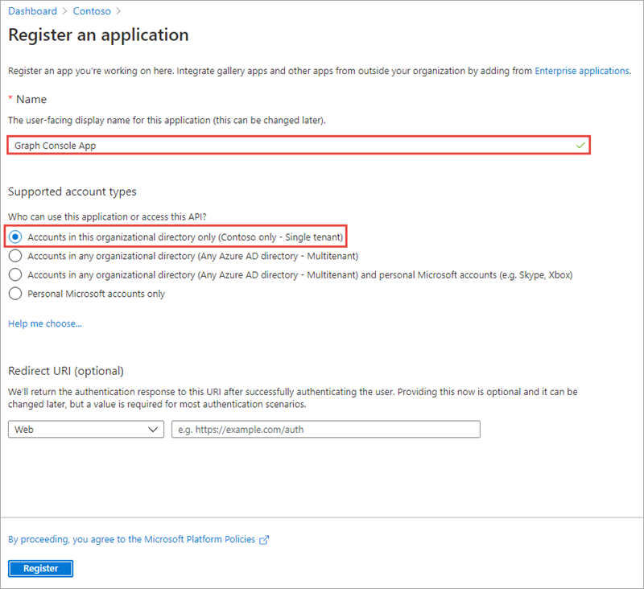

    Select **Register**.

On the **Graph Console App** page, copy the value of the **Application (client) ID** and **Directory (tenant) ID**; you'll need them later in this exercise.

  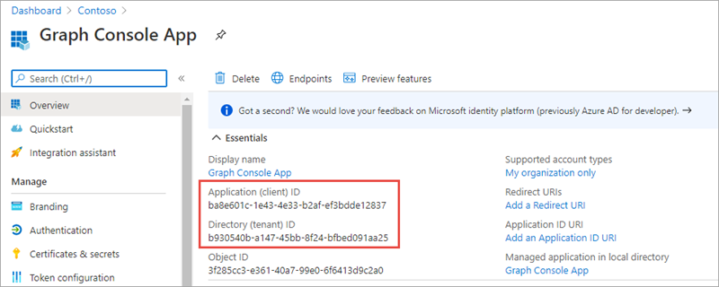

Select **Manage > Certificates & secrets**.

Select **New client secret**.

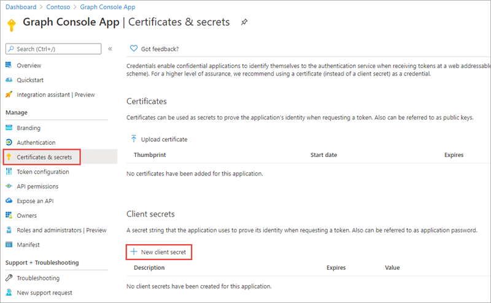

In the **Add a client secret** panel that appears, enter a value in **Description**, select one of the options for **Expires** and select **Add**.

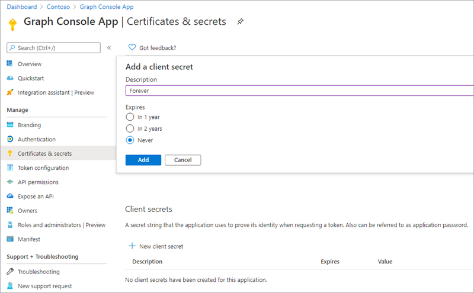

The **Certificate & secrets** page will display the new secret. It's important you copy this value as it's only shown this one time; if you leave the page and come back, it will only show as a masked value.


### Grant Azure AD application permissions to Microsoft Graph

After creating the application, you need to grant it the necessary permissions to Microsoft Graph

Select **API Permissions** in the left-hand navigation panel.


Select the **Add a permission** button.

In the **Request API permissions** panel that appears, select **Microsoft Graph** from the **Microsoft APIs** tab.


When prompted for the type of permission, select **Application permissions**.

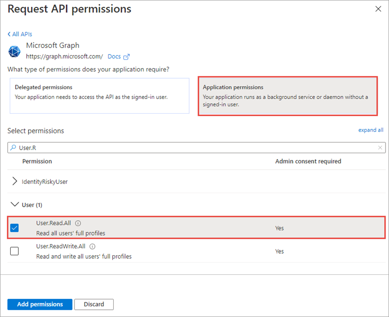

Enter **User.R** in the **Select permissions** search box and select the **User.Read.All** permission, followed by the **Add permission** button at the bottom of the panel.

In the **Configured permissions** panel, select the button **Grant admin consent for [tenant]**, and then select **Yes** when in the confirmation dialog.

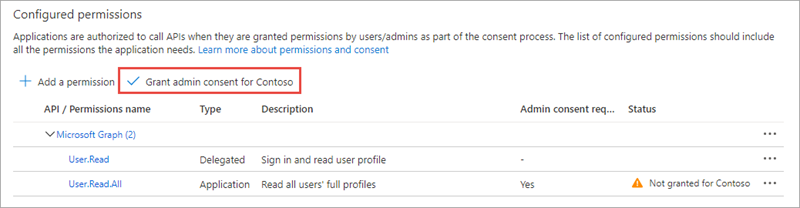

## Create .NET Core console application

> [!VIDEO https://www.microsoft.com/videoplayer/embed/RE4OIAz]

Open your command prompt, navigate to a directory where you have rights to create your project, and run the following command to create a new .NET Core console application:

```console
dotnet new console -o graphconsoleapp
```

After creating the application, run the following commands to ensure your new project runs correctly:

```console
cd graphconsoleapp
dotnet add package Microsoft.Identity.Client
dotnet add package Microsoft.Graph
dotnet add package Microsoft.Extensions.Configuration
dotnet add package Microsoft.Extensions.Configuration.FileExtensions
dotnet add package Microsoft.Extensions.Configuration.Json
```

Open the application in Visual Studio Code using the following command:

```console
code .
```

If Visual Studio Code displays a dialog box asking if you want to add required assets to the project, select **Yes**.

### Update the console app to support Azure AD authentication

Create a new file named **appsettings.json** in the root of the project and add the following code to it:

```json
{
  "tenantId": "YOUR_TENANT_ID_HERE",
  "applicationId": "YOUR_APP_ID_HERE",
  "applicationSecret": "YOUR_APP_SECRET_HERE",
  "redirectUri": "https://localhost"
}
```

Update properties with the following values:

- `YOUR_TENANT_ID_HERE`: Azure AD directory ID
- `YOUR_APP_ID_HERE`: Azure AD client ID
- `YOUR_APP_SECRET_HERE`: Azure AD client secret

#### Create helper classes

Create a new folder **Helpers** in the project.

Create a new file **AuthHandler.cs** in the **Helpers** folder and add the following code:

```csharp
using System.Net.Http;
using System.Threading.Tasks;
using Microsoft.Graph;
using System.Threading;

namespace Helpers
{
  public class AuthHandler : DelegatingHandler
  {
    private IAuthenticationProvider _authenticationProvider;

    public AuthHandler(IAuthenticationProvider authenticationProvider, HttpMessageHandler innerHandler)
    {
      InnerHandler = innerHandler;
      _authenticationProvider = authenticationProvider;
    }

    protected override async Task<HttpResponseMessage> SendAsync(HttpRequestMessage request, CancellationToken cancellationToken)
    {
      await _authenticationProvider.AuthenticateRequestAsync(request);
      return await base.SendAsync(request, cancellationToken);
    }
  }
}
```

Create a new file **MsalAuthenticationProvider.cs** in the **Helpers** folder and add the following code:

```csharp
using System.Net.Http;
using System.Net.Http.Headers;
using System.Threading.Tasks;
using Microsoft.Identity.Client;
using Microsoft.Graph;

namespace Helpers
{
  public class MsalAuthenticationProvider : IAuthenticationProvider
  {
    private IConfidentialClientApplication _clientApplication;
    private string[] _scopes;

    public MsalAuthenticationProvider(IConfidentialClientApplication clientApplication, string[] scopes)
    {
      _clientApplication = clientApplication;
      _scopes = scopes;
    }

    public async Task AuthenticateRequestAsync(HttpRequestMessage request)
    {
      var token = await GetTokenAsync();
      request.Headers.Authorization = new AuthenticationHeaderValue("bearer", token);
    }

    public async Task<string> GetTokenAsync()
    {
      AuthenticationResult authResult = null;
      authResult = await _clientApplication.AcquireTokenForClient(_scopes).ExecuteAsync();
      return authResult.AccessToken;
    }
  }
}
```

### Incorporate Microsoft Graph into the console app

Open the **Program.cs** file and add the following `using` statements to the top of the file:

```csharp
using System.Collections.Generic;
using Microsoft.Identity.Client;
using Microsoft.Graph;
using Microsoft.Extensions.Configuration;
using Helpers;
```

Add the following static member to the `Program` class in the **Program.cs** file. This member will be used to instantiate the client used to call Microsoft Graph:

```csharp
private static GraphServiceClient _graphClient;
```

Add the following method `LoadAppSettings` to the `Program` class. This method retrieves the configuration details from the **appsettings.json** file previously created:

```csharp
private static IConfigurationRoot LoadAppSettings()
{
  try
  {
    var config = new ConfigurationBuilder()
                      .SetBasePath(System.IO.Directory.GetCurrentDirectory())
                      .AddJsonFile("appsettings.json", false, true)
                      .Build();

    if (string.IsNullOrEmpty(config["applicationId"]) ||
        string.IsNullOrEmpty(config["applicationSecret"]) ||
        string.IsNullOrEmpty(config["redirectUri"]) ||
        string.IsNullOrEmpty(config["tenantId"]))
    {
      return null;
    }

    return config;
  }
  catch (System.IO.FileNotFoundException)
  {
    return null;
  }
}
```

Add the following method `CreateAuthorizationProvider` to the `Program` class. This method will create an instance of the clients used to call Microsoft Graph.

```csharp
private static IAuthenticationProvider CreateAuthorizationProvider(IConfigurationRoot config)
{
  var clientId = config["applicationId"];
  var clientSecret = config["applicationSecret"];
  var redirectUri = config["redirectUri"];
  var authority = $"https://login.microsoftonline.com/{config["tenantId"]}/v2.0";

  List<string> scopes = new List<string>();
  scopes.Add("https://graph.microsoft.com/.default");

  var cca = ConfidentialClientApplicationBuilder.Create(clientId)
                                          .WithAuthority(authority)
                                          .WithRedirectUri(redirectUri)
                                          .WithClientSecret(clientSecret)
                                          .Build();
  return new MsalAuthenticationProvider(cca, scopes.ToArray());
}
```

Add the following method `GetAuthenticatedGraphClient`  to the `Program` class. This method creates an instance of the `GraphServiceClient` object.

```csharp
private static GraphServiceClient GetAuthenticatedGraphClient(IConfigurationRoot config)
{
    var authenticationProvider = CreateAuthorizationProvider(config);
    _graphClient = new GraphServiceClient(authenticationProvider);
    return _graphClient;
}
```

Locate the `Main` method in the `Program` class. Add the following code to the end of the `Main` method to load the configuration settings from the **appsettings.json** file:

```csharp
var config = LoadAppSettings();
if (config == null)
{
  Console.WriteLine("Invalid appsettings.json file.");
  return;
}
```

Add the following code to the end of the `Main` method, just after the code added in the last step. This code will obtain an authenticated instance of the `GraphServicesClient` and submit a request for the first user.

```csharp
var client = GetAuthenticatedGraphClient(config);

var graphRequest = client.Users.Request();

var results = graphRequest.GetAsync().Result;
foreach(var user in results)
{
  Console.WriteLine(user.Id + ": " + user.DisplayName + " <" + user.Mail + ">");
}

Console.WriteLine("\nGraph Request:");
Console.WriteLine(graphRequest.GetHttpRequestMessage().RequestUri);
```

### Build and test the application

Run the following command in a command prompt to ensure the developer certificate has been trusted:

```console
dotnet dev-certs https --trust
```

Run the following command in a command prompt to compile the console application:

```console
dotnet build
```

Run the following command to run the console application:

```console
dotnet run
```

When the application runs, you'll see a list of users displayed. The query retrieved all information about the users:

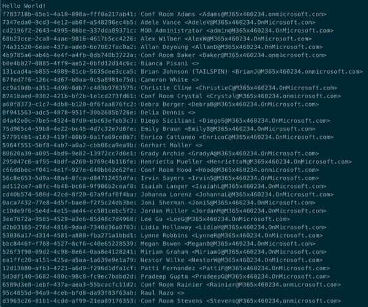

> [!NOTE]
> Notice the URL written to the console. This is the entire request, including query parameters, that the Microsoft Graph SDK is generating. Take note for each query you run in this exercise.

### Edit the application to optimize the query

> [!VIDEO https://www.microsoft.com/videoplayer/embed/RE4OIAw]

The current console application isn't efficient because it retrieves all information about all users in your organization but only displays three properties. The `$select` query parameter can limit the amount of data that is returned by Microsoft Graph, optimizing the query.

Update the line that starts with `var graphRequest = client.Users` in the `Main` method with the following to limit the query to just two properties:

```csharp
var graphRequest = client.Users
                    .Request()
                    .Select(u => new { u.DisplayName, u.Mail });
```

Rebuild and rerun the console application by executing the following commands in the command line:

```console
dotnet build
dotnet run
```

Now you see the `Id` property isn't populated with data as it wasn't included in the `$select` query parameter:

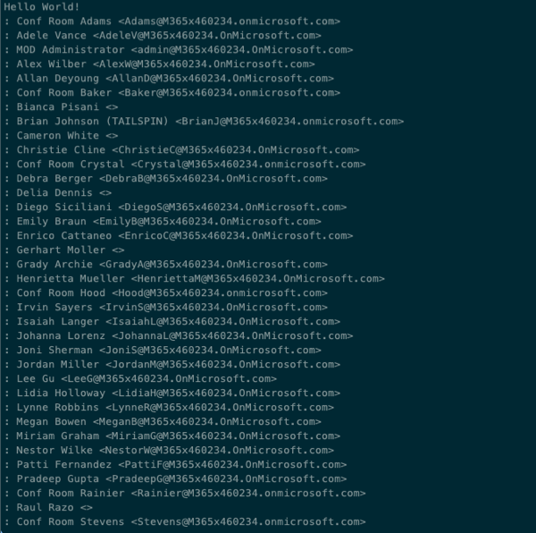

Let us further limit the results to just the first 15 results. Update the line that starts with `var graphRequest = client.Users` in the `Main` method with the following:

```csharp
var graphRequest = client.Users
                    .Request()
                    .Select(u => new { u.DisplayName, u.Mail })
                    .Top(15);
```

Rebuild and rerun the console application by executing the following commands in the command line:

```console
dotnet build
dotnet run
```

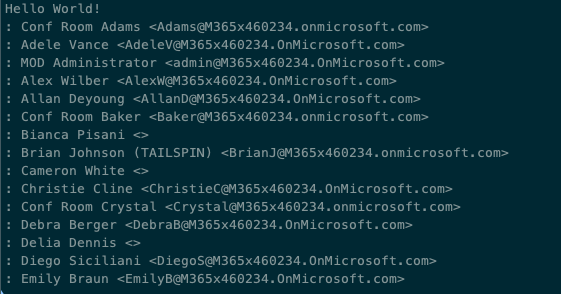

Notice only 15 items are now returned by the query.

Sort the results in reverse alphabetic order. Update the line that starts with `var graphRequest = client.Users` in the `Main` method with the following:

```csharp
var graphRequest = client.Users
                    .Request()
                    .Select(u => new { u.DisplayName, u.Mail })
                    .Top(15)
                    .OrderBy("DisplayName desc");
```

Rebuild and rerun the console application by executing the following commands in the command line:

```console
dotnet build
dotnet run
```

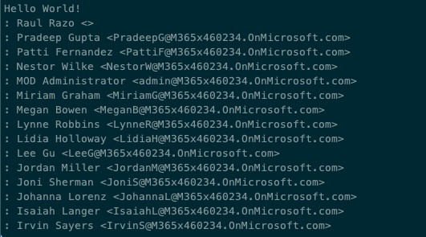

Further refine the results by selecting Users who's surname starts with A, B, or C. You'll need to remove the `$orderby` query parameter added previously as the Users endpoint doesn't support combining the `$filter` and `$orderby` parameters. Update the line that starts with `var graphRequest = client.Users` in the `Main` method with the following:

```csharp
var graphRequest = client.Users
                    .Request()
                    .Select(u => new { u.DisplayName, u.Mail })
                    .Top(15)
                    // .OrderBy("DisplayName desc)
                    .Filter("startsWith(surname,'A') or startsWith(surname,'B') or startsWith(surname,'C')");
```

Rebuild and rerun the console application by executing the following commands in the command line:

```console
dotnet build
dotnet run
```

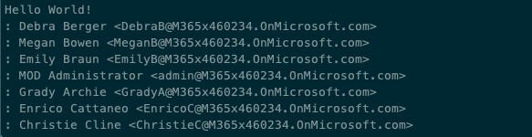

## Summary

In this exercise, you created an Azure AD application and .NET console application that retrieved user data from Microsoft Graph. You then used query parameters to limit and manipulate the data returned by Microsoft Graph to optimize the query.
