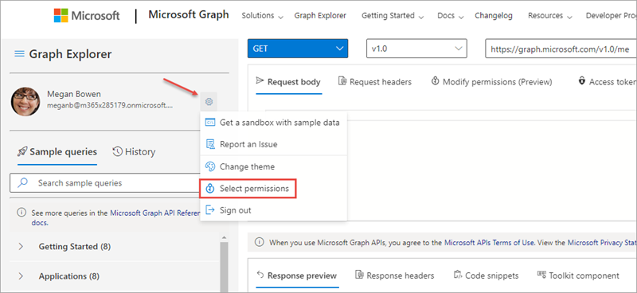
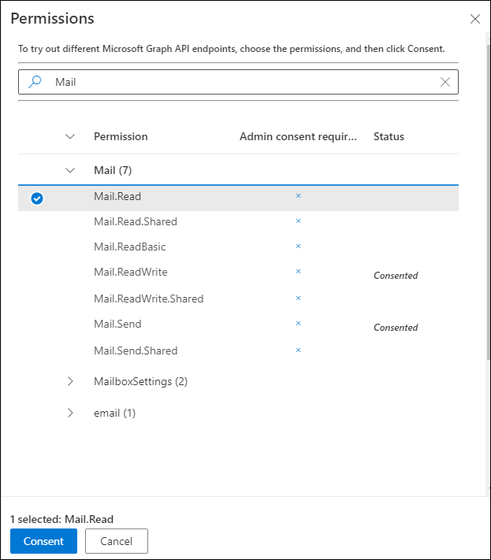
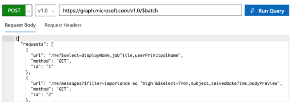
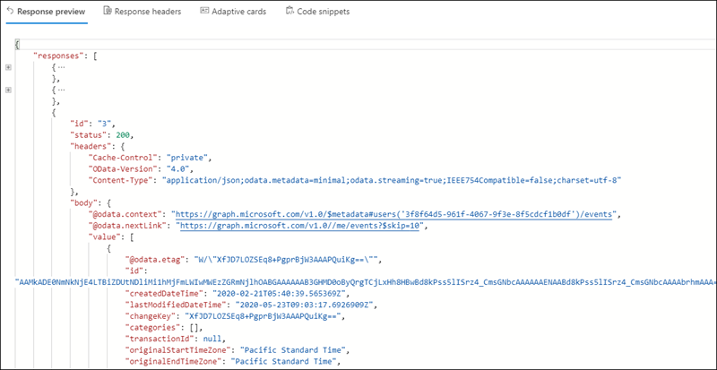
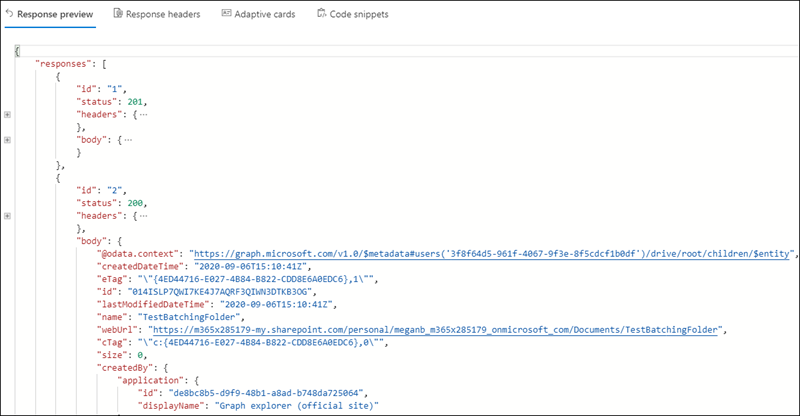

In this exercise, you'll use the Graph Explorer to create and issue a single request that contains multiple child requests. This batching of requests enables developers to submit multiple requests in a single round-trip request to Microsoft Graph, creating more optimized queries.

## Sign in to the Microsoft Graph Explorer

The Graph Explorer enables developers to create and test queries using the Microsoft Graph REST API. Previously in this module, you used the Graph Explorer as an anonymous user and executed queries using the sample data collection.

In this example, you'll sign in to Microsoft Graph with a real user.

Open a browser and navigate to https://developer.microsoft.com/graph/graph-explorer


Select the **Sign In with Microsoft** button in the left-side panel and enter the credentials of a Work and School account.

After signing in, select the gear icon to the right of your user profile and then select **Select permissions**. Verify the user has enough permissions to submit the requests in this exercise. You must consent to at least these minimum permissions:

- Mail.Read
- Calendars.Read
- Files.ReadWrite





## Submit three (3) GET requests in a single batch

All batch requests are submitted as HTTP POSTs to a specific endpoint: https://graph.microsoft.com/v1.0/$batch. The `$batch` query parameter is what tells Microsoft Graph to unpack the requests submitted in the body.

Set the request to an HTTP **POST** and the endpoint of the request to **https://graph.microsoft.com/v1.0/$batch**.

Add the following JSON to the **Request Body** input box. This JSON code will issue three requests:

- Request the current user's `displayName`, `jobTitle`, and `userPrincipalName` properties
- Request the current user's email messages that are marked with high importance
- Request all the current user's calendar events

```json
{
  "requests":
  [
    {
      "url": "/me?$select=displayName,jobTitle,userPrincipalName",
      "method": "GET",
      "id": "1"
    },
    {
      "url": "/me/messages?$filter=importance eq 'high'&$select=from,subject,receivedDateTime,bodyPreview",
      "method": "GET",
      "id": "2"
    },
    {
      "url": "/me/events",
      "method": "GET",
      "id": "3"
    }
  ]
}
```



Select the **Run Query** button.

Observe the results in the **Response Preview** box at the bottom of the page:



Notice the response includes three individual responses within the `responses` collection. Also notice for response `id:3`, the data that was returned, as indicated by the `@odata.nextLink` property, is from the **/me/events** collection. This query matches the third request in the initial request submitted.

## Combine POST and GET requests in a single batch request

Batch requests can also include both POST and GET requests.

In this example, you'll submit a request that creates a new folder in the current user's OneDrive [for Business] and then requests the newly created folder. If the first request failed, the second request should come back empty as well.

Enter the following JSON to the **Request Body** input box. This request will issue two requests:

```json
{
  "requests":
  [
    {
      "url": "/me/drive/root/children",
      "method": "POST",
      "id": "1",
      "body": {
        "name": "TestBatchingFolder",
        "folder": {}
      },
      "headers": {
        "Content-Type": "application/json"
      }
    },
    {
      "url": "/me/drive/root/children/TestBatchingFolder ",
      "method": "GET",
      "id": "2",
      "DependsOn": [
        "1"
      ]
    }
  ]
}
```

Select the **Run Query** button.

Observe the results in the **Response Preview** box at the bottom of the page:



Notice this response contains two objects. The first request resulted in an HTTP 201 that says the item, or folder, was created.

The second request was also successful and the name of the folder returned matched the folder the first request created.

## Summary

In this exercise, you used Microsoft Graph to demonstrate how you can combine multiple requests using a single request. This capability of submitting batch requests using the `$batch` query parameter enables you to optimize your applications to minimize the number of requests to Microsoft Graph.
