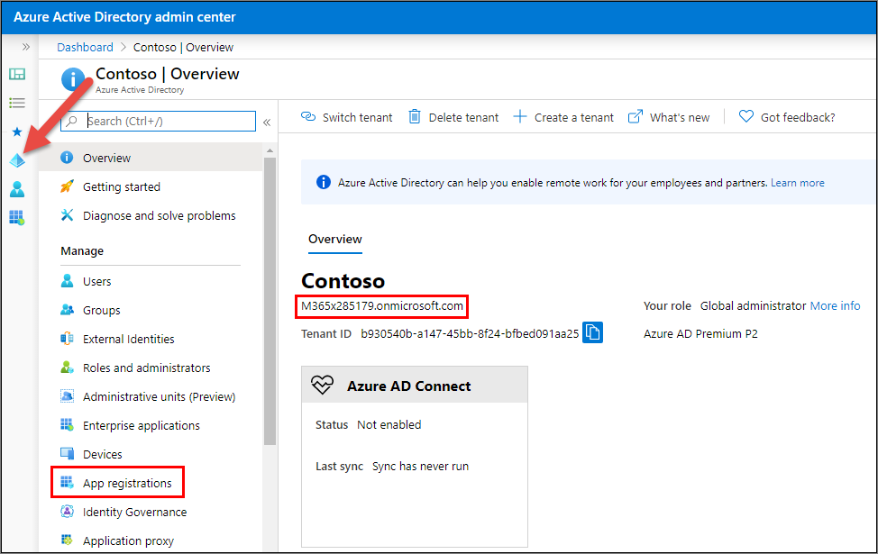
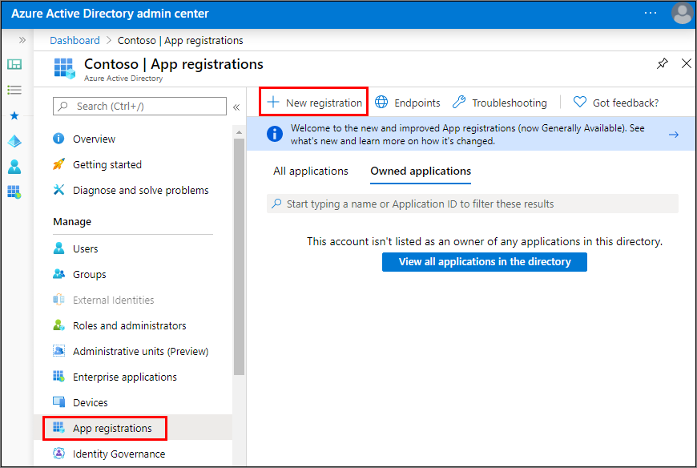
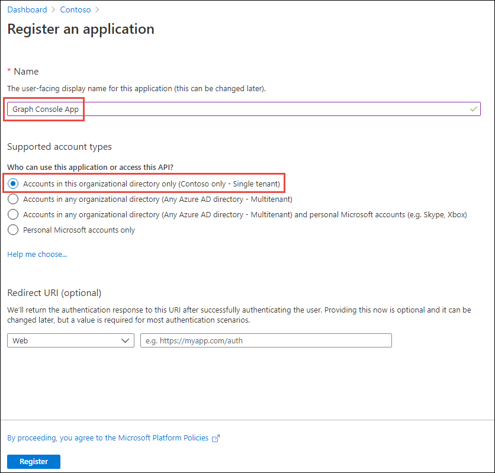
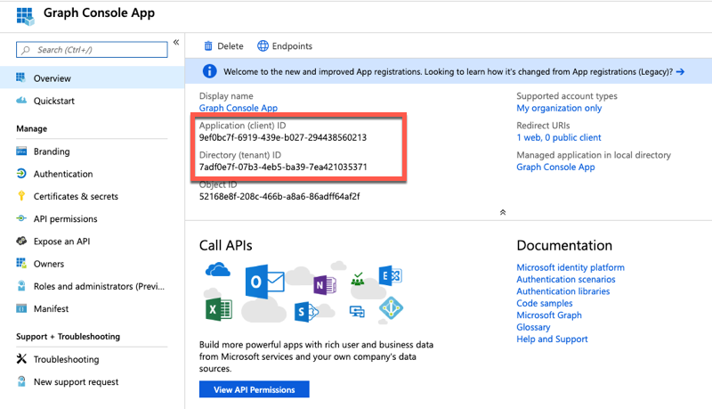
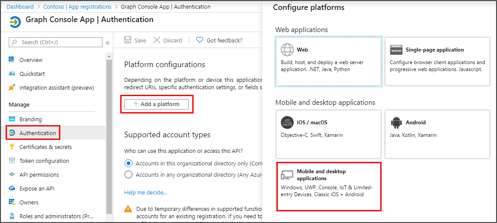
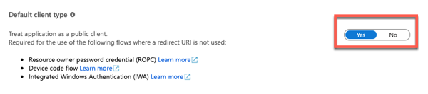
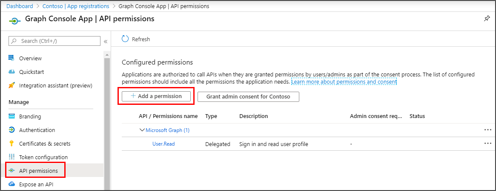
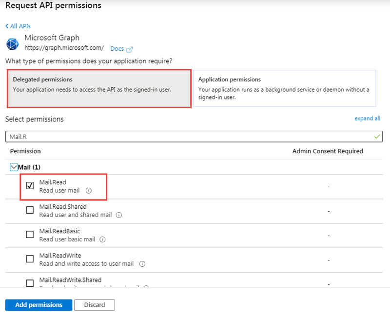
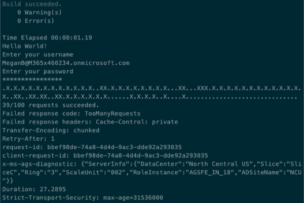

In this exercise, you will create a new Azure AD web application registration using the Azure Active Directory admin center, a .NET Core console application and query Microsoft Graph. You will issue many requests in parallel to trigger your requests to be throttled. This application will allow you to see the response you will receive.

## Create an Azure AD application

Open a browser and navigate to the [Azure Active Directory admin center (https://aad.portal.azure.com)](https://aad.portal.azure.com). Sign in using a **Work or School Account**.

Select **Azure Active Directory** in the left-hand navigation.

  

Copy the Azure AD instance domain listed on the instance portal (highlighted above the name of the instance in the previous image).

Select **Manage > App registrations** in the left-hand navigation.

On the **App registrations** page, select **New registration**.

  

On the **Register an application** page, set the values as follows:

- **Name**: Graph Console App
- **Supported account types**: Accounts in this organizational directory only (Contoso only - Single tenant)

    

    Select **Register**.

On the **GraphNotificationTutorial** page, copy the value of the **Application (client) ID** and **Directory (tenant) ID**; you will need these in the application.

  

Select **Manage > Authentication**.

In the section **Redirect URIs**, locate the **Suggested Redirect URIs for public clients (mobile, desktop)** section and select the entry that begins with **msal**:



Scroll down to the **Default claim type** section and set the toggle to **Yes**.



Select **Save** in the top menu to save your changes.

### Grant Azure AD application permissions to Microsoft Graph

After creating the application, you need to grant it the necessary permissions to Microsoft Graph

Select **API Permissions** in the left-hand navigation panel.



Select the **Add a permission** button.


In the **Request API permissions** panel that appears, select **Microsoft Graph** from the **Microsoft APIs** tab.


When prompted for the type of permission, select **Delegated permissions**.



Enter **Mail.R** in the **Select permissions** search box and select the **Mail.Read** permission, followed by the **Add permission** button at the bottom of the panel.

At the bottom of the **API Permissions** panel, select the button **Grant admin consent for [tenant]**, followed by the **Yes** button to grant all users in your organization this permission.

## Create .NET Core console application

Open your command prompt, navigate to a directory where you have rights to create your project, and run the following command to create a new .NET Core console application:

```shell
dotnet new console -o graphconsoleapp
```

After creating the application, run the following commands to ensure your new project runs correctly.

```shell
cd graphconsoleapp
dotnet add package Microsoft.Identity.Client
dotnet add package Microsoft.Graph
dotnet add package Microsoft.Extensions.Configuration
dotnet add package Microsoft.Extensions.Configuration.FileExtensions
dotnet add package Microsoft.Extensions.Configuration.Json
```

Open the application in Visual Studio Code using the following command:

```shell
code .
```

If Visual Studio code displays a dialog box asking if you want to add required assets to the project, select **Yes**.

### Update the console app to support Azure AD authentication

Create a new file named **appsettings.json** in the root of the project and add the following code to it:

```json
{
  "tenantId": "YOUR_TENANT_ID_HERE",
  "applicationId": "YOUR_APP_ID_HERE",
  "domain": "YOUR_DOMAIN_HERE"
}
```

Update properties with the following values:

- `YOUR_TENANT_ID_HERE`: Azure AD directory ID
- `YOUR_APP_ID_HERE`: Azure AD client ID
- `YOUR_DOMAIN_HERE`: the domain for your Azure AD instance (*for example, contoso.onmicrosoft.com*)

#### Create helper classes

Create a new folder **Helpers** in the project.

Create a new file **AuthHandler.cs** in the **Helpers** folder and add the following code:

```cs
using System.Net.Http;
using System.Threading;
using System.Threading.Tasks;
using Microsoft.Graph;

namespace Helpers
{
  public class AuthHandler : DelegatingHandler
  {
    private IAuthenticationProvider _authenticationProvider;

    public AuthHandler(IAuthenticationProvider authenticationProvider, HttpMessageHandler innerHandler)
    {
      InnerHandler = innerHandler;
      _authenticationProvider = authenticationProvider;
    }

    protected override async Task<HttpResponseMessage> SendAsync(HttpRequestMessage request, CancellationToken cancellationToken)
    {
      await _authenticationProvider.AuthenticateRequestAsync(request);
      return await base.SendAsync(request, cancellationToken);
    }
  }
}
```

Create a new file **MsalAuthenticationProvider.cs** in the **Helpers** folder and add the following code:

```cs
using System.Net.Http;
using System.Net.Http.Headers;
using System.Security;
using System.Threading.Tasks;
using Microsoft.Identity.Client;
using Microsoft.Graph;

namespace Helpers
{
  public class MsalAuthenticationProvider : IAuthenticationProvider
  {
    private IPublicClientApplication _clientApplication;
    private string[] _scopes;
    private string _username;
    private SecureString _password;

    public MsalAuthenticationProvider(IPublicClientApplication clientApplication, string[] scopes, string username, SecureString password)
    {
      _clientApplication = clientApplication;
      _scopes = scopes;
      _username = username;
      _password = password;
    }

    public async Task AuthenticateRequestAsync(HttpRequestMessage request)
    {
      var token = await GetTokenAsync();
      request.Headers.Authorization = new AuthenticationHeaderValue("bearer", token);
    }

    public async Task<string> GetTokenAsync()
    {
      AuthenticationResult authResult = null;
      authResult = await _clientApplication.AcquireTokenByUsernamePassword(_scopes, _username, _password).ExecuteAsync();
      return authResult.AccessToken;
    }
  }
}
```

### Incorporate Microsoft Graph into the console app

Open the **Program.cs** file and add the following `using` statements to the top fo the file:

```cs
using System.Collections.Generic;
using System.Net;
using System.Net.Http;
using System.Net.Http.Headers;
using System.Security;
using System.Threading.Tasks;
using Microsoft.Identity.Client;
using Microsoft.Graph;
using Microsoft.Extensions.Configuration;
using Helpers;

```

Add the following method `LoadAppSettings` to the `Program` class. The method retrieves the configuration details from the **appsettings.json** file previously created:

```cs
private static IConfigurationRoot LoadAppSettings()
{
  try
  {
    var config = new ConfigurationBuilder()
                      .SetBasePath(System.IO.Directory.GetCurrentDirectory())
                      .AddJsonFile("appsettings.json", false, true)
                      .Build();

    if (string.IsNullOrEmpty(config["applicationId"]) ||
        string.IsNullOrEmpty(config["tenantId"]) ||
        string.IsNullOrEmpty(config["domain"]))
    {
      return null;
    }

    return config;
  }
  catch (System.IO.FileNotFoundException)
  {
    return null;
  }
}
```

Add the following method `CreateAuthorizationProvider` to the `Program` class. The method will create an instance of the clients used to call Microsoft Graph.

```cs
private static IAuthenticationProvider CreateAuthorizationProvider(IConfigurationRoot config, string userName, SecureString userPassword)
{
  var clientId = config["applicationId"];
  var authority = $"https://login.microsoftonline.com/{config["tenantId"]}/v2.0";

  List<string> scopes = new List<string>();
  scopes.Add("User.Read");
  scopes.Add("Mail.Read");

  var cca = PublicClientApplicationBuilder.Create(clientId)
                                          .WithAuthority(authority)
                                          .Build();
  return new MsalAuthenticationProvider(cca, scopes.ToArray(), userName, userPassword);
}
```

Add the following method `GetAuthenticatedHTTPClient` to the `Program` class. The method creates an instance of the `HttpClient` object.

```cs
private static HttpClient GetAuthenticatedHTTPClient(IConfigurationRoot config, string userName, SecureString userPassword)
{
    var authenticationProvider = CreateAuthorizationProvider(config, userName, userPassword);
    var httpClient = new HttpClient(new AuthHandler(authenticationProvider, new HttpClientHandler()));
    return httpClient;
}
```

Add the following method `ReadPassword` to the `Program` class. The method prompts the user for their password:

```cs
private static SecureString ReadPassword()
{
  Console.WriteLine("Enter your password");
  SecureString password = new SecureString();
  while (true)
  {
    ConsoleKeyInfo c = Console.ReadKey(true);
    if (c.Key == ConsoleKey.Enter)
    {
      break;
    }
    password.AppendChar(c.KeyChar);
    Console.Write("*");
  }
  Console.WriteLine();
  return password;
}
```

Add the following method `ReadUsername` to the `Program` class. The method prompts the user for their username:

```cs
private static string ReadUsername()
{
  string username;
  Console.WriteLine("Enter your username");
  username = Console.ReadLine();
  return username;
}
```

Locate the `Main` method in the `Program` class. Add the following code to the end of the `Main` method to load the configuration settings from the **appsettings.json** file:

```cs
var config = LoadAppSettings();
if (config == null)
{
  Console.WriteLine("Invalid appsettings.json file.");
  return;
}
```

Add the following code to the end of the `Main` method, just after the code added in the last step. Thi code will obtain an authenticated instance of the `HttpClient` and submit a request for the current user's email:

```cs
var userName = ReadUsername();
var userPassword = ReadPassword();

var client = GetAuthenticatedHTTPClient(config, userName, userPassword);
```

Add the following code to issue many requests to Microsoft Graph. This code will create a collection of tasks to request a specific Microsoft Graph endpoint. When a task succeeds, it will write a dot to the console while failed request will write an `X` to the console. The most recent failed request's status code and headers are saved.

All tasks are then executed in parallel. At the conclusion of all requests, the results are written to the console:

```cs
var totalRequests = 100;
var successRequests = 0;
var tasks = new List<Task>();
var failResponseCode = HttpStatusCode.OK;
HttpResponseHeaders failedHeaders = null;

for (int i = 1; i < totalRequests; i++)
{
  tasks.Add(Task.Run(() =>
  {
    var response = client.GetAsync("https://graph.microsoft.com/v1.0/me/messages").Result;
    Console.Write(".");
    if (response.StatusCode == HttpStatusCode.OK)
    {
      successRequests++;
    }
    else
    {
      Console.Write('X');
      failResponseCode = response.StatusCode;
      failedHeaders = response.Headers;
    }
  }));
}

var allWork = Task.WhenAll(tasks);
try
{
  allWork.Wait();
}
catch { }
Console.WriteLine();
Console.WriteLine("{0}/{1} requests succeeded.", successRequests, totalRequests);
if (successRequests != totalRequests)
{
  Console.WriteLine("Failed response code: {0}", failResponseCode.ToString());
  Console.WriteLine("Failed response headers: {0}", failedHeaders);
}
```

### Build and test the application

Run the following command in a command prompt to compile the console application:

```shell
dotnet build
```

Run the following command to run the console application:

```shell
dotnet run
```

After entering the username and password of a user, you will see the results written to the console:



There is a mix of success and failure indicators in the console. The summary states only 39% of the requests were successful.

After the results, the console has two lines that begin with **Failed response**. Notice the code states **TooManyRequests** that is the representation of the HTTP status code 429. This status code is the indication that your requests are being throttled.

Also notice within the collection of response headers, the presence of **Retry-After**. This header is the value in seconds that Microsoft Graph tells you to wait before sending your next request to avoid being further throttled.

## Summary

In this exercise, you created an Azure AD application and .NET console application that retrieved user data from Microsoft Graph. This query was submitted multiple times to demonstrate Microsoft Graph throttling the requests.
