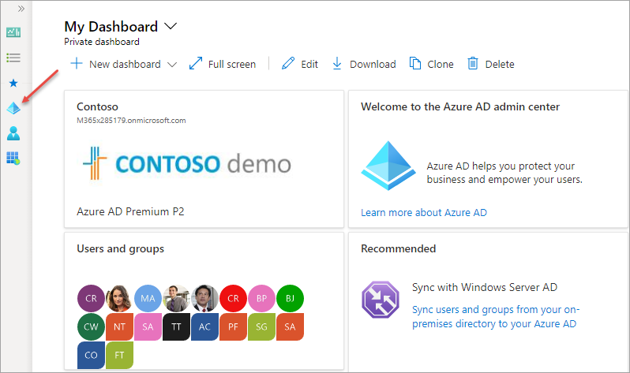
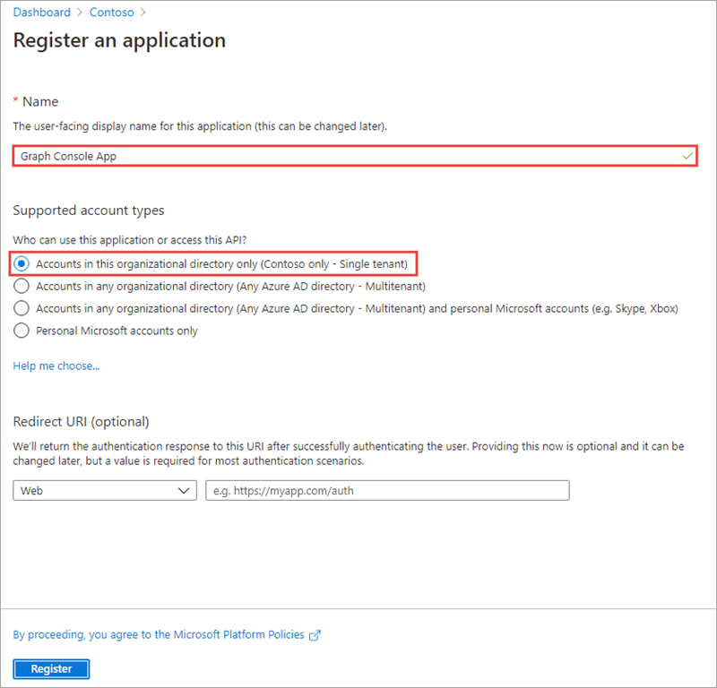
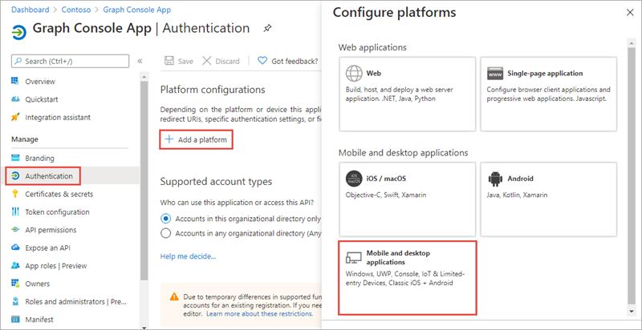
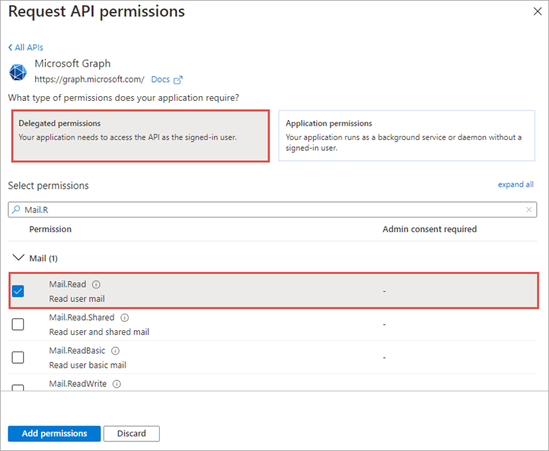
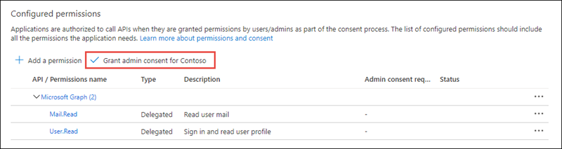
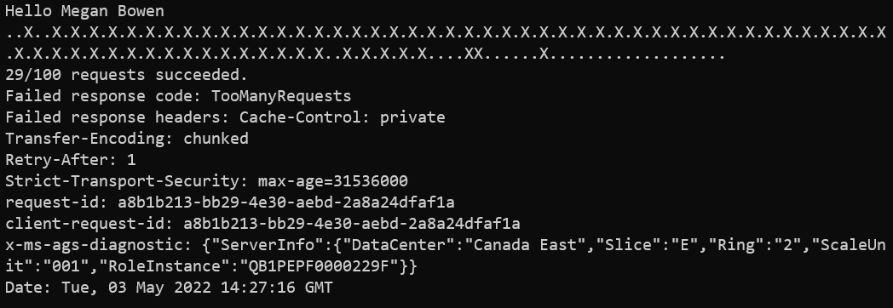

> [!VIDEO https://www.microsoft.com/videoplayer/embed/RE4OIAt]

In this exercise, you'll create a new Azure AD web application registration using the Azure Active Directory admin center, a .NET Core console application and query Microsoft Graph. You'll issue many requests in parallel to trigger your requests to be throttled. This application will allow you to see the response you'll receive.

## Prerequisites

Developing Microsoft Graph apps requires a Microsoft 365 tenant.

For the Microsoft 365 tenant, follow the instructions on the [Microsoft 365 Developer Program](https://developer.microsoft.com/microsoft-365/dev-program) site for obtaining a developer tenant if you don't currently have a Microsoft 365 account.

You'll use the .NET SDK to create custom Microsoft Graph app in this module. The exercises in this module assume you have the following tools installed on your developer workstation.

> [!IMPORTANT]
> In most cases, installing the latest version of the following tools is the best option. The versions listed here were used when this module was published and last tested.

- [.NET SDK](https://dotnet.microsoft.com/) - v5.\*
- [Visual Studio Code](https://code.visualstudio.com)

You must have the minimum versions of these prerequisites installed on your workstation.

## Create an Azure AD application

Open a browser and navigate to the [Azure Active Directory admin center (https://aad.portal.azure.com)](https://aad.portal.azure.com). Sign in using a **Work or School Account** that has global administrator rights to the tenancy.

Select **Azure Active Directory** in the left-hand navigation.

  

Select **Manage > App registrations** in the left-hand navigation.

On the **App registrations** page, select **New registration**.

  

On the **Register an application** page, set the values as follows:

- **Name**: Graph Console App
- **Supported account types**: Accounts in this organizational directory only (Contoso only - Single tenant)

    

    Select **Register**.

On the **Graph Console App** page, copy the value of the **Application (client) ID** and **Directory (tenant) ID**; you'll need these in the application.

  

Select **Manage > Authentication**.

In the **Platform configurations** section, select the **Add a platform** button. Then in the **Configure platforms** panel, select the **Mobile and desktop applications** button:



In the **Redirect URIs** section of the **Configure Desktop + devices** panel, select the checkbox that ends with **nativeclient**, set **Custom redirect URIs** to **http://localhost**, and then select the **Configure** button:


### Grant Azure AD application permissions to Microsoft Graph

After creating the application, you need to grant it the necessary permissions to Microsoft Graph

Select **API Permissions** in the left-hand navigation panel.


Select the **Add a permission** button.

In the **Request API permissions** panel that appears, select **Microsoft Graph** from the **Microsoft APIs** tab.


When prompted for the type of permission, select **Delegated permissions**.



Enter **Mail.R** in the **Select permissions** search box and select the **Mail.Read** permission, followed by the **Add permission** button at the bottom of the panel.

In the **Configured Permissions** panel, select the button **Grant admin consent for [tenant]**, and then select **Yes** in the confirmation dialog.



> [!NOTE]
> The option to **Grant admin consent** in the Azure AD admin center simplifies the exercise by pre-consenting the permissions to the users in the tenant.

## Create .NET Core console application

> [!VIDEO https://www.microsoft.com/videoplayer/embed/RE4OIAv]

Open your command prompt, navigate to a directory where you have rights to create your project, and run the following command to create a new .NET Core console application:

```console
dotnet new console -o graphconsoleapp
```

After creating the application, run the following commands to ensure your new project runs correctly.

```console
cd graphconsoleapp
dotnet add package Microsoft.Identity.Client
dotnet add package Microsoft.Graph
dotnet add package Microsoft.Extensions.Configuration
dotnet add package Microsoft.Extensions.Configuration.FileExtensions
dotnet add package Microsoft.Extensions.Configuration.Json
```

Open the application in Visual Studio Code using the following command:

```console
code .
```

If Visual Studio code displays a dialog box asking if you want to add required assets to the project, select **Yes**.

### Update the console app to enable nullable reference types

Nullable reference types refer to a group of features introduced in C# 8.0 that you can use to minimize the likelihood that your code causes the runtime to throw System.NullReferenceException.

Nullable reference types are enabled by default in .NET 6 projects, they're disabled by default in .NET 5 projects.

Ensuring that nullable reference types are enabled isn't related to the use of Microsoft Graph, it just ensures the exercises in this module can contain a single set of code that will compile without warnings when using either .NET 5 or .NET 6.

Open the **graphconsoleapp.csproj** file and ensure the `<PropertyGroup>` element contains the following child element:

```xml
<Nullable>enable</Nullable>
```

### Update the console app to support Azure AD authentication

Create a new file named **appsettings.json** in the root of the project and add the following code to it:

```json
{
  "tenantId": "YOUR_TENANT_ID_HERE",
  "applicationId": "YOUR_APP_ID_HERE"
}
```

Update properties with the following values:

- `YOUR_TENANT_ID_HERE`: Azure AD directory ID
- `YOUR_APP_ID_HERE`: Azure AD client ID

#### Create helper classes

Create a new folder **Helpers** in the project.

Create a new file **AuthHandler.cs** in the **Helpers** folder and add the following code:

```csharp
using Microsoft.Graph;

namespace Helpers
{
  public class AuthHandler : DelegatingHandler
  {
    private IAuthenticationProvider _authenticationProvider;

    public AuthHandler(IAuthenticationProvider authenticationProvider, HttpMessageHandler innerHandler)
    {
      InnerHandler = innerHandler;
      _authenticationProvider = authenticationProvider;
    }

    protected override async Task<HttpResponseMessage> SendAsync(HttpRequestMessage request, CancellationToken cancellationToken)
    {
      await _authenticationProvider.AuthenticateRequestAsync(request);
      return await base.SendAsync(request, cancellationToken);
    }
  }
}
```

Create a new file **MsalAuthenticationProvider.cs** in the **Helpers** folder and add the following code:

```csharp
using System.Net.Http.Headers;
using Microsoft.Identity.Client;
using Microsoft.Graph;

namespace Helpers
{
  public class MsalAuthenticationProvider : IAuthenticationProvider
  {
    private static MsalAuthenticationProvider? _singleton;
    private IPublicClientApplication _clientApplication;
    private string[] _scopes;
    private string? _userId;

    private MsalAuthenticationProvider(IPublicClientApplication clientApplication, string[] scopes)
    {
      _clientApplication = clientApplication;
      _scopes = scopes;
      _userId = null;
    }

    public static MsalAuthenticationProvider GetInstance(IPublicClientApplication clientApplication, string[] scopes)
    {
      if (_singleton == null)
      {
        _singleton = new MsalAuthenticationProvider(clientApplication, scopes);
      }

      return _singleton;
    }

    public async Task AuthenticateRequestAsync(HttpRequestMessage request)
    {
      var accessToken = await GetTokenAsync();

      request.Headers.Authorization = new AuthenticationHeaderValue("bearer", accessToken);
    }

    public async Task<string> GetTokenAsync()
    {
      if (!string.IsNullOrEmpty(_userId))
      {
        try
        {
          var account = await _clientApplication.GetAccountAsync(_userId);

          if (account != null)
          {
            var silentResult = await _clientApplication.AcquireTokenSilent(_scopes, account).ExecuteAsync();
            return silentResult.AccessToken;
          }
        }
        catch (MsalUiRequiredException) { }
      }

      var result = await _clientApplication.AcquireTokenInteractive(_scopes).ExecuteAsync();
      _userId = result.Account.HomeAccountId.Identifier;
      return result.AccessToken;
    }
  }
}
```

### Incorporate Microsoft Graph into the console app

Open the **Program.cs** file and replace the entire contents with the following code:

```csharp
using System;
using System.Collections.Generic;
using System.Net;
using System.Net.Http;
using System.Net.Http.Headers;
using System.Security;
using System.Threading.Tasks;
using Microsoft.Identity.Client;
using Microsoft.Graph;
using Microsoft.Extensions.Configuration;
using System.Text.Json;
using Helpers;

namespace graphconsoleapp
{
    public class Program
    {
        public static void Main(string[] args)
        {
            Console.WriteLine("Hello World!");
        }
    }
}
```

Add the following method `LoadAppSettings` to the `Program` class. The method retrieves the configuration details from the **appsettings.json** file previously created:

```csharp
private static IConfigurationRoot? LoadAppSettings()
{
  try
  {
    var config = new ConfigurationBuilder()
                      .SetBasePath(System.IO.Directory.GetCurrentDirectory())
                      .AddJsonFile("appsettings.json", false, true)
                      .Build();

    if (string.IsNullOrEmpty(config["applicationId"]) ||
        string.IsNullOrEmpty(config["tenantId"]))
    {
      return null;
    }

    return config;
  }
  catch (System.IO.FileNotFoundException)
  {
    return null;
  }
}
```

Add the following method `CreateAuthorizationProvider` to the `Program` class. The method will create an instance of the clients used to call Microsoft Graph.

```csharp
private static IAuthenticationProvider CreateAuthorizationProvider(IConfigurationRoot config)
{
  var clientId = config["applicationId"];
  var authority = $"https://login.microsoftonline.com/{config["tenantId"]}/v2.0";

  List<string> scopes = new List<string>();
  scopes.Add("https://graph.microsoft.com/.default");

  var cca = PublicClientApplicationBuilder.Create(clientId)
                                          .WithAuthority(authority)
                                          .WithDefaultRedirectUri()
                                          .Build();
  return MsalAuthenticationProvider.GetInstance(cca, scopes.ToArray());
}
```

Add the following method `GetAuthenticatedHTTPClient` to the `Program` class. The method creates an instance of the `HttpClient` object.

```csharp
private static HttpClient GetAuthenticatedHTTPClient(IConfigurationRoot config)
{
  var authenticationProvider = CreateAuthorizationProvider(config);
  var httpClient = new HttpClient(new AuthHandler(authenticationProvider, new HttpClientHandler()));
  return httpClient;
}
```

Locate the `Main` method in the `Program` class. Replace the contents of the `Main` method with the following code that loads the configuration settings from the **appsettings.json** file:

```csharp
var config = LoadAppSettings();
if (config == null)
{
  Console.WriteLine("Invalid appsettings.json file.");
  return;
}
```

Add the following code to the end of the `Main` method, just after the code added in the last step. This code will obtain an authenticated instance of the `HttpClient`:

```csharp
var client = GetAuthenticatedHTTPClient(config);
```

Add the following code to the end of the `Main` method, just after the code added in the last step. This code will submit a request for the current user's profile so it can display a welcome message to the user:

```csharp
var profileResponse = client.GetAsync("https://graph.microsoft.com/v1.0/me").Result;
var profileJson = profileResponse.Content.ReadAsStringAsync().Result;
var profileObject = JsonDocument.Parse(profileJson);
var displayName = profileObject.RootElement.GetProperty("displayName").GetString();
Console.WriteLine("Hello " + displayName);
```

Add the following code to issue many requests to Microsoft Graph. This code will create a collection of tasks to request a specific Microsoft Graph endpoint. When a task succeeds, it will write a dot to the console while failed request will write an `X` to the console. The most recent failed request's status code and headers are saved.

All tasks are then executed in parallel. At the conclusion of all requests, the results are written to the console:

```csharp
var totalRequests = 100;
var successRequests = 0;
var tasks = new List<Task>();
var failResponseCode = HttpStatusCode.OK;
HttpResponseHeaders failedHeaders = null!;

for (int i = 0; i < totalRequests; i++)
{
  tasks.Add(Task.Run(() =>
  {
    var response = client.GetAsync("https://graph.microsoft.com/v1.0/me/messages").Result;
    Console.Write(".");
    if (response.StatusCode == HttpStatusCode.OK)
    {
      successRequests++;
    }
    else
    {
      Console.Write('X');
      failResponseCode = response.StatusCode;
      failedHeaders = response.Headers;
    }
  }));
}

var allWork = Task.WhenAll(tasks);
try
{
  allWork.Wait();
}
catch { }
Console.WriteLine();
Console.WriteLine("{0}/{1} requests succeeded.", successRequests, totalRequests);
if (successRequests != totalRequests)
{
  Console.WriteLine("Failed response code: {0}", failResponseCode.ToString());
  Console.WriteLine("Failed response headers: {0}", failedHeaders);
}
```

### Build and test the application

Run the following command to ensure the developer certificate has been trusted:

```console
dotnet dev-certs https --trust
```

Run the following command in a command prompt to compile the console application:

```console
dotnet build
```

Run the following command to run the console application:

```console
dotnet run
```

You now need to authenticate with Azure Active Directory. A new tab in your default browser should open to a page asking you to sign-in. After you've logged in successfully, you'll be redirected to a page displaying the message, **"Authentication complete. You can return to the application. Feel free to close this browser tab"**. You may now close the browser tab and switch back to the console application.

The console app may take a one or two minutes to complete the process issuing the requests to Microsoft Graph. When this process is complete, you'll see the results written to the console:



There's a mix of success and failure indicators in the console. The summary indicates the number of requests that were successful.

After the results, the console has two lines that begin with **Failed response**. Notice the code states **TooManyRequests** that is the representation of the HTTP status code 429. This status code is the indication that your requests are being throttled.

Also notice within the collection of response headers, the presence of **Retry-After**. This header is the value in seconds that Microsoft Graph tells you to wait before sending your next request to avoid being further throttled.

## Summary

In this exercise, you created an Azure AD application and .NET console application that retrieved user data from Microsoft Graph. This query was submitted multiple times to demonstrate Microsoft Graph throttling the requests.
