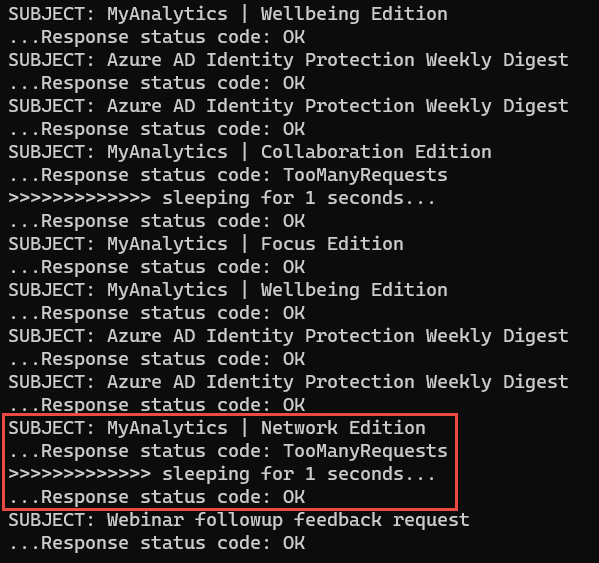
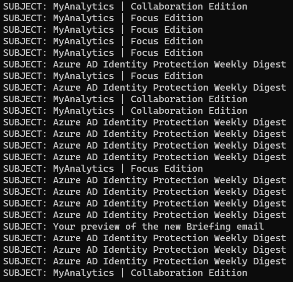

> [!VIDEO https://www.microsoft.com/videoplayer/embed/RE4OIAB]

In this exercise, you'll use the Azure AD application and .NET console application you previously created and modify them to demonstrate two strategies to account for throttling in your application.

The first strategy you'll employ involves working with the `HttpClient` object to call the base Microsoft Graph REST API. This approach will enable you to see the underlying protocol responses and how to handle them.

The second strategy you'll employ uses Microsoft Graph .NET SDK that takes into account throttling responses returned by the service and automatically retries the request. This approach simplifies your application code as you don't have to incorporate the retry logic that is included in the SDK.

> [!IMPORTANT]
> This exercise assumes you have created the Azure AD application and .NET console application from the previous unit in this module. You'll edit the existing Azure AD application and .NET console application created in that exercise in this exercise.

## Implement Microsoft Graph REST API throttling retry strategy

In a previous exercise, you created a .NET console application that triggered a throttling response from Microsoft Graph by submitting many requests to the same mailbox at the same time. Let's modify the application to implement a strategy to determine if a request is throttled. In the case the request is throttled, the application should wait for the time specified by Microsoft Graph before retrying the request.

### Add helper class to deserialize the message object returned in a REST request

It's easier to work with strongly typed objects instead of untyped JSON responses from a REST request. Create a helper class to simplify working with the messages objects returned from the REST request.

Create a new file, **Messages.cs** in the root of the project, and add the following code to it:

```csharp
using System.Text.Json.Serialization;

namespace graphconsoleapp
{
  public class Messages {
    [JsonPropertyName("@odata.context")]
    public string ODataContext {get; set;}
    [JsonPropertyName("@odata.nextLink")]
    public string ODataNextLink {get; set;}

    [JsonPropertyName("value")]
    public Message[] Items {get; set;}
  }

  public class Message {
    [JsonPropertyName("@odata.etag")]
    public string ETag {get; set;}

    [JsonPropertyName("id")]
    public string Id {get; set;}

    [JsonPropertyName("subject")]
    public string Subject {get; set;}
  }
}
```

This class is used by the JSON deserializer to translate a JSON response into a `Messages` object.

### Add method to implement delayed retry strategy when requests are throttled

The application is going to be modified to first get a list of messages in the current user's mailbox, then issue a separate request for the details of each message. In most scenarios, a separate request will trigger Microsoft Graph to throttle the requests.

To address this, your code should inspect each response for situations when the request has been throttled. In those situations, the code should check for the presence of a `Retry-After` header in the response that specifies the number of seconds your application should wait before issuing another request. If a `Retry-After` header isn't present, you should have a default value to fall back on.

Within the **Program.cs** file, add a new method `GetMessageDetail()` and the following code to it:

```csharp
private static Message GetMessageDetail(HttpClient client, string messageId, int defaultDelay = 2)
{
  Message messageDetail = null;

  string endpoint = "https://graph.microsoft.com/v1.0/me/messages/" + messageId;

  // add code here

  return messageDetail;
}
```

Add the following code before the `// add code here` comment to create a request and wait for the response from Microsoft Graph:

```csharp
// submit request to Microsoft Graph & wait to process response
var clientResponse = client.GetAsync(endpoint).Result;
var httpResponseTask = clientResponse.Content.ReadAsStringAsync();
httpResponseTask.Wait();
```

If there's a successful response, return the deserialized response back to the caller to display the messages.

Add the following lines to the top of the **Program.cs** file to update the `using` statements:

```csharp
using System.Text.Json;
```

Add the following code before the `// add code here` comment:

```csharp
Console.WriteLine("...Response status code: {0}  ", clientResponse.StatusCode);

// IF request successful (not throttled), set message to retrieved message
if (clientResponse.StatusCode == HttpStatusCode.OK)
{
  messageDetail = JsonSerializer.Deserialize<Message>(httpResponseTask.Result);
}
```

If there's a throttled response, add the following `else` statement to the `if` statement you just added:

```csharp
// ELSE IF request was throttled (429, aka: TooManyRequests)...
else if (clientResponse.StatusCode == HttpStatusCode.TooManyRequests)
{
  // get retry-after if provided; if not provided default to 2s
  int retryAfterDelay = defaultDelay;
  if (clientResponse.Headers.RetryAfter.Delta.HasValue && (clientResponse.Headers.RetryAfter.Delta.Value.Seconds > 0))
  {
    retryAfterDelay = clientResponse.Headers.RetryAfter.Delta.Value.Seconds;
  }

  // wait for specified time as instructed by Microsoft Graph's Retry-After header,
  //    or fall back to default
  Console.WriteLine(">>>>>>>>>>>>> sleeping for {0} seconds...", retryAfterDelay);
  System.Threading.Thread.Sleep(retryAfterDelay * 1000);

  // call method again after waiting
  messageDetail = GetMessageDetail(client, messageId);
}
```

This code will do the following:

1. set a default delay of two seconds before the next request is made
1. if the `Retry-After` header value is present and greater than zero seconds, use that value to overwrite the default delay
1. set the thread to sleep for the specified, or default, number of seconds
1. recursively call the same method to retry the request

> [!TIP]
> In cases where the response does not include a `Retry-After` header, it is recommended to consider implementing an exponential back-off default delay. In this code, the application will initially pause for two seconds before retrying the request. Future requests will double the delay if Microsoft Graph continues to throttle the request.
>
> Real-world applications should have an upper limit on how long they will delay so to avoid a situation where users are left with an unresponsive experience.

The resulting method should look like the following:

```csharp
private static Message GetMessageDetail(HttpClient client, string messageId, int defaultDelay = 2)
{
  Message messageDetail = null;

  string endpoint = "https://graph.microsoft.com/v1.0/me/messages/" + messageId;

  // submit request to Microsoft Graph & wait to process response
  var clientResponse = client.GetAsync(endpoint).Result;
  var httpResponseTask = clientResponse.Content.ReadAsStringAsync();
  httpResponseTask.Wait();

  Console.WriteLine("...Response status code: {0}  ", clientResponse.StatusCode);

  // IF request successful (not throttled), set message to retrieved message
  if (clientResponse.StatusCode == HttpStatusCode.OK)
  {
    messageDetail = JsonSerializer.Deserialize<Message>(httpResponseTask.Result);
  }
  // ELSE IF request was throttled (429, aka: TooManyRequests)...
  else if (clientResponse.StatusCode == HttpStatusCode.TooManyRequests)
  {
    // get retry-after if provided; if not provided default to 2s
    int retryAfterDelay = defaultDelay;
    if (clientResponse.Headers.RetryAfter.Delta.HasValue
        && (clientResponse.Headers.RetryAfter.Delta.Value.Seconds > 0)
       )
    {
      retryAfterDelay = clientResponse.Headers.RetryAfter.Delta.Value.Seconds;
    }

    // wait for specified time as instructed by Microsoft Graph's Retry-After header,
    //    or fall back to default
    Console.WriteLine(">>>>>>>>>>>>> sleeping for {0} seconds...", retryAfterDelay);
    System.Threading.Thread.Sleep(retryAfterDelay * 1000);

    // call method again after waiting
    messageDetail = GetMessageDetail(client, messageId);
  }

  return messageDetail;
}
```

### Update application to use retry strategy

The next step is to update the `Main` method to use the new method so the application will use an intelligent throttling strategy.

Locate the following line that obtains an instance of an authenticated **HttpClient** object in the `Main` method. Delete all code in the `Main` method after this line:

```csharp
var client = GetAuthenticatedHTTPClient(config, userName, userPassword);
```

Add the following code after obtaining the **HttpClient** object. This code will request the top 100 messages from the current user's mailbox and deserialize the response into a typed object you previously created:

```csharp
var stopwatch = new System.Diagnostics.Stopwatch();
stopwatch.Start();

var clientResponse = client.GetAsync("https://graph.microsoft.com/v1.0/me/messages?$select=id&$top=100").Result;
// enumerate through the list of messages
var httpResponseTask = clientResponse.Content.ReadAsStringAsync();
httpResponseTask.Wait();
var graphMessages = JsonSerializer.Deserialize<Messages>(httpResponseTask.Result);
```

Add the following code to create individual requests for each message. These tasks are created as asynchronous tasks that will be executed in parallel:

```csharp
var tasks = new List<Task>();
foreach(var graphMessage in graphMessages.Items)
{
  tasks.Add(Task.Run(() => {

    Console.WriteLine("...retrieving message: {0}", graphMessage.Id);

    var messageDetail = GetMessageDetail(client, graphMessage.Id);

    Console.WriteLine("SUBJECT: {0}", messageDetail.Subject);

  }));
}
```

Next, add the following code to execute all tasks in parallel and wait for them to complete. 

```csharp
// do all work in parallel & wait for it to complete
var allWork = Task.WhenAll(tasks);
try
{
  allWork.Wait();
}
 catch {}
```

With all work, complete write the results to the console:

```csharp
stopwatch.Stop();
Console.WriteLine();
Console.WriteLine("Elapsed time: {0} seconds", stopwatch.Elapsed.Seconds);
```

### Build and test the application

Run the following command in a command prompt to compile the console application:

```console
dotnet build
```

Run the following command to run the console application:

```console
dotnet run
```

After entering the username and password for the current user, the application will write multiple log entries to the console like the following figure:


Within one or two minutes, the application will display the results of the application. Depending on the speed of your workstation and internet connection, your requests may or may not have triggered Microsoft Graph to throttle you. If not, try running the application a few more times.

If your application ran fast enough, you should see some instances where Microsoft Graph returned the HTTP status code 429, indicated by the **TooManyRequests** entries:



In this case, the **messages** endpoint returned a `Retry-After` value of one (1) because the application displays messages on the console that it slept for one second.

The important point is that the application completed successfully, retrieving all 100 messages, even when some requests were rejected because of being throttled by Microsoft Graph.

## Implement Microsoft Graph SDK for throttling retry strategy

> [!VIDEO https://www.microsoft.com/videoplayer/embed/RE4OIAD]

In the last section, you modified the application to implement a strategy to determine if a request is throttled. In the case the request was throttled, as indicated by the response to the REST endpoint request, you implemented a retry strategy using the `HttpClient`.

Let's change the application to use the Microsoft Graph SDK client, which has all the logic built in for implementing the retry strategy when a request is throttled.

### Update the `GetAuthenticatedHTTPClient` method

The application will use the Microsoft Graph SDK to submit requests, not the **HttpClient**, so you need to update it.

Locate the method `GetAuthenticatedHTTPClient` and make the following changes to it:

- set the return type from `HttpClient` to `GraphServiceClient`
- rename the method from `GetAuthenticatedHTTPClient` to `GetAuthenticatedGraphClient`
- replace the last two lines in the method with the following lines to obtain and return an instance of the `GraphServiceClient`:

    ```csharp
    var graphClient = new GraphServiceClient(authenticationProvider);
    return graphClient;
    ```

### Update the application to use the `GraphServiceClient`

The next step is to update the application to use the Graph SDK that includes an intelligent throttling strategy.

Locate the **Messages.cs** file in the project. Delete this file or comment all code within the file out. The application will get **Message** object this file contains will get confused with the **Message** object in the Microsoft Graph SDK.

Next, within the `Main` method, locate the following line:

```csharp
var client = GetAuthenticatedHTTPClient(config, userName, userPassword);
```

Update the method called in that line to use the method you updated, `GetAuthenticatedGraphClient`:

```csharp
var client = GetAuthenticatedGraphClient(config, userName, userPassword);
```

The next few lines used the **HttpClient** to call the Microsoft Graph REST endpoint to get a list of all messages. Find these lines, as shown below, and remove them:

```csharp
var clientResponse = client.GetAsync("https://graph.microsoft.com/v1.0/me/messages?$select=id&$top=100").Result;
// enumerate through the list of messages
var httpResponseTask = clientResponse.Content.ReadAsStringAsync();
httpResponseTask.Wait();
var graphMessages = JsonConvert.DeserializeObject<Messages>(httpResponseTask.Result);
```

Replace those lines with the following code to request the same information using the microsoft Graph SDK:

```csharp
var clientResponse = client.Me.Messages
                              .Request()
                              .Select(m => new { m.Id })
                              .Top(100)
                              .GetAsync()
                              .Result;
```

The collection returned by SDK is in a different format than what the REST API returned. Locate the `foreach` loop that enumerates through all returned messages to request each message's details. Change the collection to the following code:

```csharp
foreach (var graphMessage in clientResponse.CurrentPage)
```

### Update the `GetMessageDetail` method

The last step is to modify the `GetMessageDetail` method that retrieved the message details for each message. Recall from previous section in this unit, you had to write the code to detect when requests were throttled. In the case they were throttled, you added code to retry the request after a specified delay. Fortunately, the Microsoft Graph SDK has this logic included in it.

Locate the `GetMessageDetail()` method.

Update the signature of the method so the first parameter expects an instance of the `GraphServiceClient`, not the `HttpClient`, and remove the last parameter of a default delay. The method signature should now look like the following:

```csharp
private static Message GetMessageDetail(GraphServiceClient client, string messageId)
```

Next, remove all code within this method and replace it with this single line:

```csharp
// submit request to Microsoft Graph & wait to process response
return client.Me.Messages[messageId].Request().GetAsync().Result;
```

### Build and test the application

Run the following command in a command prompt to compile the console application:

```console
dotnet build
```

Run the following command to run the console application:

```console
dotnet run
```

After entering the username and password for the current user, the application will write multiple log entries to the console like the following:



The application will do the same thing as the **HttpClient** version of the application. However, one difference is that the application won't display the status code returned in the response to the requests or any of the *sleeping* log messages because the Microsoft Graph SDK handles all the retry logic internally.

### Summary

In this exercise, you modified the Azure AD application and .NET console application you previously created to demonstrate two strategies to account for throttling in your application. One strategy used the **HttpClient** object but required you to implement the detect, delay, and retry logic yourself when requests were throttled. The other strategy used the Microsoft Graph SDK's included support for handling this same scenario.
