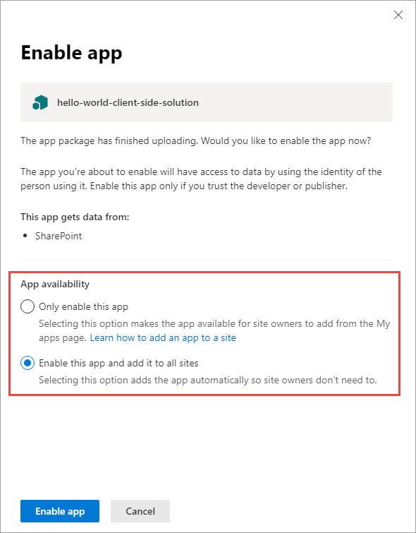
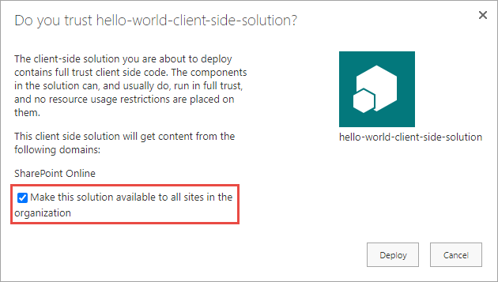

In this unit, you'll learn how to package and deploy SharePoint Framework solutions to production.

## SharePoint Framework deployment artifacts

Let's start by looking at the SharePoint Framework deployment artifacts to understand the different things required for SharePoint Framework solutions to work in production.

There are two different kinds of files:

- **Installation and registration**: The installation and registration files are included in SharePoint packages deployed to the SharePoint App Catalogs. These files make SharePoint aware of the components included in the packages.

    These files include an app manifest file, feature framework files, and other files that SharePoint needs to provision the components. It doesn't include files that make the application run.

- **Component runtime files and dependencies**: These are the files that are needed to run the SharePoint Framework component once it's been deployed and installed in a SharePoint environment. Any dependencies your component uses, such as third-party web framework libraries, can optionally be included in the component's bundle or loaded at runtime from an external CDN. The component's manifest file defines all dependencies the component requires to be present on the page prior to it loading and running.

    These files include JavaScript bundles of your components, images, CSS files, and JavaScript libraries or assets your component depends on.

## Build, bundle, and package SharePoint Framework solutions

SharePoint Framework projects are deployed to production using *packages*. A package filename ends with the **sppkg** extension. There are three steps to creating the package.

### Build

The build phase transpiles all TypeScript to JavaScript, generates TypeScript type declarations from your TypeScript files, and transpiles SCSS files to CSS. All these files are placed in the **./lib** folder in your project.

The build process is started when you run the gulp task **build** from the command line:

```console
gulp build
```

### Bundle

The next phase is bundling. The bundling phase generates a JavaScript bundle and the manifest for the SharePoint Framework component.

Bundling takes all the JavaScript and CSS files referenced in your project and combines them into a single JavaScript bundle. A configuration file enables developers to specify if multiple bundles are generated with specific components in them, or if all components in the project are grouped into a single bundle.

The popular open-source tool Webpack is used to create the JavaScript bundle file. Normally developers need to create a configuration file and pass it into webpack when bundling, but the SharePoint Framework does this for you. When the bundling task is executed, the SharePoint Framework build toolchain dynamically creates the webpack configuration using configuration files in the project.

The files generated in the bundling phase are saved to the **./dist** folder in the project.

The bundling process is started when you run the gulp task **bundle** from the command line. When you add the optional `--ship` or `-p` to the command, the bundling process will also minify the resulting bundle and manifest file. Minification removes all code comments and white space in the file to create the smallest possible file that's downloaded when the component is loaded on the page. The minified files are saved to the **./release/assets** folder.

```console
gulp bundle
```

### Package solution

The last phase is packaging. The packaging phase generates all the files necessary to deploy your SharePoint Framework solution to SharePoint. These files are combined into a ZIP archive with a **sppkg** extension that's saved to the **./sharepoint/solution** folder in your project. This file is referred to as the *SharePoint package*.

Before packaging all the files into the SharePoint package, the package solution phase generates multiple files necessary for deployment. This includes creating the app manifest, any feature definitions and element manifests necessary for provisioning the components, and collecting all the runtime files such as the bundle, component manifest and string localization files.

Depending on the project configuration, the component runtime files including the bundle, component manifest, localization files, are placed in the **./release/assets** folder or added to the package. You can configure this setting using **./config/package-solution.json** file using the `includeClientSideAssets` property. When set to `true`, the files are added to the package and are automatically provisioned to the SharePoint library **ClientSideAssets** in the root of the site collection where the app is installed. Otherwise, when the property is set to `false`, you're responsible for deploying the files to a location your users can access, such as an Azure CDN.

The packaging process is started when you run the gulp task **package-solution** from the command line. When you add the optional `--ship` or `-p` to the command, the packaging process will also modify manifest files for production, setting the URL where the component's runtime files can be located. This location is defined in the **./config/write-manifests.json** file.

```console
gulp package-solution
```

## Different build and packaging modes: debug and production

In the previous section, you learned that two of the gulp tasks used in creating a SharePoint package support an optional `--ship` switch. This switch indicates you're bundling and packaging for production. When the switch isn't present, it indicates you're bundling and packaging for development or debugging.

The gulp **build** task doesn't have any switches, but both the **bundle** and **package-solution** tasks support the optional `--ship` switch. When running **bundle** and **package-solution**, make sure both either use or don't use the `--ship` switch. In other worse, don't use it on one and not the other.

### Debug mode

When bundling and packaging the solution in debug mode, all generated files are left unminified. This means the code comments and white space is left in the generated bundle and component manifest files.

The bundling process also generates JavaScript source map files that can be used when debugging the component at runtime. Source map files map the generated JavaScript to the source TypeScript code so when a breakpoint is hit in JavaScript, you can easily debug the TypeScript and not have to figure out what TypeScript code mapped to the generated JavaScript code.

The debug mode assumes that all files are served from the local web server. Even if you deploy and install the SharePoint package in a SharePoint environment, SharePoint will look for the component's bundle and manifest file on the local web server.

## Production mode

When bundling and packaging the solution in production mode, all generated files are minified. This means the code comments and white space is removed in the generated bundle and component manifest files to create the smallest files that will be downloaded at runtime in the browser.

Unlike the debug mode, the production mode doesn't generate source map files.

> [!TIP]
> Developers can configure the webpack configuration using the SharePoint Framework build toolchain API to generate source map files when bundling in production mode.

The production mode assumes that all files are served from their production locations. This is defined in the **./config/write-manifests.json** configuration file.

## Deploy SharePoint assets

After creating the SharePoint package, the next step is to deploy it to a SharePoint environment. There are two ways to deploy SharePoint packages. Both options are SharePoint App Catalogs.

SharePoint Online supports two types of App Catalogs: tenant-scoped and site collection-scoped.

The other part of package deployment addresses the runtime files required for your component to function. This includes your component's JavaScript bundle and manifest files and any external dependencies. These files must be deployed to a hosting location that all the users on a site can access.

### Deploying component runtime files

The decision on where to host these runtime files falls into two categories. The first category is manual options. With this option, you manually copy or upload files to the target location. Some examples of the manual deployment option include the Office 365 CDN, an Azure CDN, or any location that is on a public or internal URL. The only requirement is that the files must be accessible to the users of your site.

The other option to deploy the runtime files is more automatic. In late 2017, Microsoft introduced a setting `includeClientAssets` to the **./config/package-solution.json** file. When this property is set to true, the runtime files are included in the SharePoint package.

When you install an app from the SharePoint package in a site collection, SharePoint will copy the runtime files to a hidden library, **ClientSideAssets**, in the root of the site collection. Your component's manifest file contains a special URL that is replaced at runtime by the SharePoint Framework to point to the site collection's **ClientSideAssets** library.

If you've enabled the Office 365 CDN, this library is included in the list of libraries that are backed by the CDN.

### Tenant (or site collection) wide deployment

You can configure your SharePoint Framework components to be immediately available across the tenant when the solution package is installed to the tenant app catalog, or to be immediately available across the site collection when the solution package is installed to a site collection app catalog. This can be configured by using the `skipFeatureDeployment` property of the `solution` object in the **./config/package-solution.json** file.

When the value of `skipFeatureDeployment` is set to **true**, the administrator deploying the package to the app catalog is given the option to enable the app and add it to all sites. This applies to existing sites and sites created in the future.

When the value of `skipFeatureDeployment` is set to **false**, the administrator deploying the package to the app catalog doesn't have the option described above. The app contained in the package must be manually added to each site where the components will be used.





## Review - deployment and installation steps

Let's review the deployment and installation steps for a SharePoint Framework solution.

### Build the project

The first step is to build your project with the **gulp build** command. This will create all the files that are used in the deployment of your solution.

### Generate the bundle and manifest

Next, create the component bundle and manifest files for production using the **gulp bundle --ship** command. This step takes the files from the build step and creates the files that will be deployed to SharePoint.

### Generate the SharePoint package

The final step in the packaging process is to create the SharePoint package with the **gulp package-solution --ship** command. This step takes the results from the bundle phase, generates the necessary deployment files including an app manifest and associated feature files, and packages them into a single ZIP archive with a **sppkg** extension.

### Upload the package to the App Catalog

Now that you've created the package, the next step is to upload the package to one of the SharePoint app catalogs. Part of this process is to also enable the package, indicating to SharePoint the app within the SharePoint package are safe to run in your environment.

This step makes the components available for installation and use within your SharePoint environment.

### Install the app from the site collection's Site Contents page

If the administrator didn't enable tenant wide deployment for the package, then the last step is to install the app from the package into a site collection. This is done from the **New > App** menu in the **Site Contents** library in a site collection.

## Summary

In this unit, you learned how to package and deploy SharePoint Framework solutions to production.
