In this exercise, you'll create a SharePoint Framework (SPFx) client-side web part that will be used to try different deployment configurations.

> [!IMPORTANT]
> The instructions below assume you are using v1.13.0 of the SharePoint Framework Yeoman generator.

Open a command prompt and change to the folder where you want to create the project. Run the SharePoint Yeoman generator by executing the following command:

```console
yo @microsoft/sharepoint
```

Use the following to complete the prompt that is displayed (*if additional options are presented, accept the default answer)*:

- **What is your solution name?**: DeploymentDemo
- **Only SharePoint Online (latest) is supported. For earlier versions of SharePoint (2016 and 2019) please use the 1.4.1 version of the generator.**: SharePoint Online only (latest)
- **Where do you want to place the files?**: Use the current folder
- **Do you want to allow the tenant admin the choice of being able to deploy the solution to all sites immediately without running any feature deployment or adding apps in sites?**: No
- **Will the components in the solution require permissions to access web APIs that are unique and not shared with other components in the tenant?**: No
- **Which type of client-side component to create?**: WebPart
- **What is your Web part name?**: Deployment Demo
- **What is your Web part description?**: Deployment Demo description
- **Which framework would you like to use?**: No JavaScript framework

After provisioning the folders required for the project, the generator will install all the dependency packages by running `npm install` automatically.

## Create a deployment package for the project

When NPM completes downloading all dependencies, build the project by running the following command on the command line from the root of the project:

```console
gulp build
```

Next, create a production bundle of the project by running the following command on the command line from the root of the project:

```console
gulp bundle --ship
```

Finally, create a deployment package of the project by running the following command on the command line from the root of the project:

```console
gulp package-solution --ship
```

## Deploy the package to a SharePoint site

In a browser, navigate to your SharePoint tenant's App Catalog site.

Select the **Apps for SharePoint** link in the left-hand navigation.

Drag the package created in the previous steps, located in the project's **./sharepoint/solution/deployment-demo.sppkg**, into the **Apps for SharePoint** library.

SharePoint will launch a dialog asking if you want to trust the package:


Select **Deploy**.

## Install the SharePoint package in a site collection

Navigate to an existing site collection, or create a new one.

Select **Site Contents** from the left-hand navigation.

From the **New** menu, select **App**.


In the filters, select **From my organization**.

Select the **Add** button in the **deployment-demo-client-side-solution** tile to add your web part.

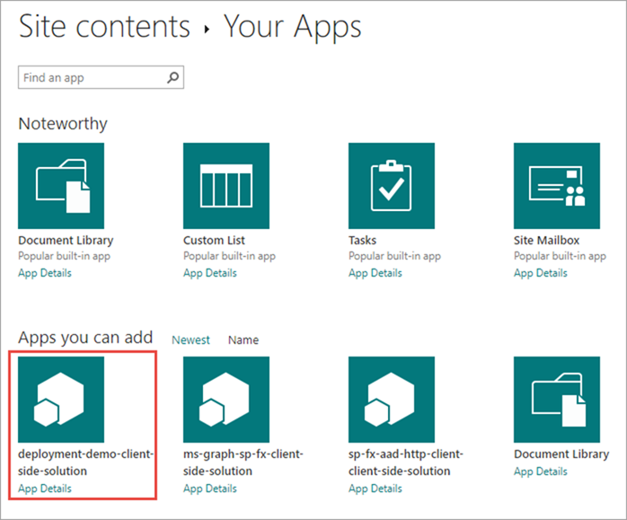

## Add the web part to a page

Navigate to a SharePoint page.

Put it in edit mode by selecting the **Edit** button in the top-right portion of the content area on the page.

Select the web part icon button to open the list of available web parts:

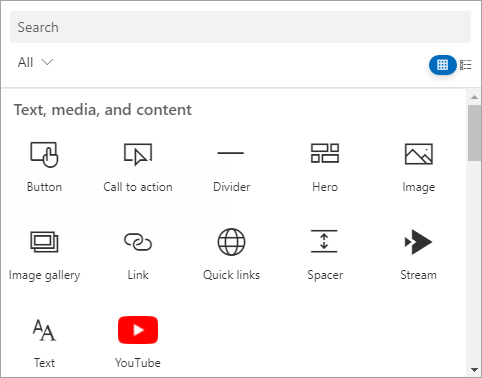

Select the expand icon, a diagonal line with two arrows in the top-right corner, to expand the web part toolbox.

Scroll to the bottom, locate, and select the **Deployment Demo** web part.

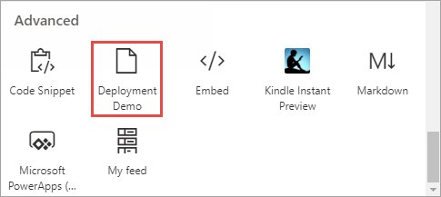

## Examine the deployed web part files

Once the page loads, open the browser's developer tools and navigate to the **Sources** tab.

Refresh the page and examine where the JavaScript bundle is being hosted.

If you haven't enabled the Office 365 CDN, then the bundle will be hosted from a document library named **ClientSideAssets** in the App Catalog site.

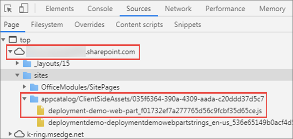

If you've enabled the Office 365 CDN, then the bundle will be automatically hosted from the CDN.

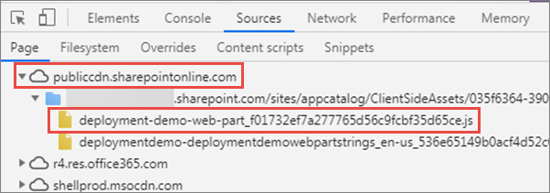

## Remove the deployed web part

### Remove the web part from the page

Select the trash can icon in the toolbar to the left of the web part:


### Remove the SharePoint app

Navigate back to the site's **Site Contents** page.

Select the context menu for the installed package and select the **Remove** action:

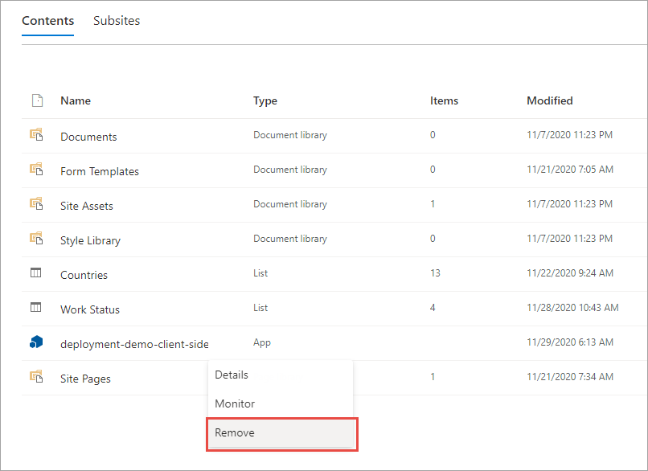

In the **Action isn't supported in this view** dialog, select the **Return to classic SharePoint** button:

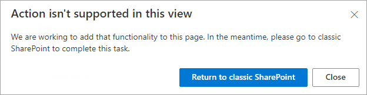

Select the context menu for the installed package and select the **Remove** action:

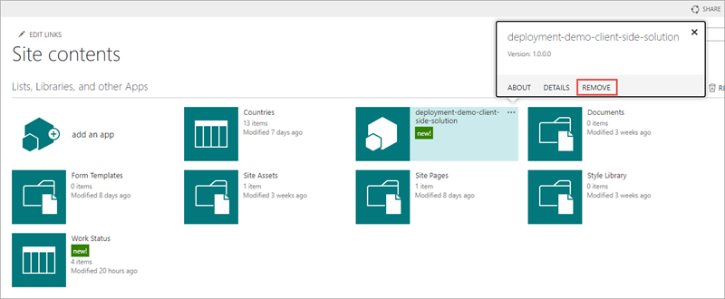

In the left-hand navigation menu, select the **Exit classic experience** link.

### Delete the SharePoint app from the recycle bin

Navigate back to the site's **Site Contents** page.

Select **Recycle bin** in the command bar.


Select **deployment-demo-client-side-solution** and select **Delete** in the command bar. Select **Delete** in the pop-up dialog to confirm you wish to delete the file.

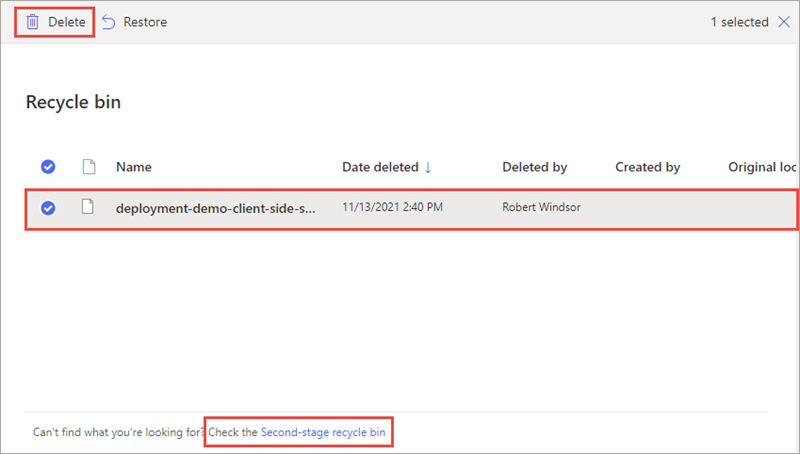

Select **Second-stage recycle bin** at the bottom of the page to navigate to the second-stage recycle bin. 

Select **deployment-demo-client-side-solution** and select **Delete** in the command bar. Select **Delete** in the pop-up dialog to confirm you wish to delete the file.

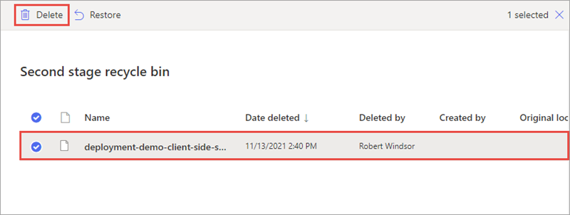

### Retract the SharePoint package

Navigate back to the tenant's **App Catalog** site.

Select the **Apps for SharePoint** option from the left-hand navigation.

Select the menu for the deployed package, open the extra actions, and then select **Delete** as shown in the following figure:

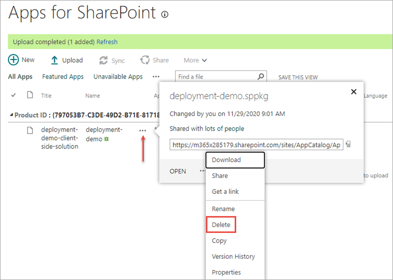

Delete the SharePoint package from both the first and second-stage recycle bins.

## Summary

In this exercise, you created a SharePoint Framework (SPFx) client-side web part that is used to try different deployment configurations.
