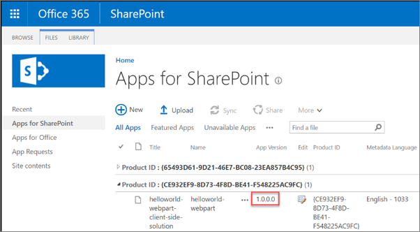

In this unit, you'll learn how versioning works in SharePoint Framework solutions and how to upgrade existing components.

## Understand version numbers in SharePoint Framework projects

SharePoint Framework projects have two different things that you can version.

In a SharePoint Framework project, you can assign a version to the component itself, such as a web part or an extension. You can also version the entire SharePoint Framework package.

When updating a component or package, it isn't required to increment the version numbers. Versioning is mostly used for documentation purposes but there are some scenarios that require you to increment the versions of packages and components.

When you change the code for a SharePoint Framework component, you'll need to rebuild, bundle, package, and redeploy the solution to SharePoint. When the package is redeployed, all existing code files are automatically overwritten with the new files regardless if the version number changed or not.

The only time a version number can impact updating a SharePoint package or component is when you increment the package version. When SharePoint detects a new version number for an updated package, it will trigger SharePoint's app upgrade process. Nothing happens automatically, but the app can now be upgraded.

## Update SharePoint Framework components and incrementing versions

The version number of components is set in the component's manifest file. The `version` property is set to a string as shown in the following figure:


If this value is set to `*`, the `version` property from the project's **package.json** file is used.

By setting the version number in each component manifest, different components in the resulting SharePoint package can each share the same version number or they can have unique version numbers.

## Update the SharePoint Framework package version

The version number for the package is defined in the **./config/package-solution.json** file. SharePoint package version is displayed in the tenant or site collection App Catalog:



If you deploy an updated SharePoint package without changing the version numbers, SharePoint will still update the existing deployed component runtime files, including the JavaScript bundles.

The package version is used for documentation and to trigger the SharePoint app upgrade process. The app upgrade process is required when you want to add a new component to your project.

Consider the following example of a **./config/package-solution.json** file:

```json
{
  "solution": {
    "name": "deployment-demo-client-side-solution",
    "id": "c07d1ae7-7e7c-4e4b-a920-3492d034ceae",
    "version": "1.0.0.0",
    "includeClientSideAssets": true,
    "isDomainIsolated": false
  },
  "paths": {
    "zippedPackage": "solution/deployment-demo.sppkg"
  }
}
```

The package is version 1.0.0.0. If I added a new SharePoint Framework component to this package, I would need to increment this version for SharePoint to give site owners the ability to upgrade any existing app instances of this package. Otherwise, the SharePoint feature that provisions the new web part's definition file to the Web Part Gallery can't get reactivated.

## Update the version in the package.json file

The last version number to look at in a SharePoint Framework project is the one that's listed in the project's **package.json** file. The only time the value of the `version` property in this file is used when you have set the `version` property in a component's manifest file to `*` instead of a specific value.

The value of the **package.json**'s `version` property doesn't have any impact on the component other than documentation. Neither the behavior of the component, package, or SharePoint is affected by changing the `version` property.

While it's only used for documentation, its recommended to increment this version whenever you make changes to your components strictly for documentation purposes.

## Summary

In this unit, you learned how versioning works in SharePoint Framework solutions and how to upgrade existing components.
