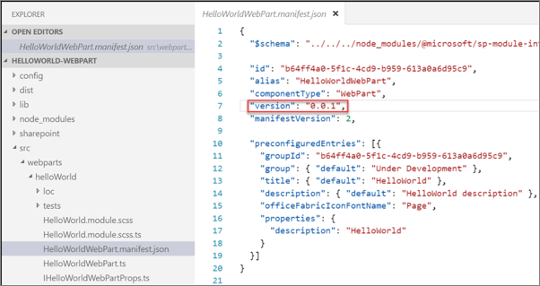

In this unit, you'll learn how versioning works in SharePoint Framework solutions and how to upgrade existing components.

## Understand version numbers in SharePoint Framework projects

SharePoint Framework projects have three things that you can version. You can assign a version to each component, such as a web part or an extension, in the package. You can assign a version to the Features in the package. And you can assign a version the package itself.

Versioning of components is exclusively used for documentation purposes. Versioning of Features and the package is also used for documentation purposes, however there are scenarios where you may be required to increment the version number for one or more Features and/or the package version number to see the effects of your changes.

When you change the code for a SharePoint Framework component, you'll need to rebuild, bundle, package, and redeploy the solution to SharePoint. When the package is redeployed, all existing code files are automatically overwritten with the new files regardless of whether the package version number changed or not.

When you add new web parts to a SharePoint Framework project, you'll need to rebuild, bundle, package, and redeploy the solution to SharePoint. When the package is redeployed, the new web parts will be immediately available regardless of whether the package version number changed or not.

When you add new extensions to a SharePoint Framework project, you don't need to increment any version numbers for the new extensions to be available after you rebuild, bundle, package, and redeploy the solution to SharePoint.

If you don't enable tenant wide deployment, you'll need to increment both the package version and the version number of the Feature or Features that provision resources associated with the extensions. Then you need to rebuild, bundle, package, and redeploy the solution to SharePoint. Incrementing the package version enables you to update the app in site collections where it's been added. Incrementing the Feature version indicates to SharePoint that the Feature needs to be updated during the app update process.

## Update the SharePoint Framework package version

The version number for the package is defined in the **./config/package-solution.json** file. SharePoint package version is displayed in the tenant or site collection App Catalog:

If you deploy an updated SharePoint package without changing the version numbers, SharePoint will still update the existing deployed component runtime files, including the JavaScript bundles.

The package version is used for documentation and to trigger the SharePoint app upgrade process. The app upgrade process may be required when new components are added to a project.

## Update SharePoint Framework components and incrementing versions

The version number of components is set in the component's manifest file. The `version` property is set to a string as shown in the following figure:

If this value is set to `*`, the `version` property from the project's **package.json** file is used.

By setting the version number in each component manifest, different components in the resulting SharePoint package can each share the same version number or they can have unique version numbers.

## Update the version in the package.json file

The last version number to look at in a SharePoint Framework project is the one that's listed in the project's **package.json** file. The only time the value of the `version` property in this file is used when you have set the `version` property in a component's manifest file to `*` instead of a specific value.

The value of the **package.json**'s `version` property doesn't have any impact on the component other than documentation. Neither the behavior of the component, package, or SharePoint is affected by changing the `version` property.

While it's only used for documentation, it's still recommended to increment this version whenever you make changes to your components.

## Summary

In this unit, you learned how versioning works in SharePoint Framework solutions and how to upgrade existing components.
