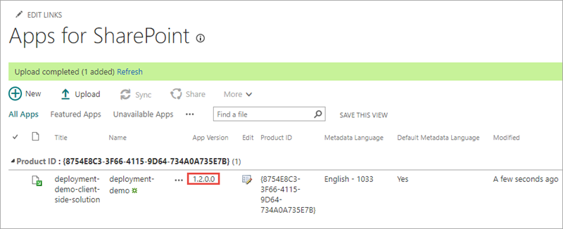
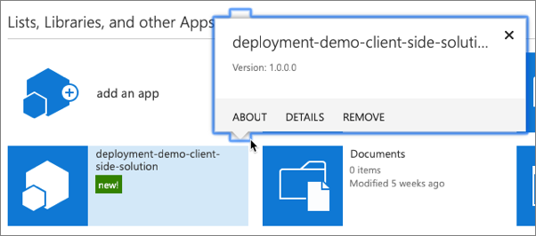
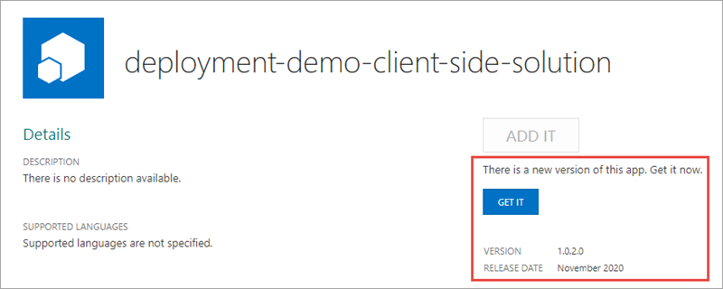
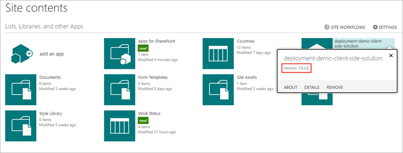
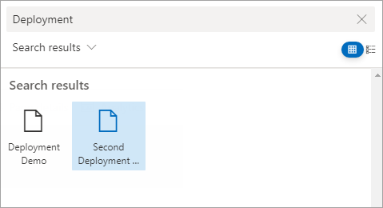

In this exercise, you'll learn how to change the various version numbers in SharePoint Framework components, packages, and how this impacts your deployments.

> [!IMPORTANT]
> Regardless if you decide to change the version number of the SharePoint Framework component or package as demonstrated in this exercise, when you upload a new package all existing code will be updated to what is in that package.

> [!NOTE]
> In the previous exercise you deployed a SharePoint Framework package that contained a single web part. The version of that web part was unchanged from the default version included in a newly created component: 0.0.1.

## Examine the existing component's version number

Locate and open the file **./src/webparts/deploymentDemo/DeploymentDemoWebPart.manifest.json**.

Notice the `version` property of the component is set to `*`. This means that the version number will be pulled from the project's **package.json** file.

> [!TIP]
> You have the option to make this value unique by replacing the `*` with a custom value.

Locate and open the file **package.json** in the root of the project.

Notice the `version` property of the project is set to `0.0.1`. This is the version all components will use by default.

## Update the component's version number

Change the `version` property in the **package.json** file to `0.0.2` and save your changes.

Build and bundle the project to see the new version. Do this by executing the following two commands in the root of the project:

```console
gulp build

gulp bundle --ship
```

Open the component's manifest file **./dist/{{COMPONENT_GUID}}.manifest.json**.

Notice the `version` property of the component's manifest is now `0.0.2`.

## Add a new component to the package

Execute the following in the command line from the root of the SharePoint project:

```console
yo @microsoft/sharepoint
```

Use the following to complete the prompt that is displayed (*if additional options are presented, accept the default answer)*:

- **Which type of client-side component to create?**: WebPart
- **What is your Web part name?**: Second Deployment Demo
- **What is your Web part description?**: Second Deployment Demo description
- **Which framework would you like to use?**: No JavaScript framework


## Update the deployment package

Build the project by running the following command on the command line from the root of the project:

```console
gulp build
```

Next, create a production bundle of the project by running the following command on the command line from the root of the project:

```console
gulp bundle --ship
```

Finally, create a deployment package of the project by running the following command on the command line from the root of the project:

```console
gulp package-solution --ship
```

## Deploy the package to a SharePoint site

In a browser, navigate to the site collection where you previously deployed the package.

Select the **Apps for SharePoint** link in the left-hand navigation.

Drag the package created in the previous steps, located in the project's **./sharepoint/solution/deployment-demo.sppkg**, into the **Apps for SharePoint** library.

SharePoint will launch a dialog asking if you want to trust the package:


Select **Deploy**.

After the package has been deployed, notice the version of the package is still version 1.0.0.0. We'll see how to update the package version number later in this exercise.

## Attempt to add the new web part to a page

Navigate to a modern site page.

Put it in edit mode by selecting the **Edit** button in the top-right portion of the content area on the page.

Select the web part icon button to open the list of available web parts:


Scroll to the bottom and notice the new web part isn't listed. This is because web parts are added to the web part gallery by activating a feature.

> [!NOTE]
> When the package was first deployed, the features within it were activated. Without versioning the package, SharePoint does not expose the user interface needed to activate or reactivate any new or existing features.

## Update the package version

Locate and open the **./config/package-solution.json** file.

Within the `solution` object, update the `version` property to `1.2.0.0`.

Build the project by running the following command on the command line from the root of the project:

```console
gulp build
```

Next, create a production bundle of the project by running the following command on the command line from the root of the project:

```console
gulp bundle --ship
```

Finally, create a deployment package of the project by running the following command on the command line from the root of the project:

```console
gulp package-solution --ship
```

## Deploy the package to SharePoint

In a browser, navigate to the site collection where you previously deployed the package.

Select the **Apps for SharePoint** link in the left-hand navigation.

Drag the package created in the previous steps, located in the project's **./sharepoint/solution/deployment-demo.sppkg**, into the **Apps for SharePoint** library.

SharePoint will launch a dialog asking if you want to trust the package:


Select **Deploy**.

After the package has been deployed, notice the version of the package is now 1.2.0.0:



## Upgrade the installed app

Select the **Site Contents** link in the left-hand navigation.

If you're not currently in the classic mode, select the **Return to classic SharePoint** link in the bottom-left of the screen.

Use the mouse to hover over the tile for the installed app. Notice the version is still 1.0.0.0.



Select the **About** link.

On the app details page, notice there's a message that a new version of the app is available and the version is 1.2.0.0.



Select the **Get It** button to upgrade the application.

SharePoint will take you back to the **Site Contents** page. Wait for the app to complete its upgrade process and verify the new version has been installed:



Now, when you go back to a page to add the new web part, you'll see the second web part show up in the web part toolbox as shown in the following image:



## Summary

In this exercise, you learned how to change the various version numbers in SharePoint Framework components, packages, and how this impacts your deployments.
