In this exercise, you'll learn how to change the various version numbers in SharePoint Framework components, packages, and how this impacts your deployments.

## Working with the package version

In this section of the exercise, you'll make several changes to the project created in the first exercise and see how those changes are manifested in SharePoint depending on whether the package version is changed or not.

### Examine the existing package version

In a browser, navigate to the site collection where you previously deployed the package.

Select the **Apps for SharePoint** link in the left-hand navigation.

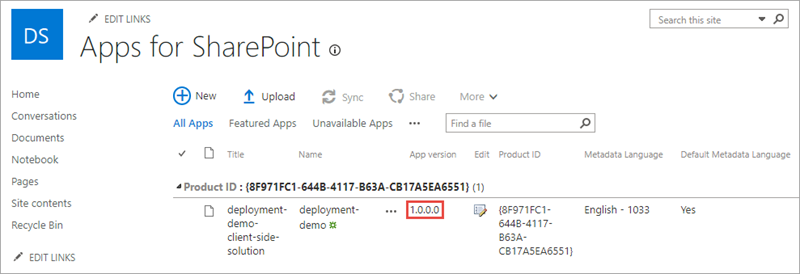

Notice the value of the **App version** property is **1.0.0.0**. This is the package version.

Locate and open the **./config/package-solution.json** file.

The package version is defined by the `version` property of the `solution` object in the **./config/package-solution.json** file.

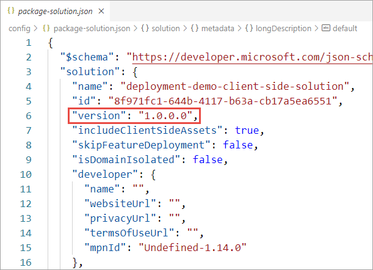

#### Add the web part to a page

Navigate to a SharePoint page.

Put it in edit mode by selecting the **Edit** button in the top-right portion of the content area on the page.

Select the web part icon button to open the list of available web parts:


Select the **Sort and filter** dropdown under the **Search** box, and select **Advanced** under **Filter by category**.

Select the **Deployment Demo** web part in the **Advanced** section:


Notice the existing web part user interface.

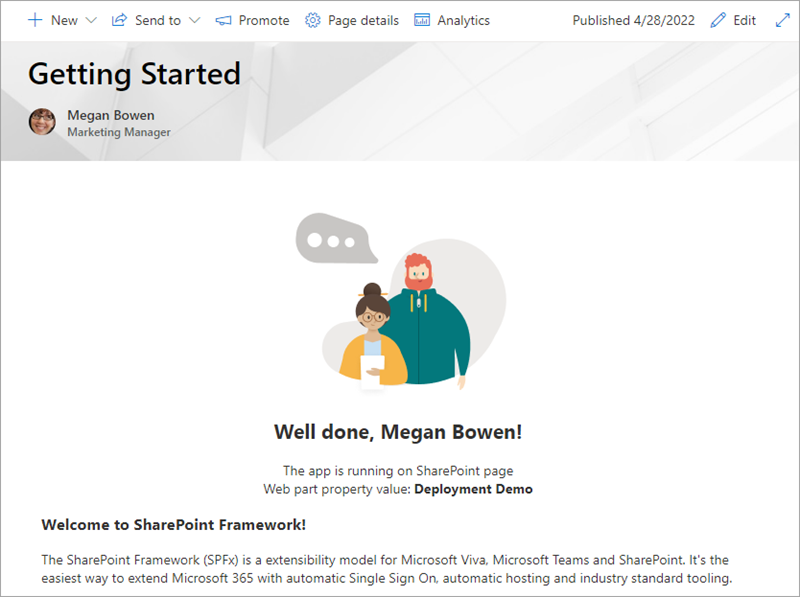

### Make a code change

Locate the web part file **src/webparts/deploymentDemo/DeploymentDemoWebPart.ts**.

Locate the existing `render()` method in the **DeploymentDemoWebPart** class. Replace the contents of the `render()` method with the following. This code displays the component version for the web part. The value of the component version will be used later in this exercise:

```typescript
public render(): void {
  this.domElement.innerHTML = `
    <section class="${styles.deploymentDemo} ${!!this.context.sdks.microsoftTeams ? styles.teams : ''}">
      <div class="${styles.welcome}">
        <h2>Well done, ${escape(this.context.pageContext.user.displayName)}!</h2>
        <div>Web part title: <strong>${escape(this.title)}</strong></div>
        <div>Component version: <strong>${escape(this.manifest.version)}</strong></div>
      </div>
    </section>`;
}
```

### Update the deployment package

Build the project by running the following command on the command line from the root of the project:

```console
gulp build
```

Next, create a production bundle of the project by running the following command on the command line from the root of the project:

```console
gulp bundle --ship
```

Finally, create a deployment package of the project by running the following command on the command line from the root of the project:

```console
gulp package-solution --ship
```

### Deploy the package to a SharePoint site

In a browser, navigate to the site collection where you previously deployed the package.

Select **Site Contents** in the left-hand navigation.

Select the **Apps for SharePoint** link in the left-hand navigation.

Drag the package created in the previous steps, located in the project's **./sharepoint/solution/deployment-demo.sppkg**, into the **Apps for SharePoint** library.

SharePoint will launch a dialog asking if you want to trust the package:

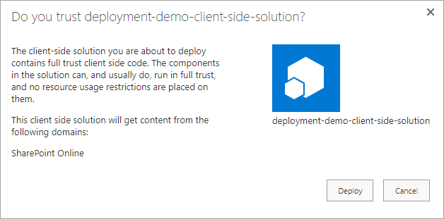

Select **Deploy**.

After the package has been deployed, notice the package version is still **1.0.0.0**.

### Examine the existing web part

Navigate to the page where you previously added the web part and refresh.

Notice that the web part user interface has changed.

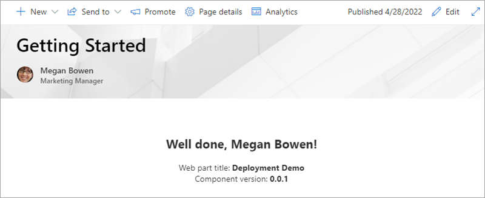

When a package is redeployed, all existing code files are automatically overwritten with the new files regardless of whether the package version number changed or not.

### Add a new web part

Execute the following in the command line from the root of the SharePoint project:

```console
yo @microsoft/sharepoint
```

Use the following to complete the prompt that is displayed (*if more options are presented, accept the default answer)*:

- **Which type of client-side component to create?**: WebPart
- **What is your Web part name?**: Second Deployment Demo
- **Which template would you like to use?**: No framework

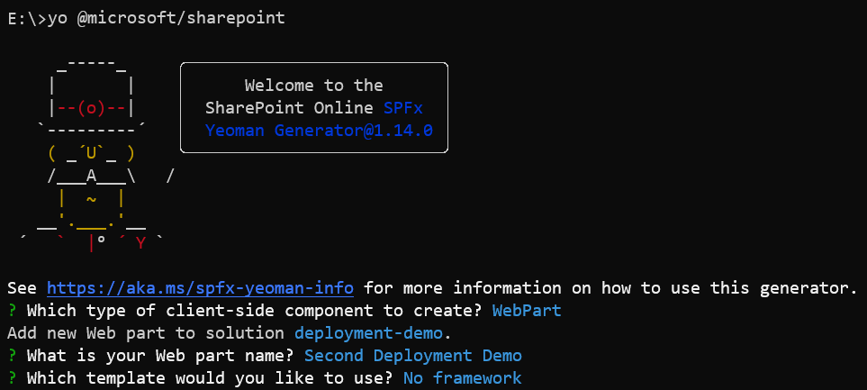

Locate the web part file **src/webparts/secondDeploymentDemo/SecondDeploymentDemoWebPart.ts**.

Locate the existing `render()` method in the **SecondDeploymentDemoWebPart** class. Replace the contents of the `render()` method with the following:

```typescript
public render(): void {
  this.domElement.innerHTML = `
    <section class="${styles.secondDeploymentDemo} ${!!this.context.sdks.microsoftTeams ? styles.teams : ''}">
      <div class="${styles.welcome}">
        <h2>Well done, ${escape(this.context.pageContext.user.displayName)}!</h2>
        <div>Web part title: <strong>${escape(this.title)}</strong></div>
        <div>Component version: <strong>${escape(this.manifest.version)}</strong></div>
      </div>
    </section>`;
}
```

Update the deployment package and redeploy the package to the site collection app catalog using the instructions included earlier in this exercise.

After the package has been deployed, notice the package version is still **1.0.0.0**.

### Add the new web part to a page

Navigate to the page where you previously added the web part.

Put it in edit mode by selecting the **Edit** button in the top-right portion of the content area on the page.

Select the web part icon button to open the list of available web parts.


Search for **deployment**. Select the **Second Deployment Demo** web part:

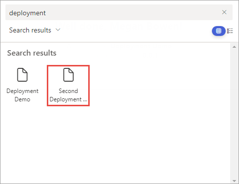

Notice the new web part user interface.

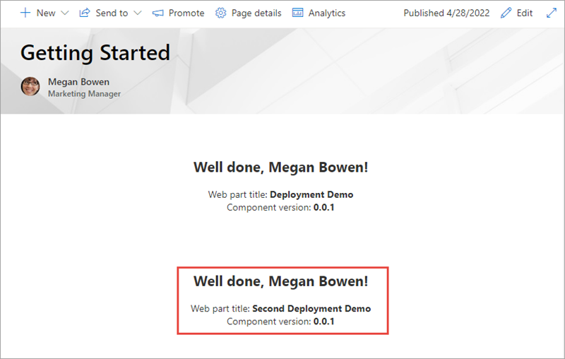

When a package is redeployed, any web parts added to the package are immediately available regardless of whether the package version number changed or not.

> [!IMPORTANT]
> This behavior changed with SharePoint Framework v1.14.0. Prior to this version of SPFx, you needed to increment the package version to see the new web parts in the web part toolbox. If you were not using tenant-wide deployment, you also needed to update the associated app in the site collections where you wanted to use the new web parts.

### Add a new extension

Now you'll add a command set extension to the project. The deployment of command set extensions is similar to other types of SharePoint Framework extensions. The existing SharePoint Feature framework is used to provision command set buttons into a SharePoint environment using the `<CustomAction>` element.

Execute the following in the command line from the root of the SharePoint project:

```console
yo @microsoft/sharepoint
```

Use the following to complete the prompt that is displayed (*if more options are presented, accept the default answer)*:

- **Which type of client-side component to create?**: Extension
- **Which type of client-side extension to create?**: ListView Command Set
- **What is your Command Set name?**: Third Deployment Demo

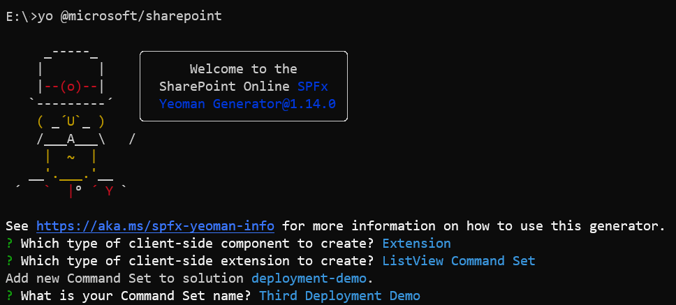

Locate and open the **./sharepoint/assets/elements.xml** file. Update the `RegistrationId` property on the `<CustomAction>` element to **101** to associate this custom action with document libraries:

```xml
<?xml version="1.0" encoding="utf-8"?>
<Elements xmlns="http://schemas.microsoft.com/sharepoint/">
    <CustomAction
        Title="ThirdDeploymentDemo"
        RegistrationId="101"
        RegistrationType="List"
        Location="ClientSideExtension.ListViewCommandSet.CommandBar"
        ClientSideComponentId="bdfacb49-5f04-4cc9-a9a1-84e3de5cfc6e"
        ClientSideComponentProperties="{&quot;sampleTextOne&quot;:&quot;One item is selected in the list.&quot;, &quot;sampleTextTwo&quot;:&quot;This command is always visible.&quot;}">
    </CustomAction>
</Elements>
```

Update the deployment package and redeploy the package to the site collection app catalog using the instructions included earlier in this exercise.

After the package has been deployed, notice the package version is still **1.0.0.0**.

### Examine a document library command bar

Navigate to a document library in the site collection where you deployed the package.

Notice that there aren't any custom command set buttons in the command bar.

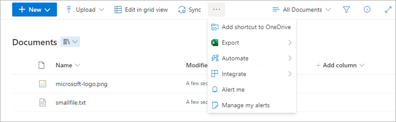

For the new extension to be activated, you need to update both the package version number and the version number of the Feature that provisions the custom action. You then need to deploy the updated package and update the app contained within it.

### Update the package and feature version

Locate and open the **./config/package-solution.json** file.

Within the `solution` object, update the `version` property to `1.2.0.0`.

```json
{
  "$schema": "https://developer.microsoft.com/json-schemas/spfx-build/package-solution.schema.json",
  "solution": {
    "name": "deployment-demo-client-side-solution",
    "id": "8f971fc1-644b-4117-b63a-cb17a5ea6551",
    "version": "1.2.0.0",
    "includeClientSideAssets": true,
    "skipFeatureDeployment": false,
    "isDomainIsolated": false,

    ...

  },
  "paths": {
    "zippedPackage": "solution/deployment-demo.sppkg"
  }
}
```

Within the `features` array, update the `version` property of the first feature object to `1.2.0.0`.

```json
"features": [
  {
    "title": "deployment-demo Feature",
    "description": "The feature that activates elements of the deployment-demo solution.",
    "id": "a2a0db38-4821-4cda-87da-1d3ce4124660",
    "version": "1.2.0.0",
    "assets": {
      "elementManifests": [
        "elements.xml",
        "ClientSideInstance.xml"
      ]
    }
  }
]
```

Update the deployment package and redeploy the package to the site collection app catalog using the instructions included earlier in this exercise.

After the package has been deployed, notice the package version is now **1.2.0.0**.


### Upgrade the installed app

Select the **Site Contents** link in the left-hand navigation.

If you're not currently in the classic mode, select the **Return to classic SharePoint** link in the bottom-left of the screen.

Use the mouse to hover over the tile for the installed app. Notice the version is still 1.0.0.0.


Select the **About** link.

On the app details page, notice there's a message that a new version of the app is available and the version is 1.2.0.0.


Select the **Get It** button to upgrade the application.

SharePoint will take you back to the **Site Contents** page. Wait for the app to complete its upgrade process and verify the new version has been installed:


### Examine a document library command bar

Navigate to a document library in the site collection where you deployed the package.

Notice that the custom command set buttons now appear in the command bar.

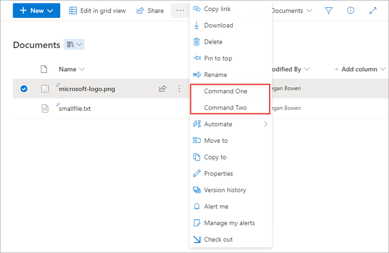

## Working with the component versions

In this section of the exercise, you'll see how the different components of a project may be versioned.

## Examine the existing component's version number

Locate and open the file **./src/webparts/deploymentDemo/DeploymentDemoWebPart.manifest.json**.

Notice the `version` property of the component is set to `*`. This means that the version number will be pulled from the project's **package.json** file.

If you open the manifest file(s) for the second web part and/or the extension, you'll see the same thing. That is, the `version` property of the component is set to `*`

> [!TIP]
> You have the option to make this value unique by replacing the `*` with a custom value, thus each component may be versioned independently.

Locate and open the file **package.json** in the root of the project.

Notice the `version` property of the project is set to `0.0.1`. This is the version all components will use by default.

### Update the component's version number

Change the `version` property in the **package.json** file to `0.0.5` and save your changes.

Update the deployment package and redeploy the package to the site collection app catalog using the instructions included earlier in this exercise.

Navigate to the page where you previously added the web parts.

Notice that both web parts are now showing that their component version is **0.0.5**.

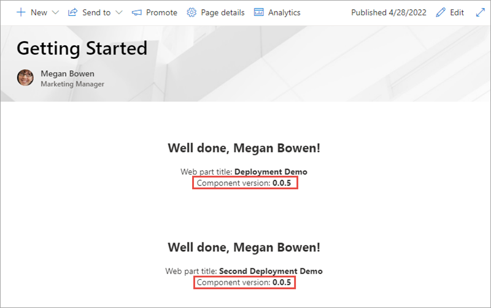

## Summary

In this exercise, you learned how to change the various version numbers in SharePoint Framework components, packages, and how doing so impacts your deployments.
