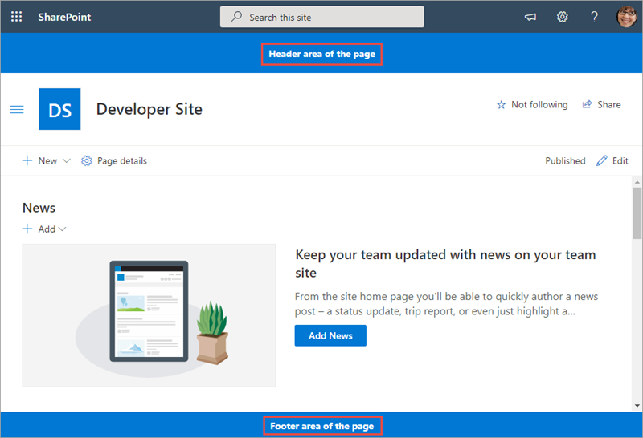
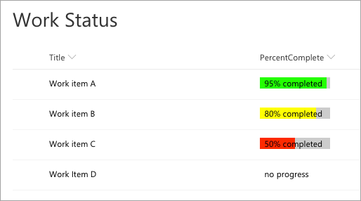
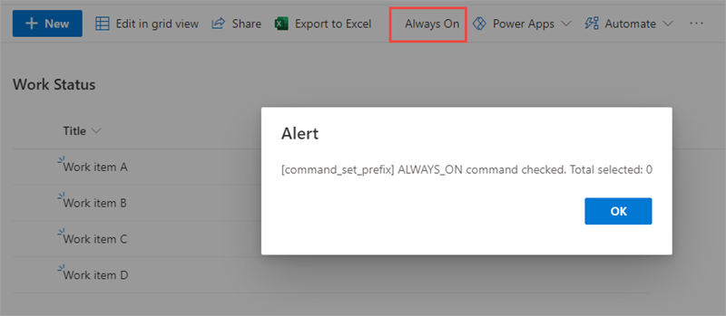
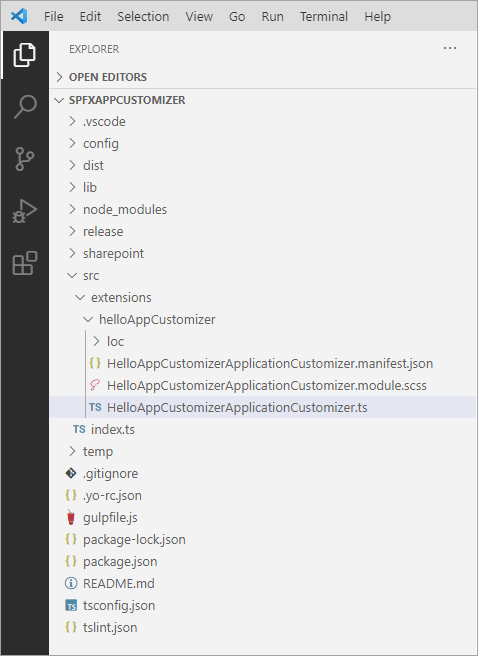

In this unit, you'll learn what SharePoint Framework extensions are and how you can use them to customize SharePoint. Then, you'll learn about one type of extension: application customizers.

## SharePoint Framework extensions

SharePoint Framework extensions enable developers to customize and extend the SharePoint user experience. You can use them to customize notification areas, list toolbars, list menus, and list data views.

Microsoft introduced extensions in the SharePoint Framework to allow customers to implement some of the same customization options available in classic sites. Extensions will only work in the modern SharePoint experience and are intended to serve as the modern option for the following options in the classic experience:

- delegate controls and `ScriptLink`
- client-side rendering (CSR) and `JSLink`
- custom actions

Because they only run in the modern experience, you can only use SharePoint Framework extensions in SharePoint Server 2019 and SharePoint Online.

### Application customizers

Let's look at the first type of extension: the application customizer. This extension is intended to be the modern replacement to the legacy delegate controls and `ScriptLink` property.

Application customizers enable you to do two things:

- add script to all pages in a site collection
- set the HTML on two well known `<div>` elements on the page that serve as headers and footers



### Field customizer

The next type of extension is the field customizer. This extension is intended to be the modern replacement to the legacy client-side rendering (CSR) framework and `JSLink`.

Field customizers enable you to define the HTML within a cell in a list view. In the following screenshot, notice the **Percent Complete** column is rendered with custom colored bars instead of plain text:



### Command sets

The last type of extension is the command set. This extension is intended to be the modern replacement for legacy custom actions.

Command sets enable you to add buttons to list and library toolbars or to the context menu of items within a list.



## Project structure

The Yeoman generator for the SharePoint Framework creates the scaffolding (*folders and files*) for a new SharePoint Framework project. After building the project the first time, you'll see even more folders and files present. Just like a .NET Framework project, some of the generated files are temporary and shouldn't be kept in source control.

Let's look at the folders in a newly created and built SharePoint Framework project:



- **.vscode**: This folder contains Visual Studio Code specific files.
- **config**: This folder contains configuration files used by the project's various build tasks. You'll edit these files as necessary depending on the types of components you're creating and for specific situations, such as the site to test extensions or adding references to external libraries.
- **dist**: This folder contains the files generated when you bundle your project, regardless of which switch you use. The unminified JavaScript files and source maps contained in this folder are used when you run in debug mode.
- **lib**: This folder, created automatically when you build the project, contains the temporary files generated from the compilation and transpilation of TypeScript to JavaScript and SCSS to CSS files.
- **node_modules**: This folder is created automatically when installing package dependencies using the `npm install` command.
- **release**: This folder contains a subfolder named **assets** that contains the files generated when you bundle your project using the `ship` or `production` switch. These files are deployed to the CDN. This folder also contains two additional subfolders that contain manifest files.
- **src**: This folder contains all the source code for your project.
- **temp**: This folder, created automatically when you test the project, contains files used by the local development web server.

> [!NOTE]
> The **dist**, **lib**, **node_modules**, **release**, and **temp** folders should not be committed to your source control solution because they are automatically generated by the build process and when installing or restoring dependencies.
>
> These folders are similar to the **bin**, **obj**, and **packages** folder generated in a .NET project.

## Debugging and testing extensions

Now let's look at how you can debug and test SharePoint Framework extensions. The SharePoint workbench doesn't support testing extensions. However, you can still build and host extensions projects locally while debugging and testing in a remote SharePoint site.

To test an extension, you include special query string parameters to the URL of a live SharePoint modern page, list, or library. These parameters instruct SharePoint to do the following things:

- load the SharePoint Framework on the page if it isn't already present
- the location of the **manifest.js** file from the local web server that tells SharePoint what custom components can be put on the page
- which component the SharePoint Framework should load and put on the page
- additional properties specific to each component

The Yeoman generator for the SharePoint Framework simplifies this process fo you by creating a configuration that the **gulp serve** task uses to create the debugging URL. These settings are defined in the **./config/serve.json** file.

When SharePoint receives the request with these query string parameters, it will first prompt the user to confirm they want to load debugging scripts. SharePoint does this same technique could be used in a phishing attack. So, you should only load the debugging scripts if you're sure you started the request.


## Deployment

The deployment for extensions is similar in many ways to deploying web parts. The existing SharePoint Feature framework is used to provision assets into a SharePoint environment.

Application customizers and command sets are provisioned in an environment using the `<CustomAction>` element. Field customizers are provisioned into a SharePoint environment as site columns that are defined using the `<Field>` element.

When it comes to deployment, the difference between web parts and extensions is that the web part provisioning process is more transparent than extensions, which require more manual work.

When the SharePoint Framework build process creates the SharePoint package, it generates the **\*.webpart** file and SharePoint Feature that's used to provision the **\*.webpart** file to the Web Part Gallery. This is done using the component's manifest and other various project configuration files.

However with extensions, these files must be manually modified before packaging to get the right settings.

### Tenant wide deployment

Some extensions support tenant wide deployment. Tenant wide deployment allows you to have centralized control of which extensions are available across all sites in a tenant. This deployment option enables you to easily implement a consistent user experience across all of your sites.

The other aspect of tenant wide deployment is that it applies to not just existing sites, but any new sites will have the extension automatically installed as well.

Tenant wide deployment allows you to bypass the need for installing extensions to each site collection. Only application customizers and list view command sets can be deployed tenant wide; field customizers can't be deployed tenant-wide.

The public properties can be set on the extension enabling administrators to apply them to specific list templates or site templates. For example, if you wanted a command set customization to show up in a document library and not a list, you can specify the public properties on an extension across all the sites.

The presence of a specific file in the project enables an extension tenant wide deployment. When the **ClientSideInstances.xml** file is detected during deployment to the tenant's App Catalog, an entry is added to a special SharePoint list. The values within the XML file are used to add an entry to the list that contains all extensions that are deployed to the tenant:

```xml
<Elements xmlns="http://schemas.microsoft.com/sharepoint/">
    <ClientSideComponentInstance
        Title="HelloAppCustomizer"
        Location="ClientSideExtension.ApplicationCustomizer"
        ComponentId="e0d94086-deda-4c10-a1a8-274286f16472"
        Properties="{&quot;header&quot;:&quot;Header area of the page&quot;,&quot;footer&quot;:&quot;Footer area of the page&quot;}">
    </ClientSideComponentInstance>
</Elements>
```

The **ClientSideInstances.xml** file is added to an extension project by default, located in the **./sharepoint/assets** folder in the project. To disable the extension from being deployed to the entire tenant, delete this file from your project before creating the SharePoint package.

### Tenant wide extensions list

SharePoint installs extensions across an all sites in a tenant based on the contents of the **Tenant Wide Extensions** list. This list, in the tenant's App Catalog site, is populated by the **ClientSideInstances.xml** file when an extension is deployed to the App Catalog.

To uninstall an extension from tenant wide deployment, delete the extension's entry in this list or change the value of the **Disabled** field.

#### Tenant wide extensions list schema

|        Column        |  Type   |                                                        Description                                                         |
| -------------------: | :-----: | -------------------------------------------------------------------------------------------------------------------------- |
|                Title | string  | Title of the entry. Can be descriptive entry for the registration. Doesn't have to match anything, just for your reference |
|         Component ID |  GUID   | Manifest ID of the component. Has to be in GUID format and component must exists in the App Catalog.                       |
| Component Properties | string  | Optional component properties.                                                                                             |
|         Web Template | string  | Can be used to target extension only to specific web templates.                                                            |
|        List Template |   int   | List type as a number.                                                                                                     |
|             Location | string  | Location of the entry. There are different support locations for application customizers and List View Command Sets.       |
|             Sequence |   int   | Sequence of the entry in rendering.                                                                                        |
|             Disabled | boolean | Enabled state of the deployment.                                                                                           |

## Application customizers

Now let's look at one type of SharePoint Framework extension: the application customizer. Application customizers enable you to do two things:

- add script to all pages in a site collection
- set the HTML on two well known `<div>` elements on the page that serve as headers and footers

This type of extension is intended to be the modern experience replacement to the classic experience's delegate control and `ScriptLink` control. Some common uses for application customizers include the following uses:

- **add script to every page**: If you need to add JavaScript to all pages in your site, the application customizer is perfect for this scenario.
- **add third-party libraries to all pages in a site**: Similar to the previous scenario, you can use an application customizer to install a third-party service or library for monitoring or telemetry tracking in a site, such as Azure's Application Insights. The application customizer is used to add the necessary reference to the JavaScript library to all pages and do any required configuration.
- **add notice to all pages**: Application customizers are used to add script to a page. You can use this approach to display news, privacy messages or alerts to all your users easily using application customizers.

### Placeholders

In addition to adding script to all pages, application customizers also enable developers to add HTML to two well-known elements on all pages in a site.

These two elements, called *placeholders*, are located at the top and bottom of a page. The top placeholder is a `<div>` that spans the entire top part of the page just below the Office 365 suite bar.

The bottom placeholder acts as a footer. This `<div>` spans the width of the page.

Both placeholders are sticky in the sense they remained pinned in the browser and don't scroll with the page.

To write to a placeholder, you must first get a reference to it from the application customizer. In this code, notice the two private members `_topPlaceholder` and `_bottomPlaceholder`. You should always first check if you have a reference to the placeholder before writing to it. Otherwise, you can run into errors as you can't have more than one reference to it.

Obtain a reference to the placeholder with the `placeholderProvider` object by calling `this.context.placeholderProvider.tryCreateContent()` method:

```typescript
this._topPlaceholder = this.context.placeholderProvider.tryCreateContent(
  PlaceholderName.Top,
  { onDispose: this._onDispose }
);
```

## Summary

In this unit, you learned what SharePoint Framework extensions are and how you can use them to customize SharePoint. Then, you learned about one type of extension: application customizers.
