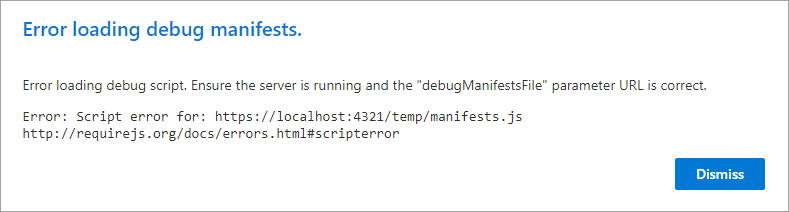
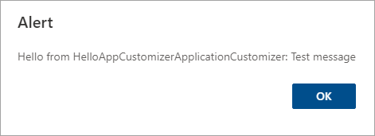

In this exercise, you'll create a SharePoint Framework (SPFx) application customizer extension.

> [!IMPORTANT]
> The instructions below assume you are using v1.13.1 of the SharePoint Framework Yeoman generator.

Open a command prompt and change to the folder where you want to create the project.

Run the SharePoint Yeoman generator by executing the following command:

```console
yo @microsoft/sharepoint
```

Use the following to complete the prompt that is displayed (*if additional options are presented, accept the default answer)*:

- **What is your solution name?**: SPFxAppCustomizer
- **Only SharePoint Online (latest) is supported. For earlier versions of SharePoint (2016 and 2019) please use the 1.4.1 version of the generator.**: SharePoint Online only (latest)
- **Do you want to allow the tenant admin the choice of being able to deploy the solution to all sites immediately without running any feature deployment or adding apps in sites?**: Yes
- **Will the components in the solution require permissions to access web APIs that are unique and not shared with other components in the tenant?**: No
- **Which type of client-side component to create?**: Extension
- **What type of client-side extension to create?**: Application Customizer
- **What is your Application Customizer name?**: HelloAppCustomizer
- **What is your Application Customizer description?**: HelloAppCustomizer description

After provisioning the folders required for the project, the generator will install all the dependency packages by running `npm install` automatically. When NPM completes downloading all dependencies, test the default project provisioned by the generator.

Unlike web parts, which can be tested in the hosted workbench, extensions must be tested in a modern SharePoint page. Special query string parameters are included with the request to indicate that the extension should be loaded from the local development web server.

To test the extension, you need to modify the **serve.json** configuration file. Start by obtaining the URL of a modern page in a live SharePoint environment.

Next, open the **./config/serve.json** file and copy the URL of your modern SharePoint page into the `serveConfigurations.default.pageUrl` property.

> [!NOTE]
> The SPFx build process' gulp **serve** task will launch a browser and navigate to this URL, appending the necessary query string parameters.

Run the project by executing the following command:

```console
gulp serve
```

When the SharePoint page loads, SharePoint will prompt you to load the debug scripts. This is a confirmation check to ensure you really want to load scripts from an untrusted source. The untrusted source is your local development web server on **https://localhost**.

Select the **Load debug scripts** button.


If you see this warning, switch back to the command prompt, wait for the **reload** subtask to finish executing, and then refresh the page:



Once the page loads, a SharePoint alert dialog will be shown:



This alert dialog is shown by the application customizer. Open the application customizer file located at **./src/extensions/helloAppCustomizer/HelloAppCustomizerApplicationCustomizer.ts** and find the `OnInit()` method. Notice the following line in the method that is triggering the dialog to appear.

```typescript
Dialog.alert(`Hello from ${strings.Title}:\n\n${message}`);
```

Stop the local web server by pressing <kbd>CTRL</kbd>+<kbd>C</kbd> in the command prompt.

## Update application customizer to add placeholders to the page

In this step, you'll modify the application customizer to write some pre-defined text to the top and bottom placeholders on the page.

### Update the customizer to have two public settable properties

Locate and open the **./src/extensions/helloAppCustomizer/HelloAppCustomizerApplicationCustomizer.ts** file.

Locate the `IHelloAppCustomizerApplicationCustomizerProperties` interface and edit it to have only two properties:

```typescript
header: string;
footer: string;
```

### Update the configuration for testing and deployment

To test the changes, modify the **serve.json** file to include values for these two properties.

Locate and open the **./config/serve.json** file. Locate the `serveConfigurations.default.properties` object and change the value of the `properties` object to the following:

```json
"properties": {
  "header": "Header area of the page",
  "footer": "Footer area of the page"
}
```

This change will only update the application customizer when you're testing it. To ensure these properties are set when the component is deployed, you need to modify the element manifest file used during deployment.

Locate and open the **./sharepoint/assets/elements.xml** file.

Set the `ClientSideComponentProperties` property to the following HTML encoded JSON string that contains the public property values:

```xml
{&quot;header&quot;:&quot;Header area of the page&quot;,&quot;footer&quot;:&quot;Footer area of the page&quot;}
```

Now, make the same changes to the file that's used when the extension is deployed to all sites in the tenant in SharePoint Online.

Locate and open the **./sharepoint/assets/ClientSideInstance.xml** file.

Set the `Properties` property to the following HTML encoded JSON string that contains the public property values:

```xml
{&quot;header&quot;:&quot;Header area of the page&quot;,&quot;footer&quot;:&quot;Footer area of the page&quot;}
```

### Add CSS styles to the application customizer

In this next step, we'll modify the CSS to give the header and footer a better user experience than a plain `<div>` element.

Start by installing the SPFx version of the Office UI Fabric Core CSS files by executing the following command on the command line:

```console
npm install @microsoft/sp-office-ui-fabric-core --save
```

Create a new file **HelloAppCustomizerApplicationCustomizer.module.scss** to the **./src/extensions/helloAppCustomizer** folder and add the following SCSS code:

```scss
@import '~@microsoft/sp-office-ui-fabric-core/dist/sass/SPFabricCore.scss';

.app {
  .top {
    height:60px;
    text-align:center;
    line-height:2.5;
    font-weight:bold;
    display: flex;
    align-items: center;
    justify-content: center;
    background-color: $ms-color-themePrimary;
    color: $ms-color-white;
  }

  .bottom {
    height:40px;
    text-align:center;
    line-height:2.5;
    font-weight:bold;
    display: flex;
    align-items: center;
    justify-content: center;
    background-color: $ms-color-themePrimary;
    color: $ms-color-white;
  }
}
```

Locate and open the **./src/extensions/helloAppCustomizer/HelloAppCustomizerApplicationCustomizer.ts** file.

Add the following `import` statements to the top of the file after the existing `import` statements:

```typescript
import styles from './HelloAppCustomizerApplicationCustomizer.module.scss';
import { escape } from '@microsoft/sp-lodash-subset';
```

## Update the header and footer placeholders

Locate and open the **./src/extensions/helloAppCustomizer/HelloAppCustomizerApplicationCustomizer.ts** file.

Locate the existing `import` statement for the `@microsoft/sp-application-base` library. Update the list of imports to add the following references: `PlaceholderContent` and `PlaceholderName`.

In the `HelloAppCustomizerApplicationCustomizer` class, add the following two private members:

```typescript
private _topPlaceholder: PlaceholderContent | undefined;
private _bottomPlaceholder: PlaceholderContent | undefined;
```

Add the following method to the `HelloAppCustomizerApplicationCustomizer` class. This method is used when the placeholders are disposed.

```typescript
private _onDispose(): void {
  console.log('[HelloWorldApplicationCustomizer._onDispose] Disposed custom top and bottom placeholders.');
}
```

Add the following method to the `HelloAppCustomizerApplicationCustomizer` class. This method will be called when the placeholders are rendered:

```typescript
private _renderPlaceHolders(): void {
  console.log('Available application customizer placeholders: ',
    this.context.placeholderProvider.placeholderNames
      .map((name) => PlaceholderName[name])
      .join(', ')
  );
}
```

Add the following code to the `_renderPlaceHolders()` method. This code will obtain a handle to the top placeholder on the page. It will then add some markup to the placeholder using the message defined in the public property:

```typescript
if (!this._topPlaceholder) {
  this._topPlaceholder = this.context.placeholderProvider.tryCreateContent(
    PlaceholderName.Top,
    { onDispose: this._onDispose }
  );

  if (!this._topPlaceholder) {
    console.error('The expected placeholder (Top) was not found.');
    return;
  }

  if (this.properties) {
    let headerMessage: string = this.properties.header;
    if (!headerMessage) {
      headerMessage = '(header property was not defined.)';
    }

    if (this._topPlaceholder.domElement) {
      this._topPlaceholder.domElement.innerHTML = `
        <div class="${styles.app}">
          <div class="${styles.top}">
            <i class="ms-Icon ms-Icon--Info" aria-hidden="true"></i> ${escape(headerMessage)}
          </div>
        </div>`;
    }
  }
}
```

Add the following code to the `_renderPlaceHolders()` to update the bottom placeholder:

```typescript
if (!this._bottomPlaceholder) {
  this._bottomPlaceholder = this.context.placeholderProvider.tryCreateContent(
    PlaceholderName.Bottom,
    { onDispose: this._onDispose }
  );

  if (!this._bottomPlaceholder) {
    console.error('The expected placeholder (Bottom) was not found.');
    return;
  }

  if (this.properties) {
    let footerMessage: string = this.properties.footer;
    if (!footerMessage) {
      footerMessage = '(footer property was not defined.)';
    }

    if (this._bottomPlaceholder.domElement) {
      this._bottomPlaceholder.domElement.innerHTML = `
        <div class="${styles.app}">
          <div class="${styles.bottom}">
            <i class="ms-Icon ms-Icon--Info" aria-hidden="true"></i> ${escape(footerMessage)}
          </div>
        </div>`;
    }
  }
}
```

Replace all the code in the `onInit()` method with the following code:

```typescript
Log.info(LOG_SOURCE, `Initialized ${strings.Title}`);

this.context.placeholderProvider.changedEvent.add(this, this._renderPlaceHolders);

return Promise.resolve();
```

## Test the Application Customizer

Run the project by executing the following command:

```console
gulp serve
```

When prompted, select the **Load debug scripts** button.

Notice when the page loads, the text defined in the public properties is displayed in the header and footer of the page. If the header and footer do not show on the page, switch back to the command prompt, wait for the **reload** subtask to finish executing, and then refresh.


Stop the local web server by pressing <kbd>CTRL</kbd>+<kbd>C</kbd> in the command prompt.

## Deploy the Application Customizer to all Sites in the SharePoint Online Tenant

In this step, you'll deploy the application customizer to your entire SharePoint tenant.

Locate and open the **./config/package-solution.json** file. Verify the `solution` object has a property named `skipFeatureDeployment` and ensure that the value of this property is set to **true**.

Locate and open the **./sharepoint/assets/ClientSideInstance.xml** file. This file contains the values that will be automatically set on the **Tenant-Wide Extensions** list in your SharePoint Online tenant's App Catalog site when the package is deployed.

Build and package the solution by running the following commands one at a time:

```console
gulp build
gulp bundle --ship
gulp package-solution --ship
```

In the browser, navigate to your SharePoint Online's tenant **App Catalog** site.

Select the **Apps for SharePoint** list in the left-hand navigation.

Drag the generated **./sharepoint/solution/sp-fx-app-customizer.sppkg** file into the **Apps for SharePoint** list.

In the **Do you trust spfx-app-customizer-client-side-solution?** dialog:

- Select the checkbox: **Make this solution available to all sites in the organization**
- Review the message: **This package contains an extension which will be automatically enabled across sites...**
- Select **Deploy**


Select **Site contents** in the left-hand navigation.

Select **Tenant Wide Extensions**. Depending on when your tenant was created the **Tenant Wide Extensions** list may be hidden. If you don't see the list in the Site Contents, then you'll have to navigate to it manually by appending `/Lists/TenantWideExtensions/AllItems.aspx` to the URL of the App Catalog site.


Notice the application customizer is present, with the specified properties, in the list:


In a separate browser window, navigate to any modern page in any modern site within your SharePoint Online tenant. You should see the extension appear in the tenant.

## Summary

In this exercise, you created a SharePoint Framework (SPFx) application customizer extension.
