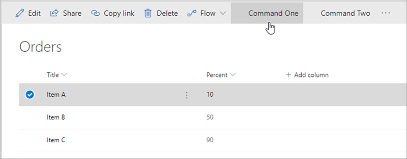

In this unit, you'll learn about another type of SharePoint Framework extension that enables adding buttons to a list toolbar and context menu: command sets.

## Overview

A SharePoint Framework command set extension enables developers to add buttons to modern lists and library toolbars and context menus.



Each button's visibility state is controlled using a single boolean property that developers can set. This property enables developers to conditionally show or hide buttons from the toolbar or context menus on an item. These command set extensions are similar to the SharePoint classic experience customizations of custom actions. The classic mode custom action customizations don't work in the modern experience and command sets will only work in the modern experience.

The following scenarios are some example use cases for command sets:

- start an external process
- execute custom script when the button is selected

The SharePoint Framework will raise an event whenever the state of the view changes that your custom code can subscribe to. For example, if a user selects or unselects an item or changes a filter on the view, you can conditionally change the state of the button's `visible` property based on how many items are currently selected in the list.

## Registering command sets

Unlike the other types of extensions, you must first register the command set buttons before executing the code. Command set registration is done in the component's manifest file. Each button must be added to the `items` collection:

```json
{
  "id": "93c624a4-13df-4e43-a1c8-fa8da95eb949",
  "alias": "CommandSetDemoCommandSet",
  "componentType": "Extension",
  "extensionType": "ListViewCommandSet",
  ...
  "items": {
    "ONE_ITEM_SELECTED": {
      "title": { "default": "One Item Selected" },
      "type": "command"
    },
    "TWO_ITEM_SELECTED": {
      "title": { "default": "Two Items Selected" },
      "type": "command"
    },
    "ALWAYS_ON": {
      "title": { "default": "Always On" },
      "type": "command"
    }
  }
}
```

This JSON excerpt from the component manifest registers three buttons. The name of the buttons must be in all caps and only consist of letters and underscores.

Each button reference has a `type` property set to `command` and a `title` property that can be localized to any of the SharePoint Framework supported locales. You can also set an `iconUrl` property on the button object that points to the fully qualified URL of the icon to render with the button.

## Command set class

After registering the buttons, you must create a class who's implementation is similar to the other SharePoint Framework extension options.

An interface is used to define the public properties that can be set as inputs on the extension.

```typescript
export interface ICommandSetDemoCommandSetProperties {
  messagePrefix: string;
}
```

Next, implement a class that extends the `BaseListViewCommandSet` base class and override the implementation of three methods:

```typescript
export default class CommandSetDemoCommandSet extends BaseListViewCommandSet<ICommandSetDemoCommandSetProperties> {

  @override
  public onInit(): Promise<void> { }

  @override
  public onListViewUpdated(event: IListViewCommandSetListViewUpdatedParameters): void { }

  @override
  public onExecute(event: IListViewCommandSetExecuteEventParameters): void { }
}
```

The `onInit()` method returns a `Promise` object and can be used to do any initialization code that needs to be completed before rendering the command set.

Next, implement the `onListViewUpdated()` event. This method is called when the command set button is first rendered on the page and when the list view state changes. Each button rendered on the page will call this method, so if you've registered three buttons in your component's manifest, this method will be called three times every time the list view state changes.

The last step is to implement the `onExecute()` event that is called when a button is selected by the user. Similar to the `onListViewUpdated()` event, this is method is shared among all the buttons registered in your component's manifest. You can use the `itemId` property on the `IListViewCommandSetExecuteEventParameters` object passed into the `onExecute()` to determine which button triggered the click event.

## Debugging and testing extensions

Now let's look at how you can debug and test SharePoint Framework command set extensions. The SharePoint workbench doesn't support testing extensions. However, you can still build and host extensions projects locally while debugging and testing in a remote SharePoint site.

To test a command set extension, you include special query string parameters to the URL of a live SharePoint modern page, list, or library. These parameters instruct SharePoint to do the following things:

- load the SharePoint Framework on the page if it isn't already present
- the location of the **manifest.js** file from the local web server that tells SharePoint what custom components can be put on the page
- which component the SharePoint Framework should load and put on the page
- additional properties specific to each component

The Yeoman generator for the SharePoint Framework simplifies this process fo you by creating a configuration that the **gulp serve** task uses to create the debugging URL. These settings are defined in the **./config/serve.json** file.

When SharePoint receives the request with these query string parameters, it will first prompt the user to confirm they want to load debugging scripts. SharePoint does this same technique could be used in a phishing attack. So, you should only load the debugging scripts if you're sure you started the request.

## Deployment

The deployment of command set extensions is similar to other types of SharePoint Frameworks extensions. The existing SharePoint Feature framework is used to provision command set buttons into a SharePoint environment using the `<CustomAction>` element.

```xml
<Elements xmlns="http://schemas.microsoft.com/sharepoint/">
  <CustomAction
    Title="CommandSetDemo"
    RegistrationId="100"
    RegistrationType="List"
    Location="ClientSideExtension.ListViewCommandSet.CommandBar"
    ClientSideComponentId="93c624a4-13df-4e43-a1c8-fa8da95eb949"
    ClientSideComponentProperties="{&quot;messagePrefix&quot;:&quot;[command_set_prefix]&quot;}">
  </CustomAction>
</Elements>
```

SharePoint Framework command set extensions, like application customizers, support tenant-wide deployment. This means the presence of the **ClientSideInstance.xml** file within your SharePoint package will add an entry to the **Tenant Wide Extensions** list in the tenants **App Catalog** site when the package is deployed.

## Summary

In this unit, you learned about another type of SharePoint Framework extension that enables adding buttons to a list toolbar and context menu: command sets.
