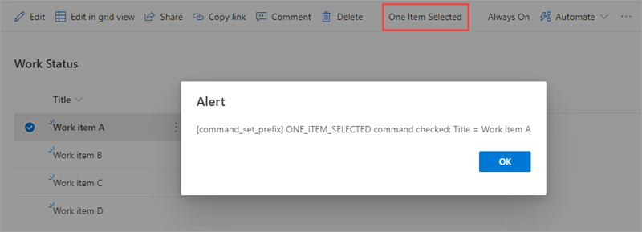
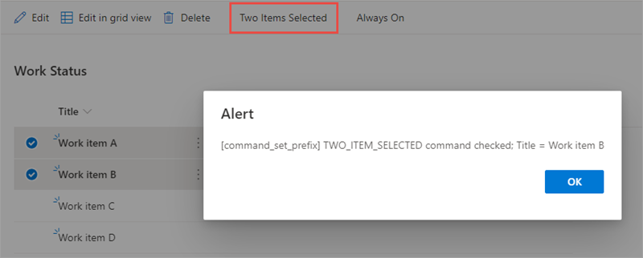

In this exercise, you'll create a SharePoint Framework (SPFx) command set extension that will display custom buttons in a SharePoint list.

> [!IMPORTANT]
> The instructions below assume you are using v1.13.0 of the SharePoint Framework Yeoman generator.

Open a command prompt and change to the folder where you want to create the project.

Run the SharePoint Yeoman generator by executing the following command:

```console
yo @microsoft/sharepoint
```

Use the following to complete the prompt that is displayed (*if additional options are presented, accept the default answer)*:

- **What is your solution name?**: SPFxCommandSet
- **Only SharePoint Online (latest) is supported. For earlier versions of SharePoint (2016 and 2019) please use the 1.4.1 version of the generator.**: SharePoint Online only (latest)
- **Where do you want to place the files?**: Use the current folder
- **Do you want to allow the tenant admin the choice of being able to deploy the solution to all sites immediately without running any feature deployment or adding apps in sites?**: No
- **Will the components in the solution require permissions to access web APIs that are unique and not shared with other components in the tenant?**: No
- **Which type of client-side component to create?**: Extension
- **What type of client-side extension to create?**: ListView Command Set
- **What is your Command Set name?**: CommandSetDemo
- **What is your Command Set description?**: CommandSetDemo description

After provisioning the folders required for the project, the generator will install all the dependency packages by running `npm install` automatically. When NPM completes downloading all dependencies, open the project folder in **Visual Studio Code**.

## Define the command set buttons

The first step to create a command set extension is to define the buttons. Buttons are defined in the component's manifest file.

Locate and open the **./src/extensions/commandSetDemo/CommandSetDemoCommandSet.manifest.json** file. Replace the existing `items` property with the following JSON:

```json
"items": {
  "ONE_ITEM_SELECTED": {
    "title": { "default": "One Item Selected" },
    "iconImageUrl": "icons/request.png",
    "type": "command"
  },
  "TWO_ITEM_SELECTED": {
    "title": { "default": "Two Items Selected" },
    "iconImageUrl": "icons/cancel.png",
    "type": "command"
  },
  "ALWAYS_ON": {
    "title": { "default": "Always On" },
    "iconImageUrl": "icons/cancel.png",
    "type": "command"
  }
}
```

## Update the command set code

After defining the buttons, the next step is to write the code that implements the extension.

Locate and open the **./src/extensions/commandSetDemo/CommandSetDemoCommandSet.ts** file. Locate the interface `ICommandSetDemoCommandSetProperties` and update its members to the following code:

```typescript
messagePrefix: string;
```

Locate the method `onListViewUpdated()` in the `CommandSetDemoCommandSet` class and replace its contents with the following code. This code will show or hide two of the buttons depending on the number of items selected in the list.

```typescript
const one_item_selected: Command = this.tryGetCommand('ONE_ITEM_SELECTED');
if (one_item_selected) {
  one_item_selected.visible = event.selectedRows.length === 1;
}
const two_item_selected: Command = this.tryGetCommand('TWO_ITEM_SELECTED');
if (two_item_selected) {
  two_item_selected.visible = event.selectedRows.length === 2;
}
```

Locate the method `onExecute()` in the `CommandSetDemoCommandSet` class and replace its contents with the following code. This code controls what happens when custom button is selected.

```typescript
switch (event.itemId) {
  case 'ONE_ITEM_SELECTED':
    Dialog.alert(`${this.properties.messagePrefix} ONE_ITEM_SELECTED command checked; Title = ${event.selectedRows[0].getValueByName('Title')}`);
    break;
  case 'TWO_ITEM_SELECTED':
    Dialog.alert(`${this.properties.messagePrefix} TWO_ITEM_SELECTED command checked; Title = ${event.selectedRows[event.selectedRows.length-1].getValueByName('Title')}`);
    break;
  case 'ALWAYS_ON':
    Dialog.alert(`${this.properties.messagePrefix} ALWAYS_ON command checked. Total selected: ${event.selectedRows.length}`);
    break;
  default:
    throw new Error('Unknown command');
}
```

## Update the deployment configuration

Command sets, when deployed to production, are implemented by provisioning a new custom action that is associated with the custom script defined in the command set's bundle file.

Locate and open the **./sharepoint/assets/elements.xml** file. Update the `ClientSideComponentProperties` property on the `<CustomAction>` element, setting the values on the public properties on the command set:

```xml
ClientSideComponentProperties="{&quot;messagePrefix&quot;:&quot;[command_set_prefix]&quot;}"
```

## Test the command set

In a browser, navigate to a SharePoint Online modern site collection where you want to test the field customizer.

Select the **Site contents** link in the left-hand navigation. Select the list **Work Status** you created in a previous exercise:


Locate and open the **./config/serve.json** file.

Copy in the full URL (including **AllItems.aspx**) of the list `serveConfigurations.default.pageUrl` property.

Locate the `serveConfigurations.default.customActions.properties` object.

Change the value of the `properties` object to the following JSON:

```json
"properties": {
  "messagePrefix": "[command_set_prefix]"
}
```

Run the project by executing the following command:

```console
gulp serve
```

When prompted, select the **Load debug scripts** button.

Notice a new button in the toolbar after the page loads. When the **Always On** button is selected, a dialog appears that displays the message prefix defined in the public properties and the total number of items selected. If the buttons are not added to the toolbar, switch back to the command prompt, wait for the **reload** subtask to finish executing, and then refresh.


Select one item in the list. Notice a new button appears. Select the button and notice how the dialog has changed:



Select a second item in the list. Notice a new button appears. Select the button and notice how the dialog has changed:



Stop the local web server by pressing <kbd>CTRL</kbd>+<kbd>C</kbd> in the command prompt.

## Summary

In this exercise, you created a SharePoint Framework (SPFx) command set extension that displays custom buttons in a SharePoint list.
