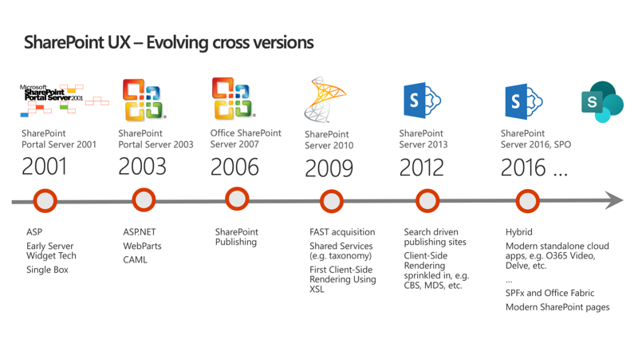
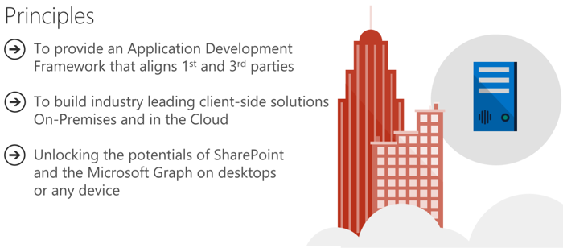
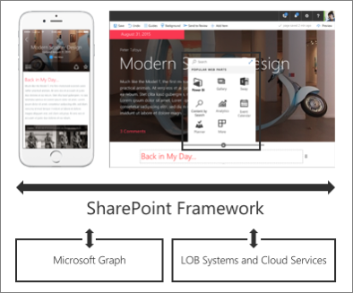

In this unit, you'll learn what the SharePoint Framework is and how to configure your developer environment.

## SharePoint user experience evolution

The SharePoint user experience has been evolving across multiple versions throughout the years.

SharePoint has a long history going back to the first release of SharePoint Portal Server 2001. The figure above displays the versions of SharePoint Microsoft has released over the years. After the initial release, Microsoft rewrote SharePoint on ASP.NET and introduced web parts in with the SharePoint Portal Server 2003 release.

As SharePoint's popularity grew, developers started to take interest in extending the product. Office SharePoint Server 2007 introduced multiple capabilities for developers, namely features, and solutions. Microsoft also merged the Microsoft Content Management Server, web content management solution, into SharePoint as site publishing capabilities.

SharePoint Server 2010 added multiple shared services to the product, including taxonomy, shared search services, and the ability to incorporate external business data into SharePoint sites.

In 2012, Microsoft introduced a new development model enabling developers to externalize customizations to run either in the browser, or on servers other than the servers were SharePoint was installed. This new model, the SharePoint Add-in model, was introduced in SharePoint Server 2013 and was released along with significant investments to the SharePoint REST API. SharePoint Server 2013 also adopted the OAuth 2.0 protocol and introduced the ability for developers to create apps that had their own identities.

More recently, with SharePoint Server 2016, SharePoint Server 2019, and SharePoint Online, Microsoft noticed customers were using client-side development techniques to customize and extend SharePoint. Client-side customizations are the foundation and inspiration for the SharePoint Framework.

Present day SharePoint exists in one of two versions:

- **SharePoint Server 2019**: This is the on-premises version of SharePoint that customers install and maintain on their servers.
- **SharePoint Online**: This is the hosted version of SharePoint, managed by Microsoft as part of Microsoft 365.

## SharePoint Framework extensibility principles

Over the past several years, with the evolution of Microsoft 365, development of SharePoint solutions has a new set of challenges: while on one hand IT and Tenant administrators require a new set of tools to control how data get accessed and consumed in their tenancies, developers want to programmatically control the whole lifecycle, experience, and data access capabilities of a Site.

Unfortunately, developers today find themselves constraint around building app parts because of iFrames, a reduced set of APIs, and no integration with cross Microsoft 365 workloads. This in turn limits their ability to develop powerful portals that extend SharePoint.

The client-side development framework will deliver capabilities that will help both first party and third-party developers build powerful, rich applications and provide an enjoyable web experience in Microsoft 365 for end users that are both intuitive and simple to consume.

### SharePoint Framework overview

SharePoint Framework is modern client-side development. All the customizations you create and build are deployed and run in the browser. There's no server-side component in a SharePoint Framework component.

You can create server-side components, but you're going to host that yourself in a location other than SharePoint.

SharePoint Framework components are lightweight and run in both web and mobile experiences because they're client-side solutions. We're relying on JavaScript, HTML, CSS, and images. This means they run the exact same way in the browser as it does in the mobile experiences.

The SharePoint Framework is backwards compatible meaning that it works not just the modern pages, but also on classic and publishing pages as well.

The development tools and platform used in the SharePoint Framework is implemented with open-source tools and common JavaScript web frameworks like React.

### Modern pages

What is a modern page?

The difference between a modern page and classic pages is that a modern page is rendered client-side. Modern pages aren't rendered server side, which is how SharePoint developers use to build component such as server-side based web parts.

Modern pages are natively responsive meaning that when the browser is resized, it's going to resize and re-render the page appropriate for the current resolution and experience.

Web parts you create will run and be rendered client-side; Client-side components can also use persistent caches so data that's cached by the SharePoint Framework API can be used by custom components on modern pages.

Modern pages are mobile optimized and will render both in the client if you're using a browser or a desktop browser.

Modern site pages enable users to easily create beautiful looking pages. They help you communicate ideas and information using an improved authoring canvases and a gallery of web parts. Some of the different building blocks that are available to page authors include a page canvas. This canvas and web parts and these are all built using client-side HTML and JavaScript.

Mobile support is built in from the start, which means that page reflows across different device sizes. Pages are fast and fluid. Modern pages get better with Microsoft Graph because authors can leverage Microsoft Graph to surface relevant pages to the people that need to read them.

### SharePoint client-side development

Is all SharePoint Framework development done in JavaScript?

No, and in many similar ways as the SharePoint Add-in development model, server-side development is needed for backend scenarios.

The SharePoint Framework is simply concentrating on the user interface side of components, not on the fundamentals around the API usage. You can still create server-side solutions, but they're not going to be visible or surfaced in SharePoint Online or run within a SharePoint process.

Instead, you can create a SharePoint Framework component that can interact with those backend APIs.

## Configure a SharePoint Framework development environment

There are a few things you need to take into consideration when setting up a SharePoint Framework development environment. First you need to set up a Microsoft 365 developer tenant.

### Set up a Microsoft 365 developer tenant

A developer tenant is no different than a normal production tenant. Microsoft provides developers, through the Microsoft 365 Developer Program to get access to a developer tenant. The developer tenant same thing you would normally get when you purchase Microsoft 365 licenses.

> [!TIP]
> Sign up for the Microsoft 365 Developer Program at [https://aka.ms/offdp](https://aka.ms/offdp).

Once you have a developer tenant, you need to create an App Catalog site. The App Catalog is where you deploy your custom packages that contain your components that you want to test or share with others in your organization. You can think of it like the SharePoint Store in a sense

You then need to create a modern site collection for testing your custom components.

All SharePoint modern sites have something called the *workbench*. The workbench is where you can test your components when they're going to be running up in SharePoint Online sites. From the workbench, you can work with live data from the SharePoint REST API.

## Summary

In this unit, you learned what the SharePoint Framework is and how to configure your developer environment.
