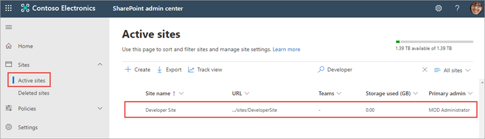

In this exercise, you'll configure your SharePoint environment to be ready for SharePoint Framework development.

Open a browser and navigate to your Office 365 tenant's **SharePoint admin center** site: **https://{{REPLACE_WITH_YOUR_TENANTID}}-admin.sharepoint.com/_layouts/15/online/AdminHome.aspx**.

> Replace the text `{{REPLACE_WITH_YOUR_TENANTID}}` in the above URL with the unique prefix for your Microsoft 365 tenant. For example, if the domain for your SharePoint sites is **contoso.sharepoint.com**, then the unique prefix for your Microsoft 365 tenant is **contoso**.

## Create the SharePoint tenant app catalog site

Select **More features** in the left-hand navigation.

Select the **Open** button under **Apps**.

If you're taken to an app catalog site as shown in the following image, then your tenant already has a SharePoint tenant app catalog site. 

Otherwise the SharePoint tenant app catalog site will automatically be provisioned for you. 

## Create a development site collection

Open a browser and navigate to your Office 365 tenant's **SharePoint admin center** site: **https://{{REPLACE_WITH_YOUR_TENANTID}}-admin.sharepoint.com/_layouts/15/online/AdminHome.aspx**.

> Replace the text `{{REPLACE_WITH_YOUR_TENANTID}}` in the above URL with the unique prefix for your Office 365 tenant.

On the **SharePoint admin center** site, select **Sites > Active sites** from the left-hand navigation and then select **Create**.

On the **Create a site** panel, select the **Team site** button.

On the **Create a team site** panel, enter the following values to create a new team site collection and select **Next**.

- **Site name**: Developer Site
- **Primary administrator**: *use the people picker to select your account*
- **Select a language**: *select the default language for your site*

On the **Add site owners and members**, you may optionally add owners and members to the site. Select **Finish**.

> [!NOTE]
> After a minute or two the site collection will be created. On the **SharePoint admin center** site, select the **Sites > Active Sites** item in the left-hand navigation. You'll see a list of all *classic* and *modern* sites including the **Developer site** that you just created.
>
> 

## Summary

In this exercise, you configured your SharePoint environment to be ready for SharePoint Framework development.