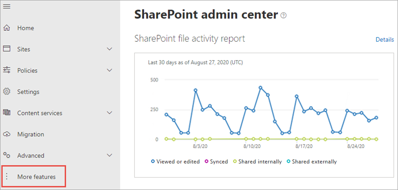
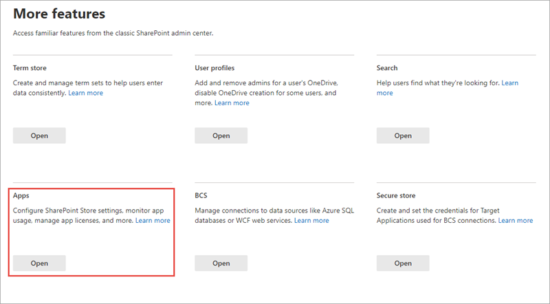
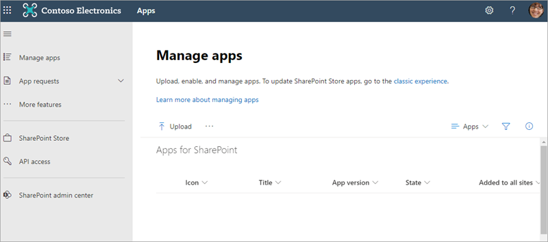
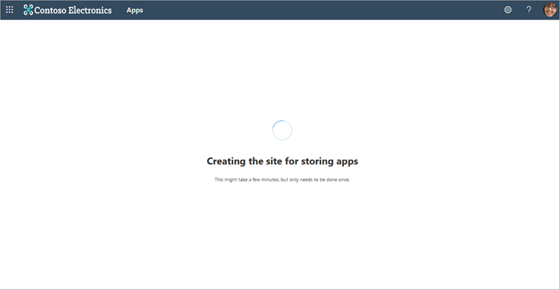
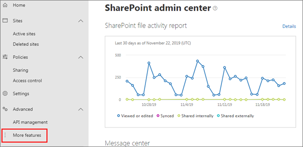
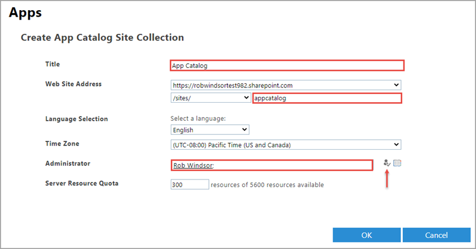
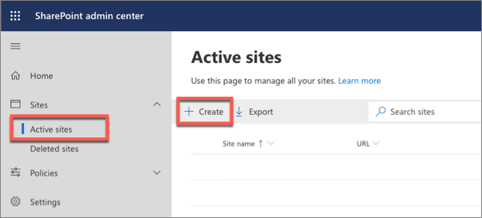
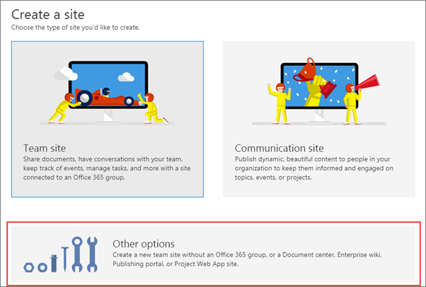
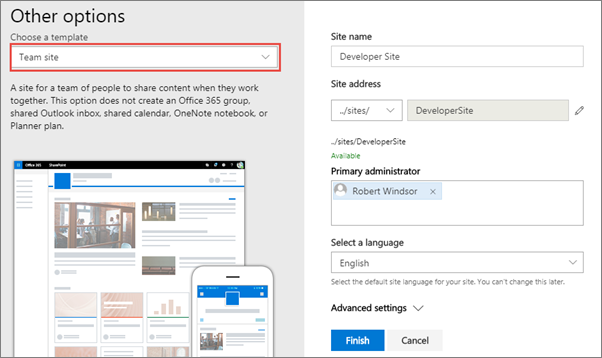
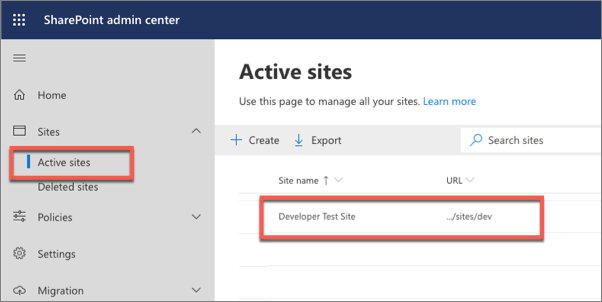

In this exercise, you'll configure your SharePoint environment to be ready for SharePoint Framework development.

Open a browser and navigate to your Office 365 tenant's **SharePoint admin center** site: **https://{{REPLACE_WITH_YOUR_TENANTID}}-admin.sharepoint.com/_layouts/15/online/AdminHome.aspx**.

> Replace the text `{{REPLACE_WITH_YOUR_TENANTID}}` in the above URL with the unique prefix for your Office 365 tenant. For example, if the domain for your SharePoint sites is **contoso.sharepoint.com**, then the unique prefix for your Office 365 tenant is **contoso**.

Select **More features** in the left-hand navigation.

Select the **Open** button under **Apps**.

When the new page opens, select **App Catalog**.

> If you're taken to an app catalog site as shown in the following image, then your tenant already has an app catalog, created by someone previously. In this case, you can skip to the next step to create a developer site collection.
>
> 
>
> Otherwise, if you're presented with a form to create an app catalog (*as shown in the following image*), your tenant does not already have an app catalog. In this case, continue with the following steps to create an app catalog.
>
> 

Select the **Automatically create a new app catalog site** option if you want SharePoint to create the app catalog site for you, or select the **Manually create a new app catalog site (classic)** option if you wish to configure the app catalog site settings prior to the site creation. 

Select the **OK** button.

If you selected the **Create a new app catalog site** option, then on the **Create App Catalog Site Collection** page, enter the following details, and select **OK**.

- **Title**: App Catalog
- **Web Site Address (suffix)**: appcatalog
- **Administrator**: *enter your username and select the **check names** icon to resolve your username*

SharePoint Online will provision the app catalog for the tenant.

## Create a development site collection

Open a browser and navigate to your Office 365 tenant's **SharePoint admin center** site: **https://{{REPLACE_WITH_YOUR_TENANTID}}-admin.sharepoint.com/_layouts/15/online/AdminHome.aspx**.

> Replace the text `{{REPLACE_WITH_YOUR_TENANTID}}` in the above URL with the unique prefix for your Office 365 tenant.

On the **SharePoint admin center** site, select **Sites > Active sites** from the left-hand navigation and then select **Create**.

On the **Create a site** panel, select the **Other options** button.

On the **Other options** panel, keep the default value of **Team site** in the **Choose a template** dropdown and then enter the following values to create a new team site collection and select **Finish**.

- **Site name**: Developer Site
- **Site address**: ../sites/DeveloperSite
- **Primary administrator**: *use the people picker to select your account*
- **Select a language**: English

> [!NOTE]
> After a minute or two the site collection will be created. On the **SharePoint admin center** site, select the **Sites > Active Sites** item in the left-hand navigation. You'll see a list of all *classic* and *modern* sites including the **Developer site** that you just created.
>
> 

## Summary

In this exercise, you configured your SharePoint environment to be ready for SharePoint Framework development.
