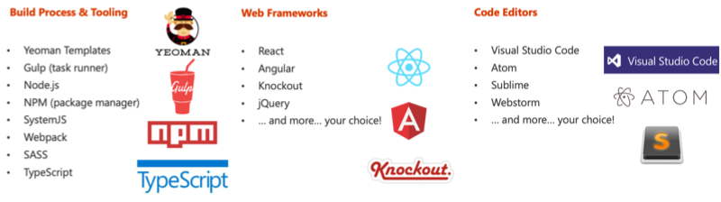
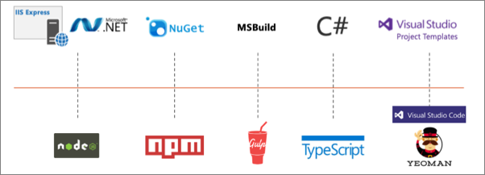

In this unit, you'll learn what you need to install on your development environment to start creating SharePoint Framework components.

## Open-source tooling

Microsoft has adopted the open-source tooling for the foundation of SharePoint Framework development. Three categories to explore when it comes to open-source tooling and libraries related to the SharePoint Framework are as follows:

- build process and tooling
- web frameworks
- code editors

### Build process and tooling

Let's look at the build process and tooling first. Yeoman is used to replace the new project experience that traditional server-side SharePoint developers are familiar with in Visual Studio.

Gulp is a task runner that replaces the tool MSBuild used in .NET solutions. This is used to run various tasks, like transpiling TypeScript to JavaScript, creating JavaScript bundles and SharePoint packages.

Node.js is the underlying runtime used by all applications. The tools we're covering in this section are all built on top of Node.js. Node.js is required to run them, just like the .NET Framework is required to run .NET apps.

NPM is used as the package manager and you'll use it to install global tools and reusable code in your projects.

Webpack is used to combine all the JavaScript and CSS files in your project into a single JavaScript bundle. Bundles are the recommended way to deploy client-side applications for performance reasons.

These are tools that aren't built and provided by Microsoft, rather they're maintained by the community and are all open-source tools. One benefit of using these tools is that they're cross platform, so the same tools can be used regardless if your development environment is Windows, macOS, or Linux.

### Web frameworks

When building client-side applications, developers commonly use web frameworks. The SharePoint Framework doesn't limit you to any specific framework. You can use any of the popular web frameworks in your projects including React, Angular, Knockout, or Vue.js. You can even use the popular jQuery library in your custom apps.

### Code editors

You'll also want to get a code editor to develop your project. Most developers are use Visual Studio Code by Microsoft. It's a lightweight version of Visual Studio and is just a text editor that understands TypeScript and can be customized using extensions.

However, you aren't limited to Visual Studio Code. You can choose a different editor if you wanted to. Something as simple as notepad, Atom, Sublime, or WebStorm will work as well. It doesn't matter what you use as all development is done though text editors.

## Server-side tool comparison

The SharePoint Framework development toolchain is a significant change from the traditional server-side SharePoint development experience. Let's look at the two development toolchains to see how they compare and contrast:

In the previous image, the top row is the server-side tool comparison, starting with the Microsoft IIS web server. This includes the .NET Framework, NuGet used for package management, MSBuild used for running build and packaging tasks, C# as the development language and Visual Studio for the development experience.

The bottom row represents the SharePoint Framework tools. Notice the lines drawn between the tools so you can see how the two compare.

## Exploring the SharePoint Framework core development and build tools

Let's look at each of the tools used in the SharePoint Framework development and build toolchain.

### Node.js

Node.js is a JavaScript runtime for running JavaScript on devices outside of the browser. Its a wrapper to the V8 JavaScript engine from the Chromium open-source browser project with some extra APIs that allow the V8 engine to run outside of the browser. This enables JavaScript to run on desktops, laptops, servers, and other devices.

> [!NOTE]
> Chromium is the project both of the browsers Google Chrome and Microsoft Edge are based on.

In the context of the SharePoint Framework, Node.js is needed as its the runtime for the development and build tools previously covered. The SharePoint Framework doesn't require you to become a Node.js developer, but you need to install it so the apps in the development and build toolchain will run.

When compared to the server-side toolchain, Node.js serves the same role as the .NET Framework.

### NPM: Node Package Manager

NPM is a package manager for Node.js-based projects and is included with the Node.js installation. Its one of many package managers that can download and install packages from the npmjs.org registry.

When compared to the server-side toolchain, NPM serves the same role as NuGet.

### Yeoman

When building server-side SharePoint components using the Add-in model or as features or solutions, developers used Visual Studio to create and develop the project. The first step in these models is to create a project using the *New Project* wizard experience. This wizard collects information about the project and then scaffolds the project by creating folders, files, and customizing the files based on the responses to the questions.

Visual Studio Code doesn't have this *New Project* wizard experience. To simplify project creation, Yeoman is used to create the project.

Yeoman is a scaffolding engine that runs generators. A generator defines the set of questions and understands how to scaffold a new project or modify existing projects.

Microsoft provides a generator to scaffold SharePoint Framework projects, both new projects and to add components to existing projects.

### Gulp

Gulp is the task runner we use to do different tasks in our development and build process. Gulp executes tasks that are written in JavaScript. You'll use gulp to do things like building your project and transpiling the SASS files to CSS and TypeScript to JavaScript. You'll use other tasks to combine the resulting files into bundles and package the resulting files into a SharePoint package file used for deployment.

When compared to the server-side toolchain, Gulp serves the same role as MSBuild.

### TypeScript

TypeScript is the language that you're going to write your SharePoint Framework projects with. Its super set of JavaScript with extra capabilities it to make JavaScript development easier to manage.

If you aren't familiar with JavaScript or you're not familiar with TypeScript, think of it as like a C# flavor to JavaScript. TypeScript's most popular features are type checking, the ability to use classes, and future features coming to JavaScript but not yet implemented or available except in preview.

Similar to C# based projects, you don't deploy TypeScript to production. Rather its used to create intermediate files. The output of TypeScript is JavaScript, similar to how the output of C# is intermediate language (IL).

When compared to the server-side toolchain, TypeScript serves the same role as C#.

## Summary

In this unit, you learned what you needed to install on your development environment to start creating SharePoint Framework components.
