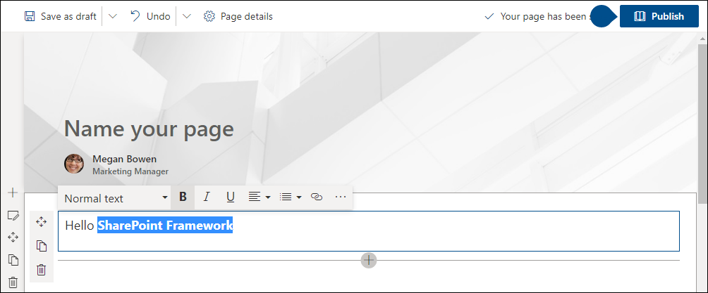

In this unit, you'll learn how to interact with SharePoint Framework-based client-side web parts in a SharePoint Online modern site collection.

## SharePoint client-side web parts

Client-side web parts, built using the SharePoint Framework, are the cornerstone of the vision for innovating, extending, and customizing the SharePoint modern experience.

They're configurable, reusable, and purpose-built components that page designers and site owners can use to create unique experiences for their users.

Client-side web parts are built using the SharePoint Framework that provides more capabilities, including access to Microsoft Graph for incorporating personal and organizational information into page experiences.

Web parts are also context aware, in the sense that they have access to contextual information about the current page. For instance, at runtime, the web part can get information about the current user and the current page and site the web part is currently running in.

Client-side web parts are flexible as well! Developers can use them to create single page applications (SPAs) as single page app pages, the basis for Microsoft Teams tabs and personal apps, and even as the host for Office Add-ins.

## Client-side web parts

Experienced SharePoint developers who are familiar with server-side web parts developed and deployed using SharePoint features and solutions will find client-side web parts to be familiar. They're just web parts!

The only difference from a server-side web part is client-side web parts are rendered in the browser, not on the server.

Client-side web parts are built for the modern, JavaScript-driven web just as the modern SharePoint experience.

## Adding SPFx web parts to pages

Adding a SPFx client-side web part to a page works in very much the same way as adding server-side web parts. However, there are a few things that make working with client-side web parts a bit easier.

Unlike classic pages, when a page is in edit mode, any web parts on the page are also in edit mode. Compared to classic pages where the web part has a different edit mode from the page's edit mode.

To add a web part to a modern page, first put the page in edit mode and then select the **+** icon to open the toolbox. Select a web part from the toolbox to add it to the page.

You can edit the web part by opening the property pane with the edit icon to the left of the web part. By default, any changes made in the property page are immediately reflected in the web part.

## Summary

In this unit, you learned how to interact with Framework-based client-side web parts in a SharePoint Online modern site collection.
