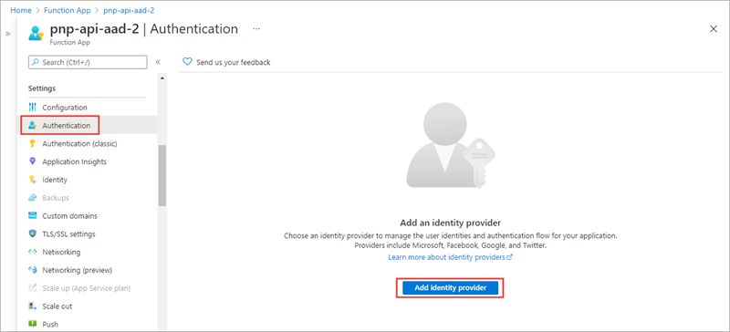
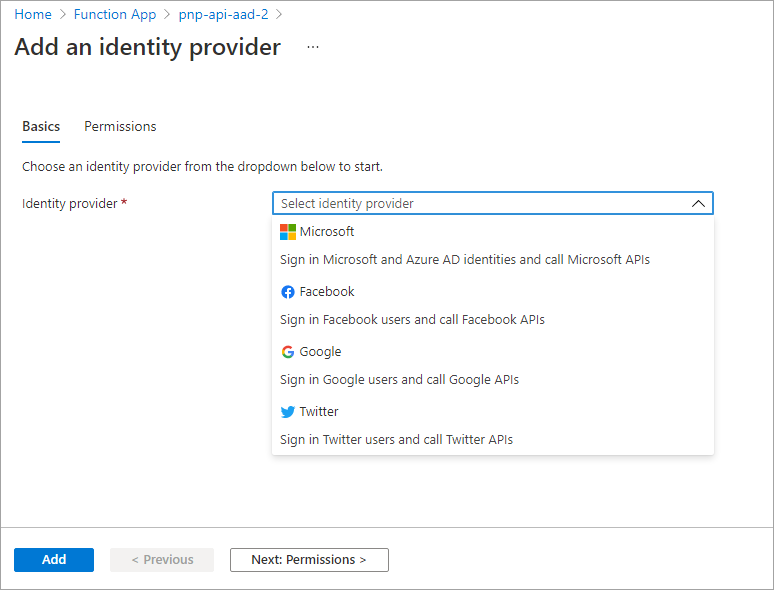
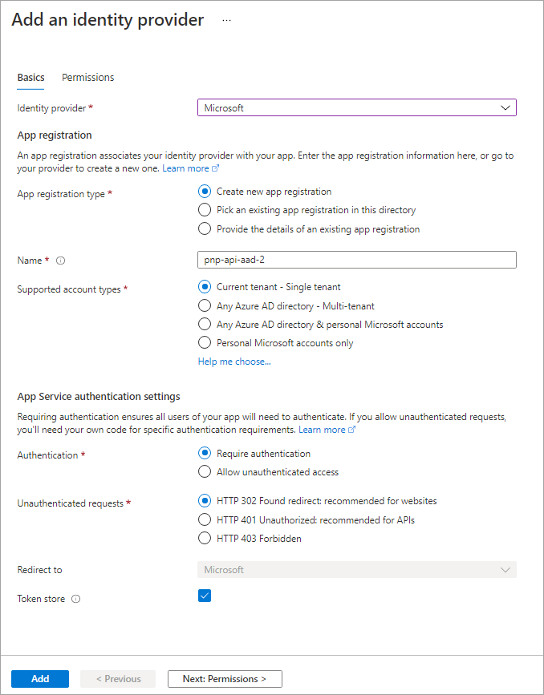

In this unit, you'll learn how to use the SharePoint Framework API to call REST APIs that are secured with Azure Active Directory (Azure AD).

## Secure REST APIs with Azure AD

Resources in Microsoft Azure can be secured with Azure AD. Azure AD can be used to secure REST APIs that are hosted in Microsoft Azure and API hosted in other cloud platforms. Microsoft Azure hosted resources are easier to secure as the Azure Management Portal provides a simplified configuration experience.

Azure AD secured REST APIs require all requests to be authorized. To authorize a request, you'll include an OAuth 2.0 access token in the `authorization` HTTP request header. This access token must be obtained from Azure AD using one of the supported OAuth flows.

All available Microsoft REST APIs that don't support anonymous requests are secured with Azure AD. This includes APIs including the SharePoint REST API, Microsoft Graph, Azure Management REST API and  many more.

### Secure Azure Functions with Azure AD

A common approach to implementing a REST API is to use Azure Functions. Securing an Azure Function with Azure AD is simple. In the left-hand navigation, select the **Authentication** menu item.



The **Authentication** blade supports authentication using different OAuth 2.0 providers, including Microsoft, Facebook, Google, and Twitter.



After selecting **Microsoft**, you'll then either create a new Azure AD app or associate the Azure Function app with an existing Azure AD app.



By enabling Azure AD authentication on an Azure Function, Microsoft Azure will automatically check for a valid access token in the `authorization` HTTP request header in every request received. If the access token isn't present or not valid, the request is rejected. This verification check is done without you having to write any special code in your Azure Function.

## Call Azure AD secured resources from the SharePoint Framework

Let's look at how requests to Azure AD secured resources are handled by the SharePoint Framework.

Permission requests to REST APIs, also known as *resources*, are granted to an Azure AD app provisioned in every SharePoint Online tenant: **SharePoint Online Client Extensibility Web Application Principal**.

When you grant a permission request for a specific resource, such as Microsoft Graph, to the **SharePoint Online Client Extensibility Web Application Principal** app, you're granting that entire SharePoint Online tenant the permission. It's important to understand that this permission grant isn't unique to the site or to the SharePoint Framework component; the permission grant applies to the *entire SharePoint Online tenant*.

Also, it's important to understand that permissions aren't tied to SharePoint Framework apps. SharePoint Framework solutions and apps can be deployed, installed, added, and removed to or from pages without approving or revoking permission requests.

### Grant permissions to SharePoint Online

There are three ways you can request and grant permissions to a SharePoint Online tenant:

- **Defined with the SharePoint Framework package solution manifest**: In this option, you'll define the permission requests for the resources that your solution needs to run. When the solution is deployed to the App Catalog site, the administrator is notified that they'll need to approve or reject the permission request.
- **PowerShell**: PowerShell can be used to submit a permission request, and approve or reject permission requests. You can also use PowerShell to create the permission grant, bypassing the request process.
- **Office 365 CLI**: You can also use the cross-platform Office 365 CLI to request, approve, reject, grant, and revoke permission requests the same way you can with PowerShell.

### Declare permission requests in SharePoint Framework projects

To request a permission when a SharePoint Framework package is deployed to the App Catalog, add it to the `webApiPermissionRequests` array in the **package-solution.json** configuration file in a project.

Each request must include the name of the REST API (`resource`) and the permission (`scope`) requested:

```json
// package-solution.json
{
  "solution": {
    "name": "sp-fx-aad-http-client-side-solution",
    "id": "dfb230b7-4f61-431f-9b65-a34e83922663",
    "version": "1.0.0.0",
    "includeClientSideAssets": true,
    "isDomainIsolated": false,
    "webApiPermissionRequests": [
      {
        "resource": "Microsoft Graph",
        "scope": "User.ReadBasic.All"
      }
    ]
  },
  "paths": {
    "zippedPackage": "solution/sp-fx-aad-http.sppkg"
  }
}
```

## Call Azure AD secured REST APIs from the SharePoint Framework

After SharePoint Framework package has been added to the App Catalog, let's look the process for granting permissions and how the SharePoint Framework ultimately submits requests to the Azure AD secured REST API.


At the bottom of the figure above, the tenant administrator grants the permissions (also known as *scopes*), to the SharePoint Online tenant. This is done from the API Management page in the SharePoint Admin Center.

Once the permission request is granted, the SharePoint Framework component will ask SharePoint Online for an access token for the specified resource. The SharePoint Online, with Azure AD, will validate the permission for the specified resource has been granted to that SharePoint Online tenant and return an access token. The SharePoint Framework will then submit a request to the REST API and include the access token in the `authorization` HTTP request header.

The Azure AD secured resource will verify the `authorization` HTTP request header before passing to the REST API. From this point, the HTTP request continues like normal, processing the request and sending the response back to the SharePoint Framework component.

### Use the SharePoint Framework Azure AD HTTP client

The SharePoint Framework API simplifies the access token acquisition from SharePoint Online and Azure AD. The API uses the token to configure a special instance of the `HttpClient`, known as the `AadHttpClient`, you'll use to submit the request.

To do this, start by importing the `AadHttpClient` object into your TypeScript file:

```typescript
import {
  AadHttpClient,
  HttpClientResponse
} from '@microsoft/sp-http';
```

Next, use the `aadhttpClientFactory` to request an HTTP client configured with the access token for the specified resource:

```typescript
this.context.aadHttpClientFactory
  .getClient("https://your-endpoint-uri")
  .then((aadClient: AadHttpClient) => {
    /* submit request to endpoint */
  });
```

Finally, use the configured client to call the secured REST API the same way you can use the `HttpClient`:

```typescript
const endpoint: string = "https://your-endpoint-uri/api";
aadClient.get(endpoint, AadHttpClient.configurations.v1)
  .then((rawResponse: HttpClientResponse) => {
    return rawResponse.json();
  })
  .then((jsonResponse: any) => {
    // work with result
  });
```

## Add SharePoint packages to the SharePoint App Catalog

> [!NOTE]
> What's been referred to as **permission** requests above, are referred to as **API access** requests in the user interface for the app catalog and the SharePoint Admin Center. You can consider permission requests and API access requests to be synonymous. The term API access requests will be used for the remainder of this unit.

When an administrator deploys the SharePoint Framework component to the tenant App Catalog, they're presented with information about API access requests in the **Enable app** panel:


This section of the panel lists the API access requests that should be reviewed and approved or rejected. Recall that API access requests aren't tied to the SharePoint Framework package. Approving or rejecting the API access requests is a separate step that must be done in order for the SharePoint Framework component to work.

### Approve or reject API access requests from the SharePoint Admin Center

To approve or reject API access requests, navigate to the **API access** page in the SharePoint Admin Center. Here you'll find a list of API access requests pending approval or rejection:


Select the API access request to view its details and use the buttons at the bottom of the panel to approve or reject the request:


## Summary

In this unit, you learned how to use the SharePoint Framework API to call REST APIs that are secured with Azure AD.
