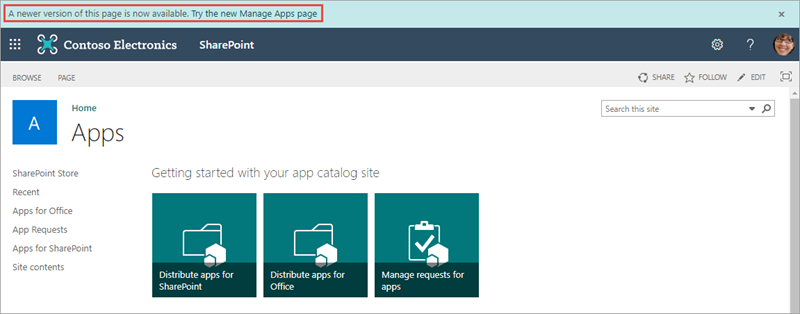
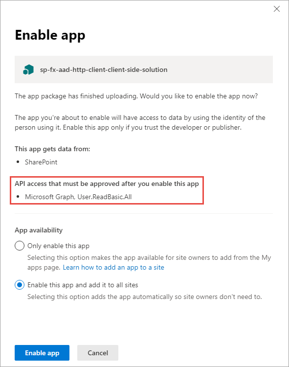
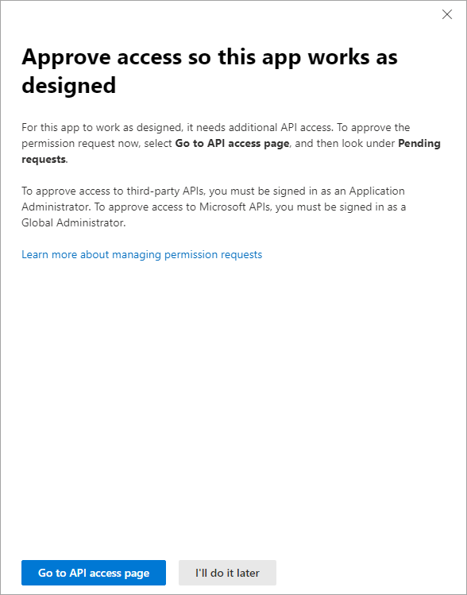

In this exercise, you'll create a new SharePoint Framework project with a single client-side web part that uses React and Microsoft Graph to display users in the currently logged in user's directory. You'll use the Azure AD HTTP client API included in the SharePoint Framework to authenticate and call the Microsoft Graph REST API.

## Create the SharePoint Framework solution

> [!IMPORTANT]
> The instructions below assume you're using v1.14.0 of the SharePoint Framework Yeoman generator. For more information on the use of the SharePoint Framework Yeoman generator, see [Yeoman generator for the SharePoint Framework](https://aka.ms/spfx-yeoman-info).

Open a command prompt and change to the folder where you want to create the project. Run the SharePoint Yeoman generator by executing the following command

```console
yo @microsoft/sharepoint
```

Use the following to complete the prompt that is displayed (*if more options are presented, accept the default answer)*:

- **What is your solution name?**: SPFxAadHttpClient
- **Which type of client-side component to create?**: WebPart
- **What is your Web part name?**: SPFxAadHttpClient
- **Which framework would you like to use?**: React

After provisioning the folders required for the project, the generator will install all the dependency packages by running `npm install` automatically. When NPM completes downloading all dependencies, open the project in **Visual Studio Code**.

## Create an interface that reflects the results of the query

Locate the **./src** folder in the project.

Create a new folder **models** in the existing **./src** folder.

Add a new file, **IUserItem.ts**, to the **models** folder with the following code:

```typescript
export interface IUserItem {
  id: string;
  mail?: string;
  displayName?: string;
}
```

## Implement the user interface for the web part

Update the public interface of the React component to accept a collection of users.

Locate and open the file **./src/webparts/spFxAadHttpClient/components/ISpFxAadHttpClientProps.ts**.

Update the contents of the file to match the following code:

```typescript
import { IUserItem } from '../../../models/IUserItem';

export interface ISpFxAadHttpClientProps {
  userItems: IUserItem[];
  isDarkTheme: boolean;
  environmentMessage: string;
  hasTeamsContext: boolean;
  userDisplayName: string;
}
```

Locate and open the file **./src/webparts/spFxAadHttpClient/components/SpFxAadHttpClient.module.scss**.

Add the following to the bottom of the file:

```scss
.mail {
  padding-top: 20px;
}
```

Locate and open the file **./src/webparts/spFxAadHttpClient/components/SpFxAadHttpClient.tsx**.

Update the contents of the `render()` method to the following code. This will create a list with each item displaying the properties of a user returned from the call to Microsoft Graph:

```tsx
public render(): React.ReactElement<ISpFxAadHttpClientProps> {
  const {
    userItems,
    isDarkTheme,
    environmentMessage,
    hasTeamsContext,
    userDisplayName
  } = this.props;

  return (
    <section className={`${styles.spFxAadHttpClient} ${hasTeamsContext ? styles.teams : ''}`}>
      <div className={styles.welcome}>
        
        <h2>Well done, {escape(userDisplayName)}!</h2>
        <div>{environmentMessage}</div>
      </div>
      <div className={styles.mail}>
        <div><strong>Mail:</strong></div>
        <ul>
          {this.props.userItems &&
            this.props.userItems.map((user) =>
              <li key={user.id}>
                <strong>ID:</strong> {user.id}<br />
                <strong>Email:</strong> {user.mail}<br />
                <strong>DisplayName:</strong> {user.displayName}
              </li>
            )
          }
        </ul>
      </div>
    </section>
  );
}
```

## Call Microsoft Graph

Locate and open the file **./src/webparts/spFxAadHttpClient/SpFxAadHttpClientWebPart.ts**.

Add the following `import` statements immediately following the existing `import` statements:

```typescript
import { IUserItem } from '../../models/IUserItem';
import {
  AadHttpClient,
  HttpClientResponse
} from '@microsoft/sp-http';
```

Add the following method to the `SpFxAadHttpClientWebPart` class.

This method will first obtain an instance of the Azure AD HTTP client that has been configured with the necessary details, including the authentication HTTP header, to call Microsoft Graph.

It will then use that `aadClient` object to issue an HTTP GET request to Microsoft Graph endpoint, requesting the first 10 users for the current logged in user.

Once a response is received, the body is processed as JSON and the collection of users is resolved in the JavaScript promise:

```typescript
private _getUsers(): Promise<IUserItem[]> {
  return new Promise<IUserItem[]>((resolve, reject) => {
    this.context.aadHttpClientFactory
      .getClient('https://graph.microsoft.com')
      .then((aadClient: AadHttpClient) => {
        const endpoint: string = 'https://graph.microsoft.com/v1.0/users?$top=10&$select=id,displayName,mail';
        aadClient.get(endpoint, AadHttpClient.configurations.v1)
          .then((rawResponse: HttpClientResponse) => {
            return rawResponse.json();
          })
          .then((jsonResponse: any) => {
            resolve(jsonResponse.value);
          });
      });
    });
}
```

Update the contents of the `render()` method to the following code:

```typescript
public render(): void {
  if (!this.renderedOnce) {
    this._getUsers()
      .then((results: IUserItem[]) => {
        const element: React.ReactElement<ISpFxAadHttpClientProps> = React.createElement(
          SpFxAadHttpClient,
          {
            userItems: results,
            isDarkTheme: this._isDarkTheme,
            environmentMessage: this._environmentMessage,
            hasTeamsContext: !!this.context.sdks.microsoftTeams,
            userDisplayName: this.context.pageContext.user.displayName
          }
        );

        ReactDom.render(element, this.domElement);
      });
  }
}
```

In this code, we've added a check to see if the web part has already been rendered on the page. If not, it calls the `_getUsers()` method previously added.

## Update the package permission requests

The last step before testing is to notify SharePoint that upon deployment to production, this app requires permission to Microsoft Graph API.

Open the **./config/package-solution.json** file.

Locate the `solution` section. Add the following permission request element just after the property `isDomainIsolated`:

```json
"webApiPermissionRequests": [
  {
    "resource": "Microsoft Graph",
    "scope": "User.ReadBasic.All"
  }
],
```

## Create the SharePoint package for deployment

Build the solution by executing the following command on the command line:

```console
gulp build
```

Bundle the solution by executing the following command on the command line:

```console
gulp bundle --ship
```

Package the solution by executing the following command on the command line:

```console
gulp package-solution --ship
```

## Deploy and trust the SharePoint package

In the browser, navigate to your SharePoint Online Tenant App Catalog.

Microsoft is in the process of transitioning from the classic app catalog user experience to a modern app catalog user experience. If you see the classic app catalog, you can select the **Try the new Manage Apps page** link displayed at the top of the page, or you can add **/_layouts/15/tenantAppCatalog.aspx** to the end of the app catalog site URL. Either option should take you to the modern app catalog (i.e. the **Manage Apps** page).




Drag the generated SharePoint package from **/sharepoint/solution/sp-fx-aad-http-client.sppkg** into the **Apps for SharePoint** library.

In the **Enable app** panel, make note of the section that lists the API access requests that should be reviewed. You'll need to approve or reject these requests in the next step. Ensure the **Enable this app and add it to all sites** radio button is selected and then select **Enable app**.



In the **Approve access so this app works as designed** panel, select **Go to API access page**. This will take you to the **API access** page in the **SharePoint admin center**.



## Approve the API permission request

Select the **Pending approval** for the **Microsoft Graph** permission **User.ReadBasic.All**.


Select the **Approve** button, then select the **Approve** button in the **Approve access** panel.

## Test the web part

> [!NOTE]
> The SharePoint Framework includes a SharePoint-hosted workbench for testing custom solutions. However, the workbench will not work the first time when testing solutions that utilize Microsoft Graph due to nuances with how the workbench operates and authentication requirements. Therefore, the first time you test a Microsoft Graph enabled SPFx solution, you will need to test it in a real modern page.
>
> Once this has been done and your browser has been cookied by the Azure AD authentication process, you can leverage local webserver and SharePoint-hosted workbench for testing the solution.

### Test the web part on a SharePoint Online modern page

In the site navigation, select the **Pages** library.

Select an existing page or create a new page in the library to test the web part on.


In the browser, select the Web part icon button to open the list of available web parts:


Search for the **SPFxAadHttpClient** web part and select it


When the page loads, notice after a brief delay, it will display a list of users:


## Summary

In this exercise, you created a new SharePoint Framework project with a single client-side web part that used React and Microsoft Graph to display users in the currently logged in user's directory. You used the Azure AD HTTP client API included in the SharePoint Framework to authenticate and call the Microsoft Graph REST API.
