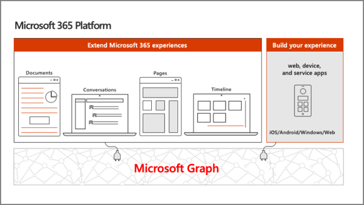
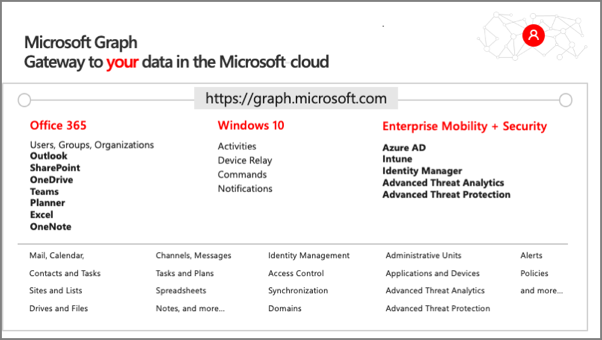
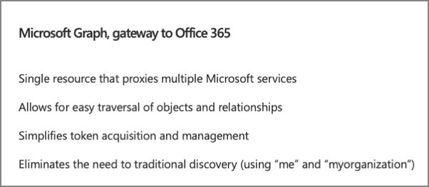
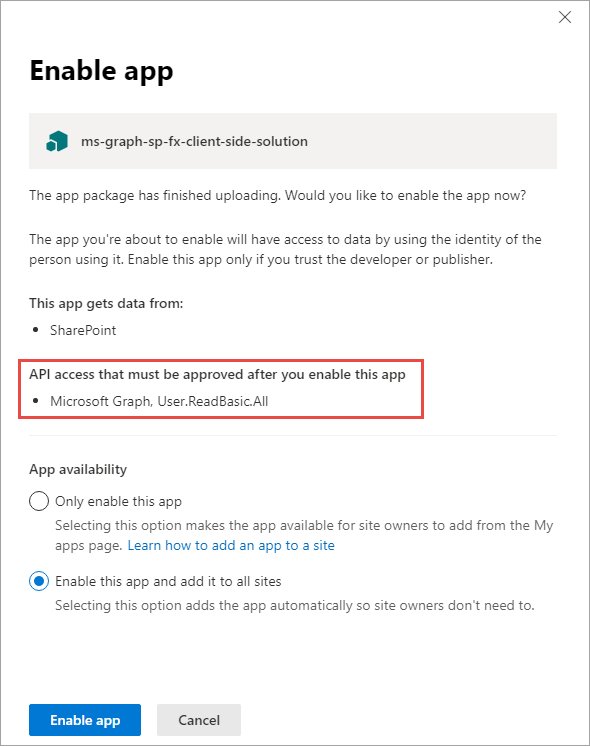

In this unit, you'll learn how to incorporate Microsoft Graph into your custom SharePoint Framework solutions.

## Microsoft 365 platform



The Microsoft 365 developer vision focuses on the user's experience and their data and as a developer you can bring your application into the user experience with over 1.2 billion users of Office worldwide. This is a huge opportunity to provide a window into your application and to enable users to connect into their data to intelligence to your application.

There are currently over 850 million events created each month and a total of over 400 petabytes of data stored in the service that can add value for your users.

The Microsoft Graph is the gateway to your data in the Microsoft cloud as you see there.

### Microsoft Graph - gateway to your data in the Microsoft cloud



The Microsoft cloud is included of multiple services and data types that we can take advantage of from Office 365, and it's all considered part of the Microsoft 365 platform.

Developers can integrate the signed-in user's email, calendar, contacts, and tasks into custom apps. We can work with content in SharePoint sites and lists files in OneDrive, channels and content within Microsoft Teams, and users in Azure Active Directory (Azure AD).

There are many different services that developers can take advantage of in their custom apps. Many of these services have their own APIs that developers can interact with.

However, this can be challenging to go to each of these individual services with their individual endpoints. Each API may have its own permission model, which means they have individual access control configurations. Different endpoints for each service mean our custom applications will need to obtain an access token from Azure AD for each one.

### Microsoft Graph simplifies access to Microsoft 365 data



One of the benefits of Microsoft Graph is that it serves as a proxy endpoint to all of these other services. Microsoft Graph encompass things such as Office 365, Windows 10 enterprise mobility and security (EMS), and it brings all of these different services under one unified endpoint: **graph.microsoft.com**.

The advantage to using Microsoft Graph is that it allows developers to just have a single endpoint, a resource, which means you're only going to need a single access token authenticate the different services. Each service still has its own individual permissions so that everything is still secured in an individual way. A single endpoint makes it easier for developers to build applications.

Microsoft Graph also enables easy navigation of entities and the relationships between entities. While there are many different Microsoft 365 services such as OneDrive for files, or Outlook for contacts and calendars, these different entities are related to each other. These relationships are in Microsoft Graph, which makes it easy to navigate from one entity to another, even if it crosses different underlying endpoints.

## Microsoft Graph JavaScript SDK

Microsoft Graph is accessible as a REST API so developers can use any technology that supports submitting and processing an HTTP request to an endpoint. Microsoft also offers many different SDKs for Microsoft Graph for different platforms and technologies to improve developer productivity.

One of the options offered by Microsoft is the [Microsoft Graph JavaScript SDK](https://github.com/microsoftgraph/msgraph-sdk-javascript). After initializing the SDK with an OAuth 2.0 access token, you can use the SDK to submit requests to Microsoft Graph. The SDK communicates directly with the Microsoft Graph REST API and returns the results as well-known objects. Microsoft also provides TypeScript type declarations for the SDK for TypeScript-based projects.

### Initialize the Microsoft JavaScript SDK

To use the JavaScript SDK, you must first initialize it. This is done by setting the OAuth 2.0 access token before you submit any requests to Microsoft Graph.

Initialize the Microsoft Graph JavaScript SDK by calling the `init()` method and pass in an object with an `authProvider` implementation. The `authProvider` function contains one argument, a callback, that you call with two arguments. The second argument should be the access token.

```typescript
var client = MicrosoftGraph.Client.init({
  authProvider: (done) => {
    /* code to obtain an access token from Azure AD */

    // let access_token = ...;
    done(null, access_token);
  }
});
```

Once the Microsoft Graph client is initialized, you can submit requests to Microsoft Graph endpoints using the `api()` method. The JavaScript SDK is a fluent API, which means you can chain multiple methods together. For instance, to get the current user's information, you can call the `get()` method after calling the `api()` method.

```typescript
client.api('me').get((err, res) => {
  console.log(res);
});
```

### Microsoft Graph TypeScript type declarations

While the Microsoft Graph JavaScript SDK is written in JavaScript, just like other libraries, you can use it in TypeScript applications including SharePoint Framework projects. Once the [Microsoft Graph TypeScript Type Definitions](https://github.com/microsoftgraph/msgraph-typescript-typings) are installed in TypeScript-based projects, you can then import relevant objects into your TypeScript files.

Install the Microsoft Graph TypeScript type declarations by executing the following statement on the command line:

```console
npm install @microsoft/microsoft-graph-types --save-dev
```

Once installed, you can then use the types in your projects:

```typescript
import * as MicrosoftGraph from '@microsoft/microsoft-graph-types';

// init Microsoft Graph client

client.api('/me')
  .get((error: any, user: MicrosoftGraph.User, rawResponse?: any) => {
    console.log('name: ', user.displayName);
    console.log('email: ', user.mail);
    console.log('phone: ', user.businessPhones[0]);
    });
  });
```

## Use the Microsoft Graph in SharePoint Framework solutions

You can use Microsoft Graph in your custom SharePoint Framework solutions. Microsoft Graph is a service that is secured with Azure AD. The SharePoint Framework uses the same infrastructure for requesting and granting permissions to Azure AD secured APIs as it does for custom Azure AD secured APIs. The unit on **Call Azure AD secured third-party REST APIs** explains how the SharePoint Framework API can be used to call Azure AD secured endpoints.

The SharePoint Framework API includes the Microsoft Graph JavaScript SDK and also handles the initialization of the client. This is handled using the existing Azure AD support to obtain an access token.

To obtain an instance of the Microsoft Graph JavaScript SDK, use the `this.context.msGraphClientFactory.getClient()` method. This will return an instance of the `MSGraphClient` that is already configured with the necessary OAuth 2.0 access token:

```typescript
this.context.msGraphClientFactory
     .getClient()
     .then((client: MSGraphClient): void => {
       // use MSGraphClient here
     });
```

### SharePoint Framework solutions declare permission requests

Because Microsoft Graph is an Azure AD secured API, you'll need to request a permission to Microsoft Graph when a SharePoint Framework package is deployed to the App Catalog. Do this using the `webApiPermissionRequests` array in the **package-solution.json** configuration file in a project.

Each request must include the name of the REST API (`resource`) and the permission (`scope`) requested:

```json
// package-solution.json
{
  "solution": {
    "name": "sp-fx-aad-http-client-side-solution",
    "id": "dfb230b7-4f61-431f-9b65-a34e83922663",
    "version": "1.0.0.0",
    "includeClientSideAssets": true,
    "isDomainIsolated": false,
    "webApiPermissionRequests": [
      { "resource": "Microsoft Graph", "scope": "User.ReadBasic.All" },
      { "resource": "Microsoft Graph", "scope": "Calendars.Read" },
      { "resource": "Microsoft Graph", "scope": "Tasks.Read" }
    ]
  },
  "paths": {
    "zippedPackage": "solution/sp-fx-aad-http.sppkg"
  }
}
```

## Add SharePoint packages to the SharePoint App Catalog

> [!NOTE]
> What's been referred to as **permission** requests above, are referred to as **API access** requests in the user interface for the app catalog and the SharePoint Admin Center. You can consider permission requests and API access requests to be synonymous. The term API access requests will be used for the remainder of this unit.

When an administrator deploys the SharePoint Framework component to the tenant App Catalog, they're presented with information about API access requests in the **Enable app** panel:



This section of the panel lists the API access requests that should be reviewed and approved or rejected. Recall that API access requests aren't tied to the SharePoint Framework package. Approving or rejecting the API access requests is a separate step that must be done in order for the SharePoint Framework component to work.

### Approve or reject API access requests from the SharePoint Admin Center

To approve or reject API access requests, navigate to the **API access** page in the SharePoint Admin Center. Here you'll find a list of API access requests pending approval or rejection:


Select the API access request to view its details and use the buttons at the bottom of the panel to approve or reject the request:


## Summary

In this unit, you learned how to incorporate Microsoft Graph into your custom SharePoint Framework solutions.
