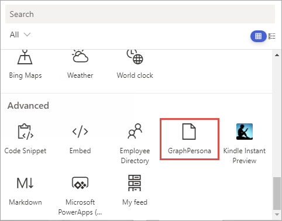

In this exercise, you'll create a new SharePoint Framework project with a single client-side web part that uses React and Microsoft Graph to display the currently logged in user's personal details in a familiar office [Persona](https://developer.microsoft.com/fabric#/components/persona) card. You'll use the Microsoft Graph HTTP client API included in the SharePoint Framework to authenticate and call the Microsoft Graph REST API.

## Create the Persona SharePoint Framework solution

> [!IMPORTANT]
> The instructions below assume you're using v1.14.0 of the SharePoint Framework Yeoman generator. For more information on the use of the SharePoint Framework Yeoman generator, see [Yeoman generator for the SharePoint Framework](https://aka.ms/spfx-yeoman-info).

Open a command prompt and change to the folder where you want to create the project. Run the SharePoint Yeoman generator by executing the following command:

```console
yo @microsoft/sharepoint
```

Use the following to complete the prompt that is displayed (*if more options are presented, accept the default answer)*:

- **What is your solution name?**: MSGraphSPFx
- **Which type of client-side component to create?**: WebPart
- **What is your Web part name?**: GraphPersona
- **Which framework would you like to use?**: React

After provisioning the folders required for the project, the generator will install all the dependency packages by running `npm install` automatically. When npm completes downloading all dependencies, open the project in **Visual Studio Code**.

## Update the solution dependencies

Install the Microsoft Graph TypeScript type declarations by executing the following statement on the command line:

```console99a2bc0b-2d8b-415d-bbac-e590cf4bddbc
npm install @microsoft/microsoft-graph-types --save-dev
```

## Update the Persona web part

Update the default web part to pass the React component an instance of the Microsoft Graph client API.

Open the web part file **src/webparts/graphPersona/GraphPersonaWebPart.ts**.

Add the following `import` statement after the existing `import` statements:

```typescript
import { MSGraphClient } from '@microsoft/sp-http';
```

Locate the `render()` method. This method creates a new instance of a React element by passing in the component class and the properties to bind to it. The only property being set is the `description` property.

Replace the contents of the `render()` method with the following code to create and initialize a new instance fo the Microsoft Graph client:

```typescript
this.context.msGraphClientFactory.getClient()
.then((client: MSGraphClient): void => {
  const element: React.ReactElement<IGraphPersonaProps> = React.createElement(
    GraphPersona,
    {
      graphClient: client,
      isDarkTheme: this._isDarkTheme,
      environmentMessage: this._environmentMessage,
      hasTeamsContext: !!this.context.sdks.microsoftTeams,
      userDisplayName: this.context.pageContext.user.displayName
    }
  );

  ReactDom.render(element, this.domElement);
});
```

> [!NOTE]
> The public property of the **GraphPersona** React component's `graphClient` property will be defined in the next step.

## Implement the GraphPersona React component

After updating the public signature of the `GraphPersona` component, the public property interface of the component needs to be updated to accept the Microsoft Graph client.

Open the **src/webparts/graphPersona/components/IGraphPersonaProps.ts**.

Replace the contents with the following code to change the public signature of the component:

```typescript
import { MSGraphClient } from '@microsoft/sp-http';

export interface IGraphPersonaProps {
  graphClient: MSGraphClient;
  isDarkTheme: boolean;
  environmentMessage: string;
  hasTeamsContext: boolean;
  userDisplayName: string;
}
```

Create a new interface that will keep track of the state of the component's state.

Create a new file **IGraphPersonaState.ts** and save it to the folder: **src/webparts/graphPersona/components/**.

Add the following code to define a new state object that will be used by the component:

```typescript
export interface IGraphPersonaState {
  name: string;
  email: string;
  phone: string;
  image: string;
}
```

Update the component's references to add the new state interface, support for the Microsoft Graph, Fabric React Persona control, and other necessary controls.

Open the **src/webparts/graphPersona/components/GraphPersona.tsx**.

Add the following `import` statements after the existing `import` statements:

```typescript
import { IGraphPersonaState } from './IGraphPersonaState';

import { MSGraphClient } from '@microsoft/sp-http';
import * as MicrosoftGraph from '@microsoft/microsoft-graph-types';

import {
  Persona,
  PersonaSize
} from 'office-ui-fabric-react/lib/components/Persona';

import { Link } from 'office-ui-fabric-react/lib/components/Link';
```

Update the public signature of the component to include the state.

Locate the class `GraphPersona` declaration.

At the end of the line, notice there's generic type with two parameters, the second is an empty object `{}`:

```typescript
export default class GraphPersona extends React.Component<IGraphPersonaProps, {}>
```

Update the second parameter to be the state interface previously created:

```typescript
export default class GraphPersona extends React.Component<IGraphPersonaProps, IGraphPersonaState>
```

Add the following constructor to the `GraphPersona` class to initialize the state of the component:

```typescript
constructor(props: IGraphPersonaProps) {
  super(props);

  this.state = {
    name: '',
    email: '',
    phone: '',
    image: null
  };
}
```

Update the contents of the `render()` method to the following code. This will display the Fabric React Persona card:

```typescript
public render(): React.ReactElement<IGraphPersonaProps> {
  return (
    <Persona primaryText={this.state.name}
             secondaryText={this.state.email}
             onRenderSecondaryText={this._renderMail}
             tertiaryText={this.state.phone}
             onRenderTertiaryText={this._renderPhone}
             imageUrl={this.state.image}
             size={PersonaSize.size100} />
  );
}
```

The code in the Persona card references two utility methods to control rendering of the secondary and tertiary text. Add the following to methods to the `GraphPersona` class that will be used to render the text:

```typescript
private _renderMail = () => {
  if (this.state.email) {
    return <Link href={`mailto:${this.state.email}`}>{this.state.email}</Link>;
  } else {
    return <div />;
  }
}

private _renderPhone = () => {
  if (this.state.phone) {
    return <Link href={`tel:${this.state.phone}`}>{this.state.phone}</Link>;
  } else {
    return <div />;
  }
}
```

The last step is to update the loading, or *mounting*, phase of the React component. When the component loads on the page, it should call Microsoft Graph to get details on the current user and their photo. When each of these results complete, they'll update the component's state, which will trigger the component to rerender.

Add the following method to the `GraphPersona` class:

```typescript
public componentDidMount(): void {
  this.props.graphClient
    .api('me')
    .get((error: any, user: MicrosoftGraph.User, rawResponse?: any) => {
      this.setState({
        name: user.displayName,
        email: user.mail,
        phone: user.businessPhones[0]
      });
    });

  this.props.graphClient
    .api('/me/photo/$value')
    .responseType('blob')
    .get((err: any, photoResponse: any, rawResponse: any) => {
      const blobUrl = window.URL.createObjectURL(photoResponse);
      this.setState({ image: blobUrl });
    });
}
```

## Update the package permission requests

The last step before testing is to notify SharePoint that upon deployment to production, this app requires permission to the Microsoft Graph to access the user's persona details.

Open the **config/package-solution.json** file.

Locate the `solution` section. Add the following permission request element just after the property `isDomainIsolated`:

```json
"webApiPermissionRequests": [
  {
    "resource": "Microsoft Graph",
    "scope": "User.ReadBasic.All"
  }
],
```

## Create the SharePoint package for deployment

Build the solution by executing the following command on the command line:

```console
gulp build
```

Bundle the solution by executing the following command on the command line:

```console
gulp bundle --ship
```

Package the solution by executing the following command on the command line:

```console
gulp package-solution --ship
```

## Deploy and trust the SharePoint package

In the browser, navigate to your SharePoint Online Tenant App Catalog.

Microsoft is in the process of transitioning from the classic app catalog user experience to a modern app catalog user experience. If you see the classic app catalog, you can select the **Try the new Manage Apps page** link displayed at the top of the page, or you can add **/_layouts/15/tenantAppCatalog.aspx** to the end of the app catalog site URL. Either option should take you to the modern app catalog (i.e. the **Manage Apps** page).


Drag the generated SharePoint package from **/sharepoint/solution/ms-graph-sp-fx.sppkg** into the **Apps for SharePoint** library.

In the **Enable app** panel, make note of the section that lists the API access requests that should be reviewed. You may need to approve or reject these requests in the next step. Ensure the **Enable this app and add it to all sites** radio button is selected and then select **Enable app**.


In the **Approve access so this app works as designed** panel, select **Go to API access page**. This will take you to the **API access** page in the **SharePoint admin center**.


## Approve the API permission request

> [!NOTE]
> If you completed the exercise **Call Azure AD secured REST APIs** in this module, you've already approved the permission request for **User.ReadBasic.All** so you may skip this step and move to testing the web part.

Select the **Pending approval** for the **Microsoft Graph** permission **User.ReadBasic.All**.


Select the **Approve or Reject** button, followed by selecting **Approve**.

## Test the web part

> [!NOTE]
> The SharePoint Framework includes a SharePoint-hosted workbench for testing custom solutions. However, the workbench will not work the first time when testing solutions that utilize Microsoft Graph due to nuances with how the workbench operates and authentication requirements. Therefore, the first time you test a Microsoft Graph enabled SPFx solution, you will need to test it in a real modern page.
>
> Once this has been done and your browser has been cookied by the Azure AD authentication process, you can leverage local webserver and SharePoint-hosted workbench for testing the solution.

### Test the web part on a SharePoint Online modern page

In the site navigation, select the **Pages** library.

Select an existing page or create a new page in the library to test the web part on:


Add the web part to the page and test.

In the browser, select the Web part icon button to open the list of available web parts:


Search for the **GraphPersona** web part and select it:



When the page loads, notice after a brief delay, it will display the current user's details on the Persona card:


## Summary

In this exercise, you created a new SharePoint Framework project with a single client-side web part that uses React and Microsoft Graph to display the currently logged in user's personal details in a familiar office [Persona](https://developer.microsoft.com/fabric#/components/persona) card. You used the Microsoft Graph HTTP client API included in the SharePoint Framework to authenticate and call the Microsoft Graph REST API.
