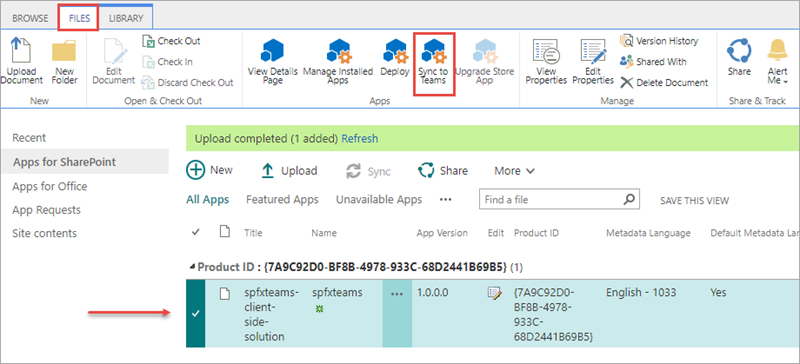

In this unit, you'll learn how you can take your existing SharePoint Framework development skills and use them for creating custom Microsoft Teams apps.

## Microsoft Teams extensibility options

Microsoft Teams offers developers multiple extensibility options.

Developers can create a custom Microsoft Teams app that can consist of a custom tab within a team. The custom teams app can also incorporate existing bots, messaging extensions, and connectors.

Another option for developers is to create a custom bot that can receive and reply to messages from a user in one-to-one chats, group chats, and the **Conversations** channel. Bots are a great option for implementing brief interactions with your users.

## Overview - building a Microsoft Teams tab

In Microsoft Teams, a team consists of multiple channels. Each channel has one or more tabs. One of the more popular extensibility options in Microsoft Teams custom apps is creating custom tabs. Let's look at what's involved in creating a custom tab.

### Design your custom tab

The first step is to design your tab. Start by identifying the relevant functionality you want to do in your tab. Tabs work best when they're built to address a specific need. Focus on a small set of tasks or a subset of data that's relevant to the channel the tab is in.

A tab in Microsoft Teams is just a web page rendered in an Iframe. Unlike a normal web page, pages used as tabs should have reduced chrome. Avoid creating multiple panels in a tab, adding layers of navigation, or requiring users to scroll both vertically and horizontally in one tab.

Think about how to integrate your tab into Microsoft Teams experience. For example, notify users about tab activity by posting cards to conversations. Think how you can help conversations around a tab. This ensures that conversations center on the content, data, or process at hand.

### Develop custom tabs

Tabs are just web pages loaded in an Iframe within the Microsoft Teams client. There are no technical requirements for a specific web technology or platform that developers have to implement or use to create custom tabs. Ultimately, the page will use HTML and JavaScript to implement the interface and interactions.

Pages that implement tabs can call REST services and even deep link to other content within other channels and teams within Microsoft Teams.

Developers can use any tools they want, from Visual Studio, Visual Studio Code, Eclipse, JetBrains' WebStorm, or even Notepad to develop custom tabs.

### Deploy your tab

You'll want to deploy your tab to Microsoft Teams once you've built it. You'll register your tab in a custom Microsoft Teams app. The next step is to get your application into Microsoft Teams.

You can upload your Microsoft Teams custom app directly to Microsoft Teams, upload it to your tenant's App Gallery so anyone in your organization can install it in their team, or submit it for approval to be included in the Office Store for anyone to install it and use it.

## Tab configuration and content

The configuration of your tab is located in your custom Microsoft Teams app's manifest file. The manifest file defines the different configuration options that are displayed when the tab is added to the channel.

When using SharePoint Framework client-side web parts to create tabs for Microsoft Teams, you'll see the configuration works mostly the same way. There are some subtle differences that we'll explore later in the module.

Recall that all content within a tab is rendered in an Iframe. Your tab and configuration page will have a URL that's used by Microsoft Teams to know the location of the page to load in the Iframe.

The tab and configuration page will use the Microsoft Teams context to inspect the tab's `EntityId` and `SubEntityId`. These are IDs that uniquely identify your tab. The `SubEntityId` is sometimes used to store simple configuration information.

## Interact with Microsoft Teams from tabs

Tabs can interact with Microsoft Teams, and Microsoft Teams communicates with a tab, in two different ways: URL placeholders and a context.

### Get Microsoft Teams context through URL placeholders

When a tab loads, Microsoft Teams will replace well-known strings in the URL before loading the tab. For example, the ID of the current team, channel, and theme setting is added to the URL when you include the `{teamId}`, `{channelId}`, and `{theme}` respectively. These values are resolved at runtime and allow developers to customize the tab based on this information.

For example, when your tab loads, it can get the current Microsoft Teams client theme that's set by the user and have the tab's experience use a matching theme. This makes a great experience for your users because the tab can look and feel like it's part of Microsoft Teams. If the user changes the selected theme, the URL is updated, and your tab can detect the newly selected theme.

### Get Microsoft Teams context through the JavaScript library

Another option your custom tab can use to get Microsoft Teams context is through the Microsoft Teams JavaScript SDK. You can obtain context by calling the `microsoftTeams.getContext()` method and passing a success callback that returns the current Microsoft Teams context.

The following table lists some of the noteworthy properties you have access to on the Microsoft Teams context:

|   Property    |                                 Description                                 |
| ------------- | --------------------------------------------------------------------------- |
| `teamId`      | The ID of the current team.                                                 |
| `channelId`   | The ID of the current channel.                                              |
| `locale`      | The current locale set in Microsoft Teams the lowercase lang-locale format. |
| `theme`       | default, dark, or contrast                                                  |
| `entityId`    | The entity ID you set in your configuration page.                           |
| `subEntityId` | The sub entity ID you set in your configuration page.                       |
| `upn`         | The user identifier in email format.                                        |
| `tid`         | GUID identifying the current tenant ID.                                     |
| `groupId`     | GUID identifying the current Office 365 Group ID.                           |

## Benefits to using SharePoint Framework to extend Microsoft Teams

In 2019, Microsoft introduced the capability to use a SharePoint Framework client-side web part as a tab in Microsoft Teams. As we've previously covered, a Microsoft Teams tab is just a web page loaded in an Iframe.

The development process of a Microsoft Teams tab that's implemented using a SharePoint Framework client-side web part is nearly identical to creating a web part for a SharePoint site. Any web part can be exposed as a tab in Microsoft Teams.

To enable a client-side web part to be used as a tab in Microsoft Teams, you'll need to update a single property in the component's manifest.

When you use a client-side web part as the host for a Microsoft Teams tab, the URL for the tab is a page in SharePoint Online that contains a single canvas on the page. The URL parameters tell the SharePoint page which web part to load into the canvas. This URL is used to in the Iframe that implements the tab.

The tab, or client-side web part, executes in the context of the underlying SharePoint site behind the team that the tab is added to. The implication of hosting the tab in SharePoint means developers can leverage the SharePoint Framework API in their custom tabs. For example, because the client-side web part is running in SharePoint Online, you can access the SharePoint REST API, Microsoft Graph, and Azure AD secured endpoints all from the SharePoint Framework API without needing to force the user to authenticate again.

### How to surface SharePoint Framework web parts as Microsoft Teams tabs

The process of configuring a SharePoint Framework client-side web part to be used as a Microsoft Teams tab is straightforward. Assuming you've built and tested your SharePoint Framework client-side web part, there are three actions to take:

1. **Specify the web part can be a tab**: Locate the web part's manifest file. Within the manifest file, locate the property array `supportedHosts`. The `supportedHosts` property lists all the different places the web part can be run. By default, it contains a single entry `SharePointWebPart`. To configure the web part to be used as a Microsoft Teams tab, add `TeamsTab` to the array.
1. **Create Microsoft Teams tab images**: When you create a new SharePoint Framework project, it creates a folder **./teams** in the SharePoint project with two images. The images, named **{SP_COMPONENT_GUID}_color.png, and **{SP_COMPONENT_GUID}_outline.png**, are used by Microsoft Teams when displaying your tab. You can replace these default images with your own custom images, but make sure you don't change the size dimensions or names of the files.
1. **Create Microsoft Teams app manifest**: All Microsoft Teams apps need an app manifest that describes the app. You can create the manifest yourself, or you can let SharePoint create it for you.

### Create Microsoft Teams app manifest and deploy to Microsoft Teams

The Microsoft Teams app manifest tells Microsoft Teams about your custom app. It contains the name and location of the images, name and description of the tabs, the location of the application, and other metadata about the app.

When you use a SharePoint Framework client-side web part as a tab, you can create the app manifest yourself, or let SharePoint create it for you.

After uploading and deploying the SharePoint package to the SharePoint App Catalog, you'll notice a **Sync to Teams** button in the ribbon when you select the package.



When you select the **Sync to Teams** button, SharePoint will look for a custom Teams app package named **TeamsSPFxApp.zip** in the **./teams** folder of your project. If SharePoint doesn't find this file, then it will dynamically create the Teams app manifest and package. SharePoint will then deploy the Teams app package (custom or generated) to the tenant's Teams app store. For more information, see the documentation: [Deployment options for SharePoint Framework solutions for Microsoft Teams](/sharepoint/dev/spfx/deployment-spfx-teams-solutions).

The following code contains the default template for the **manifest.json** file that you can use as a template if you create your own manifest:

```json
{
  "$schema": "https://developer.microsoft.com/en-us/json-schemas/teams/v1.10/MicrosoftTeams.schema.json",
  "manifestVersion": "1.10",
  "packageName": "{{SPFX_COMPONENT_ALIAS}}",
  "id": "{{SPFX_COMPONENT_ID}}",
  "version": "0.1",
  "developer": {
    "name": "Contoso Developer",
    "websiteUrl": "https://products.office.com/en-us/sharepoint/collaboration",
    "privacyUrl": "https://privacy.microsoft.com/en-us/privacystatement",
    "termsOfUseUrl": "https://www.microsoft.com/en-us/servicesagreement"
  },
  "name": {
    "short": "{{SPFX_COMPONENT_NAME}}"
  },
  "description": {
    "short": "{{SPFX_COMPONENT_SHORT_DESCRIPTION}}",
    "full": "{{SPFX_COMPONENT_LONG_DESCRIPTION}}"
  },
  "icons": {
    "outline": "{{SPFX_COMPONENT_ID}}_outline.png",
    "color": "{{SPFX_COMPONENT_ID}}_color.png"
  },
  "accentColor": "#004578",
  "configurableTabs": [
    {
      "configurationUrl": "https://{teamSiteDomain}{teamSitePath}/_layouts/15/TeamsLogon.aspx?SPFX=true&dest={teamSitePath}/_layouts/15/teamshostedapp.aspx%3FopenPropertyPane=true%26teams%26componentId={{SPFX_COMPONENT_ID}}%26forceLocale={locale}",
      "canUpdateConfiguration": true,
      "scopes": [
        "team"
      ]
    }
  ],
  "validDomains": [
    "*.login.microsoftonline.com",
    "*.sharepoint.com",
    "*.sharepoint-df.com",
    "spoppe-a.akamaihd.net",
    "spoprod-a.akamaihd.net",
    "resourceseng.blob.core.windows.net",
    "msft.spoppe.com"
  ],
  "webApplicationInfo": {
    "resource": "https://{teamSiteDomain}",
    "id": "00000003-0000-0ff1-ce00-000000000000"
  }
}
```

This file contains multiple strings that need to be updated to match the SharePoint Framework component. Use the following table to determine the values that should be replaced.

|          manifest.json string          |  Property in SharePoint Framework component manifest  |
| -------------------------------------- | --------------------------------------------- |
| `{{SPFX_COMPONENT_ALIAS}}`             | `alias`                                       |
| `{{SPFX_COMPONENT_NAME}}`              | `preconfiguredEntries[0].title.default`       |
| `{{SPFX_COMPONENT_SHORT_DESCRIPTION}}` | `preconfiguredEntries[0].description.default` |
| `{{SPFX_COMPONENT_LONG_DESCRIPTION}}`  | `preconfiguredEntries[0].description.default` |
| `{{SPFX_COMPONENT_ID}}`                | `id`                                          |

> [!IMPORTANT]
> Don't miss replacing `{{SPFX_COMPONENT_ID}}` in `configurableTabs[0].configurationUrl`. You'll likely have to scroll your editor to the right to see it.

> [!IMPORTANT]
> The tokens surrounded by single curly braces (e.g. `{teamSiteDomain}`) do not need to be replaced.

## Summary

In this unit, you learned how you can take your existing SharePoint Framework development skills and use them for creating custom Microsoft Teams apps.
