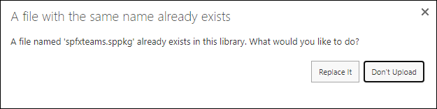
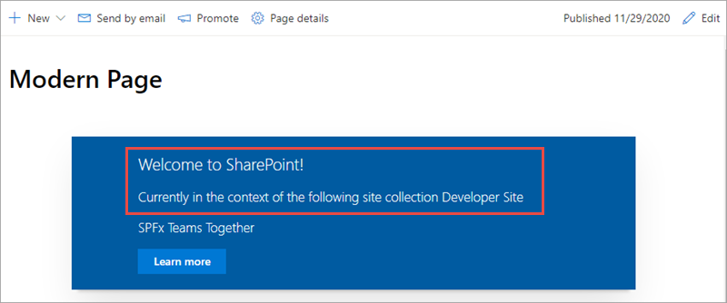
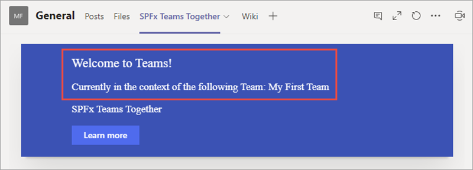

In this exercise, you'll update the SharePoint Framework web part from the previous exercise to display different information depending on whether it's running within a SharePoint or Microsoft Teams context.

Locate and open the file **./src/webparts/spFxTeamsTogether/SpFxTeamsTogetherWebPart.ts**.

Add the following `import` statement to the existing `import` statements at the top of the file:

```typescript
import * as microsoftTeams from '@microsoft/teams-js';
```

Add the following private member to the class `SpFxTeamsTogetherWebPart`. This will store the Microsoft Teams context in the case where the web part is running within a Microsoft Teams team:

```typescript
private teamsContext: microsoftTeams.Context;
```

Add the following method to the `SpFxTeamsTogetherWebPart` class to run when the web part is loaded on a page:

```typescript
protected onInit(): Promise<void> {
  return new Promise<void>((resolve, reject) => {
    if (this.context.sdks.microsoftTeams) {
      this.teamsContext = this.context.sdks.microsoftTeams.context;
    }
    resolve();
  });
}
```

Locate the `render()` method in the `SpFxTeamsTogetherWebPart` class. Add the following two members to set the title and current location depending on whether the web part is running in a SharePoint or Microsoft Teams context. Notice how using the necessary context property, you can get the name of the team or SharePoint site where the web part is currently running:

```typescript
let title: string = (this.teamsContext)
  ? 'Teams'
  : 'SharePoint';
let currentLocation: string = (this.teamsContext)
  ? `Team: ${this.teamsContext.teamName}`
  : `site collection ${this.context.pageContext.web.title}`;
```

Finally, update the HTML written to the page. Replace the existing `<div class="${ styles.column }">` with the following markup:

```tsx
<div class="${ styles.column }">
  <span class="${ styles.title }">Welcome to ${ title }!</span>
  <p class="${ styles.subTitle }">Currently in the context of the following ${ currentLocation }</p>
  <p class="${ styles.description }">${escape(this.properties.description)}</p>
  <a href="https://aka.ms/spfx" class="${ styles.button }">
    <span class="${ styles.label }">Learn more</span>
  </a>
</div>
```

## Package and deploy the web part

Build the project by opening a command prompt and changing to the root folder of the project. Then execute the following command:

```console
gulp build
```

Next, create a production bundle of the project by running the following command on the command line from the root of the project:

```console
gulp bundle --ship
```

Finally, create a deployment package of the project by running the following command on the command line from the root of the project:

```console
gulp package-solution --ship
```

Locate the file created by the gulp task, found in the **./sharepoint/solution** folder with the name **\*.sppkg**.

Drag this file into the **Apps for SharePoint** library in the browser. When prompted, select **Replace It**.



In the **Do you trust spfxteams-client-side-solution?** dialog, ensure the checkbox **Make this solution available to all sites in the organization** is selected and then select **Deploy**.

## Test the changes

Navigate back to the SharePoint page where you added the web part in the previous exercise.

Notice how the page shows that it's currently in the SharePoint context and displays the current SharePoint site name:



Now go back into the Microsoft Teams team and select the tab that you previously added. Notice how the message says you're currently in Teams and the name of the team:



## Summary

In this exercise, you updated the SharePoint Framework web part from the previous exercise to display different information depending on whether it's running within a SharePoint or Microsoft Teams context.
