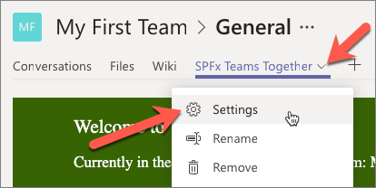
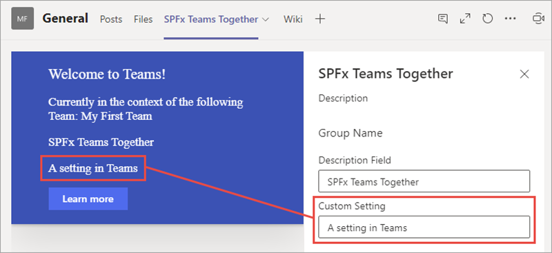
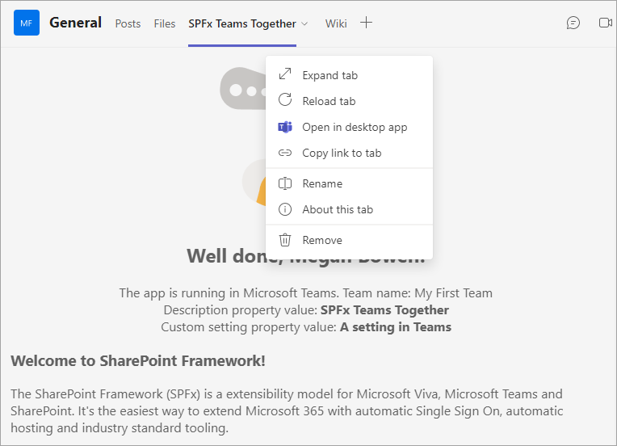

In this unit, you'll learn how to configure your SharePoint Framework client-side web part's settings when it's used as a tab in Microsoft Teams.

## Custom Microsoft Teams tab configuration options

SharePoint client-side web parts can have public properties. Developers can expose these properties to form controls within the SharePoint property pane for users to edit.


The property pane is only available when the page is in edit mode and only after a user has selected the edit control on the web part. The current user must also have access to edit the page to modify the settings on the web part.

## Web part property pane exposed in Microsoft Teams

The properties, called *settings*, on a tab in Microsoft Teams can also be modified by a user. To modify a tab's settings, select the tab's context menu and select the **Settings** option.



When the **Settings** menu option is selected, Microsoft Teams tabs launch a dialog that the tab's developer implements.

However, when a web part is used as a Microsoft Teams tab, the tab is loading a SharePoint page that's hosting the client-side web part. When the **Settings** menu item is selected in teams, instead of opening a dialog, Microsoft Teams notifies SharePoint the page is now in edit mode.

SharePoint's native property pane experience is then used to display edit the web part's public properties:



## Configure settings – edit only on install

Users who have the necessary permissions can always edit SharePoint Framework client-side web parts, including immediately after they're added to the page and any point in the future.

Microsoft Teams tabs differ from web parts in that the settings experience is displayed once when the tab is added to a channel and optionally in the future. This enables someone who has access to add a tab to a channel to modify the settings, but can optionally block tab users from modifying the settings at a later date.

Developers can control this setting for the tab in the Microsoft Teams app manifest file.

The tab's `canUpdateConfiguration` property is set to `true` by default, but you can override this and set it to `false`.

```json
{
  ...
  "configurableTabs": [
    {
      "configurationUrl": "https://..",
      "canUpdateConfiguration": false,
      "scopes": [ "team" ]
    }
  ]
}
```

When set to `false`, the settings page is only displayed immediately before the tab is added to the channel. In this scenario, the **Settings** button isn't present on the tab's context menu:



## Summary

In this unit, you learned how to configure your SharePoint Framework client-side web part's settings when it's used as a tab in Microsoft Teams.
