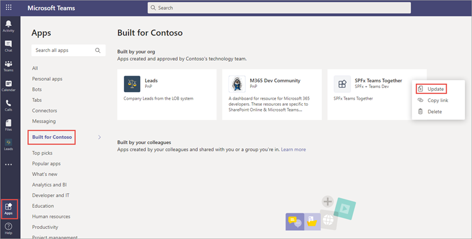
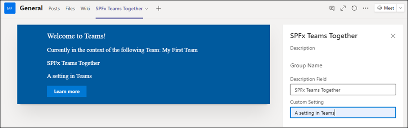
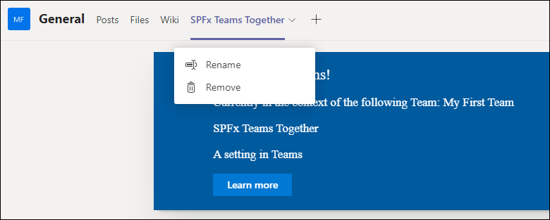
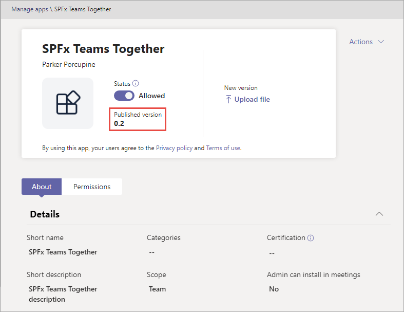
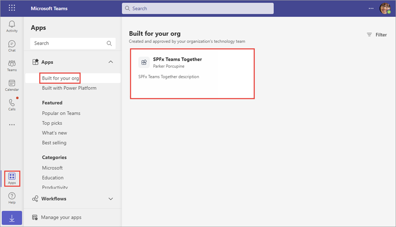
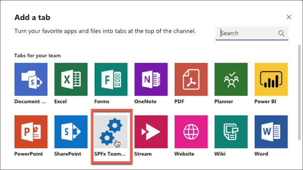
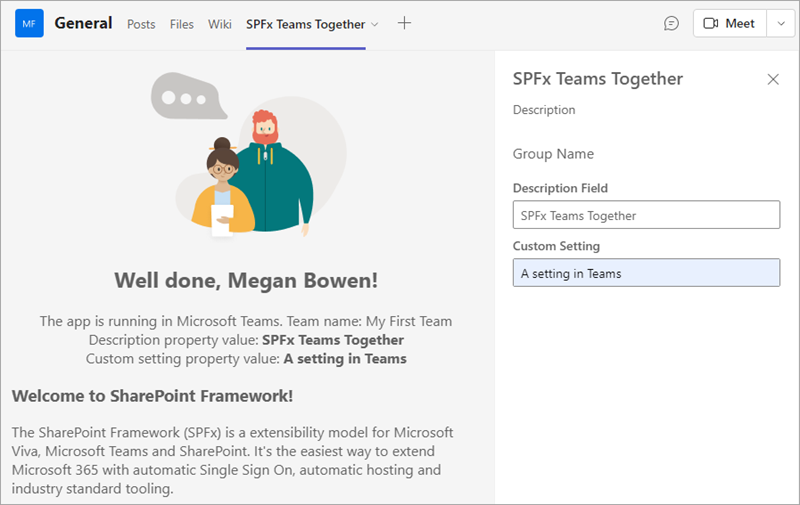

In this exercise, you'll update the configuration settings for the SharePoint Framework application and the configuration details of the Microsoft Teams application.

## Add a new custom property

Locate and open the file **./src/webparts/spFxTeamsTogether/SpFxTeamsTogetherWebPart.ts**.

Locate the interface `ISpFxTeamsTogetherWebPartProps`.

Add a new property to the interface:

```typescript
customSetting: string;
```

Locate the `render()` method within the `SpFxTeamsTogetherWebPart` class.

Locate the following line in the `render()` method:

```tsx
<p class="${ styles.description }">${escape(this.properties.description)}</p>
```

Add the following markup immediately following the previous line:

```tsx
<p class="${ styles.description }">${escape(this.properties.customSetting)}</p>
```

Scroll down to the `getPropertyPaneConfiguration()` method in the `SpFxTeamsTogetherWebPart` class.

Locate the property pane field control for the existing **description** property:

```typescript
PropertyPaneTextField('description', {
  label: strings.DescriptionFieldLabel
}),
```

Add a comma after the existing `PropertyPaneTextField()` and the following code to give users a way to edit the setting:

```typescript
PropertyPaneTextField('customSetting', {
  label: 'Custom Setting'
})
```

## Add a default value for the new property

Locate and open the file **./src/webparts/spFxTeamsTogether/SpFxTeamsTogetherWebPart.manifest.json**

Locate the `preconfiguredEntries[0].properties` object.

Add the following property and value to the `properties` object:

```json
"customSetting": "Default custom setting"
```

## Package and deploy the web part

Build the project by opening a command prompt and changing to the root folder of the project. Then execute the following command:

```console
gulp build
```

Next, create a production bundle of the project by running the following command on the command line from the root of the project:

```console
gulp bundle --ship
```

Finally, create a deployment package of the project by running the following command on the command line from the root of the project:

```console
gulp package-solution --ship
```

Locate the file created by the gulp task, found in the **./sharepoint/solution** folder with the name ***.sppkg**.

Drag this file into the **Apps for SharePoint** library in the browser. When prompted, select **Replace It**.


In the **Do you trust spfxteams-client-side-solution?** dialog, ensure the checkbox **Make this solution available to all sites in the organization** is selected and then select **Deploy**.

## Test the changes

Navigate back to the SharePoint page where you added the web part in the previous exercise and refresh the page. The value of the custom property will start out blank even though you set a default value for it in the manifest file. The default value only gets set for new web parts.

Edit the page and add a value to the **Custom Setting** property in the property pane. Notice how the page shows the property value:


Now go back into the Microsoft Teams team. Refresh the page if you have Teams open in a web browser. Select the down arrow to the right of the **SPFx Teams Together** tab and select **Settings**.


Add a value to the **Custom Setting** property in the property pane. Notice how the tab shows the property value:


## Disable updates to teams tab configuration

Locate and open the following file in the project: **teams/manifest.json**.

Set the value of the property `version` to `0.2`.

Locate the property `configurableTabs[0].canUpdateConfiguration`.

Set the value of this property to `false` and save the file.

Locate the **./teams** folder in the project.

Delete the existing Teams app package, **TeamsSPFxApp.zip**.

Recreate the Teams app package by making a new ZIP archive containing the three files in the folder: the two images and **manifest.json**. 

> [!IMPORTANT]
> ZIP the contents of the folder, not the folder itself.

Name the ZIP archive **TeamsSPFxApp.zip** and save it in the **teams** folder. 

## Delete the previous Microsoft Teams tab

Within the Microsoft Teams client, go to the **General** tab within the **My First Team**.

Select the down-arrow to the right of the **SPFx Teams Together** tab and select **Remove**.

When prompted, select **Remove**.

## Update the previously installed Microsoft Teams app

Navigate to the Microsoft Teams Admin Center located at **https://admin.teams.microsoft.com/**.

In the navigation, select **Teams apps > Manage apps**, search for **SPFx Teams Together**, and then select the **SPFx Teams Together** app:



In the **Manage apps \ SPFx Teams Together** pane, note that the **Published version** is 0.1. Select the **Upload file** link to upload the updated Teams app package:



In the **Update app** dialog, select **Select a file**, and select the new Microsoft Teams app manifest you created a moment ago:



Go back to the **Manage apps \ SPFx Teams Together** pane to ensure that the **Published version** is now 0.2:



Within the Microsoft Teams client, select **Apps** in the lower right corner, select **Built for your org** from the sidebar menu, and then select the **SPFx Teams Together** app.



In the **SPFx Teams Together** dialog, ensure the **Version** is 0.2:


## Test the new Microsoft Teams app

Select the **My First Team** team previously created.

Select the **General** channel.


### Add the SPFx web part as a tab

At the top of the page, select the + icon in the horizontal navigation:


In the **Add a tab** dialog, locate, and select the **SPFx Teams Together** app:



The next dialog will confirm the installation of the app. Select **Save**.


The application should now load in Microsoft Teams within the **General** channel under the tab **SPFx Teams Together**.

Notice how the web part's property pane opens by default. Edit the values of the public properties on the web part and then select the **X** in the upper-right corner of the property pane to close the initial configuration:



Now go back into the Microsoft Teams team. Select the down arrow to the right of the **SPFx Teams Together** tab. Notice the **Settings** option is no longer present. This is because the setting in the Microsoft Teams app manifest specified the configuration can't be updated once its installed into Microsoft Teams.


## Summary

In this exercise, you updated the configuration settings for the SharePoint Framework application and the configuration details of the Microsoft Teams application.
